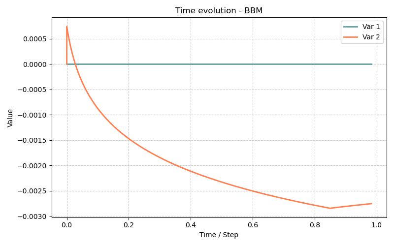

# Modèle BBM — Barcelona Basic Model pour sols non saturés (2D axisymétrique)

> **Fichiers sources :**
> `src/Models/ModelFiles/BBM.c` · `src/Models/ConstitutiveLaws/PlasticityModels/PlasticityBBM.c`
>
> **Exemples :**
> `test_examples/BBM/BBM` · `test_examples/BBM/BBM2` · `test_examples/BBM/BBM_pcst`
>
> **Auteurs du modèle Bil :** Eizaguirre, Dangla (Université Gustave Eiffel)

---

## Table des matières

1. [Contexte et objectif](#1-contexte-et-objectif)
2. [Hypothèses](#2-hypothèses)
3. [Variables et notation](#3-variables-et-notation)
4. [Modèle mathématique](#4-modèle-mathématique)
   - 4.1 [Équations de conservation](#41-équations-de-conservation)
   - 4.2 [Loi de comportement élastique non-linéaire](#42-loi-de-comportement-élastique-non-linéaire)
   - 4.3 [Surface de charge et courbe LC](#43-surface-de-charge-et-courbe-lc)
   - 4.4 [Règle d'écoulement et écrouissage](#44-règle-découlement-et-écrouissage)
   - 4.5 [Couplage hydromécanique — flux de Darcy](#45-couplage-hydromécanique--flux-de-darcy)
   - 4.6 [Courbes de rétention capillaire](#46-courbes-de-rétention-capillaire)
5. [Conditions aux limites et initiales](#5-conditions-aux-limites-et-initiales)
6. [Explication détaillée des fichiers d'entrée](#6-explication-détaillée-des-fichiers-dentrée)
   - 6.1 [Fichier principal `BBM` — compression isotrope avec cycles de succion](#61-fichier-principal-bbm--compression-isotrope-avec-cycles-de-succion)
   - 6.2 [Fichier `BBM2` — chemin de contraintes p-q avec succion variable](#62-fichier-bbm2--chemin-de-contraintes-p-q-avec-succion-variable)
   - 6.3 [Fichier `BBM_pcst` — succion constante](#63-fichier-bbm_pcst--succion-constante)
   - 6.4 [Courbes matériaux : `wrc2`, `krc2`, `lc`](#64-courbes-matériaux--wrc2-krc2-lc)
   - 6.5 [Maillage `carre.msh` et géométrie `carre.geo`](#65-maillage-carremsh-et-géométrie-carregeo)
7. [Résultats](#7-résultats)
8. [Discrétisation numérique](#8-discrétisation-numérique)
9. [Références bibliographiques](#9-références-bibliographiques)

---

## 1. Contexte et objectif

Le modèle BBM implémente le **Modèle de Barcelone de Base** (*Barcelona Basic Model*, BBM), proposé par Alonso, Gens et Josa (1990), qui est le modèle de référence pour la mécanique des sols non saturés. Il étend le modèle Cam-Clay modifié aux états non saturés en introduisant la **succion** $s = p_g - p_l$ comme variable d'état supplémentaire, qui module l'enveloppe de plasticité via la courbe d'effondrement à charge (*Loading Collapse*, LC).

Le modèle est **couplé hydromécanique** : les déformations du squelette solide modifient la porosité et donc le stockage d'eau, tandis que la succion affecte la rigidité et la résistance. L'écoulement de l'eau suit la loi de Darcy généralisée.

Les trois cas test illustrent des **essais en conditions drainées** (la succion est imposée directement) sur un volume élémentaire représentatif (VER) cubique axisymétrique :

| Fichier | Essai | Objectif |
|---------|-------|---------|
| `BBM` | Compression isotrope avec cycles de charge/décharge, succion croissante par paliers | Vérification de la courbe LC et de l'écrouissage |
| `BBM2` | Chemin en p-q (compression triaxiale) avec succion croissante | Vérification de la surface de charge dans l'espace p-q |
| `BBM_pcst` | Compression avec cisaillement, succion nulle constante | Comportement saturé, comparaison avec Cam-Clay |

---

## 2. Hypothèses

1. **Milieu poreux déformable** : squelette solide élastoplastique, porosité variable.
2. **Deux phases fluides** : phase liquide (eau) et phase gazeuse (à pression constante $p_g = 0$, prise comme référence).
3. **Petites déformations** : cadre de la mécanique des milieux continus en petites déformations (tenseur de déformation linéarisé).
4. **Contraintes nettes** : le comportement mécanique est formulé en termes de **contraintes nettes** $\bar{\boldsymbol{\sigma}} = \boldsymbol{\sigma} + p_g\,\mathbf{I}$ et de succion $s = p_g - p_l \geq 0$.
5. **Isotropie transverse** (axisymétrie) : problème 2D avec symétrie de révolution.
6. **Drained conditions** (essais drainés) : la succion est imposée en tout point du domaine ; la perméabilité est très faible ($k_\text{int} = 10^{-20}$ m²) mais l'état drainé est atteint grâce aux conditions aux limites.
7. **Pas de gravité** : $g = 0$ dans les trois cas test.

---

## 3. Variables et notation

### Inconnues primaires

| Symbole | Signification | Unité |
|---------|---------------|-------|
| $p_l$ | Pression de la phase liquide | Pa |
| $\mathbf{u} = (u_1,\,u_2)$ | Vecteur déplacement | m |

La succion $s$ et la contrainte nette $\bar{\boldsymbol{\sigma}}$ en découlent :

$$s = p_g - p_l = -p_l \quad (\text{car } p_g = 0), \qquad \bar{\boldsymbol{\sigma}} = \boldsymbol{\sigma} + p_g\,\mathbf{I} = \boldsymbol{\sigma}$$

### Variables internes (stockées aux points d'intégration)

| Symbole | Signification |
|---------|---------------|
| $\boldsymbol{\sigma}$ | Tenseur de contrainte totale (9 composantes) |
| $\boldsymbol{\varepsilon}^p$ | Tenseur de déformation plastique (9 composantes) |
| $m_l$ | Teneur en eau massique |
| $\mathbf{W}_l$ | Flux massique de liquide |
| $p_{c0}$ | Pression de préconsolidation à succion nulle (variable d'écrouissage) |
| $\phi$ | Porosité |

### Paramètres matériaux (cas test `BBM`)

| Paramètre | Symbole | Valeur | Signification |
|-----------|---------|--------|---------------|
| `slope_of_swelling_line` | $\kappa$ | 0.011 | Pente de la ligne de gonflement (espace $\ln p$-$e$) |
| `slope_of_virgin_consolidation_line` | $\lambda_0$ | 0.065 | Pente de la NCL à succion nulle |
| `slope_of_critical_state_line` | $M$ | 1.2 | Pente de la CSL dans $p$-$q$ |
| `initial_pre-consolidation_pressure` | $p_{c0}$ | 40 kPa | Pression de préconsolidation initiale |
| `reference_consolidation_pressure` | $p_r$ | 10 kPa | Pression de référence pour la courbe LC |
| `kappa_s` | $\kappa_s$ | 0.005 | Indice de gonflement élastique dû à la succion |
| `suction_cohesion_coefficient` | $k$ | 0.8 | Coefficient d'augmentation de cohésion par la succion |
| `poisson` | $\nu$ | 0.15 | Coefficient de Poisson |
| `initial_porosity` | $\phi_0$ | 0.25 | Porosité initiale |
| `initial_stress` | $\boldsymbol{\sigma}_0$ | $-1000$ Pa (isotrope) | État de contrainte initial |
| `k_int` | $k_\text{int}$ | $10^{-20}$ m² | Perméabilité intrinsèque |
| `mu_l` | $\mu_l$ | $10^{-3}$ Pa·s | Viscosité du liquide |
| `rho_l` | $\rho_l$ | 1000 kg/m³ | Masse volumique du liquide |
| `rho_s` | $\rho_s$ | 2000 kg/m³ | Masse volumique des particules solides |

---

## 4. Modèle mathématique

Le modèle BBM résout un système de $1 + \dim$ équations couplées : 1 équation de conservation de la masse de l'eau et $\dim$ équations d'équilibre mécanique.

### 4.1 Équations de conservation

#### Bilan de masse de l'eau liquide

$$\frac{\partial m_l}{\partial t} + \nabla \cdot \mathbf{W}_l = 0, \qquad m_l = \rho_l\,\phi\,s_l(s)$$

où $\phi = \phi_0 + \text{tr}\,\boldsymbol{\varepsilon}$ est la porosité courante (Biot), $s_l(s)$ la saturation en fonction de la succion, et $\mathbf{W}_l$ le flux de Darcy (§4.5).

#### Équilibre mécanique (sans gravité)

$$\nabla \cdot \boldsymbol{\sigma} = \mathbf{0}$$

soit en 2D axisymétrique :

$$\frac{\partial \sigma_{rr}}{\partial r} + \frac{\partial \sigma_{rz}}{\partial z} + \frac{\sigma_{rr} - \sigma_{\theta\theta}}{r} = 0$$

$$\frac{\partial \sigma_{rz}}{\partial r} + \frac{\partial \sigma_{zz}}{\partial z} + \frac{\sigma_{rz}}{r} = 0$$

### 4.2 Loi de comportement élastique non-linéaire

L'élasticité du BBM est **non-linéaire** : le module de compressibilité volumique dépend de l'état de contrainte et de la succion.

**Module de compressibilité volumique :**

$$K = -\frac{(1 + e_0)\,\bar{p}}{\kappa + \kappa_s\,\Delta\ln(s + p_\text{atm})}$$

Dans l'implémentation Bil (en pratique, pour les pas de temps courants), on utilise la formulation simplifiée :

$$K = -\frac{(1 + e_0)\,\bar{p}_n}{\kappa}, \qquad E = 3K(1 - 2\nu)$$

où $\bar{p}_n = (\sigma_{11}^n + \sigma_{22}^n + \sigma_{33}^n)/3 + p_g$ est la pression nette moyenne au pas de temps précédent. Le module de Young $E$ et le coefficient de cisaillement $\mu = E/[2(1+\nu)]$ sont mis à jour à chaque pas de temps.

**Décomposition élastoplastique des déformations :**

$$\boldsymbol{\varepsilon} = \boldsymbol{\varepsilon}^e + \boldsymbol{\varepsilon}^p$$

**Contraintes nettes d'essai élastique :**

$$\bar{\boldsymbol{\sigma}}^* = \bar{\boldsymbol{\sigma}}_n + \mathbb{C}^e : \Delta\boldsymbol{\varepsilon}$$

avec la contribution supplémentaire de la succion :

$$\Delta\bar{\sigma}_m^s = -\bar{p}_n\,\frac{\kappa_s}{\kappa}\,\Delta\ln\!\left(\frac{s + p_\text{atm}}{s_n + p_\text{atm}}\right)$$

### 4.3 Surface de charge et courbe LC

La **surface de charge BBM** (critère de plasticité) dans l'espace contraintes nettes est :

$$\boxed{f(\bar{p},\,q,\,s) = \frac{q^2}{M^2} + (\bar{p} - p_s)(\bar{p} + p_c(s)) = 0}$$

où :

| Terme | Expression | Signification |
|-------|-----------|---------------|
| $\bar{p}$ | $(\bar{\sigma}_{11} + \bar{\sigma}_{22} + \bar{\sigma}_{33})/3$ | Pression nette moyenne (négative en compression) |
| $q$ | $\sqrt{3J_2}$ | Contrainte déviatorique |
| $M$ | 1.2 | Pente de la CSL |
| $p_s(s)$ | $k \cdot s$ | Augmentation de cohésion par la succion |
| $p_c(s)$ | courbe LC | Pression de préconsolidation à la succion $s$ |

**Courbe LC (Loading Collapse) :**

La courbe LC relie la pression de préconsolidation à la succion $s$ à celle à succion nulle $p_{c0}$ via :

$$\ln\frac{p_c(s)}{p_r} = \text{lc}(s)\,\ln\frac{p_{c0}}{p_r}$$

où le facteur LC $\text{lc}(s)$ est :

$$\text{lc}(s) = \frac{\lambda_0 - \kappa}{\lambda(s) - \kappa}, \qquad \lambda(s) = \lambda_0\left[(1-r)\,e^{-\beta s} + r\right]$$

Avec les paramètres du cas test : $\lambda_0 = 0.065$, $\kappa = 0.011$, $r = 0.75$, $\beta = 20 \times 10^{-6}$ Pa$^{-1}$.

Cette formule montre que :
- À $s = 0$ : $\lambda(0) = \lambda_0$, $\text{lc}(0) = 1$, $p_c(0) = p_{c0}$ (sol saturé, Cam-Clay standard).
- À $s > 0$ : $\lambda(s) < \lambda_0$, $\text{lc}(s) > 1$, $p_c(s) > p_{c0}$ — **la succion renforce le sol**, l'enveloppe de plasticité s'agrandit.
- À $s \to \infty$ : $\lambda(\infty) = \lambda_0 r = 0.049$, $\text{lc}(\infty) = (\lambda_0 - \kappa)/(\lambda_0 r - \kappa) \approx 1.43$ — limite asymptotique.

La **variable d'écrouissage** stockée est $a = \ln(p_{c0})$, de sorte que :

$$p_{c0} = e^a, \qquad a_0 = \ln(p_{c0,\text{init}}) = \ln(40000) \approx 10.597 \quad \text{(valeur initiale observée dans les résultats)}$$

### 4.4 Règle d'écoulement et écrouissage

**Règle d'écoulement associée** (le potentiel plastique est identique à la surface de charge) :

$$\dot{\boldsymbol{\varepsilon}}^p = \dot{\lambda}\,\frac{\partial f}{\partial \bar{\boldsymbol{\sigma}}} = \dot{\lambda}\left[\frac{2\bar{p} + p_c - p_s}{3}\,\mathbf{I} + \frac{3}{M^2}\,\mathbf{s}\right]$$

**Loi d'écrouissage isotrope** (consolidation isotrope) :

La déformation plastique volumique $\dot{\varepsilon}^p_v = \text{tr}\,\dot{\boldsymbol{\varepsilon}}^p$ commande l'évolution de la préconsolidation :

$$\dot{a} = \frac{\mathrm{d}\ln p_{c0}}{\mathrm{d}t} = h(\bar{p}, a)\,\dot{\lambda}, \qquad h = -\frac{1 + e_0}{\lambda_0 - \kappa}\,(2\bar{p} + p_c - p_s)$$

**Module d'écrouissage** (défini par $\mathrm{d}f = \frac{\partial f}{\partial \bar{\boldsymbol{\sigma}}}:\mathrm{d}\bar{\boldsymbol{\sigma}} - H\,\mathrm{d}\lambda = 0$) :

$$H = \frac{1 + e_0}{\lambda_0 - \kappa}\,(\bar{p} - p_s)\,(2\bar{p} + p_c - p_s)\,p_c\,\text{lc}(s)$$

Un module positif ($H > 0$) indique un comportement **écrouissant** (consolidation), typique des états de compression normalement consolidée.

### 4.5 Couplage hydromécanique — flux de Darcy

Le flux massique de liquide est donné par la loi de Darcy (sans gravité dans ces cas test) :

$$\mathbf{W}_l = -K_l\,\nabla p_l, \qquad K_l = \frac{\rho_l\,k_\text{int}\,k_{rl}(s)}{\mu_l}$$

La porositéaurant suit l'évolution de la déformation volumique :

$$\phi = \phi_0 + \text{tr}\,\boldsymbol{\varepsilon}$$

### 4.6 Courbes de rétention capillaire

Deux courbes sont utilisées (définies analytiquement et tabulées dans `wrc2`) :

**Saturation** (modèle van Genuchten) :

$$s_l(s) = \left(1 + \left(\frac{s}{p_0}\right)^{\frac{1}{1-m}}\right)^{-m}, \qquad p_0 = 10^6 \text{ Pa},\quad m = 0.6$$

**Perméabilité relative** (constante dans ce cas test) :

$$k_{rl}(s) = 1 \quad \forall s$$

Cette simplification ($k_{rl} = 1$ et $k_g = 1$ dans `krc2`) reflète le fait que les cas test sont **pilotés en succion** (condition drainée) : l'écoulement ne joue pas de rôle dynamique, seules les contraintes mécaniques et la succion imposée contrôlent la réponse.

---

## 5. Conditions aux limites et initiales

### État initial (commun aux trois cas test)

Le VER est initialement dans un état isotrope léger ($\sigma_0 = -1000$ Pa, très inférieur à la préconsolidation $p_{c0} = 40000$ Pa) et saturé ($s = 0$, $s_l = 1$, $p_l = 0$) :

| Variable | Valeur initiale |
|----------|-----------------|
| $\boldsymbol{\sigma}$ | $-1000$ Pa (isotrope) |
| $\mathbf{u}$ | $\mathbf{0}$ |
| $p_l$ | 0 Pa |
| $s = -p_l$ | 0 Pa |
| $s_l$ | 1.0 |
| $\phi$ | 0.25 |
| $p_{c0}$ | 40 kPa |
| $a = \ln(p_{c0})$ | $\ln(40000) \approx 10.597$ |

### Conditions aux limites géométriques (communes)

| Region | Ligne | Condition | Signification |
|--------|-------|-----------|---------------|
| 14 | gauche ($r = 0$) | $u_1 = 0$ | Axe de symétrie (déplacement radial nul) |
| 11 | bas ($z = 0$) | $u_2 = 0$ | Base fixe (déplacement vertical nul) |
| 100 | domaine entier | $p_l$ imposé | Succion pilotée via $p_l = -s$ |

---

## 6. Explication détaillée des fichiers d'entrée

### 6.1 Fichier principal `BBM` — compression isotrope avec cycles de succion

```
Geometry
2 axis
```

Problème **2D axisymétrique** (`axis`) : $x$ est le rayon $r$, $y$ est la hauteur $z$. La géométrie est de révolution autour de l'axe $r = 0$.

---

```
Mesh
carre.msh
```

Référence au fichier de maillage externe `carre.msh` (carré 1 m × 1 m, 1 seul élément quadrilatère). Voir §6.5.

---

```
Material
Model = BBM
gravity = 0
rho_s = 2000
slope_of_swelling_line = 0.011
slope_of_virgin_consolidation_line = 0.065
poisson = 0.15
slope_of_critical_state_line = 1.2
initial_pre-consolidation_pressure = 0.04e6
reference_consolidation_pressure = 0.01e6
kappa_s = 0.005
initial_stress_11 = -1000
initial_stress_22 = -1000
initial_stress_33 = -1000
initial_porosity = 0.25
rho_l = 1000
k_int = 1e-20
mu_l = 0.001
suction_cohesion_coefficient = 0.8
```

Les paramètres de plasticité BBM sont :

| Paramètre | Valeur | Rôle |
|-----------|--------|------|
| `slope_of_swelling_line = 0.011` | $\kappa = 0.011$ | Compressibilité élastique (pente gonflement) |
| `slope_of_virgin_consolidation_line = 0.065` | $\lambda_0 = 0.065$ | Compressibilité plastique à saturation |
| `slope_of_critical_state_line = 1.2` | $M = 1.2$ | Angle de frottement : $\sin\phi' = 3M/(6+M)$ |
| `initial_pre-consolidation_pressure = 0.04e6` | $p_{c0} = 40$ kPa | Preconsolidation initiale |
| `reference_consolidation_pressure = 0.01e6` | $p_r = 10$ kPa | Référence pour la courbe LC |
| `kappa_s = 0.005` | $\kappa_s$ | Compressibilité élastique vis-à-vis de la succion |
| `suction_cohesion_coefficient = 0.8` | $k$ | Cohésion : $p_s = k \cdot s$ |

Les courbes sont définies en **ligne de commande analytique** (syntaxe Bil de génération de courbes) :

```
Curves = wrc2   pc = Range{x1 = 0, x2 = 30.e6, n = 171}
                sl = Expressions(1){p0 = 1.e6 ; m = 0.6 ;
                                    sl = (1 + (pc/p0)**(1/(1-m)))**(-m)}
```

**Syntaxe `Range{...}`** : génère un tableau de 171 valeurs de $p_c$ uniformément espacées entre 0 et $30 \times 10^6$ Pa.

**Syntaxe `Expressions(1){...}`** : définit la colonne `sl` par la formule van Genuchten :
$$s_l = \left(1 + \left(\frac{p_c}{10^6}\right)^{1/(1-0.6)}\right)^{-0.6} = \left(1 + \left(\frac{p_c}{10^6}\right)^{2.5}\right)^{-0.6}$$

```
Curves = krc2   pc = Range{x1 = 0, x2 = 30.e6, n = 171}
                kl = Expressions(1){kl = 1}
                kg = Expressions(1){kg = 1}
```

Perméabilités relatives constantes à 1 (condition drainée parfaite).

```
Curves = lc     pc = Range{x1 = 0, x2 = 1.e6, n = 200}
                lc = Expressions(1){l0 = 0.065 ; k = 0.011 ; beta = 20.e-6 ;
                                    r = 0.75 ;
                                    lc = (l0 - k)/(l0*((1-r)*exp(-beta*pc) + r) - k)}
```

La courbe `lc` tabule le facteur LC :
$$\text{lc}(p_c) = \frac{\lambda_0 - \kappa}{\lambda_0\left[(1-r)e^{-\beta p_c} + r\right] - \kappa}$$

| $p_c$ [Pa] | $\lambda(p_c)$ | $\text{lc}(p_c)$ |
|------------|----------------|-------------------|
| 0 | 0.065 | 1.000 |
| $10^5$ | 0.057 | 1.150 |
| $10^6$ | 0.049 | 1.430 (asymptote) |

---

```
Fields
2
Value = -1.e3 Gradient = 0 0 0 Point = 0 0 0
Value =  1.e3 Gradient = 0 0 0 Point = 0 0 0
```

Deux champs spatiaux uniformes :
- **Champ 1** = $-1000$ Pa : utilisé pour imposer $p_l = -s$ (la succion en Pa). Comme $p_l = \text{Champ 1} \times \text{Fonction 2}$, on obtient $p_l = -1000 \times F_2(t) = -s(t)$ en Pa.
- **Champ 2** = $+1000$ Pa : utilisé comme amplitude de la pression mécanique appliquée ($1\,\text{kPa}$ par unité de fonction).

---

```
Functions
2
N = 7 F(0) = 1   F(1) = 40  F(2) = 1   F(3) = 80   F(4) = 1   F(5) = 160  F(6) = 1
N = 7 F(0) = 0   F(1.999) = 0  F(2) = 40  F(3.999) = 40  F(4) = 80  F(5.999) = 80  F(6) = 160
```

**Syntaxe des fonctions Bil :** `N = n` donne le nombre de couples $(t_i,\,F_i)$ ; les valeurs intermédiaires sont interpolées linéairement.

- **Fonction 1** — pression mécanique (kPa) :

```
  Valeur (×1000 Pa)
   160│                           ╮ ╮
    80│             ╮ ╮            │  │
    40│   ╮ ╮        │  │            │  │
     1│───╯   ╰───╯    ╰───╯    ╰───
       0   1   2   3   4   5   6  t
```

Trois cycles chargement-déchargement : 1→40→1 kPa, 1→80→1 kPa, 1→160→1 kPa.

- **Fonction 2** — succion (kPa), par paliers instantanés :

```
  Succion (kPa)
   160│                                     ╭───
    80│                   ╭─────────────╯
    40│       ╭───────────╯
     0│───────╯
       0   1   2   3   4   5   6  t
```

La succion est nulle pendant le premier cycle, puis augmente par palier (40 kPa à $t = 2$, 80 kPa à $t = 4$, 160 kPa à $t = 6$).

> **Piège de lecture :** `F(1.999) = 0` puis `F(2) = 40` crée une montée quasi-instantanée de la succion en $t = 2$ (sur $\Delta t = 10^{-3}$ unité de temps). Cela simule une **imposition instantanée de succion** (le séchage est considéré infiniment rapide devant le chargement mécanique).

---

```
Boundary Conditions
3
Region = 14 Unknown = u_1 Field = 0 Function = 0
Region = 11 Unknown = u_2 Field = 0 Function = 0
Region = 100 Unknown = p_l Field = 1 Function = 2
```

| Condition | Interprétation |
|-----------|----------------|
| `Region = 14 Unknown = u_1 Field = 0` | $u_1 = 0$ sur l'axe ($r = 0$) — symétrie axiale |
| `Region = 11 Unknown = u_2 Field = 0` | $u_2 = 0$ en bas ($z = 0$) — base fixe |
| `Region = 100 Unknown = p_l Field = 1 Function = 2` | $p_l = (-1000) \times F_2(t) = -s(t)$ sur l'ensemble du domaine |

**`Field = 0`** signifie la valeur nulle (zéro) directement.

La condition sur `Region = 100` (toute la surface du carré) impose $p_l$ à **tous les nœuds** simultanément. Combinée avec `Field = 1` ($= -1000$ Pa) et `Function = 2` (montée par paliers), elle crée la succion imposée $s(t) = 1000 \times F_2(t)$ Pa.

---

```
Loads
2
Region = 13 Equation = meca_1 Type = pressure Field = 2 Function = 1
Region = 12 Equation = meca_1 Type = pressure Field = 2 Function = 1
```

Les `Loads` imposent des conditions de Neumann (flux de traction imposé sur les faces) :

| Charge | Interprétation |
|--------|----------------|
| `Region = 13` (bord supérieur) | Pression verticale $= 1000 \times F_1(t)$ Pa |
| `Region = 12` (bord droit) | Pression radiale $= 1000 \times F_1(t)$ Pa |

Comme les deux faces subissent la **même pression**, le chargement est **isotrope** : $\sigma_{rr} = \sigma_{zz} = -1000 \times F_1(t)$ Pa. Le signe négatif est dû à la convention Bil (une pression est une traction négative).

---

```
Points
1
0.5 0.5
```

Sortie au point $(r, z) = (0.5, 0.5)$ m (centre du carré) enregistrée à chaque pas de temps dans `BBM.p1`.

---

```
Dates
7
0 1 2 3 4 5 6
```

Instantanés de l'ensemble du champ sauvegardés dans `BBM.t0` à `BBM.t6`.

---

```
Objective Variations
u_1 = 1.e-4
u_2 = 1.e-4
p_l = 1000
```

Variations cibles par pas de temps :
- Déplacements : $\Delta u \leq 10^{-4}$ m (très faible pour capter les transitions plastiques)
- Pression : $\Delta p_l \leq 1000$ Pa (contrôle fin de la succion lors des sauts)

---

```
Iterative Process
Iteration = 100
Tolerance = 1e-06
Repetition = 0

Time Steps
Dtini = 1.e-4
Dtmax = 1e-3
```

Pas de temps très petits ($\Delta t_\text{ini} = 10^{-4}$, $\Delta t_\text{max} = 10^{-3}$) pour suivre les sauts de succion quasi-instantanés (montées en $10^{-3}$ unité de temps). Newton–Raphson avec jusqu'à 100 itérations et une tolérance $10^{-6}$.

---

### 6.2 Fichier `BBM2` — chemin de contraintes p-q avec succion variable

Ce cas test réalise un chemin de contrainte dans l'espace $(p, q)$ en appliquant séparément une contrainte isotrope (p) et une contrainte déviatorique (q). Il nécessite **4 champs** et **3 fonctions** :

```
Fields
4
Type = affine  Value =  1.e3    Point = 0 0 0   ← Champ 1 : amplitude isotrope
Type = affine  Value = -0.33e3  Point = 0 0 0   ← Champ 2 : correction radiale (-1/3)
Type = affine  Value =  0.66e3  Point = 0 0 0   ← Champ 3 : correction axiale (+2/3)
Type = affine  Value =  -1.e3   Point = 0 0 0   ← Champ 4 : succion (négatif)
```

**Construction du chemin p-q :**

Pour un état de contrainte axisymétrique $(\sigma_r, \sigma_z)$ :
$$p = \frac{2\sigma_r + \sigma_z}{3}, \qquad q = |\sigma_z - \sigma_r|$$

En appliquant une contrainte $\sigma_r = \text{Ch1} \times F_1 + \text{Ch2} \times F_2$ et $\sigma_z = \text{Ch1} \times F_1 + \text{Ch3} \times F_2$ :

$$\sigma_r = 1000\,F_1 - 330\,F_2, \qquad \sigma_z = 1000\,F_1 + 660\,F_2$$

$$\Rightarrow \quad p \approx 1000\,F_1, \qquad q \approx 990\,F_2 \approx F_2 \text{ kPa}$$

Les fonctions :
```
N = 6  F(0) = 1   F(1) = 40   F(2) = 1   F(3) = 80   F(4) = 1   F(5) = 160  ← p en kPa
N = 6  F(0) = 1   F(1) = 20   F(2) = 1   F(3) = 40   F(4) = 1   F(5) = 80   ← q en kPa
N = 6  F(0) = 0   F(1.999) = 0  F(2) = 40  F(3.999) = 40  F(4) = 80  F(5) = 80  ← succion
```

Le chemin de contrainte trace des cycles dans l'espace $p$-$q$ : compression isotrope ($F_1$) et ajout de déviateur ($F_2$) se combinent pour approcher ou dépasser la surface de charge BBM.

---

### 6.3 Fichier `BBM_pcst` — succion constante

Identique à `BBM2` mais avec une succion nulle constante :

```
N = 6  F(0) = 0  F(1) = 0  F(2) = 0  F(3) = 0  F(4) = 0  F(5) = 0  ← succion = 0
```

Ce cas reproduit le **comportement Cam-Clay modifié à saturation complète**, servant de référence pour valider la limite saturée du BBM.

---

### 6.4 Courbes matériaux : `wrc2`, `krc2`, `lc`

Ces fichiers sont **générés automatiquement par Bil** à partir des expressions analytiques de la section `Curves`. Ils sont au format ASCII :

**`wrc2`** (3 colonnes : $p_c$, $s_l$, $k_l$, $k_g$) — courbe de rétention van Genuchten :

```
# Models: X-axis(1) Expressions(2) Expressions(3) Expressions(4)
# Labels: pc(1) sl(2) kl(3) kg(4)
0.000000e+00   1.000000e+00   1.000000e+00   1.000000e+00
1.764706e+05   9.922319e-01   1.000000e+00   1.000000e+00
...
3.000000e+07   6.085066e-03   1.000000e+00   1.000000e+00
```

| $p_c$ [Pa] | $s_l$ [-] | Remarque |
|------------|-----------|----------|
| 0 | 1.000 | Sol saturé |
| $10^5$ | 0.979 | Légèrement désaturé |
| $10^6$ | 0.758 | Désaturation notable |
| $10^7$ | 0.302 | Fortement désaturé |
| $3 \times 10^7$ | 0.006 | Quasi-résiduel |

**`lc`** (2 colonnes : $p_c$, lc) — facteur LC :

```
# Labels: pc(1) lc(2)
0.000000e+00   1.000000e+00    ← sol saturé : p_c(s) = p_c(0)
5.025126e+03   1.029626e+00    ← succion 5 kPa : +3% de préconsolidation
1.005025e+04   1.057973e+00    ← succion 10 kPa : +6%
1.000000e+06   1.430464e+00    ← succion 1 MPa : +43% (asymptote)
```

---

### 6.5 Maillage `carre.msh` et géométrie `carre.geo`

La géométrie est un **carré unité** $[0,1] \times [0,1]$ m généré avec Gmsh.

**`carre.geo`** — fichier source Gmsh :

```gmsh
cl1 = 1;                          // taille caractéristique = 1 m (1 seul élément)
Point(1) = {0, 0, 0, cl1};        // (r=0, z=0) — coin bas-gauche (axe + base)
Point(2) = {1, 0, 0, cl1};        // (r=1, z=0) — coin bas-droit
Point(3) = {1, 1, 0, cl1};        // (r=1, z=1) — coin haut-droit
Point(4) = {0, 1, 0, cl1};        // (r=0, z=1) — coin haut-gauche (axe + sommet)
Line(11) = {1, 2};                 // bord bas (z=0)  → Region 11
Line(12) = {2, 3};                 // bord droit (r=1) → Region 12
Line(13) = {3, 4};                 // bord haut (z=1)  → Region 13
Line(14) = {4, 1};                 // axe (r=0)        → Region 14
Plane Surface(100) = {99};         // surface intérieure → Region 100
Recombine Surface {100};           // forcer quadrilatères
```

**`carre.msh`** — maillage compilé (format Gmsh v1) :

```
$NOD
4                           ← 4 nœuds
1  0  0  0                  ← nœud 1 : (r=0, z=0)
2  1  0  0                  ← nœud 2 : (r=1, z=0)
3  1  1  0                  ← nœud 3 : (r=1, z=1)
4  0  1  0                  ← nœud 4 : (r=0, z=1)
$ELM
5
1  1  1  11  2  1  2        ← élément linéaire, Region 11 (bas), nœuds 1-2
2  1  1  12  2  2  3        ← élément linéaire, Region 12 (droit), nœuds 2-3
3  1  1  13  2  3  4        ← élément linéaire, Region 13 (haut), nœuds 3-4
4  1  1  14  2  4  1        ← élément linéaire, Region 14 (axe), nœuds 4-1
5  3  1  100  4  1  2  3  4 ← quadrilatère, Region 100, nœuds 1-2-3-4
```

Le maillage est intentionnellement **minimal** (1 seul élément quadrilatère à 4 nœuds) : ces cas test représentent le comportement d'un **point de Gauss** (VER), et la convergence spatiale n'est pas l'objectif.

---

## 7. Résultats

Les résultats du cas test `BBM` sont stockés dans `BBM.t0`–`BBM.t6` (champs spatiaux) et `BBM.p1` (évolution temporelle au point central $(0.5,\,0.5)$).

### Format des fichiers de résultats

Chaque ligne de `BBM.p1` contient 29 colonnes :

```
# Time(1) Liquid_pore_pressure(2) Displacements(3) Fluid_mass_flow(6) 
# Stresses(9) Saturation_degree(18) Void_ratio_variation(19) 
# Plastic_strains(20) Hardening_variable(29)
```

Les colonnes clés :

| Colonne | Quantité | Unité |
|---------|----------|-------|
| 1 | Temps $t$ | — (sans dimension, $t_\text{max} = 6$) |
| 2 | $p_l$ | Pa |
| 9, 13, 17 | $\sigma_{11}$, $\sigma_{22}$, $\sigma_{33}$ | Pa |
| 18 | $s_l$ | — |
| 19 | $\Delta e = (1+e_0)\,\text{tr}\,\boldsymbol{\varepsilon}$ | — |
| 29 | $a = \ln(p_{c0})$ | — |

### Évolution aux instants clés

| Instant | $t$ | $p_l$ [Pa] | $\sigma$ [Pa] | $s$ [kPa] | $s_l$ [-] | $\Delta e$ | $a = \ln p_{c0}$ |
|---------|-----|-----------|---------------|-----------|-----------|------------|-----------------|
| Initial | 0 | 0 | −1000 | 0 | 1.000 | 0 | **10.597** |
| Après 1er chargement (40 kPa) | 1 | 0 | −40000 | 0 | 1.000 | −0.0408 | 10.597 |
| Après 1er déchargement | 2 | 0 | −1000 | 0 | 1.000 | −0.0054 | 10.597 |
| Après 2e chargement (80 kPa, s=40 kPa) | 3 | −40000 | −80000 | 40 | 0.998 | −0.0694 | **10.906** |
| Après 2e déchargement | 4 | −40000 | −5000 | 40 | 0.998 | −0.0394 | 10.945 |
| Après 3e chargement (160 kPa, s=80 kPa) | 5 | −80000 | −143000 | 80 | 0.996 | −0.0935 | **11.234** |
| État final (s=80 kPa, déchargé) | 6 | −160000 | −1000 | 160 | 0.993 | −0.0457 | **11.317** |

> **Note :** la variable $a = \ln(p_{c0})$ reste constante pendant les phases élastiques (cycles 1) et augmente lors des phases **plastiques** (cycles 2 et 3), reflétant l'écrouissage de la préconsolidation.

### Interprétation physique

**1er cycle (t = 0 → 2) — compression saturée à 40 kPa :**
- Le matériau est chargé jusqu'à sa préconsolidation initiale $p_{c0} = 40$ kPa : la déformation est **purement élastique** (hardv constant = 10.597).
- La déformation volumique élastique lors du chargement : $\Delta e \approx -0.041$, calculée par $\Delta e = -(1+e_0)\kappa\,\Delta\ln p \approx -(1+0.333) \times 0.011 \times \ln(40000/1000) = -0.039$ ✓
- Lors du déchargement, une fraction de la déformation est récupérée.

**2e cycle (t = 2 → 4) — application de succion (40 kPa) puis compression à 80 kPa :**
- La succion augmente la préconsolidation via la courbe LC : $p_c(40\,\text{kPa}) = p_{c0} \times \text{lc}(40000) \approx 40000 \times 1.15 = 46$ kPa.
- En comprimant à 80 kPa > 46 kPa, le matériau **plastifie** → hardv passe de 10.597 à 10.906 ($p_{c0}$ passe de 40 à 54 kPa).
- La saturation chute légèrement à $s_l = 0.998$ (succion = 40 kPa < 100 kPa — faible désaturation).

**3e cycle (t = 4 → 6) — succion 80 kPa puis compression à 160 kPa :**
- Nouvel accroissement de la préconsolidation. La LC à $s = 80$ kPa donne $p_c(80\,\text{kPa}) \approx 40000 \times 1.22 = 49$ kPa.
- Chargement à 160 kPa >> 49 kPa → **forte plastification**, hardv monte à 11.317 ($p_{c0} \approx 82$ kPa).

**Diagramme $\Delta e$ — $\ln p$ (généré par `BBM.gp` → `E-P.eps`) :**

```
 Δe
  0 │───╮
     │    ╰─────╮
−0.04│           ╰──╮ ← cycle élastique (saturation)
     │               ╰────╮
−0.07│    ← plastification ╰╮ ← pente λ(40kPa)
     │                       ╰────╮
−0.09│         ← pente λ(80kPa)   ╰──
     └─────────────────────────────────── ln p
      1kPa      40kPa   80kPa    160kPa
```

La pente des courbes de compression change avec la succion, reflétant la variation de $\lambda(s)$.



---

## 8. Discrétisation numérique

Le modèle BBM utilise la **méthode des éléments finis (FEM)** via `FEM.h`. Le système couplé hydromécanique à $1 + \dim$ équations par nœud est résolu simultanément (formulation monolithique).

**Matrice tangente élémentaire (découpage par blocs) :**

$$\mathbf{K} = \begin{pmatrix}
K_{pp} & K_{pu} \\
K_{up} & K_{uu}
\end{pmatrix}$$

| Bloc | Expression | Signification |
|------|-----------|---------------|
| $K_{uu}$ | $\int \mathbf{B}^T \mathbb{C}^{ep} \mathbf{B}\,dV$ | Rigidité élastoplastique tangente |
| $K_{up}$ | $\int \mathbf{B}^T \frac{\partial\bar{\boldsymbol{\sigma}}}{\partial p_l}\,\mathbf{N}\,dV$ | Couplage mécanique-hydraulique |
| $K_{pu}$ | $\int \mathbf{N}^T \rho_l\,s_l\,\text{div}\,\mathbf{N}_u\,dV$ | Couplage Biot (déformation → stockage) |
| $K_{pp}$ | $\int \mathbf{N}^T C(p_l)\,\mathbf{N}\,dV + \Delta t\,\int \mathbf{B}^T K_l\,\mathbf{B}\,dV$ | Capacité capillaire + diffusion |

La matrice de rigidité élastoplastique $\mathbb{C}^{ep}$ est calculée par le module de plasticité `PlasticityBBM.c` via le **retour au critère** (*return mapping*). L'algorithme utilise l'**AutoDiff** (différentiation automatique) pour calculer le gradient du critère et le module d'écrouissage de façon exacte.

---

## 9. Références bibliographiques

### Modèle de Barcelone — BBM

- **Alonso, E. E., Gens, A. & Josa, A.** (1990). A constitutive model for partially saturated soils. *Géotechnique*, 40(3), 405–430. — Article fondateur du BBM : surface de charge LC, courbe de rétention, couplage succion-mécanique.

- **Gens, A. & Alonso, E. E.** (1992). A framework for the behaviour of unsaturated expansive clays. *Canadian Geotechnical Journal*, 29(6), 1013–1032. — Extension aux argiles gonflantes (BExM).

- **Gens, A.** (1996). Constitutive modelling: Application to compacted soils. In *Unsaturated Soils*, E. Alonso & P. Delage (Eds.), Vol. 3, pp. 1179–1200. — Synthèse des modèles pour sols non saturés.

### Mécanique des sols non saturés

- **Fredlund, D. G. & Morgenstern, N. R.** (1977). Stress state variables for unsaturated soils. *Journal of Geotechnical Engineering*, 103(GT5), 447–466. — Définition des contraintes nettes et de la succion comme variables d'état indépendantes.

- **Coussy, O.** (2004). *Poromechanics*. John Wiley & Sons, Chichester. — Cadre thermodynamique rigoureux pour les milieux poreux multiphasiques (contraintes effectives généralisées, potentiel de Helmholtz).

- **Wheeler, S. J. & Sivakumar, V.** (1995). An elasto-plastic critical state framework for unsaturated soil. *Géotechnique*, 45(1), 35–53. — Validation expérimentale du BBM sur sols compactés.

### Courbe LC et comportement avec succion

- **Cui, Y. J. & Delage, P.** (1996). Yielding and plastic behaviour of an unsaturated compacted silt. *Géotechnique*, 46(2), 291–311. — Détermination expérimentale de la courbe LC pour limon compacté.

- **Romero, E., Gens, A. & Lloret, A.** (1999). Water permeability, water retention and microstructure of unsaturated compacted Boom clay. *Engineering Geology*, 54(1–2), 117–127. — Courbes de rétention et comportement hydromécanique des argiles non saturées.

### Plasticité et retour au critère

- **Simo, J. C. & Hughes, T. J. R.** (1998). *Computational Inelasticity*. Springer, New York. — Algorithmes de retour au critère (*return mapping*) et calcul de la matrice tangente consistante.

- **Borja, R. I.** (1991). Cam-Clay plasticity, Part II: Implicit integration of constitutive equation based on a nonlinear elastic stress predictor. *Computer Methods in Applied Mechanics and Engineering*, 88(2), 225–240. — Intégration implicite du Cam-Clay modifié, base de l'algorithme BBM.

### Implémentation numérique couplée

- **Lewis, R. W. & Schrefler, B. A.** (1998). *The Finite Element Method in the Deformation and Consolidation of Porous Media* (2e éd.). John Wiley & Sons, Chichester. — Formulation FEM couplée pour la consolidation des milieux poreux.

- **Dangla, P.** — *Bil : a FEM/FVM platform for multiphysics simulations*. Université Gustave Eiffel. Code source : <https://github.com/Universite-Gustave-Eiffel/bil>
