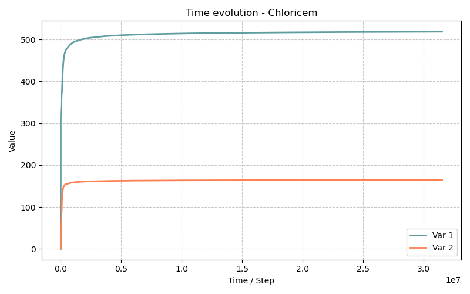

# Modèle Chloricem — Durabilité des matériaux cimentaires : pénétration des chlorures (1D)

> **Fichiers sources :**
> `src/Models/ModelFiles/Chloricem.cpp`
>
> **Exemple :**
> `test_examples/Chloricem/Chloricem` · `test_examples/Chloricem/Chloricem.msh`
>
> **Modèles dérivés :** Carbocem · Carbochloricem
>
> **Auteurs du modèle Bil :** P. Dangla et al. (Université Gustave Eiffel)

---

## Table des matières

1. [Contexte et objectif](#1-contexte-et-objectif)
2. [Hypothèses](#2-hypothèses)
3. [Variables et notation](#3-variables-et-notation)
4. [Modèle mathématique](#4-modèle-mathématique)
   - 4.1 [Équations de conservation](#41-équations-de-conservation)
   - 4.2 [Lois de flux ionique](#42-lois-de-flux-ionique)
   - 4.3 [Chimie de la solution interstitielle](#43-chimie-de-la-solution-interstitielle)
   - 4.4 [Phases solides : dissolution, précipitation, décalcification](#44-phases-solides--dissolution-précipitation-décalcification)
   - 4.5 [Adsorption des chlorures par les C-S-H](#45-adsorption-des-chlorures-par-les-c-s-h)
   - 4.6 [Transport hydraulique — loi de Darcy](#46-transport-hydraulique--loi-de-darcy)
   - 4.7 [Perméabilité et tortuosité évolutives](#47-perméabilité-et-tortuosité-évolutives)
5. [Conditions aux limites et initiales](#5-conditions-aux-limites-et-initiales)
6. [Explication détaillée des fichiers d'entrée](#6-explication-détaillée-des-fichiers-dentrée)
   - 6.1 [Fichier principal `Chloricem`](#61-fichier-principal-chloricem)
   - 6.2 [Courbe de saturation `sat`](#62-courbe-de-saturation-sat)
   - 6.3 [Courbe de perméabilité relative `relpermCN`](#63-courbe-de-perméabilité-relative-relpermmcn)
   - 6.4 [Courbe de volume molaire des C-S-H `V_CSH`](#64-courbe-de-volume-molaire-des-c-s-h-v_csh)
   - 6.5 [Courbes d'adsorption des chlorures `Adscl`](#65-courbes-dadsorption-des-chlorures-adscl)
   - 6.6 [Courbes d'adsorption Na/K — `Adsna`, `Adsk`](#66-courbes-dadsorption-nak--adsna-adsk)
   - 6.7 [Fichier de maillage `Chloricem.msh`](#67-fichier-de-maillage-chloricemmsh)
   - 6.8 [Fichier alternatif `m42` (modèle simplifié de référence)](#68-fichier-alternatif-m42-modèle-simplifié-de-référence)
7. [Résultats attendus et interprétation physique](#7-résultats-attendus-et-interprétation-physique)
   - 7.1 [Structure des fichiers de sortie `.tN`](#71-structure-des-fichiers-de-sortie-tn)
8. [Discrétisation numérique](#8-discrétisation-numérique)
9. [Références bibliographiques](#9-références-bibliographiques)

---

## 1. Contexte et objectif

Le modèle Chloricem est un modèle de **durabilité des bétons et matériaux cimentaires** (CBM — *Cementitious-Based Materials*). Il couple le **transport multi-ionique en phase liquide** avec la **chimie des phases solides du ciment hydraté** (portlandite, C-S-H, calcite, sel de Friedel). C'est le modèle dit « mère » dont dérivent les modèles Carbocem (carbonatation seule) et Carbochloricem (carbonatation + chlorures).

Le scénario du cas test représente la **pénétration des ions chlorure** dans un béton ou une pâte de ciment saturée, exposée à une solution saline (eau de mer, saumure, sels de déverglaçage). Ce phénomène est l'une des principales causes de la corrosion des armatures dans les structures en béton armé : les chlorures dépassent un seuil critique à la surface des aciers et amorcent leur dépassivation.

**Domaine :** 1D planaire, $L = 0.5$ dm = 5 cm.

| Paramètre | Valeur |
|-----------|--------|
| Porosité initiale $\phi_0$ | 12.1 % |
| Perméabilité intrinsèque $k_l^\text{int}$ | $1.4 \times 10^{-17}$ dm² |
| Teneur initiale en portlandite $n_\text{CH}^0$ | 1.64 mol/dm³ |
| Teneur initiale en C-S-H $n_\text{CSH}^0$ | 0.635 mol/dm³ |
| Durée de simulation | 1 an ($3.1536 \times 10^7$ s) |

Le matériau est initialement **sain** (portlandite et C-S-H intacts, solution interstitielle alcaline, pas de chlorures). Le bord gauche ($x = 0$) est soumis à des conditions salines évoluant dans le temps (concentration en Cl⁻ croissante interpolée sur 24 h). Le bord droit ($x = 0.5$ dm) est imperméable (Neumann nul sur toutes les espèces sauf $p_l$ et $z_\text{si}$ qui sont maintenus en Dirichlet).

---

## 2. Hypothèses

1. **Isotherme** : $T = 298$ K (25 °C). Les constantes d'équilibre, viscosités et diffusivités sont fixées à cette température.
2. **Milieu saturé** ($s_l = 1$, sans phase gazeuse active) : la courbe de saturation est constante égale à 1 pour la plage de pressions considérée. L'équation `E_AIR` (air) est désactivée dans cette configuration.
3. **Porosité évolutive** : la dissolution de la portlandite et la précipitation du sel de Friedel modifient le volume solide, donc la porosité.
4. **Électroneutralité locale** : une équation supplémentaire contraint la charge nette de la solution (via l'inconnue $\log c_\text{OH}$).
5. **Gaz parfaits** pour le calcul des pressions partielles de vapeur et de CO₂ gazeux (utiles dans les modèles couplés dérivés).
6. **Loi de Darcy** pour le transport advectif de masse totale (pression $p_l$).
7. **Loi de Nernst-Planck** pour le transport ionique (diffusion + migration électrique).
8. **Équilibres thermodynamiques locaux** pour la chimie de la solution, résolus par la bibliothèque `HardenedCementChemistry`.
9. **Cinétiques de précipitation** pour la calcite et le sel de Friedel ; **dissolution cinétique** de la portlandite couverte d'une couche de calcite (modèle de Thiery).

---

## 3. Variables et notation

### Inconnues primaires (8 dans le cas test Chloricem)

| Symbole Bil | Signification physique | Unité |
|-------------|------------------------|-------|
| `p_l` | Pression de la phase liquide | Pa |
| `z_ca` | Inconnue zêta calcique : $z_\text{ca} = n_\text{CcH}/n_\text{ch}^0 + \log_{10} S_\text{CcH}$ | — |
| `z_si` | Inconnue zêta silicique : $z_\text{si} = n_\text{Si,CSH}/n_\text{csh}^0 + \log_{10} S_\text{CSH}$ | — |
| `logc_na` | $\log_{10}(c_\text{Na})$, Na total dissous | mol/dm³ |
| `logc_k` | $\log_{10}(c_\text{K})$, K total dissous | mol/dm³ |
| `psi` | Potentiel électrique adimensionné $\psi = F\varphi/(RT)$ | — |
| `logc_oh` | $\log_{10}(c_\text{OH})$ (électroneutralité) | mol/dm³ |
| `logc_cl` | $\log_{10}(c_\text{Cl})$, Cl⁻ total dissous | mol/dm³ |

> **Remarque sur les inconnues zêta :** La variable $z_\text{ca}$ encode simultanément la quantité de solide (CH + CC) et son état de saturation. Quand $z_\text{ca} > 0$, le solide est présent et $S_\text{CcH} = 1$ (équilibre) ; quand $z_\text{ca} < 0$, le solide est épuisé et $S_\text{CcH} = 10^{z_\text{ca}} < 1$ (sous-saturation). Le même principe s'applique à $z_\text{si}$ pour les C-S-H.

### Variables secondaires calculées

| Symbole | Signification |
|---------|---------------|
| $s_l$ | Degré de saturation en liquide |
| $\phi$ | Porosité actuelle |
| $n_\text{CH}$ | Teneur molaire en portlandite (mol/dm³) |
| $n_\text{CSH}$ | Teneur molaire en C-S-H (mol/dm³) |
| $n_\text{CC}$ | Teneur molaire en calcite (mol/dm³) |
| $n_\text{FS}$ | Teneur molaire en sel de Friedel (mol/dm³) |
| $x_\text{csh}$ | Rapport Ca/Si dans les C-S-H |
| $c_\text{Cl}^\text{ads}$ | Chlorures adsorbés sur les C-S-H (mol/dm³) |
| $\tau_l$ | Tortuosité effective pour le transport ionique |
| $k_\text{perm}$ | Coefficient de perméabilité relatif à $\phi_0$ |

### Constantes thermodynamiques

| Symbole | Valeur | Signification |
|---------|--------|---------------|
| $T$ | 298 K | Température |
| $R$ | 8.314 J/(mol·K) | Constante des gaz parfaits |
| $K_w$ | $10^{-14}$ mol²/dm⁶ | Produit ionique de l'eau |
| $\rho_l^0$ | 1 kg/dm³ | Masse volumique de l'eau |
| $\mu_l$ | $\approx 10^{-3}$ Pa·s | Viscosité dynamique de l'eau à 298 K |

---

## 4. Modèle mathématique

### 4.1 Équations de conservation

Le système résout **8 équations aux dérivées partielles** couplées (dans la configuration Chloricem active) :

**Conservation de la masse totale (eau) :**

$$\frac{\partial M_\text{tot}}{\partial t} + \nabla \cdot \mathbf{W}_\text{tot} = 0$$

avec $M_\text{tot} = \rho_l\,\phi\,s_l$ (masse d'eau liquide par unité de volume total, la vapeur étant négligeable en milieu saturé).

**Conservation molaire du calcium :**

$$\frac{\partial N_\text{Ca}}{\partial t} + \nabla \cdot \mathbf{W}_\text{Ca} = 0$$

$$N_\text{Ca} = \phi s_l\,c_\text{Ca,l} + n_\text{CH} + x_\text{csh}\,n_\text{CSH} + n_\text{CC} + n_\text{FS,Ca}$$

**Conservation molaire du silicium :**

$$\frac{\partial N_\text{Si}}{\partial t} + \nabla \cdot \mathbf{W}_\text{Si} = 0$$

$$N_\text{Si} = \phi s_l\,c_\text{Si,l} + n_\text{CSH}$$

**Conservation molaire du sodium :**

$$\frac{\partial N_\text{Na}}{\partial t} + \nabla \cdot \mathbf{W}_\text{Na} = 0$$

$$N_\text{Na} = \phi s_l\,c_\text{Na,l} + c_\text{Na,ads}^\text{CSH}\,n_\text{CSH}$$

**Conservation molaire du potassium :**

$$\frac{\partial N_\text{K}}{\partial t} + \nabla \cdot \mathbf{W}_\text{K} = 0$$

$$N_\text{K} = \phi s_l\,c_\text{K,l} + c_\text{K,ads}^\text{CSH}\,n_\text{CSH}$$

**Conservation molaire du chlore :**

$$\frac{\partial N_\text{Cl}}{\partial t} + \nabla \cdot \mathbf{W}_\text{Cl} = 0$$

$$N_\text{Cl} = \phi s_l\,c_\text{Cl,l} + c_\text{Cl,ads}^\text{CSH}\,n_\text{CSH} + 2\,n_\text{FS}$$

**Bilan de charge électrique (divergence du courant nul) :**

$$\nabla \cdot \mathbf{W}_q = 0$$

**Électroneutralité locale :**

$$\sum_i z_i\,c_i = 0$$

c'est-à-dire $2c_{\text{Ca}^{2+}} + c_{\text{Na}^+} + c_{\text{K}^+} + c_{\text{H}^+} - c_{\text{OH}^-} - c_{\text{Cl}^-} - 2c_{\text{CO}_3^{2-}} - \ldots = 0$

Cette relation, résolue dans `HardenedCementChemistry`, fournit $c_\text{OH}$ (inconnue `logc_oh`).

---

### 4.2 Lois de flux ionique

Le flux molaire de chaque ion $i$ dans la phase liquide est donné par l'équation de **Nernst-Planck** :

$$\mathbf{W}_i = -\phi\,s_l\,\tau_l\,D_i^\text{eff}\,\left(\nabla c_i + z_i\,c_i\,\nabla\psi\right) + c_i\,\mathbf{W}_l/\rho_l$$

où :
- $D_i^\text{eff}$ est le coefficient de diffusion effectif de l'ion $i$ dans l'eau (calculé par `CementSolutionDiffusion`) ;
- $z_i$ est le nombre de charge de l'ion ;
- $\psi = F\varphi/(RT)$ est le potentiel électrique adimensionné ;
- $\tau_l$ est la tortuosité de la phase liquide (voir §4.7) ;
- $\mathbf{W}_l$ est le flux de masse liquide (Darcy, voir §4.6).

Le **courant électrique** $\mathbf{W}_q$ est la somme pondérée par les charges :

$$\mathbf{W}_q = \sum_i z_i\,\mathbf{W}_i$$

La condition $\nabla \cdot \mathbf{W}_q = 0$ (conservation de la charge) détermine le gradient de potentiel électrique $\nabla\psi$ qui assure la neutralité locale du flux.

---

### 4.3 Chimie de la solution interstitielle

La chimie est résolue à chaque point d'intégration par la bibliothèque **`HardenedCementChemistry`**, qui calcule à l'équilibre thermodynamique l'ensemble des concentrations ioniques à partir des variables primaires. Les espèces aqueuses prises en compte comprennent notamment :

| Espèce | Commentaire |
|--------|-------------|
| Ca²⁺, CaOH⁺, CaOH₂(aq) | Calcium |
| H₂SiO₄²⁻, H₃SiO₄⁻, H₄SiO₄ | Silicate |
| Na⁺, NaOH(aq) | Sodium |
| K⁺, KOH(aq) | Potassium |
| H⁺, OH⁻ | Eau |
| CO₃²⁻, HCO₃⁻, CO₂(aq) | Carbone |
| Cl⁻ | Chlorure |

La bibliothèque `CementSolutionDiffusion` fournit les coefficients de diffusion effectifs de chaque espèce en fonction de la composition de la solution et de la temperature.

---

### 4.4 Phases solides : dissolution, précipitation, décalcification

#### Portlandite Ca(OH)₂ — CH

La portlandite se dissout selon une cinétique contrôlée par la diffusion du CO₂ à travers une couche de calcite qui se forme en surface du cristal (modèle de Thiery, 2005). En absence de carbonatation (CO₂ = 0), CH est à l'équilibre :

$$S_\text{CH} = \frac{[\text{Ca}^{2+}][\text{OH}^-]^2}{K_\text{sp,CH}}$$

Le contenu en CH est gouverné par l'inconnue $z_\text{ca}$ :

$$n_\text{CH} = n_\text{ch}^0 \cdot \max(z_\text{ca},\, 0), \qquad \log_{10} S_\text{CH} = \min(z_\text{ca},\, 0)$$

#### C-S-H (Silicates de Calcium Hydratés)

Les C-S-H forment une solution solide de composition variable, caractérisée par le rapport Ca/Si = $x_\text{csh}$. La décalcification progressive des C-S-H est modélisée par la diminution de $x_\text{csh}$ lorsque la solution s'appauvrit en calcium. Le volume molaire des C-S-H varie linéairement avec $x_\text{csh}$ (courbe `V_CSH`) :

$$V_\text{CSH}(x) = \frac{x_1 - x}{x_1 - x_0}\,V_0 + \frac{x - x_0}{x_1 - x_0}\,V_1$$

avec $x_0 = 0$, $V_0 = 5.44 \times 10^{-2}$ dm³/mol (tobermorite) et $x_1 = 0.85$, $V_1 = 8.14 \times 10^{-2}$ dm³/mol.

#### Calcite CaCO₃ — CC

La précipitation/dissolution de la calcite suit une **cinétique du premier ordre** :

$$\frac{d n_\text{CC}}{d t} = r_\text{CC} \cdot (S_\text{CC} - 1), \qquad r_\text{CC} = 10^{-6}\ \text{mol/(dm³·s)}$$

La calcite ne se forme que si la solution est sursaturée en CaCO₃ ($S_\text{CC} > 1$), ce qui requiert la présence de CO₂ dissous. Dans le cas test pur chlorure (pas de CO₂ externe), la calcite reste absente.

#### Sel de Friedel Ca₄Al₂O₆Cl₂·10H₂O

Le sel de Friedel est la phase solide qui fixe chimiquement les chlorures. Sa précipitation suit une cinétique analogue :

$$\frac{d n_\text{FS}}{d t} = r_\text{FS} \cdot (S_\text{FS} - 1), \qquad r_\text{FS} = 10^{-6}\ \text{mol/(dm³·s)}$$

Le sel de Friedel contient 2 moles de Cl par mole, contribuant significativement à la fixation des chlorures dans le béton.

#### Porosité actuelle

La porosité évolue en fonction des volumes des phases solides :

$$\phi = \phi_0 - \Delta V_s^\text{CSH} - \Delta V_s^\text{CH} - \Delta V_s^\text{CC} - \Delta V_s^\text{FS}$$

$$\phi = \phi_0 - V_\text{CSH}(x)\,(n_\text{CSH} - n_\text{csh}^0) - V_\text{CH}\,(n_\text{CH} - n_\text{ch}^0) - V_\text{CC}\,n_\text{CC} - V_\text{FS}\,n_\text{FS}$$

---

### 4.5 Adsorption des chlorures par les C-S-H

Les C-S-H adsorbent physiquement les ions Cl⁻ selon une **isotherme de Langmuir** en fonction de la concentration en chlorures libres $c_\text{Cl}$ et du rapport Ca/Si courant $x_\text{csh}$ :

$$c_\text{Cl,ads}^\text{CSH} = \frac{\alpha(x_\text{csh})\,c_\text{Cl}}{1 + \beta(x_\text{csh})\,c_\text{Cl}}$$

Les coefficients $\alpha$ et $\beta$ sont tabulés en fonction de $x_\text{csh}$ dans la courbe `Adscl`. Dans le cas test :

$$\alpha = 3.192, \qquad \beta = 26.6 \text{ dm³/mol}$$

Ces valeurs sont **indépendantes de** $x_\text{csh}$ dans cet exemple (courbe constante sur $[0.5,\, 1.5]$).

L'adsorption du sodium et du potassium est modélisée par une **isotherme linéaire** tronquée à $c = 0.3$ mol/dm³ :

$$c_\text{Na,ads}^\text{CSH} = R_\text{Na}(x_\text{csh})\,\min(c_\text{Na},\, 0.3\ \text{mol/dm³})$$

Dans le cas test, $R_\text{Na} = R_\text{K} = 0$ (courbes `Adsna`, `Adsk`), donc les alcalins ne sont pas adsorbés.

---

### 4.6 Transport hydraulique — loi de Darcy

Le flux de masse totale d'eau liquide (en milieu saturé, sans gravité) est :

$$\mathbf{W}_\text{tot} = -\frac{\rho_l\,k_l^\text{int}\,k_{rl}(s_l)\,k_\text{perm}(\phi)}{\mu_l}\,\nabla p_l$$

Le coefficient $k_\text{perm}(\phi)$ modélise la réduction de perméabilité due au colmatage par les produits de réaction (voir §4.7). Dans le cas test saturé, $k_{rl} = 1$.

---

### 4.7 Perméabilité et tortuosité évolutives

#### Tortuosité — modèle Oh & Jang (2004)

La tortuosité de la phase liquide pour le transport ionique est calculée selon le modèle empirique de Oh & Jang :

$$\tau_l(\phi,\, s_l) = f(\phi,\, s_l)$$

Ce modèle est calibré sur des données expérimentales de diffusivité de bétons et pâtes de ciment, et tient compte de l'effet conjoint de la porosité et de la saturation.

#### Perméabilité — modèle Verma & Pruess (1988)

La réduction de perméabilité liée au colmatage est modélisée par le modèle de Verma & Pruess :

$$k_\text{perm}(\phi) = \left(\frac{\phi - \phi_r}{\phi_0 - \phi_r}\right)^n \cdot f_\text{pore}$$

où $\phi_r = 0.70\,\phi_0$ est la porosité seuil en-dessous de laquelle la perméabilité s'annule, et le facteur de forme $f_\text{pore}$ dépend de la fraction de longueur des corps de pores `frac` = 0.8.

---

## 5. Conditions aux limites et initiales

### Conditions initiales

Le béton est **initialement sain**, en équilibre avec la solution interstitielle alcaline :

| Inconnue | Valeur initiale | Commentaire |
|----------|-----------------|-------------|
| `p_l` | 0 Pa | Pression de référence |
| `logc_cl` | $-4$ (soit $10^{-4}$ mol/dm³) | Traces de chlorures |
| `z_ca` | 1 | Portlandite présente ($n_\text{CH} = n_\text{ch}^0$) |
| `z_si` | $-0.92$ | C-S-H présents à composition initiale |
| `logc_na` | $-0.64$ (soit ≈ 0.23 mol/dm³) | Sodium initial |
| `logc_k` | $-4$ (soit $10^{-4}$ mol/dm³) | Potassium initial faible |
| `psi` | 0 | Potentiel nul de référence |

> Ces valeurs correspondent à une solution interstitielle fortement alcaline (pH ≈ 13.5, portlandite à l'équilibre) caractéristique d'un béton OPC hydraté.

### Conditions aux limites

| Bord | $x$ [dm] | Variable | Type | Valeur |
|------|----------|----------|------|--------|
| Gauche (exposition) | 0 | `logc_cl` | Dirichlet | $-4$ à $t=0$ → $-0.28$ à $t=86400$ s |
| Gauche | 0 | `z_ca` | Dirichlet | $1 \to -0.208$ (décalcification progressive) |
| Gauche | 0 | `logc_na` | Dirichlet | $-0.64 \to -2.49$ |
| Gauche | 0 | `logc_k` | Dirichlet | $-4$ (constant) |
| Gauche | 0 | `psi` | Dirichlet | 0 |
| Droit (symétrie) | 0.5 | `p_l` | Dirichlet | 0 Pa |
| Droit | 0.5 | `z_si` | Dirichlet | $-0.92$ (C-S-H imposés) |

Les conditions de bord gauche évoluent **linéairement en temps** entre $t = 0$ et $t = 86400$ s (1 jour), simulant l'établissement progressif d'un contact avec la solution saline. Au-delà d'un jour, les valeurs restent constantes (la fonction est interpolée avec les 2 points fournis, ce qui implique une extrapolation constante au-delà).

> **Interprétation physique :** Le front de chlorures pénètre depuis le bord gauche (surface exposée à la mer ou à une solution saline) vers le bord droit (cœur du matériau, imperméable ou plan de symétrie). Sur 1 an, le front atteint quelques millimètres à quelques centimètres selon la diffusivité effective.

---

## 6. Explication détaillée des fichiers d'entrée

### 6.1 Fichier principal `Chloricem`

```
Units
Length = decimeter
Mass   = hectogram
```

**Système d'unités :** Le modèle travaille en **décimètres** (longueur) et **hectogrammes** (masse). Toutes les entrées doivent être cohérentes avec ce système :
- Les longueurs sont en dm (1 dm = 10 cm)
- Les concentrations sont en mol/dm³ (= mol/L)
- Les pressions en Pa
- Le temps en secondes

---

```
Geometry
1 plan
```

**Géométrie :** Problème 1D planaire (axe $x$, pas de symétrie cylindrique ni sphérique).

---

```
Mesh
4 0. 0. 0.5 0.5
5.e-3
1 100 1
1 1 1
```

**Maillage :** Définit un domaine 1D de 0 à 0.5 dm avec 100 éléments de taille $5 \times 10^{-3}$ dm = 0.5 mm. Le maillage génère 103 nœuds (incluant les nœuds de bord). Les 4 premières valeurs `4 0. 0. 0.5 0.5` définissent les coordonnées des coins du domaine ; le format est lu par Bil pour construire le maillage structuré.

> **Astuce :** Le fichier `Chloricem.msh` (format Gmsh v2.0) est la version exportée de ce maillage, utilisée si Bil est lancé avec un fichier `.msh` externe plutôt que la génération interne.

---

```
Material
Model = Chloricem
InitialPorosity = 0.121
IntrinsicPermeability = 1.4e-17
InitialContent_portlandite = 1.64
InitialContent_csh = 0.635
InitialConcentration_sodium = -1
InitialConcentration_potassium = -1
FractionalLengthOfPoreBodies = 0.8
PorosityFractionAtVanishingPermeability = 0.70
MinimumPorosity = 0.01
PrecipitationRate_calcite = 1.e-6
PrecipitationRate_friedelsalt = 1.e-6
Curves = sat       p_c = ...   s_l = ...
Curves = relpermCN s_l = ...   kl_r = ...
Curves = V_CSH     x = ...     v_csh = ...
Curves = Adscl     x = ...     alpha = ...  beta = ...
Curves = Adsna     x = ...     adsna = ...
Curves = Adsk      x = ...     adsk = ...
```

Paramètres matériaux lus par la fonction `ReadMatProp` :

| Paramètre | Valeur | Signification |
|-----------|--------|---------------|
| `InitialPorosity` | 0.121 | $\phi_0$ = 12.1 % |
| `IntrinsicPermeability` | $1.4 \times 10^{-17}$ dm² | $k_l^\text{int}$ (en dm², pas m²) |
| `InitialContent_portlandite` | 1.64 mol/dm³ | $n_\text{CH}^0$ |
| `InitialContent_csh` | 0.635 mol/dm³ | $n_\text{CSH}^0$ |
| `InitialConcentration_sodium` | $-1$ | Valeur négative = calcul automatique via `HardenedCementChemistry` |
| `InitialConcentration_potassium` | $-1$ | Idem |
| `FractionalLengthOfPoreBodies` | 0.8 | Paramètre `frac` du modèle Verma-Pruess |
| `PorosityFractionAtVanishingPermeability` | 0.70 | $\phi_r/\phi_0$ : seuil de colmatage |
| `MinimumPorosity` | 0.01 | $\phi_\text{min}$ : plancher numérique de porosité |
| `PrecipitationRate_calcite` | $10^{-6}$ mol/(dm³·s) | Taux cinétique calcite $r_\text{CC}$ |
| `PrecipitationRate_friedelsalt` | $10^{-6}$ mol/(dm³·s) | Taux cinétique sel de Friedel $r_\text{FS}$ |

---

```
Fields
1
Value = 1.      Gradient = 0 0 0      Point = 0 0 0
```

**Champs spatiaux :** Un seul champ uniforme de valeur 1, utilisé comme multiplicateur dans les conditions initiales et aux limites (facteur d'échelle neutre ici).

---

```
Initialization
7
Region = 2    Unknown = p_l       Field = 0    Function = 0
Region = 2    Unknown = logc_cl   Field = 1    Function = 1
Region = 2    Unknown = z_ca      Field = 1    Function = 2
Region = 2    Unknown = z_si      Field = 1    Function = 0
Region = 2    Unknown = logc_na   Field = 1    Function = 3
Region = 2    Unknown = logc_k    Field = 1    Function = 4
Region = 2    Unknown = psi       Field = 0    Function = 0
```

**Initialisation :** Les 7 inconnues sont initialisées dans la région 2 (tout le domaine volumique). La syntaxe `Field = i  Function = j` signifie que la valeur initiale est `Field[i] × Function[j](t=0)` :

| Inconnue | Field | Function | Valeur initiale | Interprétation |
|----------|-------|----------|-----------------|----------------|
| `p_l` | 0 (=0) | 0 (=0) | 0 Pa | Pression de référence |
| `logc_cl` | 1 (=1) | 1 : F(0)=−4 | −4 | $c_\text{Cl} = 10^{-4}$ mol/dm³ |
| `z_ca` | 1 (=1) | 2 : F(0)=1 | 1 | Portlandite intacte |
| `z_si` | 1 (=1) | 0 (=0) | 0 | **Attention** : Z_si=0 signifie $n_\text{CSH} = n_\text{csh}^0$, $S_\text{CSH}=1$ |
| `logc_na` | 1 (=1) | 3 : F(0)=−0.639 | −0.639 | $c_\text{Na} \approx 0.23$ mol/dm³ |
| `logc_k` | 1 (=1) | 4 : F(0)=−4 | −4 | $c_\text{K} = 10^{-4}$ mol/dm³ |
| `psi` | 0 (=0) | 0 (=0) | 0 | Potentiel nul |

---

```
Functions
5
N = 2     F(0) = -4         F(86400) = -0.28133
N = 2     F(0) = 1          F(86400) = -2.7766
N = 2     F(0) = -0.92082   F(86400) = -0.20761
N = 2     F(0) = -0.63927   F(86400) = -2.4948
N = 1     F(0) = -4
```

**Fonctions temporelles :** 5 fonctions linéaires par morceaux utilisées pour les conditions initiales et aux limites :

| Fonction | $t=0$ | $t=86400$ s (1 j) | Usage |
|----------|-------|-------------------|-------|
| 1 | $-4$ | $-0.281$ | `logc_cl` : de $10^{-4}$ mol/dm³ à $0.52$ mol/dm³ |
| 2 | $1$ | $-2.777$ | `z_ca` : dissolution progressive de la portlandite (décalcification) |
| 3 | $-0.921$ | $-0.208$ | `z_si` : décalcification des C-S-H |
| 4 | $-0.639$ | $-2.495$ | `logc_na` : dilution du sodium par l'eau de mer |
| 5 | $-4$ | (1 point) | `logc_k` : constant |

> Ces valeurs correspondent à des conditions à la frontière gauche représentant le contact avec une eau de mer (environ 0.5 mol/dm³ de NaCl, pH neutre à légèrement basique, calcium dilué).

---

```
Boundary Conditions
7
Region = 2    Unknown = p_l       Field = 0    Function = 0
Region = 1    Unknown = logc_cl   Field = 1    Function = 1
Region = 1    Unknown = z_ca      Field = 1    Function = 2
Region = 1    Unknown = logc_na   Field = 1    Function = 3
Region = 1    Unknown = logc_k    Field = 1    Function = 4
Region = 1    Unknown = psi       Field = 0    Function = 0
Region = 2    Unknown = z_si      Field = 1    Function = 0
```

**Conditions aux limites :**

- **Région 1** (bord gauche, $x = 0$) : conditions de Dirichlet sur les espèces ioniques. Ces valeurs évoluent dans le temps via les fonctions 1–4.
- **Région 2** (bord droit, $x = 0.5$ dm) : Dirichlet sur `p_l` (pression de référence) et `z_si` (C-S-H en état initial, cœur du matériau).
- **`logc_oh`** n'est pas listé car il est déterminé implicitement par l'équation d'électroneutralité.

> La condition `psi = 0` au bord d'exposition fixe la référence du potentiel électrique.

---

```
Dates
13
0.  2.628e6 5.256e6 7.884e6 1.0512e7 1.314e7 1.5768e7 1.8396e7 2.1024e7 2.3652e7 2.628e7 2.8908e7 3.1536e7
```

**Pas de sortie :** 13 instants de sortie régulièrement espacés d'environ 1 mois ($\approx 2.628 \times 10^6$ s), couvrant 1 an. Chaque instant génère un fichier `Chloricem.tN`.

---

```
Objective Variations
logc_cl    = 1.e-1
p_l        = 1.e5
z_ca       = 1.
z_si       = 1.
logc_na    = 1.
logc_k     = 1.
psi        = 1.e3
logc_oh    = 1.e-2
```

**Variations objectives (contrôle adaptatif du pas de temps) :** Ces valeurs définissent la variation maximale autorisée de chaque inconnue par pas de temps. Si une inconnue varie plus que sa valeur objective, le pas de temps est réduit. `logc_oh = 1e-2` est la contrainte la plus stricte car le pH est très sensible.

---

```
Iterative Process
Iterations = 20
Tolerance = 1.e-6
Repetition = 2
```

**Processus itératif Newton-Raphson :** Maximum 20 itérations Newton, tolérance $10^{-6}$ sur le résidu, 2 tentatives de répétition en cas d'échec de convergence (avec réduction du pas de temps).

---

```
Time Steps
Dtini = 1.e-1
Dtmax = 1.e6
```

**Pas de temps :** Départ très petit (0.1 s) pour les fortes discontinuités initiales des conditions aux limites, puis croissance adaptative jusqu'à $10^6$ s ≈ 11.6 jours.

---

### 6.2 Courbe de saturation `sat`

```
Curves = sat  p_c = Range{x1 = 0, x2 = 1, n = 2}  s_l = Expressions(1){s_l = 1}
```

Le milieu est considéré **entièrement saturé** ($s_l = 1$) quelle que soit la pression capillaire. Cette simplification est valide pour un béton immergé ou en contact permanent avec une eau libre. La courbe est définie par 2 points avec $s_l = 1$ constant.

---

### 6.3 Courbe de perméabilité relative `relpermCN`

```
Curves = relpermCN  s_l = Range{x1 = 0, x2 = 1, n = 101}
                    kl_r = Mualem_liq(1){m = 0.45}
```

Perméabilité relative liquide calculée par le **modèle de Mualem-van Genuchten** avec le paramètre de forme $m = 0.45$ :

$$k_{rl}(s_l) = \sqrt{s_l}\,\left[1 - \left(1 - s_l^{1/m}\right)^m\right]^2$$

En milieu saturé ($s_l = 1$), $k_{rl} = 1$. Cette courbe est définie sur 101 points de $s_l = 0$ à $s_l = 1$.

---

### 6.4 Courbe de volume molaire des C-S-H `V_CSH`

```
Curves = V_CSH  x = Range{x1 = 0, x2 = 0.85, n=2}
                v_csh = Expressions(1){x0=0 ; v0=5.44e-2 ; x1=0.85 ; v1=8.14e-2 ;
                                       v_csh = (x1-x)/(x1-x0)*v0 + (x-x0)/(x1-x0)*v1}
```

Interpolation **linéaire** du volume molaire des C-S-H en fonction du rapport Ca/Si $x$ :

| $x$ (Ca/Si) | $V_\text{CSH}$ [dm³/mol] | Phase |
|-------------|--------------------------|-------|
| 0 | 0.0544 | Tobermorite (C-S-H riche Si) |
| 0.85 | 0.0814 | C-S-H typique de l'OPC |

Ce volume entre directement dans le calcul de la porosité actuelle $\phi$.

---

### 6.5 Courbes d'adsorption des chlorures `Adscl`

```
Curves = Adscl  x = Range{x1 = 0.5, x2 = 1.5, n = 100}
                alpha = Expressions(1){alpha = 3.192 ;}
                beta  = Expressions(1){beta = 26.6 ;}
```

Isotherme de Langmuir pour l'adsorption des chlorures. Les coefficients sont constants sur $x_\text{csh} \in [0.5,\, 1.5]$ :

$$c_\text{Cl,ads} = \frac{3.192\,c_\text{Cl}}{1 + 26.6\,c_\text{Cl}} \quad [\text{mol Cl/mol CSH}]$$

La capacité d'adsorption maximale (plateau de Langmuir) est $\alpha/\beta = 3.192/26.6 \approx 0.12$ mol Cl/mol CSH.

---

### 6.6 Courbes d'adsorption Na/K — `Adsna`, `Adsk`

```
Curves = Adsna  x = Range{x1 = 0, x2 = 1, n = 2}  adsna = Expressions(1){adsna = 0;}
Curves = Adsk   x = Range{x1 = 0, x2 = 1, n = 2}  adsk  = Expressions(1){adsk  = 0;}
```

Adsorption nulle pour Na et K dans ce cas test. Ces courbes sont requises par le modèle mais ici inactives.

---

### 6.7 Fichier de maillage `Chloricem.msh`

Fichier au **format Gmsh v2.0** généré automatiquement. Il contient :
- 103 nœuds sur le segment $[0,\, 0.5]$ dm ;
- 102 éléments linéiques (LINE2) intérieurs ;
- 2 éléments ponctuels (POINT) aux extrémités (régions 1 et 2, correspondant aux nœuds de bord gauche et droit).

Les régions physiques `1` (bord gauche) et `2` (bord droit / domaine volumique) sont utilisées pour affecter les conditions aux limites.

---

### 6.8 Fichier alternatif `m42` (modèle simplifié de référence)

Le fichier `m42` utilise le modèle de référence **42** (un modèle de transport de chlorures simplifié, purement diffusif) sur un domaine plus court ($L = 0.05$ dm = 5 mm). Il constitue une **solution de référence** pour valider le comportement de Chloricem : les deux modèles doivent produire des profils de chlorures cohérents dans la limite des simplifications.

Le modèle 42 utilise 8 inconnues algébriquement différentes (`c_cl`, `z_caoh2`, `z_c3a`, `z_sf`, `c_na`, `c_k`, `z_aloh3`, `psi`) et des paramètres matériaux directement en unités SI (pas dm/hg) : `D_Cl = 2.032e-13 m²/s`.

---

## 7. Résultats attendus et interprétation physique

### 7.1 Structure des fichiers de sortie `.tN`

Chaque instant de sortie génère un fichier texte `<nom>.tN` (ex. `Carbochloricem.t1`). Le fichier commence par un en-tête de commentaires (`#`) suivi d'une ligne de données par nœud du maillage.

```
# Version 2.8.3, ...
# Time = 8.603352e+04
# Model = Carbochloricem
# Number of views = 70
# Numbers of components per view = 1 1 1 ...
# Coordinates(1)  p_l(4)  saturation(5)  ...
```

> Les colonnes 2 et 3 (coordonnées $y$ et $z$) sont présentes dans le fichier mais non nommées dans l'en-tête ; elles valent 0 en géométrie 1D planaire.

Le tableau ci-dessous donne les 73 colonnes nommées du modèle **Carbochloricem** (modèle dérivé de Chloricem incluant la carbonatation). Le système d'unités est celui du fichier d'entrée : longueurs en **dm**, masse en **hg** (hectogramme = 100 g), temps en **s**.

| Col. | Nom Bil | Description | Unité |
|-----:|---------|-------------|-------|
| 1 | `Coordinates` | Coordonnée spatiale $x$ | dm |
| 4 | `p_l` | Pression de la phase liquide | Pa |
| 5 | `saturation` | Degré de saturation $s_l$ | — |
| 6 | `porosity` | Porosité $\phi$ | — |
| 7 | `c_co2` | Concentration totale en CO₂ dissous | mol/dm³ |
| 8 | `c_ca_l` | Concentration totale en Ca en phase liquide | mol/dm³ |
| 9 | `c_si_l` | Concentration totale en Si en phase liquide | mol/dm³ |
| 10 | `c_na_l` | Concentration totale en Na en phase liquide | mol/dm³ |
| 11 | `c_k_l` | Concentration totale en K en phase liquide | mol/dm³ |
| 12 | `c_c_l` | Concentration totale en carbone inorganique dissous | mol/dm³ |
| 13 | `c_cl_l` | Concentration totale en Cl en phase liquide | mol/dm³ |
| 14 | `n_CH` | Teneur en portlandite Ca(OH)₂ | mol/dm³ |
| 15 | `s_ch` | Indice de saturation de la portlandite | — |
| 16 | `n_CSH` | Teneur en C-S-H | mol/dm³ |
| 17 | `x_csh` | Rapport Ca/Si dans les C-S-H | — |
| 18 | `s_sh` | Indice de saturation des C-S-H | — |
| 19 | `n_CC` | Teneur en calcite CaCO₃ | mol/dm³ |
| 20 | `s_cc` | Indice de saturation de la calcite | — |
| 21 | `n_Friedel's salt` | Teneur en sel de Friedel | mol/dm³ |
| 22 | `s_friedelsalt` | Indice de saturation du sel de Friedel | — |
| 23 | `c_h` | Concentration en H⁺ | mol/dm³ |
| 24 | `c_oh` | Concentration en OH⁻ | mol/dm³ |
| 25 | `ph` | pH de la solution | — |
| 26 | `c_ca` | Concentration en Ca²⁺ | mol/dm³ |
| 27 | `c_caoh` | Concentration en CaOH⁺ | mol/dm³ |
| 28 | `c_h2sio4` | Concentration en H₂SiO₄²⁻ | mol/dm³ |
| 29 | `c_h3sio4` | Concentration en H₃SiO₄⁻ | mol/dm³ |
| 30 | `c_h4sio4` | Concentration en H₄SiO₄ (acide silicique neutre) | mol/dm³ |
| 31 | `c_na` | Concentration en Na⁺ | mol/dm³ |
| 32 | `c_naoh` | Concentration en NaOH | mol/dm³ |
| 33 | `c_k` | Concentration en K⁺ | mol/dm³ |
| 34 | `c_koh` | Concentration en KOH | mol/dm³ |
| 35 | `c_co3` | Concentration en CO₃²⁻ | mol/dm³ |
| 36 | `c_hco3` | Concentration en HCO₃⁻ | mol/dm³ |
| 37 | `c_cah2sio4` | Concentration en CaH₂SiO₄ | mol/dm³ |
| 38 | `c_cah3sio4` | Concentration en CaH₃SiO₄⁺ | mol/dm³ |
| 39 | `c_cahco3` | Concentration en CaHCO₃⁺ | mol/dm³ |
| 40 | `c_caco3aq` | Concentration en CaCO₃ aqueux | mol/dm³ |
| 41 | `c_caoh2aq` | Concentration en Ca(OH)₂ aqueux | mol/dm³ |
| 42 | `c_nahco3` | Concentration en NaHCO₃ | mol/dm³ |
| 43 | `c_naco3` | Concentration en NaCO₃⁻ | mol/dm³ |
| 44 | `c_cl` | Concentration en Cl⁻ | mol/dm³ |
| 45 | `n_Ca` | Teneur totale en Ca (toutes phases) | mol/dm³ |
| 46 | `n_Si` | Teneur totale en Si (toutes phases) | mol/dm³ |
| 47 | `n_Na` | Teneur totale en Na (toutes phases) | mol/dm³ |
| 48 | `n_K` | Teneur totale en K (toutes phases) | mol/dm³ |
| 49 | `n_C` | Teneur totale en C (toutes phases) | mol/dm³ |
| 50 | `n_Cl` | Teneur totale en Cl (liquide + adsorbé + sel de Friedel) | mol/dm³ |
| 51 | `total mass` | Masse de liquide par unité de volume de matériau | hg/dm³ |
| 52 | `total mass flow` | Flux de masse totale (Darcy) | hg/(dm²·s) |
| 53 | `carbon mass flow` | Flux massique de carbone | hg/(dm²·s) |
| 54 | `calcium mass flow` | Flux massique de calcium | hg/(dm²·s) |
| 55 | `silicon mass flow` | Flux massique de silicium | hg/(dm²·s) |
| 56 | `sodium mass flow` | Flux massique de sodium | hg/(dm²·s) |
| 57 | `potassium mass flow` | Flux massique de potassium | hg/(dm²·s) |
| 58 | `chlorine mass flow` | Flux massique de chlore | hg/(dm²·s) |
| 59 | `Ca/Si ratio` | Rapport Ca/Si global (phases solides) | — |
| 60 | `Electric potential` | Potentiel électrique adimensionné $\psi = F\varphi/(RT)$ | — |
| 61 | `charge` | Densité de charge ionique de la solution | mol/dm³ |
| 62 | `I` | Force ionique de la solution | mol/dm³ |
| 63 | `v_csh` | Volume molaire des C-S-H | dm³/mol |
| 64 | `v_ch` | Volume molaire de la portlandite | dm³/mol |
| 65 | `v_cc` | Volume molaire de la calcite | dm³/mol |
| 66 | `air pressure` | Pression partielle de l'air (phase gazeuse) | Pa |
| 67 | `humidity` | Humidité relative | — |
| 68 | `CO2 ppm` | Teneur en CO₂ gazeux | ppm |
| 69 | `gas pressure` | Pression totale de la phase gazeuse | Pa |
| 70 | `tortuosity to liquid` | Facteur de tortuosité pour le transport en phase liquide | — |
| 71 | `permeability coef` | Coefficient de perméabilité relatif ($k_\text{perm}/k_0$) | — |
| 72 | `adsorbed chloride` | Chlorures adsorbés sur les C-S-H | mol/dm³ |
| 73 | `liquid mass density` | Masse volumique de la phase liquide | hg/dm³ |

> **Rappel des conversions :** 1 hg/dm³ = 100 g/L = 100 kg/m³ ; 1 mol/dm³ = 1 mol/L = 1 M.

---

### Évolution initiale (état $t=0$)

À $t = 0$, le matériau est uniforme et sain :

| Variable | Valeur uniforme |
|----------|-----------------|
| $p_l$ | 0 Pa |
| $s_l$ | 1.0 |
| $\phi$ | 12.1 % |
| $c_\text{Cl}$ | $10^{-4}$ mol/dm³ (traces) |
| $n_\text{CH}$ | 1.64 mol/dm³ |
| $n_\text{CSH}$ | 0.635 mol/dm³ |
| $x_\text{CSH}$ (Ca/Si) | 1.79 |
| pH | ≈ 13.5 (très alcalin) |
| $c_\text{Ca,l}$ | ≈ 5.8×10⁻⁴ mol/dm³ |

### Évolution sur 1 an ($t = 3.1536 \times 10^7$ s)

L'analyse des fichiers de sortie `Chloricem.t12` au nœud $x = 0$ (bord exposé) révèle après 1 an :

| Variable | $t=0$ | $t=1$ an (bord) | Évolution |
|----------|-------|-----------------|-----------|
| $n_\text{CH}$ | 1.64 mol/dm³ | ≈ 0 mol/dm³ | Portlandite **totalement dissoute** en surface |
| $n_\text{CSH}$ | 0.635 mol/dm³ | ≈ 0.0017 mol/dm³ | C-S-H **quasi épuisés** en surface |
| $n_\text{CC}$ | 0 | ≈ 0 | Pas de calcite (pas de CO₂) |
| $c_\text{Cl}$ | $10^{-4}$ | ≈ 0.52 mol/dm³ | Front de chlorures établi en surface |
| pH | 13.5 | ≈ 9.6 | **Dépassivation** (pH < 11.5) |
| $\phi$ | 12.1 % | ≈ 17.5 % | Augmentation (dissolution sans reprécipitation) |

### Physique du front de pénétration

1. **Front de chlorures** : les ions Cl⁻ pénètrent depuis le bord gauche par diffusion (principale) et migration (secondaire). Le profil est de type erfc (fonction d'erreur complémentaire) pour un coefficient de diffusion constant.

2. **Dépassivation des armatures** : le critère usuel de dépassivation est atteint lorsque la teneur en chlorures libres dépasse $0.4\ \text{kg/m³}$ de béton, soit environ 0.01 mol/dm³. Sur 1 an dans cette configuration, ce seuil est atteint sur les premiers millimètres.

3. **Dissolution de la portlandite** : la baisse de pH induite par la dilution du bord entraîne la dissolution de CH, libérant du Ca²⁺ qui tamponne partiellement la solution.

4. **Fixation par adsorption et sel de Friedel** : une fraction des chlorures est piégée sous forme adsorbée sur les C-S-H et précipitée en sel de Friedel. Cette fixation retarde l'avancée du front de chlorures libres.

5. **Évolution de la porosité** : la dissolution de CH et des C-S-H sans reprécipitation crée une zone dégradée de porosité accrue en surface, accélérant progressivement le transport.



---

## 8. Discrétisation numérique

Le modèle est discrétisé par la méthode des **volumes finis centrés sur les cellules** (FVM), implémentée dans Bil via `FVM.h`. La discrétisation spatiale utilise un schéma centré pour les flux diffusifs et le flux électrique.

Le système non-linéaire (8 équations couplées × 103 nœuds = 824 degrés de liberté) est résolu à chaque pas de temps par la **méthode de Newton-Raphson**, avec une matrice Jacobienne assemblée par `SetTangentMatrix()`.

Le **pas de temps adaptatif** est contrôlé par la variation maximale des inconnues (OBJE dans Bil) : le pas est réduit si une inconnue varie plus que sa valeur objective, et augmenté sinon, jusqu'au maximum `Dtmax = 1e6` s.

La chimie interne (résolution des équilibres thermodynamiques et des saturations des phases solides) est effectuée à chaque point d'intégration par la bibliothèque **`HardenedCementChemistry`**, via la méthode `Integrate()` du `MaterialPointMethod`.

---

## 9. Références bibliographiques

### Modèles de transport ionique en milieu poreux

- **Nernst, W.** (1888). Zur Kinetik der in Lösung befindlichen Körper. *Zeitschrift für Physikalische Chemie*, 2, 613–637. — Équation de Nernst-Planck pour la diffusion ionique couplée à la migration électrique.

- **Planck, M.** (1890). Ueber die Potentialdifferenz zwischen zwei verdünnten Lösungen binärer Elektrolyte. *Annalen der Physik*, 276(8), 561–576. — Formalisme de Nernst-Planck.

- **Samson, E. & Marchand, J.** (1999). Numerical solution of the extended Nernst-Planck model. *Journal of Colloid and Interface Science*, 215(1), 1–8. — Implémentation numérique du transport multi-ionique dans les bétons.

### Durabilité des bétons — Pénétration des chlorures

- **Tuutti, K.** (1982). *Corrosion of Steel in Concrete*. Swedish Cement and Concrete Research Institute, Stockholm. — Modèle classique de durée de vie en deux phases : initiation + propagation de la corrosion.

- **Andrade, C., Alonso, C. & Molina, F.J.** (1993). Cover cracking as a function of bar corrosion: Part I — Experimental test. *Materials and Structures*, 26(8), 453–464. — Critères de dépassivation des armatures.

- **Tang, L. & Nilsson, L.O.** (1992). Rapid determination of the chloride diffusivity in concrete by applying an electric field. *ACI Materials Journal*, 89(1), 49–53. — Méthode RCPT et coefficients de diffusion des chlorures.

### Chimie du ciment hydraté

- **Taylor, H.F.W.** (1997). *Cement Chemistry* (2ᵉ éd.). Thomas Telford, London. — Référence fondamentale sur la composition et la chimie des hydrates du ciment.

- **Lothenbach, B. & Winnefeld, F.** (2006). Thermodynamic modelling of the hydration of Portland cement. *Cement and Concrete Research*, 36(2), 209–226. — Modélisation thermodynamique des phases solides du ciment hydraté.

### Adsorption des chlorures par les C-S-H

- **Barbarulo, R., Marchand, J., Snyder, K.A. & Prené, S.** (2000). Dimensional analysis of ionic transport problems in hydrated cement systems. *Cement and Concrete Research*, 30(12), 1955–1960. — Modélisation de la fixation des chlorures.

- **Zibara, H., Hooton, R.D., Thomas, M.D.A. & Stanish, K.** (2008). Influence of the C/S and C/A ratios of hydration products on the chloride ion binding capacity of lime-SF and lime-MK mixtures. *Cement and Concrete Research*, 38(3), 422–426. — Dépendance de l'adsorption des chlorures en fonction de la composition des C-S-H.

### Sel de Friedel

- **Birnin-Yauri, U.A. & Glasser, F.P.** (1998). Friedel's salt, Ca₂Al(OH)₆(Cl,OH)·2H₂O: its solid solutions and their role in chloride binding. *Cement and Concrete Research*, 28(12), 1713–1723. — Propriétés thermodynamiques du sel de Friedel.

### Tortuosité et diffusivité effectives

- **Oh, B.H. & Jang, S.Y.** (2004). Prediction of diffusivity of concrete based on simple analytic equations. *Cement and Concrete Research*, 34(3), 463–480. — Modèle de tortuosité Oh-Jang pour les bétons.

- **Millington, R.J. & Quirk, J.P.** (1961). Permeability of porous solids. *Transactions of the Faraday Society*, 57, 1200–1207. — Modèle de tortuosité classique.

### Perméabilité et colmatage

- **Verma, A. & Pruess, K.** (1988). Thermohydrological conditions and silica redistribution near high-level nuclear wastes emplaced in saturated geological formations. *Journal of Geophysical Research*, 93(B2), 1159–1173. — Modèle de réduction de perméabilité par précipitation.

### Dissolution de la portlandite et cinétiques

- **Thiery, M.** (2005). *Modélisation de la carbonatation atmosphérique des matériaux cimentaires*. Thèse de Doctorat, École Nationale des Ponts et Chaussées, Paris. — Cinétique de dissolution de la portlandite couverte de calcite ; paramètres $a_2$, $c_2$, $D$.

- **Dangla, P., Thiery, M. & Villain, G.** (2004). Modélisation couplée des transferts et des réactions chimiques dans les matériaux cimentaires exposés à la carbonatation atmosphérique. *Revue Française de Génie Civil*, 8(5), 571–589. — Cadre théorique du modèle Carbocem/Chloricem.

### Implémentation numérique

- **Dangla, P.** — *Bil : a FEM/FVM platform for multiphysics simulations*. Université Gustave Eiffel. Code source : <https://github.com/Universite-Gustave-Eiffel/bil>
