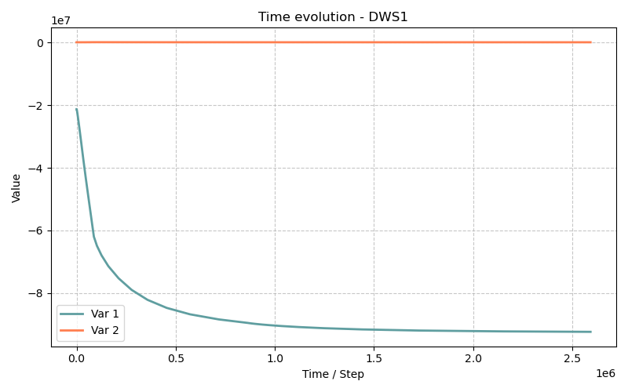

# DWS1 Model — Drying and Wetting with Salt (1D isothermal)

> **Bil fimodelles:** `src/Models/ModelFiles/DWS1.c`

> **Input file:** `doc/mkdocs/CoupledTransfers/DWS1/DWS1`
>
> **Model author:** P. Dangla

---

## Table of contents

1. [Context and objective](#1-context-and-objective)
2. [Assumptions](#2-assumptions)
3. [Variables and notation](#3-variables-and-notation)
4. [Mathematical model](#4-mathematical-model)
   - 4.1 [Conservation equations](#41-conservation-equations)
   - 4.2 [Flux laws](#42-flux-laws)
   - 4.3 [Constitutive and thermodynamic relations](#43-constitutive-and-thermodynamic-relations)
5. [Input file description](#5-input-file-description)
6. [Simulation results](#6-simulation-results)
7. [Bibliographic references](#7-bibliographic-references)

---

## 1. Context and objective

The **DWS1** (Drying-Wetting with Salt) model studies coupled **water-air-salt** transfers in porous media under isothermal conditions. It models the transport of water (in liquid and vapor form), dry air, and a dissolved salt (by default aqueous sodium sulfate, $\text{Na}_2\text{SO}_4$, or $\text{NaCl}$).

The application case `test_examples/DWS1/DWS1` corresponds to an **isothermal drying test of a very low-permeability concrete specimen**. This type of test reproduces the hygrothermal evolution and salt concentration at the surface and interior of concrete exposed to a drying environment. When free water evaporates, the salt concentration increases, which modifies the chemical activity of water and therefore the overall thermodynamic equilibrium, affecting moisture profiles.

The modeled specimen has a length of 1 cm ($L = 0.01$ m), initially very moist, and undergoes significant drying through one of its boundaries.

---

## 2. Assumptions

1. **Isothermal conditions**: temperature is assumed constant at $T = 293$ K.
2. **Three phases, four constituents**: the model covers the solid phase (rigid cementitious matrix, $\phi = 0.3$), the liquid phase (water + dissolved ions forming the salt), and the gas phase (dry air + water vapor).
3. **Dissolved salt only**: the concentration concerns aqueous ions. Precipitation/crystallization that could lead to clogged pores is not treated in this simple variant.
4. **Osmotic effect**: the chemical activity of water ($a_w$) depends directly on the salt concentration. Kelvin's law is therefore modified according to electrolyte solution thermodynamics.
5. **Darcy and Fick laws**: phase advection is driven by relative permeability (Darcy), and constituent diffusion (vapor and ions) by Fick's laws.
6. The gas component is an **ideal gas**.

---

## 3. Variables and notation

### Primary unknowns (Solution variables)

| Symbol | Meaning |
|---------|---------|
| $h_r$   | Relative humidity (dimensionless) |
| $p_g$   | Gas phase pressure (Pa) |
| $c_s$   | Molar concentration of dissolved salt (mol/m³) |

### Secondary variables

| Symbol | Meaning |
|---------|---------|
| $p_l$   | Liquid pressure (Pa) |
| $p_c$   | Capillary pressure $p_g - p_l$ (Pa) |
| $\rho_l, \rho_g$ | Liquid and gas mass densities (kg/m³) |
| $s_l, s_g$ | Liquid and gas saturations |
| $a_w$ | Water activity |

---

## 4. Mathematical model

### 4.1 Conservation equations

The code solves three balance equations on the representative elementary volume:

**1. Water mass balance (liquid + vapor):**

$$\frac{\partial m_T}{\partial t} + \nabla \cdot \mathbf{W}_T = 0$$

with $m_T = \rho_l\,\phi\,s_l + \rho_g\,\phi\,s_g$ (total fluid mass grouped here).

**2. Air mass balance:**

$$\frac{\partial m_A}{\partial t} + \nabla \cdot \mathbf{W}_A = 0$$

with $m_A = \rho_a\,\phi\,s_g$.

**3. Salt molar balance:**

$$\frac{\partial n_S}{\partial t} + \nabla \cdot \mathbf{W}_S = 0$$

with $n_S = c_s\,\phi\,s_l$.

### 4.2 Flux laws

**1. Advective flows (Darcy):**

$$\mathbf{W}_l = - \frac{\rho_l\,k_\text{int}\,k_{rl}(p_c)}{\mu_l} \nabla p_l \qquad \text{and} \qquad \mathbf{W}_g = - \frac{\rho_g\,k_\text{int}\,k_{rg}(p_c)}{\mu_g} \nabla p_g$$

**2. Vapor diffusion and advection (Fick + Darcy):**

$$\mathbf{W}_v = c_v\,\mathbf{W}_g - \phi\,s_g\,\tau_g\,D_{av} \nabla \rho_v$$

where $c_v = \rho_v/\rho_g$ is the fraction and $D_{av}$ the vapor diffusivity in air.

Total flux: $\mathbf{W}_T = \mathbf{W}_l + \mathbf{W}_g$.
Air flux: $\mathbf{W}_A = \mathbf{W}_g - \mathbf{W}_v$.

**3. Salt transport:**

$$\mathbf{W}_S = \frac{c_s}{\rho_l} \mathbf{W}_l - \phi\,s_l\,\tau_l\,D_S \nabla c_s$$

Salt is advected by liquid water (the term $c_s / \rho_l$ converts kg/m²·s to molar flux) and diffuses along the concentration gradient.

### 4.3 Constitutive and thermodynamic relations

**Liquid-gas thermodynamic equilibrium**
The influence of salt justifies a generalized Kelvin's law accounting for water activity $a_w$ (via the osmotic factor):

$$p_l = p_{l0} + \frac{R T}{V_w} (\ln h_r - \ln a_w(c_s))$$

where $V_w$ is the molar volume of water. In a pure solution, $a_w=1$, which gives back the usual law $p_l = p_{l0} + \frac{R T}{V_w} \ln h_r$. Here, the presence of salt decreases $\ln a_w$, which increases capillary effects and retains water.

The logarithm of salt activity $\ln a_w(c_s)$ and ion activity are modeled using advanced approaches of the Pitzer type (Lin and Lee).

---

## 5. Input file description

The model behavior for the example is managed by files in `DWS1/`: `DWS1` (the main simulation script) and `beton` (the material data file).

### `DWS1` file step by step

1. **Geometry and Mesh**
   ```text
   Geometry
   1 plan
   Mesh
   4 0. 0. 1.e-2 1.e-2
   1.e-5
   1 100 1
   1 1 1
   ```
   The system defines a 1D space (plane). The mesh has 100 elements over a length of 1 cm ($L = 0.01$ m).

2. **Material**
   ```text
   Material
   Model = DWS1
   porosite = 0.3
   kl_int = 1.e-20
   kg_int = 1.e-18
   p_c3 = 1.e6
   Curves = beton   p_c = Range{x1 = 0,x2 = 1.e9,n = 401} s_l = Van-Genuchten(...)
   ```
   The `DWS1` model is defined. The simulated concrete has an intrinsic permeability to water $K_{int,l} = 10^{-20}$ m² and to gas $K_{int,g} = 10^{-18}$ m², and a porosity of $0.3$. The retention laws $s_l(p_c)$ and relative permeability are called from the `beton` file (numerically generated table), adjusted on Van-Genuchten relations.

3. **Initial conditions**
   ```text
   Initialization
   3
   Region = 2 Unknown = h_r Field = 1
   Region = 2 Unknown = p_g Field = 2
   Region = 2 Unknown = c_s Field = 4
   ```
   The domain is initialized with the values of the called `Fields`:
   - Initial `h_r` = `8.49e-01` (~85% relative humidity).
   - Initial `p_g` = `100 000` Pa (atmospheric pressure).
   - Initial `c_s` = `100` mol/m³ of dissolved salts.

4. **Boundary conditions (Drying)**
   ```text
   Functions
   1
   N = 2 F(0) = 1 F(86400) = 5.87428931e-1
   
   Boundary Conditions
   2
   Region = 1 Unknown = h_r Field = 1 Function = 1
   Region = 1 Unknown = p_g Field = 2 Function = 0
   ```
   This is the driving force. At the left boundary (`Region = 1`), the imposed function modulates `h_r`. Over 1 day (86,400 s), the boundary humidity drops from $85\%$ to $85\% \times 0.587 \approx 49.9\%$. A strong moisture gradient drives drying of the specimen.

5. **Time solver**
   ```text
   Dates
   3
   0 864000 2592000
   ```
   The computation outputs results at the initial instant, at 10 days ($8.64 \cdot 10^5$ s) and at the end of drying at 30 days ($2.592 \cdot 10^6$ s).

### `beton` file (tabulated curves)
This file groups the curve parameters as a list, enabling fast interpolations that avoid the heavy computation of fractional powers in Newton's algorithm. The columns define `$p_c$, $s_l$, $k_{rl}$ and $k_{rg}$`.

---

## 6. Simulation results

The computation (duration $\sim$ one second on a modern workstation, over about a hundred Newton time steps) generates result files from which the following observations are drawn:

**At the start of drying ($t = 0$)**
- Humidity is uniformly distributed at 84.9% in the concrete, and the homogeneous salt concentration is $100$ mol/m³.
- The liquid water pressure experiences suction, estimated at $P_l \approx -21.2$ MPa.

**At the end of drying (30 days, file `.t2`)**
- **Humidity**: The moisture shock (drop to 49.9% at the wall) will dry the sample. At the end, the outer face is at $h_r=49.89\%$ and the deepest water ($x=0.01$ m) has equilibrated to 50.21%. The material has dried almost completely thanks to the porosity and the tiny scale of the specimen.
- **Salt concentration**: Starting from $c_s = 100$ mol/m³, evaporation of the liquid solvent phase forces ions to concentrate. At the end of the test, it jumps to approximately $203$ mol/m³, homogeneously distributed.
- **Pressures**: Due to the decrease in saturation ($S_l \sim 42.9\%$), the capillary tension effect intensifies. Liquid pressure drops drastically to $P_l \approx -92.5$ MPa. Water activity responds to the more concentrated ions, showing that osmotic forces reinforce the water retention potential in concrete.



---

## 7. Bibliographic references

- **Dangla, P.** — *Bil: a FEM/FVM platform for multiphysics simulations*.
- **Millington, R. J. & Quirk, J. P.** (1961) Gas tortuosity models.
- **Nguyen, T.Q.** & **Lin & Lee** relations — Pitzer-based models for computing the activity logarithm for saline and ideal solutions (`lng_TQN`, `lna_i` implemented in M5/DWS1).
- **Van Genuchten** (1980) & **Mualem** (1976) for relative permeability and suction relations.
*(Automatically generated graphs for the DWS1 example)*
