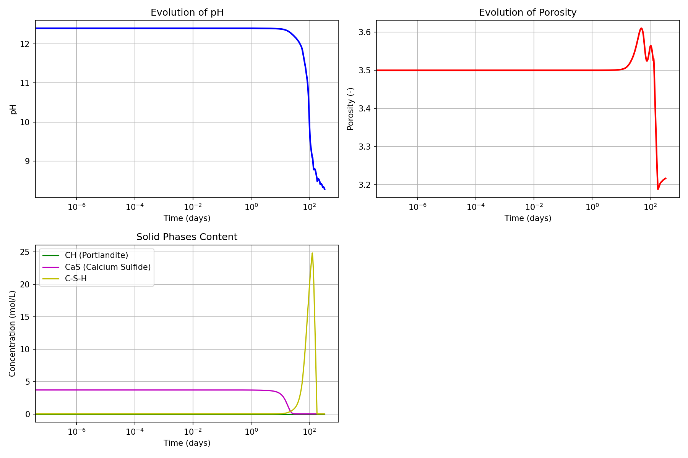

# Yuan1 Model — Hydrogen Sulfide (H₂S) Attack on Concrete

> **Bil model:** `src/Models/ModelFiles/Yuan1.c`

> **Input file:** `test_examples/Yuan1/Yuan1`
>
> **Model authors:** B. Yuan, P. Dangla (January 2015)

---

## Table of contents

1. [Context and objective](#1-context-and-objective)
2. [Assumptions](#2-assumptions)
3. [Variables and notation](#3-variables-and-notation)
4. [Mathematical model](#4-mathematical-model)
   - 4.1 [Conservation and transport equations](#41-conservation-and-transport-equations)
   - 4.2 [Chemistry and acid-base equilibria](#42-chemistry-and-acid-base-equilibria)
5. [Boundary and initial conditions](#5-boundary-and-initial-conditions)
6. [Test case: 1D gaseous corrosion (`test_examples/Yuan1`)](#6-test-case-1d-gaseous-corrosion)
7. [Modelling results](#7-modelling-results)
8. [Step-by-step input file description](#8-step-by-step-input-file-description)
9. [Bibliographic references](#9-bibliographic-references)

---

## 1. Context and objective

The **Yuan1** model mechanistically models the chemical interaction of cementitious materials with **hydrogen sulfide gas ($H_2$S)**. This is one of the major phenomena initiating biogenic corrosion in sewage networks (even before the bacterial appearance of strong sulfuric acid).

The objective is to evaluate the kinetics of dissolution of the main cement hydrates (Portlandite CH, C-S-H) when the pore pH drops under the effect of dissolved $H_2S$ (weak acid gas), leading to massive precipitation of macro-salts such as Calcium Sulfide ($CaS$).

---

## 2. Assumptions

1. **Multi-species diffusion and electroneutrality**: All ionic contributions modify the crossed electrokinetic potential of the fluids (Poisson/Electroneutrality equation via potential $\psi$).
2. **Implicit gas phase**: $H_2S$ gas dissolves at the domain boundary according to Henry's law.
3. **Dynamic C-S-H reactivity**: The model integrates a continuous desegregation of calcium silicates modeled using an external curve (files `csh3p` or `csh4p` introducing a C/S coefficient adjustable to local pH conditions).

---

## 3. Variables and notation

The model relies on a large coupled system of **6 nodal degrees of freedom**.

### Primary unknowns

| Symbol | BIL label | Meaning |
|---------|-----------|---------|
| $c_{\text{H}_2\text{S}}$ | `logc_h2s` / `c_h2s` | Hydrogen sulfide concentration (usually computed in logs) |
| $\psi$ | `psi` | Local electric potential (Nernst-Planck ionic diffusion) |
| $Z_{\text{Ca}}$ | `z_ca` | Conservative inter-phase unknown for Calcium ion (dissolved + solid) |
| $Z_{\text{Si}}$ | `z_si` | Conservative inter-phase unknown for Silica |
| $c_{\text{K}}$ | `c_k` | Alkali Potassium ion concentration |
| $c_{\text{Cl}}$ | `c_cl` | Environmental Chloride ion concentration |

### Explicit or intermediate variables

- **Solids**: `N_CH` (Portlandite molarity), `N_CaS` (Calcium sulfide molarity), `N_CSH`.
- **pH / $c_{\text{OH}}$**: Derived implicitly from thermodynamic computation with the internal charge neutrality equation.
- Free porosity of the capillary network, evolving as a function of the molar volume of the phases.

---

## 4. Mathematical model

### 4.1 Conservation and transport equations

Six conservation balances govern the accumulation and stoichiometric flux:
1. Sulfur (`E_S`): Balance of total surrounding S (including HS⁻, S²⁻ ions, dissolved gas, and solid CaS).
2. Electroneutrality (`E_q`): Accumulation of charge densities `N_q`.
3. Calcium (`E_Ca`), Silicon (`E_Si`), Chlorine (`E_Cl`), Potassium (`E_K`).

Migration of the various liquid species into the concrete is given by the **Nernst-Planck** flux law $\mathbf{W}_i = - D_{eff} \left( \nabla c_i + z_i c_i \frac{F}{RT} \nabla \psi \right)$.

### 4.2 Chemistry and acid-base equilibria

The code statically computes concentrations using global constants (mass action law):
- H₂S acidity: $H_2S \rightleftharpoons HS^- + H^+$; $HS^- \rightleftharpoons S^{2-} + H^+$
- Dissolution: CH $\rightleftharpoons$ Ca²⁺ + 2OH⁻ (constant $K_{CH}$) and $CaS \rightleftharpoons Ca^{2+} + S^{2-}$ ($K_{CaS}$).

As soon as $C_{H2S}$ at the surface or at depth exceeds $C_{eq_{H2S}}$, the thermodynamic threshold indicates irreversible dissolution of `N_CH` to switch to `N_CaS`.

---

## 5. Boundary and initial conditions

Unlike other intrusion mechanisms that constrain $p_c$ or a local state variable via Dirichlet, the sulfur input occurs at the outer boundary according to a reactive flux:
* The incoming flux depends on the Henry constant coupled to a kinetic potential (cf. macro variable `KF_A_H2S`).

---

## 6. Test case: 1D gaseous corrosion (`test_examples/Yuan1`)

The file simulates the exposure of a one-dimensional pillar (volumetric strip `1 plan` discretized into 100 cells). The right boundary (Region 3) undergoes a cumulative sulfur flux calculated by a special macro integrated into the model.

---

## 7. Modelling results

1. **Rapid pH drop (sulfur carbonation)**:
   Accumulation of weak acid $H_2S$ dissociates the electrolyte and forces the pH to decrease from 13/14 to 8.
2. **CaS / CH antagonism**:
   The graph illustrates the thermodynamic incompatibility beneath the attack zone. The native molar content of Portlandite (CH) drops drastically, while the amount of precipitated Calcium Sulfide salt gains volume, filling the chemical deficit as its stoichiometric availability grows.
3. **Porous consequence**:
   The porosity undergoes a dual state: an increase at the degradation front (release of the CSH matrix) or sometimes clogging at the reaction front of secondary salt deposits.

---

## 8. Step-by-step input file description

### File `Yuan1`

1. **Geometry & Mesh**: 1D strip of `0.15 m` depth via the built-in operator `4` describing a brick `1 100 1` (i.e., 100 elements along the long axis).
2. **Material (`Material`)**:
   - `Model = Yuan1`
   - `N_CH = 3.7`: Initial amount of portlandite.
   - `Curves_log = csh3p ...`: Attaches a silicate heterogeneity model to dynamically define the Ca/Si ratio via the local interpolated curve from file `csh3p`.
3. **Fields and `Initialization`**:
   Define ultra-reduced logarithms of species undetected at time zero (e.g., `Unknown logc_h2s Field 1: Val = 1.` which actually initializes the constant). The internal equilibrium places pH very alkaline.
4. **Loads and Boundaries**:
   - `Boundary Conditions: Region 3 Unknown = psi` fixes the terminal electric potential at 0 to bound Nernst-Planck electrolytic migration.
   - `Loads: Region 3 Equation = sulfur Type = cumulflux Field = 8 Function = 3`. An important hybrid command literally injecting the local kinetic coefficient ($a_{H_2S}$ evaluated via `Field 8`, i.e., value `Val=-7.1e-9` moles per cross-section per time) as a material supply source term to the `sulfur` balance.
5. **Criteria and Time**:
   A computation period `Dtini=1.e-2` extendable over `2.89e7` seconds (335 days) stabilizes the strong native acid-base imbalances.

---

## 9. Bibliographic references

- **Yuan, B., & Dangla, P.** (2015). *Numerical modeling of biogenic corrosion of concrete: application to the attack of H2S gas*.
- **Lothenbach, B. / Matschei, T.** — *Thermodynamic modeling of the effect of temperature on the hydration and porosity of Portland cement*.
