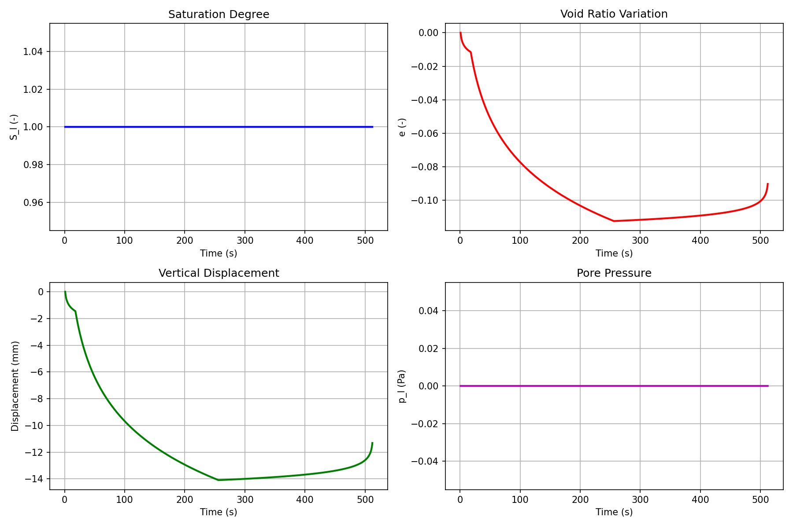

# usoil Model — Unsaturated Soil Mechanics (2019)

> **Bil model:** `src/Models/ModelFiles/usoil.c`

> **Input file:** `doc/mkdocs/CoupledTransfers/usoil/usoil`
>
> **Model author:** P. Dangla

---

## Table of contents

1. [Context and objective](#1-context-and-objective)
2. [Assumptions](#2-assumptions)
3. [Variables and notation](#3-variables-and-notation)
4. [Mathematical model](#4-mathematical-model)
   - 4.1 [Equilibrium and conservation equations](#41-equilibrium-and-conservation-equations)
   - 4.2 [Multi-coupled constitutive model (Cam-Clay)](#42-multi-coupled-constitutive-model-cam-clay)
5. [Boundary and initial conditions](#5-boundary-and-initial-conditions)
6. [Test case: 2D Cyclic Compression (`test_examples/usoil`)](#6-test-case-2d-cyclic-compression)
7. [Modelling results](#7-modelling-results)
8. [Step-by-step input file description](#8-step-by-step-input-file-description)
9. [Bibliographic references](#9-bibliographic-references)

---

## 1. Context and objective

The **usoil** model solves the coupled hydro-mechanical problem for **unsaturated soils**. Unlike the `M7` model, which uses classical linear Biot solid poroelasticity, this model integrates strict **elasto-plastic effects** managed with advanced rheological laws for fine-grained soils, such as the visco-plastic hardening behavior of **Modified Cam-Clay** type.

The objective of this solver is to predict critical phenomena such as collapse due to re-wetting under load, soil compressibility under heavy loading, and the complex progression of water fluxes related to nonlinear capillary retention.

---

## 2. Assumptions

1. **Hydro-Mechanical Poro-Plastic Generalization**: Fully integrates the `Plasticity.h` module (including the "Return Mapping" algorithm to compute the effective plastic stress).
2. **Passive Gas Phase**: Gas pressure $p_g$ is assumed constant, purely atmospheric ($p_g = 0$) everywhere. Air flow therefore only affects the model as a hydraulic constraint relative to saturation (capillary pressure $p_c = -p_l$).
3. **Equivalent Pressure**: Total stresses and plastic gradients rely on the phenomenological concept of an Equivalent Pore Pressure that weights the capillary contribution to the effort on solid grains.

---

## 3. Variables and notation

The model is defined by the resolution of $1 + \dim$ equations.

### Primary unknowns

| Symbol | BIL label | Meaning |
|---------|-----------|---------|
| $p_l$ | `p_l` | Pore fluid (pore water) pressure |
| $\mathbf{u}$ | `u_1, u_2, u_3` | Material displacements of the solid skeleton (2 directions depending on plane/axis) |

### Explicit variables (computed secondarily)

- $e$: Void ratio.
- $S_l$: Degree of liquid saturation.
- Cam-Clay parameters: $\kappa$ (*slope of swelling line*), $\lambda$ (*consolidation line*), $M$ (*critical state line*).

---

## 4. Mathematical model

### 4.1 Equilibrium and conservation equations

1. **Water diffusion and accumulation (Hydraulics)**:

   $$\frac{\partial}{\partial t}\left(m_l\right) + \text{div}\left( \mathbf{W}_l \right) = 0$$

   With $m_l = \rho_l \, \phi \, S_l(p_c)$. The **Van Genuchten** law or an exponential formula is used to define $S_l$ and the unsaturated permeability $k_{rl}$.

2. **Macroscopic mechanical equilibrium**:

   $$\text{div}(\boldsymbol{\sigma}) + (\rho_s + m_l)\mathbf{g} = \mathbf{0}$$

   To form the matrix, the hydraulic contribution to the assembly Jacobian transmits loads to the block `K(E_mec, U_p_l)`.

### 4.2 Multi-coupled constitutive model (Cam-Clay)

The stress-strain relationship goes beyond Hooke's framework:

$$ \boldsymbol{\sigma} = \boldsymbol{\sigma}' - p_{\text{equivalent}} \cdot \mathbf{I} $$

The effective stress $\boldsymbol{\sigma}'$ advances through the internal elasto-plastic solver of the finite element, using the ellipsoidal **Cam-Clay** yield surfaces in the invariant space $(p', q)$.

---

## 5. Boundary and initial conditions

The parameters integrate loads from macroscopic pressures as well as locally imposed capillary potentials. Common conditions include removal of lateral or vertical displacements according to the water table constraint (`Boundary Conditions Region X Unknown = u_X`).

---

## 6. Test case: 2D Cyclic Compression (`usoil`)

The test case loads an axisymmetric mesh (`carre.msh`) through its boundaries (Region 2 and 3) with a **cyclic radial and vertical pressure** peak.

The driving load function (`N = 3 F(1) = 1 F(256) = 256 F(512) = 1`) compresses the specimen intensely from second 1 to 256, then progressively unloads it from 256 to 512. The drainage illustrates the difference between absolute inelastic behavior (plastic strains that do not recover) and the reversible hydraulic response.

---

## 7. Modelling results

1. **Volumetric changes and voids (e)**:
   The void ratio drops sharply during the compression phase (time < 256 s), as mineral grains plastically interlock ("Virgin Consolidation").
2. **Recovery vs. Permanence**:
   Upon complete mechanical unloading (t=256s to 512s), recovery of the void ratio is only minimal, driven solely by the recompression/elastic line $\kappa$. The overall crushing is irreversible, which the *Cam-Clay* model demonstrates.
3. **Hydraulic behavior**:
   The capillary pressure generated during compaction instantly expels water, ultimately limiting pure passive re-saturation.

---

## 8. Step-by-step input file description

### File `usoil`

1. **Geometry & Mesh**: `2 axis` (2D axisymmetric revolution via `carre.msh`).
2. **Multi-state physical properties `Material`**:
   - `slope_of_swelling_line = 0.004` (kappa of visco-elastic rebound).
   - `slope_of_virgin_consolidation_line = 0.037` (lambda, plastic path in $V-\ln p'$).
   - `slope_of_critical_state_line = 1.2` (slope coefficient of the critical shear state criterion $M$).
   - `initial_pre-consolidation_pressure = 18000` ($p_{c0}$ marking the memory of ancient geological loads).
   - `Curves = sterrebeek0 ...`: Here, rather than providing a simple table, the text uses the BIL interpreter `Expressions(1)` directly involving nested arithmetic functions (e.g., cascading conditional operators `? :`) for computing $S_l$, $k_l$, $l_c$ (cross-capillary hardening) functions.
3. **Load generation**: `Loads` applies a `pressure` driven by Field 2 (`Val = 1.e3`) modulated by a triangular function F: $[0 \rightarrow 1 \rightarrow 256 \rightarrow 1]$.
4. **Strict tolerances**: `Tol = 1e-06`: Rigorously required because the plastic return-point solver ("Return Mapping") requires fine increments to converge the tangential stress drift.

---

## 9. Bibliographic references

- **Coussy, O.** (2004). *Poromechanics*. John Wiley & Sons.
- **Roscoe, K.H., Burland, J.B.** (1968). *On the generalized stress-strain behavior of "wet" clay*. In Engineering plasticity (pp. 535-609).
- **Dangla, P.** — *Bil: a FEM/FVM platform for multiphysics simulations*. Université Gustave Eiffel.
