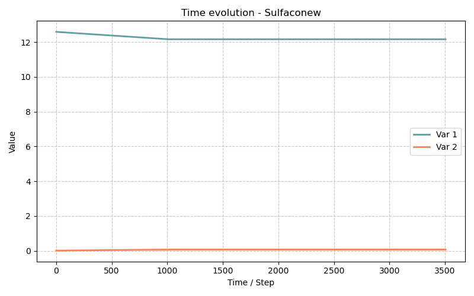

# Sulfaconew Model — C++ Refactoring of the Sulfaco Model with the MaterialPointMethod Interface

> **Bil model:** `src/Models/ModelFiles/Sulfaconew.cpp`

> **Input file:** `doc/mkdocs/Durability/Sulfaconew/Sulfaconew`
>
> **Model authors:** Gu, Dangla (Université Gustave Eiffel)

> **Internal title:** *"Internal/External sulfate attack of concrete (2017)"* (similar to Sulfaco)

---

## Table of contents

1. [Context and objective](#1-contexte-et-objectif)
2. [What Sulfaconew is NOT](#2-ce-que-sulfaconew-nest-pas)
3. [C++ architecture: new features](#3-architecture-c--les-nouveautés)
   - 3.1 [The `MaterialPointMethod` interface](#31-linterface-materialpointmethod)
   - 3.2 [Typed value structures](#32-les-structures-de-valeurs-typées)
   - 3.3 [The `BaseName()` namespace](#33-le-namespace-basename)
   - 3.4 [Named parameters](#34-les-paramètres-nommés)
4. [Model physics (identical to Sulfaco)](#4-physique-du-modèle-identique-à-sulfaco)
5. [Test de régression : comparaison Sulfaco vs Sulfaconew](#5-test-de-régression--comparaison-sulfaco-vs-sulfaconew)
6. [Step-by-step input file description](#6-description-pas-à-pas-des-fichiers-dentrée)
   - 6.1 [Fichier `Sulfaconew` — simulation avec le nouveau modèle](#61-fichier-sulfaconew--simulation-avec-le-nouveau-modèle)
   - 6.2 [Fichier `Sulfaco` — simulation de référence avec l'ancien modèle](#62-fichier-sulfaco--simulation-de-référence-avec-lancien-modèle)
7. [Tableau de correspondance des paramètres](#7-tableau-de-correspondance-des-paramètres)
8. [Conseils pour étendre le modèle](#8-conseils-pour-étendre-le-modèle)
9. [Bibliographic references](#9-références-bibliographiques)

---

## 1. Context and objective

The **Sulfaconew** model simulates **exactly the same physics** as [Sulfaco](Sulfaco_model.md) — internal/external sulfate attack of concrete, with multi-species chemistry, precipitation kinetics, and ettringite crystallization pressure. Its purpose is not to introduce a new behavioral law, but rather a complete software reengineering of the source code:

> **Sulfaconew = Sulfaco (physics) + `MaterialPointMethod` (modern C++ architecture)**

The goal is to gradually migrate BIL models from a procedural C style (raw arrays, `#define` macros, integer indices) to an object-oriented, generic, and self-differentiable C++ architecture. Sulfaconew serves as the reference model for this migration.

```
Sulfaco.c (C, 2017)                    Sulfaconew.cpp (C++, 2024)
─────────────────────────────────────────────────────────────────
static double* f = ...                 struct ImplicitValues_t<T> {
#define N_CH(i)   (f+7*NN*NN)[i]        T Mole_solidportlandite;
#define N_AFt(i)  (f+7*NN*NN+4*NN)[i]  T Mole_solidAFt;
                                         ...
#define R_AFm  12                      };
pm("R_AFm") → 12
                                       struct Parameters_t {
GetProperty("R_AFm")                     double r_afm;
                                          ...
                                       };
```

---

## 2. What Sulfaconew is NOT

- **Not a new physical model**: the conservation equations, kinetic laws, crystallization pressure, and Nernst-Planck transport are identical to those in Sulfaco.
- **Not an extension**: same 6 unknowns, same solid phases, same 1D domain.
- **Not a bug fix**: the physics remains exactly the same, as demonstrated by the regression simulations in Sulfaconew/.

---

## 3. C++ architecture: new features

### 3.1 The `MaterialPointMethod` interface

Le cœur de la refactorisation est l'adoption de l'interface `MaterialPointMethod_t<Values_t>` de BIL. Là où `Sulfaco.c` implémentait directement les fonctions BIL globales (`ComputeInitialState`, `ComputeImplicitTerms`, etc.), `Sulfaconew.cpp` délègue ces responsabilités à une structure `MPM_t` :
The core of the refactoring is the adoption of BIL's `MaterialPointMethod_t<Values_t>` interface. Whereas `Sulfaco.c` directly implemented the global BIL functions (`ComputeInitialState`, `ComputeImplicitTerms`, etc.), `Sulfaconew.cpp` delegates these responsibilities to an `MPM_t` structure:

```cpp
struct MPM_t : public MaterialPointMethod_t<Values_t> {
  MaterialPointMethod_SetInputs_t<Values_t>              SetInputs;
  MaterialPointMethod_Integrate_t<Values_t>              Integrate;
  MaterialPointMethod_Initialize_t<Values_t>             Initialize;
  MaterialPointMethod_SetTangentMatrix_t<Values_t>       SetTangentMatrix;
  MaterialPointMethod_SetFluxes_t<Values_t>              SetFluxes;
  MaterialPointMethod_SetIndexOfPrimaryVariables_t       SetIndexOfPrimaryVariables;
  MaterialPointMethod_SetIncrementOfPrimaryVariables_t   SetIncrementOfPrimaryVariables;
};
```

Each member is a material point method with a **single, clear responsibility**:

| Method | Role | Equivalence in Sulfaco.c |
|---------|------|--------------------------|
| `SetInputs` | Reads the nodal unknowns → fills `Values_t` | Start of `ComputeImplicitTerms` |
| `Initialize` | Calculates the initial state (t=0) | `ComputeInitialState` |
| `Integrate` | Integrates the governing equations over `[t, t+dt]` | Corps de `ComputeImplicitTerms` |
| `SetTangentMatrix` | Compute the tangent stiffness
matrix | `ComputeMatrix` |
| `SetFluxes` | Calculates the fluxes between elements | `ComputeResidu` (flux part) |
| `SetIndexOfPrimaryVariables` | Maps unknowns ↔ indices | `pm()` + `E_Sulfur` macros... |
| `SetIncrementOfPrimaryVariables` | Updates Newton increments | Implicit in the solveur |

### 3.2 Typed value structures

Instead of `double* f` arrays with `#define N_CH(i) (f+offset)[i]` macros, Sulfaconew uses **templated C++ structs** that name each field:

```cpp
template<typename T = double>
struct ImplicitValues_t {
  T U_sulfur;
  T U_charge;
  T U_calcium;
  T U_potassium;
  T U_aluminium;
  T U_eneutral;           // (si E_ENEUTRAL is defined)
  T Mole_sulfur;
  T MolarFlow_sulfur[Element_MaxNbOfNodes];
  T Mole_calcium;
  T MolarFlow_calcium[Element_MaxNbOfNodes];
  // ... (all mass balances and fluxes)
  T Mole_solidportlandite;
  T Mole_solidgypsum;     // CSH2
  T Mole_solidAH3;
  T Mole_solidAFm;
  T Mole_solidAFt;
  T Mole_solidC3AH6;
  T Mole_solidCSH;
  T Porosity;
  T Strain;
  T CrystalPressure;
  T DamageStrain;
  T PoreRadius;
  T SaturationDegree_crystal;
  // ...
};
```

Le paramètre template `T` est la clé de l'architecture : en substituant `T = double` pour les calculs normaux, ou `T = autodiff::dual` (différentiation automatique), **la même fonction `Integrate` calcule à la fois les valeurs et les dérivées exactes** pour la matrice tangente, sans écrire de code de dérivation à la main.
The template parameter `T` is the key to the architecture: by setting `T = double` for standard calculations, or `T = autodiff::dual` (automatic differentiation), **the same `Integrate` function computes both the exact values and derivatives** for the tangent matrix, without having to write differentiation code by hand.

Similarly:

```cpp
template<typename T = double>
struct ExplicitValues_t {
  T Tortuosity_liquid;
  T AqueousConcentration[CementSolutionDiffusion_NbOfConcentrations];
};

template<typename T = double>
struct ConstantValues_t {
  T InitialVolume_solidtotal;
};
```

These three structures replace the memory areas `f` (implicit), `va` (explicit), and `v0` (constant) in `Sulfaco.c` with human-readable names instead of integer offsets.

### 3.3 The `BaseName()` namespace

```cpp
namespace BaseName() {
  template<typename T> struct ImplicitValues_t;
  template<typename T> struct ExplicitValues_t;
  // ...
  struct Parameters_t { ... };
}
using namespace BaseName();
```

The `BaseName()` macro generates a unique namespace name derived from the source file name (`Sulfaconew`). This technique isolates the model's types into their own namespace, preventing name conflicts when multiple BIL models are compiled together (for example, if two models both define a `struct Parameters_t`).

### 3.4 Named parameters

Sulfaco’s `pm()` function returned an integer index into a `double[]` array:

```c
// Sulfaco.c : opaque, error-prone
if(strcmp(s,"R_AFm") == 0) return (12) ;
```

In Sulfaconew, `pm()` uses the `Parameters_Index(field)` macro, which automatically calculates the offset of each field in the `struct Parameters_t`:

```cpp
// Sulfaconew.cpp : auto-calculé, résistant aux refactorisations
if(!strcmp(s,"PrecipitationRate_AFm")) {
  return (Parameters_Index(r_afm)) ;
}
```

Les noms de paramètres dans le fichier d'entrée sont également **renommés pour être auto-documentés** (voir [§7](#7-tableau-de-correspondance-des-paramètres)). Parameter names in the input file are also **renamed to be self-documenting** (see [§7](#7-tableau-de-correspondance-des-paramètres)). Additionally, `ReadMatProp` initializes **default values** directly in the code:

```cpp
// Default values if not specified in the input file
Material_GetProperty(mat)[pm("PrecipitationRate_AFm")]  = 4.6e-4 ; /* mol/L/s, Salgues 2013 */
Material_GetProperty(mat)[pm("PrecipitationRate_AFt")]  = 4.6e-4 ;
Material_GetProperty(mat)[pm("PrecipitationRate_C3AH6")] = 1.e-10 ;
Material_GetProperty(mat)[pm("PrecipitationRate_CSH2")]  = 1.e-10 ;
```

This prevents undefined behavior when a parameter is omitted.

---

## 4. Model physics (identical to Sulfaco)

The physics are strictly identical to the  [Sulfaco](Sulfaco_model.md) model. Refer to this document for full details. In summary:

**6 conservation equations** (Finite Volumes) :

$$\frac{\partial N_S}{\partial t} + \nabla \cdot \mathbf{w}_S = 0 \qquad \frac{\partial N_{Ca}}{\partial t} + \nabla \cdot \mathbf{w}_{Ca} = 0 \qquad \cdots$$

**Solution chemistry** solved by `HardenedCementChemistry.h` at $T = 293\,\text{K}$.

**First-order solid-state kinetics** (AFt, AFm, CSH2, C₃AH₆) in supersaturation: 
$$n_x(t+\Delta t) = \max\!\left(n_x(t) + \Delta t \cdot R_x \cdot (S_x - 1),\, 0\right)$$

**Crystallization pressure** (Kelvin-Thomson):
$$P_c = \frac{RT}{V_\text{AFt}} \ln\!\left(\beta\right) \qquad \beta_\text{eq}(r) = \exp\!\left(\frac{2\,\Gamma_\text{AFt}\,V_\text{AFt}}{RT\,r}\right)$$

**Damage** following an exponential law:
$$D(\varepsilon) = 1 - \frac{\varepsilon_0}{\varepsilon}\exp\!\left(-\frac{\varepsilon - \varepsilon_0}{\varepsilon_f}\right)$$

**Nernst-Planck transport** with Bazant-Najjar tortuosity:
$$\mathbf{w}_i = -\phi\,\tau(\phi)\left(D_i \nabla c_i + z_i \frac{F D_i}{RT} c_i \nabla\psi\right)$$

---

## 5. Regression test: Sulfaco vs. Sulfaconew comparison

The `Sulfaconew/` directory contains **two separate input files**, each running the same simulation with a different model:

| File | Modèle BIL model | Objective |
|---------|-----------|----------|
| `Sulfaconew` | `Sulfaconew` | Simulation with the new C++ codes |
| `Sulfaco` | `Sulfaco` | Reference simulation using the old C code |

The material parameters, initial conditions, time functions, and discretization are **strictly identical** between the two files (see naming differences in §7). The Gnuplot file `Sulfaconew.gp` reads the file `Sulfaco.p1` (derived from the `Sulfaco` input file) and plots the same 9 figures as `Sulfaco.gp`. This allows one to visually verify that the two implementations produce exactly the same results.

**Expected identical results** (to within numerical precision):

| Figure | Sortie |
|--------|--------|
| 1 | Bulk strain $\varepsilon(t)$ |
| 2 | AFt saturation index |
| 3 | Ettringite content $n_\text{AFt}(t)$ |
| 4 | Crystallization pressure $P_c(t)$ |
| 5 | pH of the pore solution |
| 6 | AFt and gypsum (CSH₂) saturation indices |
| 7 | Solid phases : CH, AFt, C₃AH₆ |
| 8 | Concentration of $\text{SO}_4^{2-}$ |
| 9 | Effective stress $S_c \cdot P_c$ vs strain |



---

## 6. Step-by-step input file description

### 6.1 `Sulfaconew` file — simulation with the new model

#### Unit system and geometry

```
Units
Length = decimeter
Time   = second
Mass   = hectogram

Geometry
Dimension = 1  plan

Mesh
2       ← 2 nœuds
0. 1    ← Nœud 1 : x=0
1.      ← Nœud 2 : x=1 dm
1       ← 1 élément
1       ← Région 1
```

Same as `Sulfaco`.

#### Material — explicit parameter names

```
Material
Model = Sulfaconew
InitialPorosity = 0.23
InitialContent_CH     = 1.53
InitialContent_CSH    = 1.393
InitialContent_AH3    = 1.e-6
InitialContent_CSH2   = 0
InitialContent_AFm    = 0
InitialContent_AFt    = 0
InitialContent_C3AH6  = 0.2
PrecipitationRate_CSH2   = 1.e-12
PrecipitationRate_AFm    = 1.e-6
PrecipitationRate_C3AH6  = 1.e-6
PrecipitationRateAtInterface_AFt = 8.4e-8
PrecipitationRateAtPoreWall_AFt = 4.4e-9
ElasticBulkModulus = 30.1e9
BiotCoef = 0.54
Strain0 = 4.e-4
Strainf = 6.4e-3
AdsorbedSulfatePerUnitMoleOfCSH_coefA = 0
AdsorbedSulfatePerUnitMoleOfCSH_coefB = 0.87
Curves_log = Sat  r = Range{r1 = 1.e-8 , r2 = 1.e-3 , n = 1000}
             S_r = Expressions(1){r0=155.82e-8; m = 0.2516 ; S_r = (1 + (r0/r)**(1/(1-m)))**(-m)}
```

**New features** compared to `Sulfaco`:

- `porosity` → **`InitialPorosity`**: specifies that this is the *initial* porosity (before reaction).
- `N_CH` → **`InitialContent_CH`**: clearly indicates the *initial* content in mol/L.
- `K_bulk` → **`ElasticBulkModulus`**: physically explicit name (isostatic bulk modulus).
- `Biot` → **`BiotCoef`**: distinguishes the Biot coefficient from other parameters named `Biot` in other models.
- `A_i` → **`PrecipitationRateAtInterface_AFt`**: distinguishes growth at the free interface (pore wall) from growth in confined pores.
- `A_p` → **`PrecipitationRateAtPoreWall_AFt`**: growth in the confined pore that generates pressure.
- `AlphaCoef`, `BetaCoef` → **`AdsorbedSulfatePerUnitMoleOfCSH_coefA/B`**: explicitly names the Langmuir adsorption law.
- `R_AFm`, `R_C3AH6`... → **`PrecipitationRate_*`**: standardizes the prefix for all kinetics.

**Default values in the code**: if `DissolutionRateAtInterface_AFt` and `DissolutionRateAtPoreWall_AFt` are not specified in the file, `ReadMatProp` automatically initializes them to the same value as the corresponding precipitation rates
(precipitation/dissolution symmetry).

#### Initialization, Functions, Boundary conditions

**Strictly identical** to `Sulfaco`: same 6 unknowns `logc_so4`, `psi`, `z_ca`, `z_al`, `logc_k`, `logc_oh`, same 5 time-step functions with 5 steps, same boundary conditions in region 1.

#### Time window and convergence

```
Dates
2
0.  3.5e6        # t=0 à t=3.5×10⁶ s ≈ 40 jours

Time Steps
Dtini = 1.e3     # Pas initial de 1000 s
Dtmax = 1.e3     # Pas fixe de 1000 s
```

Similar to at `Sulfaco`.

---

### 6.2 `Sulfaco` file — reference simulation with the old model

This file runs the **old `Sulfaco` model** with exactly the same physical parameters (translated into the old nomenclature):

```
Material
Model = Sulfaco         ← old model
porosity = 0.23         ← vs InitialPorosity
N_CH     = 1.53         ← vs InitialContent_CH
N_CSH    = 1.393
N_AH3    = 1.e-6
N_C3AH6  = 0.2
R_CSH2   = 1.e-12       ← vs PrecipitationRate_CSH2
R_AFm    = 1.e-6
R_C3AH6  = 1.e-6
A_i = 8.4e-8            ← vs PrecipitationRateAtInterface_AFt
A_p = 4.4e-9            ← vs PrecipitationRateAtPoreWall_AFt
K_bulk = 30.1e9         ← vs ElasticBulkModulus
Biot = 0.54             ← vs BiotCoef
Strain0 = 4.e-4
Strainf = 6.4e-3
AlphaCoef = 0           ← vs AdsorbedSulfatePerUnitMoleOfCSH_coefA
BetaCoef = 0.87         ← vs AdsorbedSulfatePerUnitMoleOfCSH_coefB
```

**Important note**: this file does not use a `Curves_log = Sat curve...`: the saturation curve is retrieved from the Sat file in the directory, which is automatically read by BIL.

The `.gp` file reads `Sulfaco.p1` to generate the regression plots, allowing you to graphically compare the outputs of the two models without modifying the visualization script.

---

## 7. Parameter mapping table

| Sulfaco (old name) | Sulfaconew (new name) | Value in the tests | Meaning |
|---------------------|--------------------------|--------------------------|---------------|
| `porosity` | `InitialPorosity` | 0.23 | Initial porosity du béton sain |
| `N_CH` | `InitialContent_CH` | 1.53 mol/L | Teneur initiale en portlandite |
| `N_CSH` ou `N_Si` | `InitialContent_CSH` | 1.393 mol/L | Teneur initiale en C-S-H |
| `N_AH3` | `InitialContent_AH3` | 1e-6 mol/L | Teneur initiale en gibbsite |
| `N_CSH2` | `InitialContent_CSH2` | 0 | Pas de gypse initial |
| `N_AFm` | `InitialContent_AFm` | 0 | Pas de monosulfoaluminate initial |
| `N_AFt` | `InitialContent_AFt` | 0 | Pas d'ettringite secondaire initiale |
| `N_C3AH6` | `InitialContent_C3AH6` | 0.2 mol/L | Hydrogrenat initial |
| `R_CSH2` | `PrecipitationRate_CSH2` | 1e-12 mol/L/s | Cinétique gypse (lente) |
| `R_AFm` | `PrecipitationRate_AFm` | 1e-6 mol/L/s | Cinétique AFm |
| `R_C3AH6` | `PrecipitationRate_C3AH6` | 1e-6 mol/L/s | Cinétique C₃AH₆ |
| `A_i` | `PrecipitationRateAtInterface_AFt` | 8.4e-8 | Cinétique AFt à l'interface libre |
| `A_p` | `PrecipitationRateAtPoreWall_AFt` | 4.4e-9 | Cinétique AFt en pore confiné |
| `K_bulk` | `ElasticBulkModulus` | 30.1e9 Pa | Module de compression isostatique |
| `Biot` | `BiotCoef` | 0.54 | Coefficient de Biot |
| `Strain0` | `Strain0` | 4e-4 | Déformation seuil d'endommagement |
| `Strainf` | `Strainf` | 6.4e-3 | Déformation caractéristique de rupture |
| `AlphaCoef` | `AdsorbedSulfatePerUnitMoleOfCSH_coefA` | 0 | Coefficient $\alpha$ adsorption (désactivé) |
| `BetaCoef` | `AdsorbedSulfatePerUnitMoleOfCSH_coefB` | 0.87 | Coefficient $\beta$ adsorption Langmuir |
| *(pas d'équivalent)* | `DissolutionRateAtInterface_AFt` | = `A_i` par défaut | Cinétique de dissolution à l'interface |
| *(pas d'équivalent)* | `DissolutionRateAtPoreWall_AFt` | = `A_p` par défaut | Cinétique de dissolution en pore |

---

## 8. Tips for extending the model

Sulfaconew's `MaterialPointMethod` architecture is designed to facilitate extensions. Here is how to add a new state variable:

**1. Add the field in `ImplicitValues_t`** :
```cpp
template<typename T = double>
struct ImplicitValues_t {
  // ... existing fields ...
  T MyNewVariable;   // ← add here
};
```

**2. Calculate its value in `MPM_t::Integrate`** :
```cpp
val.MyNewVariable = f(val.CrystalPressure, ...) ;
```

**3. The derivative for the tangent matrix is automatic**: if `T = autodiff::dual`, the calculation of `MyNewVariable` automatically propagates the partial derivatives.

**4. Add the material parameter to `Parameters_t`** :
```cpp
struct Parameters_t {
  // ... existing parameters ...
  double my_new_parameter;
};
```

**5. Declare the read in `pm()`** :
```cpp
if(!strcmp(s,"NameInInputFile")) {
  return (Parameters_Index(my_new_parameter)) ;
}
```
In comparison, adding the same variable in `Sulfaco.c` would require: (1) manually choosing an `NVI` offset, (2) adding a `#define`, (3) incrementing `NVI`, (4) adding the derivative manually in `ComputeMatrix`.

---

## 9. Bibliographic references

- **Dangla, P.** (2018). *BIL — A finite element code for coupled problems in mechanics, physics and chemistry*. Documentation interne, Université Gustave Eiffel. — Description de l'interface `MaterialPointMethod` et du framework `CustomValues_t` utilisé dans Sulfaconew.

- The physical models (Biot, Coussy, Flatt-Scherer, Nernst-Planck, Van Genuchten) are identical to those in [Sulfaco](Sulfaco_model.md#9-références-bibliographiques).

- **Langer, U. & Steinbach, O.** (Eds.) (2016). *Adaptive Finite Elements in Linear and Nonlinear Solid and Structural Mechanics*. CISM Courses and Lectures. — Contexte général des architectures de solveurs EF orientés objet avec templates C++.

- **Logg, A., Mardal, K.-A., & Wells, G.** (2012). *Automated Solution of Differential Equations by the Finite Element Method (FEniCS)*. Springer. — Exemple de référence d'une architecture similaire : types paramétrés par `T` pour la différentiation automatique dans un code EF générique.
