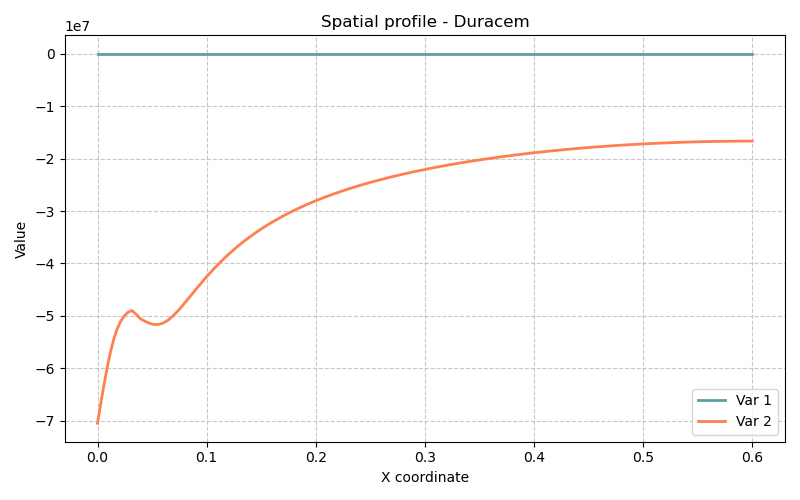

# Modèle Duracem — Durabilité des matériaux cimentaires : carbonatation et ingression de chlorures (1D)

> **Fichiers sources :**
> `src/Models/ModelFiles/Duracem.cpp` · `base/Duracem/`
>
> **Auteur du modèle Bil :** P. Dangla et al. (Université Gustave Eiffel)

---

## Table des matières

1. [Contexte et objectif](#1-contexte-et-objectif)
2. [Hypothèses](#2-hypothèses)
3. [Variables et notation](#3-variables-et-notation)
4. [Modèle mathématique](#4-modèle-mathématique)
   - 4.1 [Équations de conservation](#41-équations-de-conservation)
   - 4.2 [Lois de flux](#42-lois-de-flux)
   - 4.3 [Chimie du béton durci](#43-chimie-du-béton-durci)
   - 4.4 [Cinétiques de dissolution/précipitation](#44-cinétiques-de-dissolutionprécipitation)
   - 4.5 [Évolution de la porosité et de la perméabilité](#45-évolution-de-la-porosité-et-de-la-perméabilité)
   - 4.6 [Tortuosité et diffusion ionique en solution](#46-tortuosité-et-diffusion-ionique-en-solution)
5. [Conditions aux limites et initiales](#5-conditions-aux-limites-et-initiales)
6. [Cas test : carbonatation d'une pâte de ciment (`base/Duracem`)](#6-cas-test--carbonatation-dune-pâte-de-ciment)
7. [Fichiers d'entrée : description pas à pas](#7-fichiers-dentrée--description-pas-à-pas)
8. [Discrétisation numérique](#8-discrétisation-numérique)
9. [Références bibliographiques](#9-références-bibliographiques)

---

## 1. Contexte et objectif

Duracem est le **modèle mère** de durabilité des matériaux cimentaires dans Bil (2024). Il est conçu pour simuler la dégradation à long terme d'une pâte de ciment durcie soumise à des agressions chimiques, en particulier :

- la **carbonatation** : pénétration du CO₂ atmosphérique, dissolution de la portlandite Ca(OH)₂ et des C-S-H, précipitation du calcaire CaCO₃ ;
- l'**ingression de chlorures** (optionnelle, via la macro `E_CHLORINE`) : transport de Cl⁻ et formation du sel de Friedel.

Duracem sert de base à trois modèles dérivés plus spécialisés :

| Modèle dérivé | Processus ciblé |
|---|---|
| **Carbocem** | Carbonatation seule |
| **Chloricem** | Chlorures seuls |
| **Carbochloricem** | Carbonatation + chlorures couplés |

Le cas test `base/Duracem/` représente une colonne 1D de pâte de ciment ordinaire (OPC) exposée en surface à l'air (CO₂ à 16 % vol. après transitoire) sur une durée de 2 jours.

---

## 2. Hypothèses

1. **Isotherme** : $T = 298$ K (25 °C). Toutes les constantes physico-chimiques sont calculées à cette température.
2. **Porosité déformable** : la porosité $\phi$ évolue au cours du temps en fonction des volumes molaires des phases solides (dissolution/précipitation).
3. **Squelette solide non déformable mécaniquement** : pas de couplage poromécanique.
4. **Phase liquide unique** (solution de pore aqueuse) partiellement saturante ; pas de modélisation explicite de la phase gazeuse comme constituant dynamique (option `E_AIR` désactivée dans le cas test).
5. **Équilibre local vapeur–liquide** (loi de Kelvin) pour la pression relative de vapeur d'eau.
6. **Chimie du béton durci résolue localement** à chaque point de Gauss par le module `HardenedCementChemistry`, qui calcule les concentrations à l'équilibre thermodynamique.
7. **Trois phases solides** principales : portlandite (CH), C-S-H, et calcite (CC).
8. **Transport ionique en solution** par diffusion (Nernst-Planck via `CementSolutionDiffusion`) + advection (Darcy).
9. **Transport du CO₂ gazeux** par diffusion dans les pores partiellement désaturés (loi de Fick).

---

## 3. Variables et notation

### Inconnues primaires (cas test `base/Duracem`)

| Symbole | Inconnue Bil | Signification | Unité |
|---------|-------------|---------------|-------|
| $p_l$ | `p_l` | Pression de la phase liquide | Pa |
| $\psi$ | `psi` | Potentiel électrique $\times F/RT$ (sans dimension) | — |
| $\log c_{\text{CO}_2}$ | `logc_co2` | Log₁₀ de la concentration en CO₂ gazeux | mol/dm³ |
| $\log c_{\text{Na}}$ | `logc_na` | Log₁₀ de la concentration totale en Na | mol/dm³ |
| $\log c_{\text{K}}$ | `logc_k` | Log₁₀ de la concentration totale en K | mol/dm³ |
| $z_{\text{Ca}}$ | `z_ca` | Inconnue zêta calcium (CH + CC) | — |
| $z_{\text{Si}}$ | `z_si` | Inconnue zêta silicium (C-S-H) | — |
| $\log c_{\text{OH}}$ | `logc_oh` | Log₁₀ de la concentration en OH⁻ (électroneutralité) | mol/dm³ |

Les inconnues zêta sont définies par :

$$z_{\text{Ca}} = \frac{N_{\text{CcH}}}{N_0} + \log_{10}(S_{\text{CcH}})$$

$$z_{\text{Si}} = \frac{n_{\text{CSH}}}{n_{\text{CSH},0}} + \log_{10}(S_{\text{CSH}})$$

où $N_{\text{CcH}}$ est le contenu molaire en calcium solide (CH + CC), $S_{\text{CcH}}$ l'indice de saturation du système CaO-CO₂-H₂O, et $n_{\text{CSH}}$ le contenu en silicium dans les C-S-H. Ces inconnues permettent de traiter la dissolution/précipitation des phases solides dans le même système d'équations sans changement de variable.

### Variables secondaires calculées

| Symbole | Signification |
|---------|---------------|
| $s_l$ | Degré de saturation en eau liquide |
| $\phi$ | Porosité courante |
| $n_{\text{CH}}$ | Contenu molaire en portlandite (mol/dm³) |
| $n_{\text{CSH}}$ | Contenu molaire en C-S-H (mol/dm³) |
| $n_{\text{CC}}$ | Contenu molaire en calcite (mol/dm³) |
| $x_{\text{CSH}}$ | Rapport Ca/Si des C-S-H |
| pH | $-\log_{10}(c_{\text{H}^+})$ |
| $\rho_v$ | Masse volumique de la vapeur d'eau |

### Constantes physico-chimiques principales

| Symbole | Valeur | Signification |
|---------|--------|---------------|
| $T$ | 298 K | Température |
| $R$ | 8.314 J/(mol·K) | Constante des gaz parfaits |
| $V_{\text{H}_2\text{O}}$ | 18 cm³/mol | Volume molaire de l'eau liquide |
| $\rho_l$ | 1000 kg/m³ | Masse volumique de l'eau |
| $V_{\text{CH}}$ | ≈ 33 cm³/mol | Volume molaire de la portlandite |
| $V_{\text{CC}}$ | 37 cm³/mol | Volume molaire de la calcite |
| $k_h$ | 0.9983 | Constante de Henry CO₂(g)↔CO₂(aq) à 293 K |
| $D_{\text{CO}_2}$ | calculé à $T$ | Diffusivité CO₂ dans l'air |
| $D_{\text{vap}}$ | calculé à $T$ | Diffusivité H₂O dans l'air |

> **Unités du solveur** : longueur en **dm** (décimètre), masse en **hg** (hectogramme = 0,1 kg), temps en **s**. Les concentrations sont en **mol/dm³ = mol/L**.

---

## 4. Modèle mathématique

### 4.1 Équations de conservation

Le système résout **8 équations de bilan** par nœud :

| # | Équation | Inconnue associée |
|---|----------|------------------|
| 1 | Conservation du **calcium** : $\partial_t N_{\text{Ca}} + \nabla \cdot \mathbf{W}_{\text{Ca}} = 0$ | `z_ca` |
| 2 | Conservation du **silicium** : $\partial_t N_{\text{Si}} + \nabla \cdot \mathbf{W}_{\text{Si}} = 0$ | `z_si` |
| 3 | Conservation du **sodium** : $\partial_t N_{\text{Na}} + \nabla \cdot \mathbf{W}_{\text{Na}} = 0$ | `logc_na` |
| 4 | Conservation du **potassium** : $\partial_t N_{\text{K}} + \nabla \cdot \mathbf{W}_{\text{K}} = 0$ | `logc_k` |
| 5 | Bilan de **charge** : $\nabla \cdot \mathbf{W}_q = 0$ | `psi` |
| 6 | Conservation de la **masse totale** d'eau : $\partial_t M_{\text{tot}} + \nabla \cdot \mathbf{W}_{\text{tot}} = 0$ | `p_l` |
| 7 | Conservation du **carbone** : $\partial_t N_{\text{C}} + \nabla \cdot \mathbf{W}_{\text{C}} = 0$ | `logc_co2` |
| 8 | **Électroneutralité** : $\sum z_i c_i = 0$ | `logc_oh` |

Les contenus molaires totaux intègrent contributions liquide et solide :

$$N_{\text{Ca}} = \phi s_l c_{\text{Ca},l} + n_{\text{CH}} + n_{\text{CC}} + x_{\text{CSH}}\,n_{\text{CSH}}$$

$$N_{\text{Si}} = \phi s_l c_{\text{Si},l} + n_{\text{CSH}}$$

$$N_{\text{C}} = \phi s_l c_{\text{C},l} + \phi(1-s_l)\,\rho_{\text{CO}_2} + n_{\text{CC}}$$

$$M_{\text{tot}} = \phi s_l \rho_l + \phi(1-s_l)\,\rho_v$$

### 4.2 Lois de flux

Les flux totaux de chaque élément combinent **advection** (Darcy en solution) et **diffusion** (Nernst-Planck en solution + Fick en phase gazeuse) :

$$\mathbf{W}_\alpha = \underbrace{c_{\alpha,l}\,\mathbf{w}_l}_{\text{advection}} + \underbrace{\mathbf{j}_{\alpha,\text{diff}}}_{\text{diffusion ionique}}$$

#### Flux de Darcy (liquide)

$$\mathbf{w}_l = -K_{D,l}\,\nabla p_l, \qquad K_{D,l} = \frac{\rho_l\,k_{\text{int}}\,k_{rl}(s_l)\,f(\phi)}{\mu_l}$$

où $f(\phi)$ est le coefficient de correction de perméabilité (modèle de Verma & Pruess, voir §4.5).

#### Flux diffusifs ioniques (Nernst-Planck)

$$\mathbf{j}_{\alpha,\text{diff}} = -\tau(\phi,s_l)\,c_{\alpha,l}\,\nabla \mu_\alpha$$

où $\mu_\alpha = \mu_\alpha^0 + RT\ln(c_\alpha/c_0) + z_\alpha F \psi$ est le potentiel chimique électrochimique de l'espèce $\alpha$, et $\tau$ est le facteur de tortuosité du réseau poreux (voir §4.6).

#### Flux de CO₂ en phase gazeuse (Fick)

$$\mathbf{w}_{\text{CO}_2,g} = -D_{\text{eff,CO}_2}\,\nabla c_{\text{CO}_2}$$

avec le coefficient de diffusion effectif :

$$D_{\text{eff,CO}_2} = \phi\,(1-s_l)\,\tau_g\,D_{\text{CO}_2}$$

#### Flux de vapeur d'eau (Fick)

$$\mathbf{w}_{\text{vap}} = -D_{\text{eff,vap}}\,\nabla \rho_v$$

$$\rho_v = \frac{p_{v0}\,M_{\text{H}_2\text{O}}}{RT}\,\exp\!\left(\frac{V_{\text{H}_2\text{O}}}{RT}(p_l - p_{l0})\right)$$

#### Courant ionique total

$$\mathbf{W}_q = \sum_\alpha z_\alpha \mathbf{j}_{\alpha,\text{diff}}$$

Le bilan de charge est quasi-stationnaire ($\partial_t \approx 0$), ce qui donne $\nabla \cdot \mathbf{W}_q = 0$, équation résolue pour $\psi$.

### 4.3 Chimie du béton durci

La chimie en solution est résolue localement par le module `HardenedCementChemistry` dans le système **CaO-SiO₂-Na₂O-K₂O-CO₂-H₂O**. Ce module calcule à l'équilibre thermodynamique les concentrations de toutes les espèces ioniques à partir des inconnues primaires (indices de saturation, concentrations totales, pH).

**Espèces en solution** : H⁺, OH⁻, Ca²⁺, CaOH⁺, Ca(OH)₂(aq), CaCO₃(aq), CaHCO₃⁺, H₂SiO₄²⁻, H₃SiO₄⁻, H₄SiO₄, CaH₂SiO₄, CaH₃SiO₄⁺, Na⁺, NaOH, NaHCO₃, NaCO₃⁻, K⁺, KOH, CO₂(aq), HCO₃⁻, CO₃²⁻, Cl⁻ (optionnel), etc.

**Phases solides** en présence :
- **Portlandite** Ca(OH)₂ (CH)
- **C-S-H** avec rapport Ca/Si variable ($0 \le x \le 1.7$)
- **Calcite** CaCO₃ (CC)
- **Sel de Friedel** 3CaO·Al₂O₃·CaCl₂·10H₂O (si E_CHLORINE)

### 4.4 Cinétiques de dissolution/précipitation

#### Portlandite (CH)

La dissolution de CH est contrôlée par une **cinétique de premier ordre** modifiée par la présence d'un film de calcite recouvrant les cristaux sphériques :

$$\frac{dn_{\text{CH}}}{dt} = a_2\,f\!\left(1 - \frac{n_{\text{CH}}}{n_{\text{CH},0}}\right)\,\ln(S_{\text{CH}})$$

où $S_{\text{CH}}$ est l'indice de saturation de la portlandite ($S_{\text{CH}} < 1$ si le milieu est sous-saturé), et $f(\xi)$ est une fonction qui dépend de la fraction dissoute et du coefficient $c_2$. À l'état initial $n_{\text{CH}} = n_{\text{CH},0}$.

La cinétique repose sur le modèle du cristal sphérique enrobé de calcite développé dans la thèse de Thiery (2005) :

$$\frac{dn_{\text{CH}}}{dt} = -\frac{1}{\tau_\text{diss}}\,n_{\text{CH}}, \quad \tau_\text{diss} = \frac{R_{\text{CH}}}{3\,h\,V_{\text{CH}}}$$

Paramètres par défaut : $R_{\text{CH}} = 40\,\mu\text{m}$ (rayon initial du cristal), $h = 5.6 \times 10^{-6}$ mol/dm²/s (vitesse de réaction surfacique).

#### C-S-H (décalcification continue)

La décalcification des C-S-H est modélisée par une **dissolution/précipitation à l'équilibre** pilotée par l'indice de saturation $S_{\text{CSH}}$. Le rapport Ca/Si $x_{\text{CSH}}$ s'ajuste continûment en fonction du pH et de la concentration en calcium selon une courbe définie dans le module `HardenedCementChemistry`.

#### Calcite (CC)

La précipitation de la calcite (lorsque $S_{\text{CC}} > 1$) peut être soit à l'équilibre, soit cinétique :

$$\frac{dn_{\text{CC}}}{dt} = \text{rate\_calcite}\,(S_{\text{CC}} - 1)$$

Dans la configuration active de `base/Duracem` (`U_ZN_Ca_S`), la calcite est à l'**équilibre** par rapport au CH : la somme $n_{\text{CH}} + n_{\text{CC}} = N_{\text{CcH}}(z_{\text{Ca}})$ est imposée.

### 4.5 Évolution de la porosité et de la perméabilité

La porosité évolue en fonction des volumes molaires des phases solides :

$$\phi = \phi_0 - V_{\text{CH}}(n_{\text{CH}} - n_{\text{CH},0}) - V_{\text{CC}}\,n_{\text{CC}} - \Delta V_{\text{CSH}}$$

où $V_{\text{CH}}$, $V_{\text{CC}}$ sont les volumes molaires de la portlandite et de la calcite, et $\Delta V_{\text{CSH}}$ tient compte de la variation de volume des C-S-H lors de la décalcification (courbe `V_CSH`).

La **perméabilité intrinsèque** est modifiée par l'évolution de porosité selon le modèle de **Verma & Pruess (1988)** :

$$k = k_{\text{int},0}\,f_{\text{VP}}(\phi)$$

$$f_{\text{VP}}(\phi) = t^2\,\frac{1 - \text{frac} + \text{frac}/w^2}{1 - \text{frac} + \text{frac}\left(\frac{t}{t + w - 1}\right)^2}$$

avec $t = (\phi - \phi_c)/(\phi_0 - \phi_c)$, $\phi_c = \phi_0 \times \phi_r$ (porosité critique), $w = 1 + (\phi_r/\text{frac})/(1-\phi_r)$.

Ce modèle rend compte de la **colmatage des pores** par la calcite : lorsque $\phi \to \phi_c$, $k \to 0$. Les paramètres `frac = 0.8` et `phi_r = 0.70` sont calibrés pour les bétons ordinaires.

### 4.6 Tortuosité et diffusion ionique en solution

La tortuosité du réseau poreux pour la diffusion ionique en solution est modélisée par le modèle **Oh & Jang (2004)** :

$$\tau = \tau_{\text{paste}} \times \tau_{\text{agg}}$$

$$\tau_{\text{paste}} = \left(m_\phi + \sqrt{m_\phi^2 + D_s^{1/n} \frac{\phi_c}{1 - \phi_c}}\right)^n$$

avec $\phi_{\text{cap}} = \phi/2$ (porosité capillaire), $\phi_c = 0.18$ (porosité critique), $n = 2.7$ (OPC), $D_s = 2 \times 10^{-4}$ (rapport de diffusivité solide/liquide), et $m_\phi = 0.5 \frac{(\phi_{\text{cap}} - \phi_c) + D_s^{1/n}(1 - \phi_c - \phi_{\text{cap}})}{1 - \phi_c}$.

La dépendance à la saturation est :

$$\tau(\phi, s_l) = \tau_{\text{sat}}(\phi) \times s_l^{4.5}$$

Le facteur agrégat $\tau_{\text{agg}} = 0.27$ (béton).

---

## 5. Conditions aux limites et initiales

### Conditions initiales

| Variable | Valeur | Signification physique |
|----------|--------|----------------------|
| `logc_co2` | −15 | CO₂ initial nul dans la pâte ($c_{\text{CO}_2} \approx 10^{-15}$ mol/L) |
| `p_l` | grille `CN_satb` | Pression liquide issue du profil de saturation initiale |
| `psi` | −15 | Potentiel électrique initial nul |
| `z_si` | 1 | C-S-H intacts ($n_{\text{CSH}} = n_{\text{CSH},0}$, $S_{\text{CSH}} = 1$) |
| `z_ca` | 1 | CH intact ($n_{\text{CH}} = n_{\text{CH},0}$, $S_{\text{CH}} = 1$) |

La pression initiale `p_l` est lue depuis le fichier `CN_satb` qui fournit une correspondance 2D (porosité, pression capillaire) → saturation, permettant de fixer l'état hydrique initial cohérent avec la porosité matériau.

### Conditions aux limites

Le domaine est une colonne de longueur $L = 0.6$ dm, exposée en surface (bord droit, Région 1) :

| Bord | Inconnue | Type | Valeur |
|------|----------|------|--------|
| Gauche ($x=0$) | tous | Neumann nul | Flux = 0 (paroi imperméable) |
| Droite ($x=0.6$ dm) | `psi` | Dirichlet | Field 0 (−15, potentiel nul) |
| Droite ($x=0.6$ dm) | `p_l` | Dirichlet | Field 3 (0 Pa, $p_l = p_{\text{atm}}$) |
| Droite ($x=0.6$ dm) | `logc_co2` | Dirichlet + fonction | Field 1 × Fonction 1 (profil temporel) |

La concentration en CO₂ imposée en surface suit une **fonction linéaire par morceaux** :

$$c_{\text{CO}_2}(t=0) = 1 \times 10^{-0.158} \approx 0.695 \text{ mol/dm}^3$$
$$c_{\text{CO}_2}(t=3600\,\text{s}) = 0.16 \times 10^{-0.158} \approx 0.111 \text{ mol/dm}^3$$

Ce transitoire représente une phase initiale à forte concentration puis une stabilisation à la teneur atmosphérique (CO₂ à environ 0.04 % vol.).

---

## 6. Cas test : carbonatation d'une pâte de ciment

### Paramètres de la simulation

| Paramètre | Valeur |
|-----------|--------|
| Longueur du domaine | 0.6 dm (6 cm) |
| Nombre d'éléments | 100 (pas = 0.001 dm = 1 mm) |
| Durée totale | 172 800 s (2 jours) |
| Dates de sortie | 0, 86 400 s (1 j), 172 800 s (2 j) |
| Pas de temps initial | 10 s |
| Pas de temps maximal | 36 000 s (10 h) |
| Tolérance Newton | $10^{-3}$ |
| Itérations max | 20 |

### Paramètres matériaux

| Paramètre | Valeur | Signification |
|-----------|--------|---------------|
| `phi0` | 0.379 | Porosité initiale (37.9 %) |
| `kl_int` | $1.4 \times 10^{-17}$ dm² | Perméabilité intrinsèque au liquide |
| `n_ch0` | 3.9 mol/L | Teneur initiale en portlandite |
| `n_csh0` | 2.4 mol/L | Teneur initiale en C-S-H |
| `c_na0` | 0.019 mol/L | Concentration initiale en Na |
| `c_k0` | 0.012 mol/L | Concentration initiale en K |
| `frac` | 0.8 | Fraction de longueur des corps poreux (Verma-Pruess) |
| `phi_r` | 0.70 | Fraction de porosité à perméabilité nulle |

### Physique attendue

1. **Avant la carbonatation** : la pâte est à pH élevé (≈ 13) grâce à la portlandite et aux alcalins. Le CO₂ est absent.
2. **Pénétration du CO₂** (par diffusion gazeuse depuis la surface) : le front de CO₂ progresse de la surface vers l'intérieur.
3. **Zone carbonatée** (en surface) :
   - Dissolution de la portlandite : $\text{Ca(OH)}_2 + \text{CO}_2 \to \text{CaCO}_3 + \text{H}_2\text{O}$
   - Décalcification des C-S-H
   - Précipitation de la calcite : gain de masse solide, réduction de la porosité
   - Chute du pH de 13 vers ≈ 9
4. **Zone saine** (cœur) : pH élevé maintenu, portlandite intacte, pas de carbonatation.
5. **Front de carbonatation** : interface abrupte entre zone saine et carbonatée, se propageant en $\sqrt{t}$ à long terme.
6. **Conséquence structurelle** : la chute de pH en zone carbonatée dépassive l'armature (si présente), risque de corrosion.

Sur 2 jours, le front de carbonatation reste proche de la surface (< 1 mm selon l'humidité relative).



---

## 7. Fichiers d'entrée : description pas à pas

### 7.1 Fichier principal `Duracem`

```
Units
Length = decimeter
Mass   = hectogram
```

**Système d'unités** du solveur. Toutes les données numériques qui suivent sont dans ces unités : longueurs en dm, masses en hg, temps en s, pression en Pa.

---

```
Geometry
1 plan
```

Géométrie **1D planaire** (mono-dimensionnel).

---

```
Mesh
3 0. 0. 0.6
0.001
1 100
1 1
```

- **Ligne 1** : 3 coordonnées de la frontière du domaine (coordonnées x, y, z du nœud terminal) ; le domaine va de 0 à 0.6 dm en x.
- **Ligne 2** : pas de maillage de 0.001 dm = 1 mm.
- **Ligne 3** : 1 groupe de 100 éléments linéaires 1D.
- **Ligne 4** : subdivision 1×1 (pas de raffinement transverse).

---

```
Material
Model = Duracem
InitialPorosity = 0.379
IntrinsicPermeability_liquid = 1.4e-17
InitialContent_portlandite = 3.9
InitialContent_csh = 2.4
InitialConcentration_sodium = 0.019
InitialConcentration_potassium = 0.012
FractionalLengthOfPoreBodies = 0.8
PorosityFractionAtVanishingPermeability = 0.70
```

Déclaration des **propriétés du matériau** :

| Clé | Paramètre interne | Rôle |
|-----|-------------------|------|
| `InitialPorosity` | `phi0` | Porosité initiale, sert de référence pour $f_{\text{VP}}$ |
| `IntrinsicPermeability_liquid` | `kl_int` | Perméabilité à l'eau en dm² (à porosité initiale) |
| `InitialContent_portlandite` | `n_ch0` | Teneur initiale en CH, mol/dm³ |
| `InitialContent_csh` | `n_csh0` | Teneur initiale en C-S-H, mol/dm³ |
| `InitialConcentration_sodium` | `c_na0` | Concentration Na initiale, mol/dm³ |
| `InitialConcentration_potassium` | `c_k0` | Concentration K initiale, mol/dm³ |
| `FractionalLengthOfPoreBodies` | `frac` | Paramètre géométrique de Verma-Pruess (= 0.8) |
| `PorosityFractionAtVanishingPermeability` | `phi_r` | Fraction de la porosité initiale à laquelle $k \to 0$ |

---

```
Curves = desorbCN
Curves = relpermCN  s_l = Range{x1 = 0 , x2 = 1 , n = 101} kl_r = Mualem_liq(1){m = 0.45}
Curves = V_CSH
#Curves_log = cementpaste  p_c = ... (commenté)
```

Déclaration des **courbes matériau** :
- `desorbCN` : courbe de désorption $p_c(s_l)$ lue depuis fichier externe (101 points).
- `relpermCN` : courbe de perméabilité relative liquide $k_{rl}(s_l)$, générée par le modèle Mualem-Van Genuchten avec $m = 0.45$, sur 101 points entre 0 et 1.
- `V_CSH` : volume molaire des C-S-H en fonction du rapport Ca/Si, lu depuis fichier externe (3 points).
- La ligne `cementpaste` est **commentée** (précédée de `#`) : la courbe de rétention alternative n'est pas utilisée.

---

```
Fields
8
Value = -15         Gradient = 0. 0. 0.     Point = 0. 0. 0.
Value = -0.158      Gradient = 0. 0. 0.     Point = 0. 0. 0.
Value = -70.50000E+06 Gradient = 0. 0. 0.   Point = 0. 0. 0.
Value = 0.0         Gradient = 0. 0. 0.     Point = 0. 0. 0.
Value = 0.03        Gradient = 0. 0. 0.     Point = 0. 0. 0.
Value = 1           Gradient = 0. 0. 0.     Point = 0. 0. 0.
Value = 1           Gradient = 0. 0. 0.     Point = 0. 0. 0.
Type = grid         File = CN_satb
```

Déclaration de **8 champs** scalaires uniformes (ou issus d'une grille) :

| Indice | Valeur | Utilisation |
|--------|--------|-------------|
| 0 | −15 | `logc_co2` initial (CO₂ ≈ 0) ; `psi` initial et CL |
| 1 | −0.158 | `logc_co2` en surface (CO₂ = $10^{-0.158}$ mol/dm³) |
| 2 | −70.5×10⁶ Pa | Pression capillaire initiale élevée (béton partiellement désaturé) |
| 3 | 0.0 Pa | Pression liquide en CL (bord exposé, $p_l = 0$ = référence atmosphérique) |
| 4 | 0.03 | Valeur réservée (non utilisée dans les CL actives) |
| 5 | 1 | `z_si` initial (C-S-H intacts) |
| 6 | 1 | `z_ca` initial (CH intact) |
| 7 | grille `CN_satb` | `p_l` initial lu par interpolation 2D depuis `CN_satb` |

Le champ 7 de type `grid` est une **interpolation 2D** (en porosité et pression capillaire) qui permet de calculer la pression liquide initiale cohérente avec la porosité du matériau et l'état hydrique initial.

---

```
Initialization
5
Region = 2  Unknown = logc_co2  Field = 1   Function = 0
Region = 2  Unknown = p_l       Field = 8   Function = 0
Region = 2  Unknown = psi       Field = 0   Function = 0
Region = 2  Unknown = z_si      Field = 6   Function = 0
Region = 2  Unknown = z_ca      Field = 7   Function = 0
```

**Initialisation des inconnues** sur la Région 2 (domaine intérieur) par valeur de champ. La numérotation des champs commence à 1 ici (Field = 8 → champ d'indice 7 dans la liste ci-dessus, i.e. la grille `CN_satb`).

Les inconnues `logc_na`, `logc_k` et `logc_oh` **ne sont pas initialisées ici** car elles sont recalculées automatiquement depuis la chimie du béton au premier pas de temps (via `concentrations_oh_na_k`).

---

```
Functions
1
N = 2 F(0) = 1. F(3600) = 0.16
```

Définition de **1 fonction temporelle** (Fonction 1) : interpolation linéaire entre les points $(t=0\,\text{s},\, F=1.0)$ et $(t=3600\,\text{s},\, F=0.16)$. Cette fonction multiplie le Field 1 pour donner la concentration en CO₂ en surface au cours du temps.

---

```
Boundary Conditions
3
Region = 1  Unknown = psi       Field = 0   Function = 0
Region = 1  Unknown = p_l       Field = 3   Function = 0
Region = 1  Unknown = logc_co2  Field = 1   Function = 1
```

**Trois conditions de Dirichlet** sur la Région 1 (bord exposé droit) :
- `psi` = Field 0 × Fonction 0 (fonction constante = 1) → $\psi = -15$ (potentiel nul)
- `p_l` = Field 3 × Fonction 0 → $p_l = 0$ Pa
- `logc_co2` = Field 1 × Fonction 1 → $\log c_{\text{CO}_2}$ varie de −0.158 à −0.158+… selon la fonction temporelle

> Le bord gauche (Région 0) ne reçoit aucune condition : Bil applique par défaut un **flux nul** (condition de Neumann homogène) sur tous les inconnus non contraints.

---

```
Objective Variations
logc_co2 = 0.1
p_l      = 1.e5
z_ca     = 0.1
psi      = 1.
logc_na  = 1e-1
logc_k   = 1e-1
z_si     = 1e-1
logc_oh  = 1.
```

**Variations cibles par pas de temps** utilisées pour le contrôle adaptatif du pas de temps. Si une inconnue varie de plus que sa valeur cible, le pas de temps est réduit. Ces valeurs sont calibrées pour capturer correctement le front de carbonatation.

---

```
Iterative Process
Iter        = 20
Tol         = 1.e-3
Repetitions = 0
```

Paramètres du **solveur Newton-Raphson** : maximum 20 itérations, convergence lorsque la norme relative du résidu est inférieure à $10^{-3}$.

---

```
Dates
3 #27
0  86400  172800  # ...
```

**3 instants de sortie** (sur 27 possibles, les autres étant commentés) : $t = 0$ s, $t = 86400$ s (1 j), $t = 172800$ s (2 j).

---

```
Time Steps
Dtini = 10
Dtmax = 36000
```

Pas de temps initial $\Delta t_{\text{ini}} = 10$ s (petit pour capturer le transitoire rapide de la CL en CO₂), pas de temps maximal $\Delta t_{\text{max}} = 36000$ s (10 h).

---

### 7.2 Fichier `desorbCN` — Courbe de désorption

```
# Models:
# Labels: p_c(1)  s_l(2)
0      1       1
1000000 9.800265e-01 9.899629e-01
2000000 9.604322e-01 6.048733e-01
...
```

Tabulation de la **courbe de rétention hydrique** $s_l(p_c)$ pour la pâte de ciment :

- Colonne 1 : pression capillaire $p_c$ en Pa (de 0 à ~100 MPa)
- Colonne 2 : degré de saturation $s_l$ (de 1 à 0)
- Colonne 3 : perméabilité relative $k_{rl}$ (non utilisée ici, car remplacée par `relpermCN`)

Les données reflètent une **isotherme de désorption à 20 °C** typique d'une pâte de ciment ordinaire. La saturation décroît rapidement avec la pression capillaire à cause de la distribution étroite des rayons de pores (entre 1 et 100 nm).

---

### 7.3 Fichier `relpermCN` — Perméabilité relative liquide

```
# Models: X-axis(1) MualemVanGenuchten(2)
# Labels: s_l(1) kl_r(2)
0.000000e+00 0.000000e+00
1.000000e-02 2.615440e-11
...
1.000000e+00 1.000000e+00
```

Tabulation de la **perméabilité relative liquide** $k_{rl}(s_l)$ selon le modèle de Mualem-Van Genuchten avec paramètre $m = 0.45$ :

$$k_{rl}(s_l) = \sqrt{s_l}\,\left[1 - \left(1 - s_l^{1/m}\right)^m\right]^2$$

101 points uniformément espacés en $s_l$. La forte non-linéarité (variation sur 11 décades entre $s_l = 0$ et $s_l = 1$) est caractéristique des pâtes de ciment dont les pores fins réduisent drastiquement la perméabilité à l'eau dès que $s_l < 1$.

---

### 7.4 Fichier `V_CSH` — Volume molaire des C-S-H

```
# Models:
# Labels: x_csh(1)  v_csh(2)
0    5.44e-02
0.85 8.14e-02
1.7  8.14e-02
```

Courbe du **volume molaire des C-S-H** $V_{\text{CSH}}(x)$ (en dm³/mol) en fonction du rapport Ca/Si $x$ :

| $x$ (Ca/Si) | $V_{\text{CSH}}$ (dm³/mol) | Phase correspondante |
|---|---|---|
| 0 | 0.0544 | SH pur (silice hydratée) |
| 0.85 | 0.0814 | C-S-H de rapport intermédiaire |
| 1.7 | 0.0814 | C-S-H riche en calcium (jennite) |

Cette courbe est utilisée pour calculer la variation de volume des C-S-H lors de leur décalcification (passage de $x = 1.7$ à $x = 0$), qui contribue à la modification de la porosité.

---

### 7.5 Fichier `CN_satb` — Saturation initiale en grille

```
12
0.04  0.07  0.10  0.13  0.16  0.19  0.22  0.25  0.30  0.35  0.40  0.50
-66e6 -56e6 -47e6 -40e6 -34e6 -30e6 -26e6 -23e6 -22e6 -20e6 -19e6 -15e6
```

Grille 2D de **correspondance (porosité, pression liquide)** pour l'initialisation. Le fichier contient :
- Ligne 1 : nombre de colonnes (12 valeurs de porosité)
- Ligne 2 : 12 valeurs de porosité de 0.04 à 0.50
- Ligne 3 : 12 valeurs de pression liquide correspondantes (en Pa, toutes négatives = capillaire)

Pour une porosité de 0.379 (valeur du matériau), l'interpolation donne une pression liquide initiale $p_l \approx -19$ à $-20 \times 10^6$ Pa, correspondant à une humidité relative d'environ 87 % (béton modérément séché).

---

## 8. Discrétisation numérique

Le modèle est discrétisé par la méthode des **volumes finis centrés sur les cellules (cell-centered FVM)**, implémentée dans Bil via `FVM.h`. La discrétisation spatiale utilise un schéma de différences centrées pour les flux.

Le système non-linéaire est résolu par **Newton-Raphson** avec matrice Jacobienne calculée soit par différentiation automatique (ForwardDiff, si `USE_AUTODIFF` est activé à la compilation), soit par différentiation numérique.

L'architecture logicielle repose sur :
- `MaterialPointMethod.h` : intégration au point de Gauss des lois de comportement
- `HardenedCementChemistry.h` : résolution locale de la chimie du béton durci
- `CementSolutionDiffusion.h` : calcul des flux diffusifs ioniques (Nernst-Planck couplé)
- `CustomValues.h` : gestion typée des variables implicites/explicites/constantes

---

## 9. Références bibliographiques

### Durabilité et chimie des matériaux cimentaires

- **Thiery, M.** (2005). *Modélisation de la carbonatation atmosphérique des matériaux cimentaires*. Thèse de doctorat, École Nationale des Ponts et Chaussées, Paris. — Base du modèle cinétique de carbonatation (dissolution CH, précipitation calcite, front de carbonatation).

- **Dangla, P., et al.** (2024). *Mother model of durability of CBM (Duracem)*. Université Gustave Eiffel. Code source Bil. — Modèle Duracem proprement dit.

- **Glasser, F. P., Marchand, J. & Samson, E.** (2008). Durability of concrete — degradation phenomena involving detrimental chemical reactions. *Cement and Concrete Research*, 38(2), 226–246. — Vue d'ensemble des mécanismes de dégradation chimique.

### Courbes de rétention et transport hydrique

- **Van Genuchten, M. Th.** (1980). A closed-form equation for predicting the hydraulic conductivity of unsaturated soils. *Soil Science Society of America Journal*, 44(5), 892–898.

- **Mualem, Y.** (1976). A new model for predicting the hydraulic conductivity of unsaturated porous media. *Water Resources Research*, 12(3), 513–522.

### Perméabilité en fonction de la porosité

- **Verma, A. & Pruess, K.** (1988). Thermohydrological conditions and silica redistribution near high-level nuclear wastes emplaced in saturated geological formations. *Journal of Geophysical Research*, 93(B2), 1159–1173. — Modèle de perméabilité intrinsèque en fonction de la porosité utilisé dans Duracem (`frac`, `phi_r`).

- **Kozeny, J.** (1927) ; **Carman, P.C.** (1937). Modèle alternatif Kozeny-Carman, disponible dans le code source.

### Tortuosité et diffusion en milieu cimentaire

- **Oh, B. H. & Jang, S. Y.** (2004). Prediction of diffusivity of concrete based on simple analytic equations. *Cement and Concrete Research*, 34(3), 463–480. — Modèle de tortuosité Oh-Jang (`phi_c = 0.18`, `n = 2.7`) utilisé dans Duracem.

- **Bažant, Z. P. & Najjar, L. J.** (1972). Nonlinear water diffusion in nonsaturated concrete. *Matériaux et Constructions*, 5(25), 3–20. — Modèle alternatif Bažant-Najjar disponible dans le code.

### Équilibre thermodynamique en solution cimentaire

- **Lothenbach, B. & Winnefeld, F.** (2006). Thermodynamic modelling of the hydration of Portland cement. *Cement and Concrete Research*, 36(2), 209–226. — Base de données thermodynamiques pour la chimie du béton durci (portlandite, C-S-H, calcite, etc.).

- **Morel, F. M. M. & Hering, J. G.** (1993). *Principles and Applications of Aquatic Chemistry*. John Wiley & Sons, New York. — Cadre thermodynamique général pour la chimie des solutions aqueuses et les constantes d'équilibre.

### Implémentation numérique

- **Dangla, P.** — *Bil : a FEM/FVM platform for multiphysics simulations*. Université Gustave Eiffel. Code source : <https://github.com/Universite-Gustave-Eiffel/bil>
