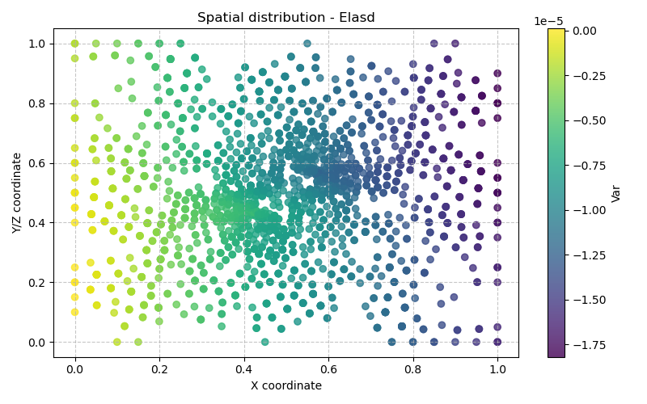

# Modèle Elasd — Élasticité avec Endommagement Isotrope (Quasi-statique)

> **Fichiers sources :**
> `src/Models/ModelFiles/Elasd.c` · `src/Models/PredefinedMethods/Damage.c` · `test_examples/Elasd/Elasd`
>
> **Auteur du modèle :** P. Dangla

---

## Table des matières

1. [Contexte et objectif](#1-contexte-et-objectif)
2. [Hypothèses](#2-hypothèses)
3. [Variables et notation](#3-variables-et-notation)
4. [Modèle mathématique](#4-modèle-mathématique)
   - 4.1 [Équation d'équilibre](#41-équation-déquilibre)
   - 4.2 [Loi de comportement endommagée](#42-loi-de-comportement-endommagée)
   - 4.3 [Modèles d'endommagement (Mazars vs Marigo-Jirasek)](#43-modèles-dendommagement-mazars-vs-marigo-jirasek)
5. [Explication des fichiers d'entrée](#5-explication-des-fichiers-dentrée)
6. [Résultats de la simulation](#6-résultats-de-la-simulation)

---

## 1. Contexte et objectif

Le modèle **Elasd** permet de résoudre les problèmes de mécanique du solide pour des matériaux subissant une forte dégradation de leurs propriétés de rigidité. Particulièrement adapté aux milieux béton, ciment ou roches, il simule l'**endommagement intrinsèque** (microfissuration du squelette rigide).

Le cas test `test_examples/Elasd/Elasd` illustre son fonctionnement sur une géométrie 2D : une plaque rectangulaire présentant un **vide central** (`samplewithvoid.msh`), sollicitée en traction uniaxiale globale sous la forme d'un déplacement bloqué à sa base, et tiré à son extrémité libre. La forme géométrique avec un trou crée des singularités et permet de visualiser l'initiation et la propagation de l'endommagement (une modélisation de fissuration en bande).

---

## 2. Hypothèses

1. **Régime quasi-statique** : on néglige les phénomènes d'inertie.
2. **Comportement linéairement proportionnel** à petite échelle, défini par un simple module de Young ($E$) et un coefficient de Poisson ($\nu$).
3. **Endommagement isotrope scalaire** : la dégradation est isotrope. Quelle que soit la charge, le retrait structurel se traduit par une unique variable d'érosion matricielle $d$ (où $0 \le d \le 1$), qui détériore progressivement la matrice de raideur de Hooke entière selon une homothétie.
4. **Indépendance de maillage** : dans sa variante Marigo-Jirasek (utilisée dans l'exemple), le modèle distribue l'énergie de rupture de surface $G_f$ sur le volume via la largeur caractéristique de bande de fissure (**crack band width** $w$), évitant ainsi le problème habituel de localisation intense sur une unique maille et une chute d'énergie non-physique en dessous d'un certain seuil d'affinement.

---

## 3. Variables et notation

### Inconnues primaires

| Symbole | Signification |
|---------|---------------|
| $\mathbf{u}$ | Vecteur des déplacements pour chaque degré de liberté (ex: $u_1, u_2, u_3$, en $m$) |

### Variables secondaires et à l'intégration

| Symbole | Signification |
|---------|---------------|
| $\boldsymbol{\sigma}$ | Tenseur des contraintes macrosocopiques symétriques liées (Pa) |
| $d$ | Variable **Damage** (Échelle de 0 à 1, où 0 = intègre, 1 = rompu) |
| $\kappa$ ou $\text{hardv}$ | **Hardening variable** - mémorise l'historique maximal de déformation relative pour le calcul d'adoucissement. |
| $f$ ou $\text{crit}$ | Fonction seuil (**Yield function**) mesurant si la phase actuelle induit l'accroissement des dommages. |

---

## 4. Modèle mathématique

L'implémentation est principalement divisée entre `Elasd.c` (le solveur éléments-finis, assemblant les raideurs tangentes $K$) et sa composante purement matériau `PredefinedMethods/Damage.c` qui calcule les tenseurs.

### 4.1 Équation d'équilibre

L'équilibre des efforts sans force inertielle (formulation Galerkin usuelle de la mécanique des structures) :
$$ \nabla \cdot \boldsymbol{\sigma} + \rho_s \mathbf{g} = \mathbf{0} $$

Dans ce modèle, `meca_1`, `meca_2` sont assemblées avec de strictes résidus mécaniques sans aucun couplage fluide. 

### 4.2 Loi de comportement endommagée

Tandis que la loi de Hooke initial décrit le repère non-lésé : 
$\boldsymbol{\sigma}_{\text{eff}} = \mathbb{C} : \boldsymbol{\varepsilon}$

La contrainte visible (apparente) est donnée grâce au scalaire d'endommagement isotrope $d$ pondérant la section porteuse du matériau intacte :
$$ \boldsymbol{\sigma} = (1 - d) \mathbb{C} : \boldsymbol{\varepsilon} $$

Le multiplicateur tangent évalué dans `ComputeTangentCoefficients` nécessite aussi la dérivation de $d$ suivant les déformations pour le Newton-Raphson :
$$ \delta\boldsymbol{\sigma} = ((1 - d) \mathbb{C} - \mathbb{C} : \boldsymbol{\varepsilon} \otimes \frac{\partial d}{\partial \boldsymbol{\varepsilon}}) : \delta\boldsymbol{\varepsilon} $$

### 4.3 Modèles d'endommagement (Mazars vs Marigo-Jirasek)

Elasd détecte magiquement selon les données d'entrée quelle loi utiliser :
- L’option historique de **Mazars** demande `max_elastic_strain`, $A_c, B_c, A_t, B_t$ (des paramètres purement tirés du béton permettant de séparer le comportement en traction vs compression équivalent).
- Le modèle de l'exemple, **Marigo-Jirasek**, demande une contrainte limite uniaxiale de rupture en traction, une énergie de rupture $G_f$, et s'assure via une approche énergétique de relâcher les surcontraintes en calculant un critère $f$ et en augmentant l'endommagement exponentiellement pour émuler l'adoucissement lors de la rupture de la bande ($w$).

---

## 5. Explication des fichiers d'entrée

Dans le répertoire `test_examples/Elasd/`, le fichier `Elasd` pilote exclusivement une démonstration 2D contraint/déformation (plan).

1. **Géométrie & Maillage**
   ```text
   Geometry
   2 plan
   Mesh
   samplewithvoid.msh
   ```
   Un maillage `gmsh` de pièce rectangulaire trouée.

2. **Matériau**
   ```text
   Material # Bulk
   Model = Elasd
   gravity = 0       
   rho_s = 2350      
   young = 2.e+9   # Module d'Young E (Pa)
   poisson = 0.3     
   uniaxial_tensile_strength = 2.e5
   fracture_energy = 590.
   crack_band_width = 1
   ```
   Rensignant ces 3 dernières propriétés caractéristiques de rupture et de bande localisée, le code bascule instantanément vers la loi d'endommagement **Marigo-Jirasek**.

3. **Conditions mécaniques (Traction)**
   ```text
   Functions
   1
   N = 3  F(0) = 0  F(1) = 4.e-4  F(2) = -2.e-3
   
   Boundary Conditions
   3
   Region = 10   Unknown = u_2   Field = 0 Function = 0
   Region = 1    Unknown = u_1   Field = 0 Function = 0
   Region = 30   Unknown = u_2   Field = 1 Function = 1
   ```
   - L'axe bas (Régions 1 et 10) de la plaque est bridé (fonction = 0 bloquant les déplacements de corps rigide).
   - Le profil de la charge pilotant le bord haut (Région 30) en `u_2` ordonne une élongation uniaxiale imposée, tirant progressivement la base pour une fraction valant `F(t)`. En 1 temps fictif, on force 0.4 mm.
   
4. **Calculs temporel et objectifs**
   ```text
   Dates
   11
   0 0.1 0.12 0.14 0.16 0.18 0.2 0.22 0.24 0.26 0.28 0.3
   ```
   Le solveur tracera l'historique sur les moments critiques de l'élasticité puis de la rupture s'initiant après un palier macroscopique, s'arrêtant artificiellement juste avant $0.3$ ($u_{2,\text{imposé}} = 0.12$ mm). Cela évitant de simuler la ruine complète en deux parts de l'échantillon.

---

## 6. Résultats de la simulation

Ce test purement mécanique génère 11 fichiers de rendus dont les comportements sont notables et lisibles à même le fichier sans interface :

1. Au pôle initial `.t0`, toute contrainte ou endommagement $d$ est strictement nul, le matériau est au repos originel.
2. Tout au long de l'élongation, la cinématique d'élévation sur $u_2$ s'immisce dans une phase purement élastique. Le vide central focalisant les lignes de force en ses pôles est et ouest, ces points-ci subissent les plus forts taux de déformations en tensions directes.
3. Arrivé au stade final généré (`.t10` correspondant à l'instant paramétrique $0.28$), on détecte explicitement la naissance du gradient d'endommagement (activé lorsque l'énergie libérable critique à son point mort a été outrepassée par le critère d'adoucissement). Autour du plan médian flanquant le vide matriciel, la variable **Damage commence à croître au-dessus de zéro** (on y lit $d > 0.1$), démontrant une plasticité apparente due à  la rupture isotrope, relâchant la contrainte apparente de cette zone qui serait sans cela non bornée. La loi Marigo-Jirasek garantit une perte énergétique finie calquée sur les $590$ de Fracture Energy.



---

## 7. Références bibliographiques

- **Dangla, P.** — *Bil : a FEM/FVM platform for multiphysics simulations*.
- **Mazars, J.** (1984) — *Application de la mécanique de l'endommagement au comportement non linéaire et à la rupture du béton de structure*. Thèse d'état, Université Paris 6. (Implémenté sous forme d'élasticité endommageable isotrope).
- **Marigo, J.-J.** (1981) — *Formulation d'une loi d'endommagement d'un matériau élastique*. C. R. Acad. Sci. Paris. 
- **Jirásek, M.**, & Bauer, M. (2012) — *Numerical aspects of the crack band approach*. Computers & Structures. (Permettant le lissage de la dissipation énergétique via `crack_band_width`, levant la dépendance au maillage).
*(Graphes générés automatiquement pour l'exemple Elasd)*
