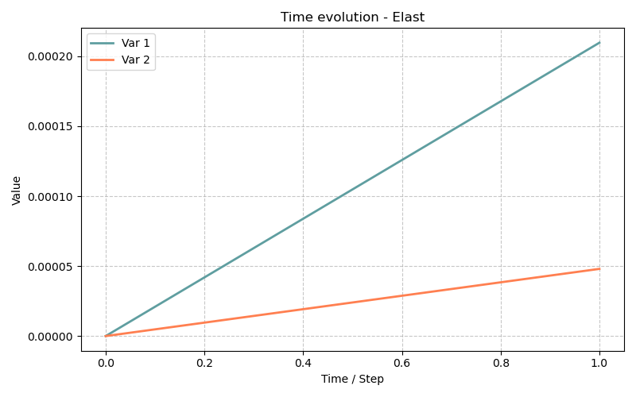

# Modèle Elast0 — Élasticité Linéaire Isotope (Géométrie Axisymétrique)

> **Fichiers sources :**
> `src/Models/ModelFiles/Elast.c` · `test_examples/Elast/Elast0`

---

## Table des matières

1. [Contexte et objectif](#1-contexte-et-objectif)
2. [Hypothèses](#2-hypothèses)
3. [Variables et Modèle mathématique](#3-variables-et-modèle-mathématique)
4. [Explication des fichiers d'entrée](#4-explication-des-fichiers-dentrée)
5. [Résultats escomptés](#5-résultats-escomptés)

---

## 1. Contexte et objectif

Le modèle **Elast** permet de résoudre de bout en bout le problème d'**élasticité linaire**. Il s'agit d'un des cas les plus basiques de la mécanique des milieux continus modélisant, pour de petites déformations, un solide se déformant de manière complètement réversible et instantanée face à des forces, pressions ou blocages géométriques.

L'exemple `test_examples/Elast/Elast0` illustre le comportement d'un solide massif **cylindrique multicouche**. Pour gagner en temps de calcul, on n'utilise pas un maillage 3D complexe, mais on exploite les symétries en déclarant le maillage selon un comportement bidimensionnel en révolution (système de coordonnées axisymétrique repéré usuellement en $r, z$). L'objectif du scénario est de simuler l'équilibre d'une structure en stratification souple et rigide, chargée en pression interne (tube sous pression).

---

## 2. Hypothèses

1. **Relation contrainte-déformation linaire** (Loi de Hooke isotrope) : Chaque strate est caractérisée avec exactitude par un seul couple de paramètres élastiques : Module de Young ($E$) et coefficient de Poisson ($\nu$).
2. **Petites perturbations** : L'équation s'écrit sur la géométrie originelle sans prendre en compte les distorsions géométriques massives $\boldsymbol{\varepsilon} = \frac{1}{2}(\nabla \mathbf{u} + \nabla^T \mathbf{u})$.
3. **Chargement quasi-statique** : L'expérience ignore les forces d'inertie.
4. **Matériau composite macroscopique** : Les éléments de maillage se partagent sous diverses "layers" (couches) définies par des lois aux valeurs distinctes.

---

## 3. Variables et Modèle mathématique

L'implémentation (visible dans `src/Models/ModelFiles/Elast.c`) décrit un système d'équation simple dont le nombre est dicté par la dimension de l'espace. En mode *2 axis* (radial et longitudinal), il y a deux équations de conservation de quantité de mouvement appelées `meca_1` ($u_r$) et `meca_2` ($u_z$).

### Inconnues
| Symbole | Signification |
|---------|---------------|
| $\mathbf{u}$   | Déplacements nodaux (inconnue primaire de l'équilibre) |

### Équilibre Statique 
Sans présence de processus thermiques ou aqueux couplés, la condition se base sur :
$$ \nabla \cdot \boldsymbol{\sigma} + \rho_s \mathbf{g} = \mathbf{0} $$

### Loi de comportement
Dans `Elast.c`, chaque intégration prend en compte le tenseur isochore et volumique construit tel que :
$$ \boldsymbol{\sigma} = \boldsymbol{\sigma}_0 + \mathbb{C} : \boldsymbol{\varepsilon} $$
Ici, $\boldsymbol{\sigma}_0$ se substitue au tenseur optionnel des précontraintes de la structure. $\mathbb{C}$ est le tenseur de raideur d'ordre 4.

---

## 4. Explication des fichiers d'entrée (`Elast0`)

Le fichier principal est une excellente vitrine de paramétrage de conditions composées dans Bil. Il gère plusieurs régions et applique une charge dynamique par morceau.

1. **Geometry & Mesh**
   ```text
   Geometry
   2 axis
   Mesh
   cylinder0.msh
   ```
   Concrétise la consigne d'aborder des coordonnées matérielles $r, z$, ce qui modifie à la volée le calcul des intégrations de volume de l'élément fini en injectant le Jacobien de la révolution $2\pi r$.

2. **Definition des matériaux (Layers)**
   Où il y a ici juxtaposition de couches au repos comprimées:
   ```text
   Material # Layer 1 (stiff)
   Modele = Elast
   rho_s = 0 
   sig0_11 = -1e6        # Précontrainte de -1 MPa
   ...
   young =  10.e+09      # Rigidité E = 10 GPa
   poisson = 0.26 
   
   # (Layer 2 est soft avec young = 1 GPa, Layer 3 est stiff à 10 GPa)
   ```
   Trois domaines physiques sont posés. Tous initient avec une pression résiduelle négative (compression de -1 MPa radiale, ortho et axiale), mais diffèrent par la consigne de raideur, imitant par exemple un tube fretté.

3. **Field et Function (Chargement instationnaire)**
   ```text
   Fields
   1
   Value = 1e6   Gradient = 0 0 0 Point = 0 0 0
   Functions
   1
   N = 3  F(0) = 1  F(1) = 10 F(2) = 0.1
   ```
   - Le Champ n°1 modélise une base de 1 MPa.
   - La fonction dicte l'historique du chargement : Au temps 0 on démarre à $100\%$ du champ, au temps 1 on monte en pic à $10 \times$ l'effort nominal (10 MPa), et au temps 2 on chute à un simple $10\%$.  

4. **Conditions aux Limites (Déplacements & Efforts)**
   ```text
   Boundary Conditions
   1
   Region = 80 Unknown = u_2   Field = 0 Function = 0
   ```
   Une section de la pièce repérée en 80  a son mouvement longitudinal empêché et mis à nul (`u_2 = 0`). Elle est encastrée.

   ```text
   Loads
   7
   Region = 10 Equation = meca_1 Type = pressure Field = 1 Function = 1
   Region = 20 Equation = meca_1 Type = pressure Field = 1 Function = 1
   Region = 30 Equation = meca_1 Type = pressure Field = 1 Function = 1
   ...
   ```
   Les points des parois des régions 10, 20 et 30 sont ceux sollicités par la pression `pressure` subissant la fluctuation cyclique `Function 1` (de 1 à 10 puis 0.1 MPa) le long des faces du tube (possiblement l'intérieur radial de différentes sections).

5. **Solveur temporel et Procédure Linéaire**
   - `Dates : 0 1 2` demande l'écriture des bilans stricts aux bornes de la fonction.
   - `Iterative Process : Iterations = 1`. Ceci est crucial, avec des modèles mécaniques non-évolutifs (ni dégradation, ni plasticité non-linéaire, petites déformations), il n'y a pas besoin de solutionner par méthode de Newton. L'inversion directe de matrice $\mathbf{K} \cdot \mathbf{u} = \mathbf{F}$ est exacte à l'issue de la première passe, la tolérance joue une marge de vérification.

---

## 5. Résultats escomptés

Cette modélisation retranscrit classiquement l'évolution contrainte/déformation pour des pièces composites ou maillées :
- La forme multicouche crée des sauts brusques d’état de **contraintes** entre les strates molles (Layer 2) et rigides (Layer 1 et 3). 
- En revanche, les vecteurs **déplacement** resteront garantis continus le long du raccord en interfaçage, les éléments finis nouant ces limites d'intégrités géométriques ensemble.
- Au bout de chaque calcul au temps ciblé, par exemple à $t=1$ l'effet d'expansion tubulaire due à la pression très haute est maximal, la paroi s'évase suivant les axes radiaux $u_1$. Au temps $t=2$, l'édifice se rétracte et, selon la topologie, peut même se replier sous l'effet des précontraintes imposées (`sig0_ij = -1 MPa`), le tout en stricte absence d'adoucissement irréversible du matériau.



---

## 6. Références bibliographiques

- **Dangla, P.** — *Bil : a FEM/FVM platform for multiphysics simulations*.
- **O.C. Zienkiewicz, R.L. Taylor, J.Z. Zhu** — *The Finite Element Method: Its Basis and Fundamentals*. (Pour la modélisation mathématique générale par éléments finis élastiques et l'intégration jacobienne axisymétrique).
- **Hooke, R.** — *Loi de Hooke* généralisée décrivant la réponse pseudo-linéaire du tenseur d'élasticité isotrope ($\mathbb{C}$).
