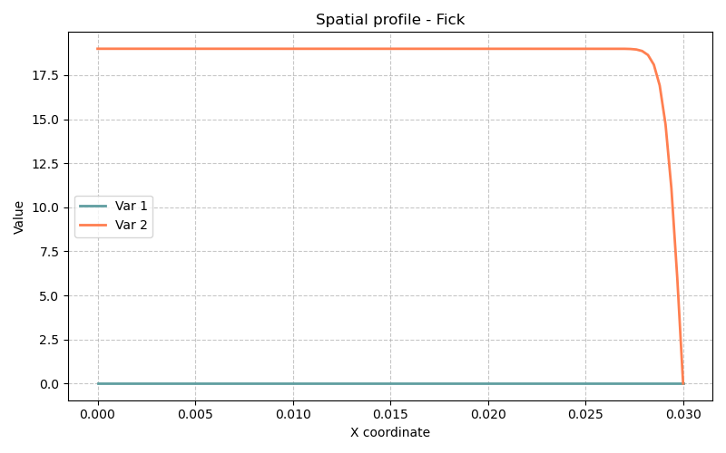

# Modèle Fick — Seconde loi de Fick (Diffusion de soluté)

> **Fichiers sources :**
> `src/Models/ModelFiles/Fick.c` · `test_examples/Fick/Fick`

---

## Table des matières

1. [Contexte et objectif](#1-contexte-et-objectif)
2. [Hypothèses](#2-hypothèses)
3. [Variables et Modèle mathématique](#3-variables-et-modèle-mathématique)
4. [Explication des fichiers d'entrée](#4-explication-des-fichiers-dentrée)
5. [Résultats escomptés](#5-résultats-escomptés)
6. [Références bibliographiques](#6-références-bibliographiques)

---

## 1. Contexte et objectif

Le modèle **Fick** simule la diffusion "pure" d'un soluté (typiquement des ions alcalins comme le Sodium $Na^+$ ou Potassium $K^+$) dissout au sein d'un milieu poreux inerte et saturé d'eau. Il s'appuie sur la **Seconde loi de Fick**, qui décrit comment un champ de concentration matérielle fluctue au fil du temps sous la stricte influence de ses propres gradients. Il n'y a pas de mouvement macroscopique du fluide porteur (ni convection, ni advection). 

L'exemple `test_examples/Fick/Fick` est une démonstration mono-dimensionnelle (`1 Axis`) de la lixiviation d'un bloc de matériau (un barreau de 3 cm). Il s'agirait d'une épruvette saturée en sel (concentration uniforme initiale) dont une extrémité est brutalement "nettoyée" au contact d'eau pure, entraînant une désorption/diffusion de l'intérieur vers l'extérieur. L'historique en est tracé sur une année complète (31 536 000 secondes).

---

## 2. Hypothèses

1. **Calcul en Volumes Finis (FVM)** : Contrairement aux modèles structurels comme *Elast* résolus par Éléments Finis, ce modèle emploie l'architecture FVM (`#include "FVM.h"`) codée dans Bil. Cette formulation intègre des flux aux frontières, garantissant de fait la **stricte conservation des moles** chimiques d'une cellule à l'autre.
2. **Diffusion sans convection** : La vélocité de l'eau interstitielle est parfaitement nulle. Le profil évolue comme un étalement gaussien ou en fonction d'erreur d'une onde chimique vers sa limite.
3. **Tortuosité du milieu poreux** : La géométrie intrique l'acheminement des molécules. Le coefficient de transfert prend en compte la tortuosité liquide (ex: `TortuosityOhJang`) qui dépend intimement de la seule variable physique d'entrée : la `porosity` $\phi$.

---

## 3. Variables et Modèle mathématique

### Inconnues
| Symbole | Signification |
|---------|---------------|
| $c_{\text{na}}$   | Molarité ou concentration primaire en Soluté (inconnue d'état) |

### Conservation de la masse
L'équation nodale traitée nommée implicitement `solute` stipule un équilibre des masses molaires de Na. Son implémentation suit le schéma temporel classique :

$$ \frac{\partial c_{\text{na}}}{\partial t} \phi  + \nabla \cdot \mathbf{w}_{\text{na}} = 0 $$

Où l'implantation FVM bilantielle discrète est : `(N_solute - N_soluten) + dt * div(W_solute) = 0`

### Flux de Fick (Loi de comportement)
La relation régissant le vecteur d'échange entre cellules :

$$ \mathbf{w}_{\text{na}} = - D_{\text{eff}} \nabla c_{\text{na}} - \dots $$

Avec un coefficient de transfert effectif calculé dans le code via : $D_{\text{eff}} = D_{\text{eau}} \cdot \tau(\phi)$ où $\tau$ est la tortuosité, et $D_{\text{eau}}$ la diffusivité du $Na^+$ dans de l'eau à $298^\circ K$. 

---

## 4. Explication des fichiers d'entrée (`Fick`)

L'expérience cible une simplicité maximale au travers d'algorithmes et d'une syntaxe minimaliste : 

1. **Geometry & Mesh**
   ```text
   Geometry
   1 Axis
   ```
   Le système bascule en unidimensionnel le long de l'axe central. Le maillage n'utilise pas de surface `.msh` de `gmsh` mais est généré internalement par des paramètres numériques (un segment continu aboutissant à 3 cm de longueur, `3.e-2` segmenté en sous-cellules de longueur $3\cdot 10^{-4}$ mètres, soit 100 mailles alignées). 

2. **Matériau**
   ```text
   Material
   Model = Fick
   porosity = 0.379 
   ```
   Un unique tenseur macroscopique, paramétré par une belle porosité de $\approx 38 \%$. La diffusivité de l'ion dans l'eau n'est pas spécifiée, le code injecte sa constante préprogrammée (`DiffusionCoefficientOfMoleculeInWater(Na)`).

3. **Gradients originels et Conditions aux limites**
   ```text
   Fields
   1
   Value = 19.
   
   Initialization
   1
   Region = 1 	Unknown = c_na  	    Field = 1
   ```
   Par le processus d'initialisation, la Totalité du domaine poreux (Region 1) se voit administrer une valeur saturante initiale de $19$ mol pour le champ primaire $c_{na}$.

   ```text
   Functions
   1
   N = 2   F(0) = 1.   F(3600) = 0.
   
   Boundary Conditions
   1
   Reg = 2 	Unknown = c_na      	Field = 1 	Function = 1
   ```
   Le point de bord (Reg 2 - vraisemblablement la face externe) est maintenu chimiquement. Via la `Function`, ce noeud valait $19 \times 1$ au temps absolu $t=0$, puis décline drastiquement pour atteindre un grand $0$ absolu au bout d'une heure (3600 sec), qu'elle maintient ad vitam. Cela représente le rinçage complet par trempage extérieur du bloc.

4. **Solveur**
   ```text
   Dates
   4
   0	86400	259200   31536000
   ```
   La simulation extrait précisément les valeurs à $t=0$, au bout de **1 jour** (86400s), **3 jours**, et **1 an** (31 536 000s). `Iterative Process` tourne via un Newton borné à 20 itérations.

---

## 5. Résultats escomptés

Cette expérience de dessalement 1D, visualisable après calcul par les fichiers `.t1` à `.t3` illuste une **diffusion par épuisement** :
- Le profil temporel révèlera la perte progressive des sels le long du barreau.
- À 1 jour (`.t1`), la face $x=0$ en contact vaudra 0, tandis que l'autre bout de l'échantillon à $x=3$ cm pourrait encore arborer son plateau de rétention natif à 19 moles, la vague chimique n'ayant pas atteint la profondeur limite due à la grande tortuosité du béton/roche.
- À l'issue d'une année (`.t3`), la concentration devrait avoisiner des reliquats asymptotiques à presque 0 le long de tous les noeuds axiaux, l'intégralité du Sodium ou Potassium ayant fui par gradient entropique dans l'eau de lavage infinie de la condition de frontière (Reg 2).



---

## 6. Références bibliographiques

- **Dangla, P.** — *Bil : a FEM/FVM platform for multiphysics simulations*.
- Base physique de la tortuosité des pores capillaires (Lois de **Oh & Jang, 2004** ou de **Bažant & Najjar, 1972** implémentées dans le préprocesseur bil pour retarder le flux).
- **Loi de Fick** — Formulation fondamentale phéno-macroscopique du transport de matière par diffusion.
