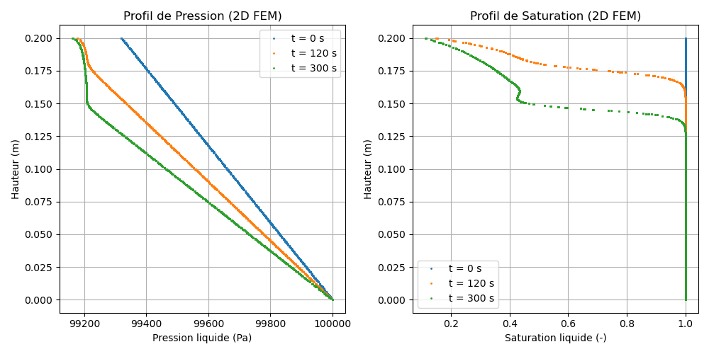

# M10 Model — Richards Equation: gravity drainage of a bead column (2D)

> **Source files:**
> `src/Models/ModelFiles/M10.c` · `test_examples/M10-2/M10-2` · `test_examples/M10-2/M10-2.msh` · `test_examples/M10-2/billes`
>
> **Bil model author:** P. Dangla (Université Gustave Eiffel)

---

## Table of contents

1. [Context and objective](#1-context-and-objective)
2. [Assumptions](#2-assumptions)
3. [Variables and notation](#3-variables-and-notation)
4. [Mathematical model](#4-mathematical-model)
   - 4.1 [Conservation equation](#41-conservation-equation)
   - 4.2 [Vectorial Darcy flux law](#42-vectorial-darcy-flux-law)
   - 4.3 [Retention curve and relative permeability](#43-retention-curve-and-relative-permeability)
   - 4.4 [Condensed form — Richards equation](#44-condensed-form--richards-equation)
5. [Boundary and initial conditions](#5-boundary-and-initial-conditions)
6. [Test case: two-dimensional bead column (`test_examples/M10-2`)](#6-test-case-two-dimensional-bead-column)
7. [Results](#7-results)
8. [2D Finite Element numerical discretization](#8-2d-finite-element-numerical-discretization)
9. [Bibliographic references](#9-bibliographic-references)

---

## 1. Context and objective

The M10 model solves the **Richards equation** for single-phase liquid water flow in a partially saturated porous medium. The gas phase is assumed at constant pressure; only the **liquid pressure** $p_l$ is the unknown.

In this specific case `test_examples/M10-2`, the modeling reproduces the **gravitational drainage of a glass bead column**, but now on a **two-dimensional (2D) plane**. The purpose of this test is to validate the behavior of the purely local integration of M10's Finite Element Method (FEM) on an **imported unstructured mesh** (`M10-2.msh`), unlike the `M10-1` case which was only a one-dimensional discretization generated on the fly.

Although the mesh has a width (coordinate $x \in [0, 0.01]$ m), the absence of transverse loads or gradients guarantees strictly vertical flow along the $y \in [0, 0.2]$ m axis.

| Base parameter | Value |
|-----------|-------|
| Porosity $\phi$ | 0.38 |
| Intrinsic permeability $k_\text{int}$ | $8.9 \times 10^{-12}$ m² |

---

## 2. Assumptions

1. **Single-phase liquid 2D**: The vectorial resolution is performed on a plane $(x,y)$. The gas pressure is set at a constant ceiling $p_g = 10^5$ Pa.
2. **Isothermal**: Constant viscosity and densities.
3. **Rigid porosity**: $\phi = \text{constant}$.
4. **Vectorial gravity**: $\mathbf{g} = (0, -9.81)$ m/s² oriented downward.

---

## 3. Variables and notation

### Primary nodal unknown

| Symbol | Meaning | Unit |
|---------|---------|------|
| $p_l$ | 2D liquid phase pressure $p_l(x,y)$ | Pa |

Local dynamics (Gauss points) are managed using capillary pressure $p_c = p_g - p_l$.

### Secondary variables

| Symbol | Meaning |
|---------|---------|
| $s_l(p_c)$ | Liquid water saturation degree |
| $k_{rl}(p_c)$ | Weighting relative permeability |
| $m_l$ | Local water content |
| $\mathbf{W}_l$ | Liquid flux vector $(W_{lx}, W_{ly})$ |

---

## 4. Mathematical model

### 4.1 Conservation equation

Mass balance on the two-dimensional finite element control volume:

$$\frac{\partial m_l}{\partial t} + \nabla \cdot \mathbf{W}_l = 0 \quad \text{with } m_l = \rho_l\,\phi\,s_l(p_c)$$

### 4.2 Vectorial Darcy flux law

The flux is driven by the general head, accounting for both gradient degrees:

$$\mathbf{W}_l = -K_l\,\left( \begin{pmatrix} \frac{\partial p_l}{\partial x} \\ \frac{\partial p_l}{\partial y} \end{pmatrix} - \rho_l \begin{pmatrix} 0 \\ g_y \end{pmatrix} \right)$$
*(where $g_y = -9.81$)*

The dependence of the effective coefficient $K_l = \frac{\rho_l\,k_\text{int}\,k_{rl}(p_c)}{\mu_l}$ on the local field $p_c$ directly drives the nonlinear frontal progression.

### 4.3 Retention curve and relative permeability

The glass bead medium exhibits extremely sudden desaturation. Its test curve is transcribed in `test_examples/M10-2/billes`.

| Quantity | Value | Description |
|----------|-------|-------------|
| $p_{c,\text{entry}}$ | ≈ 500 Pa | Characteristic air-entry pressure |
| $s_{l,\text{max}}$ | 1.0 | Full saturation below 500 Pa |
| $s_{l,\text{residual}}$ | ≈ 0.09 | Total hydraulic void at ~1000 Pa |

### 4.4 Condensed form — Richards equation

Variable substitution leads to the classical Jacobian system for Newton's method:

$$ -C(p_c) \frac{\partial p_l}{\partial t} - \nabla \cdot \left[ K_l \left(\nabla p_l - \rho_l\,\mathbf{g}\right) \right] = 0 $$

The variable $C(p_c)$ (matrix capacity) is the product $-\rho_l\,\phi\,\partial s_l/\partial p_c$.

---

## 5. Boundary and initial conditions

### Initial conditions: the `Field` call in M10-2

The column is not filled in a stabilized hydrostatic regime with gravity, but with a simple linear decrease over Y to impose a heavy initial draining flux:
`(M10-2 file: Val = 1.e5 Grad = 0 -3400 Poin = 0 0)`

$$p_l(x,\,y,\,t=0) = p_{l0} + G_{y}\,y$$
With $p_{l0} = 10^5 \text{ Pa}$ and $G_y = -3400 \text{ Pa/m}$.

| Geometric boundary | $y$ [m] | $p_l(t=0)$ [Pa] | $S_l(t=0)$ [-] |
|------|---------|-----------------|----------------|
| Base (Reg 1) | 0 | $10^5$ | 1.000 |
| Free top | 0.2 | $9.932 \times 10^4$ | ≈ 0.9998 |

*Note on $X$: Every $x$ at the same height $y$ receives exactly the same initial pressure value.*

### Boundary conditions (FEM - Vectorial)

- `Boundary Conditions` imposes `Reg = 1` with `Func = 0` on `Field = 1`.
  The 2D base ($y = 0$) is maintained fixed at the `Field 1` pressure state, i.e., pure saturated atmospheric pressure of $10^5$ Pa.
- The outer boundaries (lateral walls at $X$ left and right) and the free outer roof at $Y$ are implicitly set under Natural Neumann conditions, behaving as **exact impermeable boundaries**: no flux enters.

---

## 6. Test case: two-dimensional bead column (`test_examples/M10-2`)

### Simulation parameters
This case exactly reproduces the M10-1 executions but at a higher vectorial cost since `M10-2.msh` has a much larger number of nodes spread horizontally and vertically.

| Parameter | Value |
|-----------|-------|
| Mesh type | GMSH 2D (`2 plan`) |
| Total duration | 300 s |
| Requested outputs | $t = 0$, $t = 120$, $t = 300$ s |
| Newton error tolerance | $1.0\times 10^{-10}$ |

### Surface drainage physics

The saturation decrease should follow a pure vertical front wave. Since all local gradients in $\partial p_l / \partial x$ are strictly zero, the 2D Finite Element solver experiences no transverse flow.

---

## 7. Results

The following representation is generated as a scatter plot superimposing each node of the 2D plane individually according to its height `y` against the pressure $p_l$ and saturation $S_l$ values.

Although different nodes exist at the same $y$ base, no cross-axis deviation of $p_l$ is observed, visually supporting the smooth curves and justifying the isotropic homogeneity quality of the M10 integration solver.

### The phases:
- At $t=0$: Powerful hydraulic entrainment by mass pressure ($W_l \approx -5.7 \times 10^{-2}$ kg/m²·s) and the initial isobaric delay.
- At $t=120$ and $t=300$ s: Disappearance of saturation at the top. This boundary passes to total residual ($S_l \approx 0.11$). The cessation of flux and return to strict hydrostatic equilibrium is 100% guaranteed by FEM.

---

## 8. 2D Finite Element numerical discretization

In this mode, the `ComputeVariables` algorithm injects the $x$ and $y$ format into the core of the node conductivity matrix:
- The mass matrix deploys its full integral shape functions ($N_i(x,y)\,N_j(x,y)$) at the volume Gauss points.
- The construction of the conductivity Jacobian governs both gradients $\frac{\partial p_l}{\partial x}$ and $\frac{\partial p_l}{\partial y}$.

If the `M10-2.msh` mesh were geometrically distorted, the standard continuous FEM approach applied would guarantee global mass conservation of the final drainage, one of the pillars of the Celia et al. standard.

---

## 9. Bibliographic references

- **Celia, M. A., Bouloutas, E. T. & Zarba, R. L.** (1990). A general mass-conservative numerical solution for the unsaturated flow equation. *Water Resources Research*, 26(7), 1483–1496. — Role regarding the requirement for a proper variational method (used in this 2D/3D bil module).
- **Zienkiewicz, O. C., & Taylor, R. L.** (2000). *The Finite Element Method*. — Principles of 2D spatial quadrature.
- **Dangla, P.** — *Bil: a FEM/FVM platform for multiphysics simulations*. Université Gustave Eiffel. Source code: <https://github.com/Universite-Gustave-Eiffel/bil>
