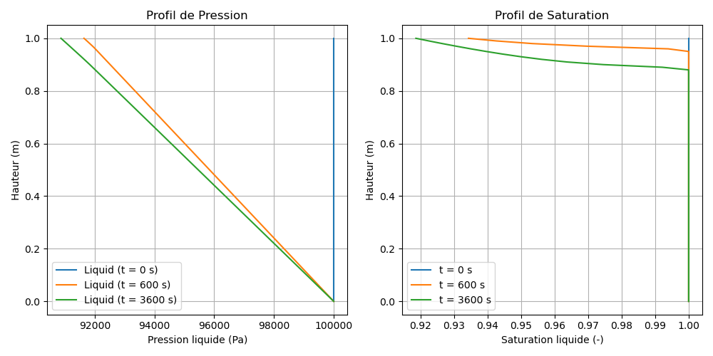

# M2 Model — Two-Phase L/G Flow (Liquid-Gas)

> **Bil model:** `src/Models/ModelFiles/M2.c`

> **Input file:** `doc/mkdocs/Flow/M2/M2`
>
> **Model authors:** P. Dangla (Université Gustave Eiffel)

---

## Table of contents

1. [Context and objective](#1-context-and-objective)
2. [Assumptions](#2-assumptions)
3. [Variables and notation](#3-variables-and-notation)
4. [Mathematical model](#4-mathematical-model)
   - 4.1 [Conservation equations](#41-conservation-equations)
   - 4.2 [Constitutive laws and fluxes (two-phase Darcy)](#42-constitutive-laws-and-fluxes-two-phase-darcy)
5. [Boundary and initial conditions](#5-boundary-and-initial-conditions)
6. [Test case: two-phase drainage of a soil column (`test_examples/M2`)](#6-test-case-two-phase-drainage-of-a-soil-column)
7. [Model material parameterization](#7-model-material-parameterization)
8. [Step-by-step file description](#8-step-by-step-file-description)
9. [Bibliographic references](#9-bibliographic-references)

---

## 1. Context and objective

The **M2** model solves the problem of **flow in porous media with two fluid phases (liquid and gas)**, a classic in geotechnical and reservoir engineering. Unlike the M1 model (Richards equation), which assumes air is everywhere stagnant at constant atmospheric pressure, M2 tightly couples the movement of both fluids: liquid (typically water) and gas (typically air or decomposition gases).

It is very useful for simulating complex drainage phenomena where air must enter the medium to allow water to exit, or for problems involving compression of intra-matrix air pockets.

---

## 2. Assumptions

1. **Active two-phase**: Both fluid phases (liquid and gas) are free to flow in the porous medium.
2. **Rigid solid matrix**: Soil or material deformation is ignored. Porosity $\phi$ is constant.
3. **Ideal gas law**: The gas phase density is compressible and follows the ideal gas law; air is described by its molar mass $M_g$ coupled to an equation of state.
4. **Incompressible liquid**: Liquid fluid density $\rho_l$ is considered constant, independent of pressure.
5. **Exclusive capillary coupling**: Saturation thermodynamics (spatial distribution of water in pores) is governed solely by the inter-phase pressure difference (capillary pressure).

---

## 3. Variables and notation

The model supports a coupled system of 2 scalar equations (mass conservation for liquid and gas).

### Primary unknowns (degrees of freedom)

| Symbol | Meaning | Unit | BIL internal |
|---------|---------|-------|-------------|
| $p_l$ | Liquid phase pressure | Pa | `p_l` |
| $p_g$ | Gas phase pressure | Pa | `p_g` |

### Behavior variables

| Symbol | Meaning |
|---------|---------|
| $p_c$ | Capillary pressure: $p_c = p_g - p_l$ |
| $S_l, S_g$ | Liquid and gas saturations ($S_g = 1 - S_l$) |
| $k_{rl}, k_{rg}$ | Phase relative permeabilities (linked to $p_c$ via retention curves) |
| $\rho_g$ | Gas density: $\rho_g = p_g \frac{M_g}{R \cdot T}$ |
| $m_l, m_g$ | Local mass contents (e.g., $m_l = \phi S_l \rho_l$) |

---

## 4. Mathematical model

### 4.1 Conservation equations

The system expresses **mass conservation** for each fluid constituent over an elementary partial porous volume.

1. **Liquid mass balance**:
   $$\frac{\partial m_l}{\partial t} + \nabla \cdot \mathbf{W}_l = 0$$

2. **Gas mass balance**:
   $$\frac{\partial m_g}{\partial t} + \nabla \cdot \mathbf{W}_g = 0$$

With local mass state relations:
- Liquid mass: $m_l = \rho_l \phi S_l(p_c)$
- Gas mass: $m_g = \rho_g(p_g) \phi S_g(p_c)$

### 4.2 Constitutive laws and fluxes (two-phase Darcy)

Macroscopic flow in the matrix follows the generalized empirical Darcy law extended to relative permeability within pores.

The liquid flux is written as a function of the head gradient:
$$\mathbf{W}_l = - \frac{\rho_l k_{\text{int}} k_{rl}(p_c)}{\mu_l} \nabla \left( p_l - \rho_l \mathbf{g} z \right)$$

Symmetrically for gas (without neglecting its compressed density):
$$\mathbf{W}_g = - \frac{\rho_g k_{\text{int}} k_{rg}(p_c)}{\mu_g} \nabla \left( p_g - \rho_g \mathbf{g} z \right)$$

*Note: State curves (saturation and relative permeabilities) are managed by the `Curves = sol` directive in the material file and can be numerically smoothed.*

---

## 5. Boundary and initial conditions

Unlike the M1 model, activating air movement requires rigorous consideration of "mixed" boundary conditions (open/closed for each phase).

- **Initial condition**: Pressure distribution (or hydrostatic) for water and barometric distribution for air $p_g$.
- **Boundary condition (liquid only free)**: Dirichlet on $p_l$, zero flux on $\mathbf{W}_g$.
- **Atmospheric boundary condition**: Pressure $p_g = 1 \text{ atm}$ imposed at the boundary and $p_l$ evaluated according to a gradient or evaporation suction.

---

## 6. Test case: two-phase drainage of a soil column

This case studied in `M2` is typical of a vertical soil column (here 1 meter thick) left to drain freely under its own weight — except that the surrounding air must migrate through the column to replace the escaping liquid.

### Test results

The evolution of the column behavior (drainage from the bottom with equalization) highlights the coupling. Under gravity, a driving head empties water from pores (decrease in $p_l$ at the top of the column and decrease in saturation). Air, following its own flux, compensates the desaturated volumes and stabilizes $p_g$. If air input at the top boundary were blocked, water would be unable to drain (capillary tensions would prevail inside, as in a capped syringe).

*(Typical results of a column where $S_l$ drops to converge toward $S_{resi}$, leaving $p_l$ depressions at the top while $p_g$ continues to ensure continuous contact.)*

---

## 7. Model material parameterization

The model requires careful implementation of fluid parameters in the file's `Material` block.

| Parameter | Value (M2 case example) | Description |
|-----------|-----------------|-------------|
| `gravite` | -9.81 | Gravitational acceleration magnitude ($m.s^{-2}$) |
| `phi` | 0.3 | Textural porosity of the medium |
| `k_int` | $4.4\times 10^{-13}$ | Intrinsic permeability of solid ($m^2$) |
| `mu_l`, `mu_g` | 1e-3, 1.8e-5 | Viscosities of water and air ($Pa.s$) |
| `M_g`, `RT` | 28.8e-3, 2436 | Specific gas law constants (air); $RT=2436 \, J.kg^{-1}$ |
| `p_c3` | 300 | Capillary limit regularization parameter |

---

## 8. Step-by-step file description

### 8.1 Control file `M2`

1. **Geometry & Mesh**: The case is again in a 1D domain (`1 plan`) with coordinate ranging from $z=0$ (base) to $z=1$ (top). The grid is fine to absorb frontal peaks: discretized into 100 cells ($\Delta z = 1$ cm).
2. **Material**: Line `Model = M2`, hydraulic properties of the medium (`sol`) to handle two-phase flow, and slope smoothing for very unfavorable pressures (`p_c3 = 300`).
3. **Initialization**: A unit affine field initializes homogeneous values of $p_l = 10^5 \text{ Pa}$ and $p_g = 10^5 \text{ Pa}$ throughout the column at $t=0$, corresponding to an isobaric saturated soil without piezometric head.
4. **Boundary Conditions**: The condition selectively blocks degrees of freedom at boundaries.
   - `Reg = 1 Inc = p_l Field = 2`: Keeps $p_l$ constant at a node.
   - `Reg = 3 Inc = p_g Field = 2`: Maintains air contact at equivalent pressure.
5. **Objective Variations**: To handle the strong nonlinearity of coupled fluxes, the time step is cut if $\Delta p > 1000$ Pa for water and air locally, ensuring convergence of the full Newton residual.

### 8.2 Model C code `src/Models/ModelFiles/M2.c`

1. **PDE map definition (`SetModelProp`)**: Associates `E_Liq` (Liquid mass balance) and `E_Gas` with `p_l` and `p_g`.
2. **Coupled permeability relations (`ComputeSecondaryComponents`)**: Key function that systematically evaluates for all nodes, from $p_c$, the saturation $S_l$ (linked to capillary interaction), the resident proportion $S_g$ ($1-S_l$), and their hydrostatic heads $H_L = P_L - \rho_l g z$ and $H_G = P_G - \rho_g g z$. The curve tool is invoked by reading the external file `sol`.
3. **Explicit differential `TangentCoefficients` (Line 646+)**: In 2-phases, evaluation of the implicit evolution matrix is drastically affected by double coupling. The M2 code calculates the differential gap manually (`dxi = 0.1` or `1.e2` depending on smoothing, line 679) on each component $p_l$ and $p_g$ to evaluate the "cross-effect" (modification of liquid flux due to gas volume changes and vice versa).
4. **Nonlinear Residual modeling (`ComputeResidu`)**: This is the mass balance between the first iterations `t` and the evolution at `t+1`. For each cell volume: the future liquid mass is reduced by the divergence of the intercell flux $W_L$; the gas fraction is rebalanced on the volumetric gas differential $W_G$. Equilibrium is declared when the node residual tends to 0 within Newton tolerance (`Tol = 1e-4` in the control file).

---

## 9. Bibliographic references

- **Celia, M. A., and Binning, P.** (1992). A Mass Conservative Numerical Solution for Two-Phase Flow in Porous Media with Application to Unsaturated Flow. *Water Resources Research*, 28(10), 2819-2828.
- **Dullien, F. A. L.** (1992). *Porous Media: Fluid Transport and Pore Structure*. Academic press.
- **Corey, A. T.** (1954). The Interrelation Between Gas and Oil Relative Permeabilities. *Producer's Monthly*, 19(1), 38-41.
