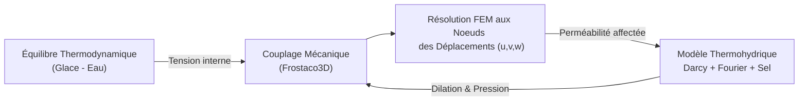

# Modèle Frostaco3D — Action du gel dans le béton en 3D (Couplage Poromécanique Complet)

> **Fichiers sources :**
> `src/Models/ModelFiles/Frostaco3d.c` · `test_examples/Frostaco3d/Frostaco3d`
>
> **Auteurs du modèle :** Tahiri, P. Dangla (Université Gustave Eiffel)

---

## Table des matières

1. [Contexte et objectif](#1-contexte-et-objectif)
2. [Hypothèses](#2-hypothèses)
3. [Variables et notation](#3-variables-et-notation)
4. [Modèle mathématique](#4-modèle-mathématique)
   - 4.1 [Équations de conservation et équilibre mécanique](#41-équations-de-conservation-et-équilibre-mécanique)
   - 4.2 [Lois de flux](#42-lois-de-flux)
   - 4.3 [Équilibre thermodynamique glace-liquide](#43-équilibre-thermodynamique-glace-liquide)
5. [Conditions aux limites et initiales](#5-conditions-aux-limites-et-initiales)
6. [Cas test : congélation géométrie sphérique (`test_examples/Frostaco3d/`)](#6-cas-test--congélation-géométrie-sphérique)
7. [Discrétisation numérique](#7-discrétisation-numérique)
8. [Description pas-à-pas des fichiers](#8-description-pas-à-pas-des-fichiers)
   - 8.1 [Fichier de pilotage `test_examples/Frostaco3d/Frostaco3d`](#81-fichier-de-pilotage-test_examplesfrostaco3dfrostaco3d)
   - 8.2 [Fichier modèle `src/Models/ModelFiles/Frostaco3d.c`](#82-fichier-modèle-srcmodelsmodelfilesfrostaco3dc)
9. [Références bibliographiques](#9-références-bibliographiques)

---

## 1. Contexte et objectif

Le modèle **Frostaco3d** (Frost actions in 3D concrete) est une évolution multidimensionnelle du modèle Frostaco original. Contrairement à la version 1D qui gère les contraintes mécaniques en "post-traitement", cette version intègre la résolution complète et couplée du champ tensoriel des **déplacements mécaniques** du squelette solide (parois poreuses) sous l'effet de l'expansion de la glace et de la cryoscuccion. Il conserve les transferts thermo-hydro-chimiques couplés avec activité d'un sel dissous (NaCl, CaCl₂).

---

## 2. Hypothèses

1. **Représentation tridimensionnelle spatiale** (1D sphérique, 2D plan, ou 3D plein).
2. Résolution active des **déplacements solides** et de l'équilibre mécanique selon la théorie de la poromécanique de Coussy.
3. Le milieu est modélisé par une **matrice élastique isotrope**. Ses modules d'élasticité (Module d'Young $E$, Coefficient de Poisson $\nu$) peuvent être imposés, ou automatiquement déduis du schéma d'homogénéisation de *Mori-Tanaka* selon les propriétés en masse de la matrice fine.
4. Transfert de la phase liquide régi par la loi de Darcy (sans transport interstitiel de la glace).
5. Activité thermodynamique de l'eau affectée par le sel selon une loi simplifiée (dépression cryoscopique).

---

## 3. Variables et notation

Le modèle supporte $3 + \text{dim}$ équations où $\text{dim}$ est la dimension de l'espace. En 3D, on a 6 variables primaires résolues en chaque nœud.

### Inconnues primaires

| Symbole | Signification | Unité |
|---------|---------------|-------|
| $u_1, u_2, u_3$ | Vecteur de déplacement mécanique du squelette | m |
| $p_{l}$ (ou $p_{\max}$) | Pression du liquide ou pression maximale | Pa |
| $c_s$ | Concentration en sel dans la solution interstitielle | mol/m³ |
| $T$ | Température | K |

### Variables de comportement

| Symbole | Signification |
|---------|---------------|
| $\sigma$ | Tenseur des contraintes totales |
| $\varepsilon$ | Tenseur des déformations ($\nabla^s \mathbf{u}$) |
| $S_l, S_i$ | Degrés de saturation liquide / glace |

---

## 4. Modèle mathématique

### 4.1 Équations de conservation et équilibre mécanique

Le modèle résout le système fortement couplé suivant :

**1. Équilibre mécanique vectoriel** :
$$\nabla \cdot \boldsymbol{\sigma} + \mathbf{f} = \mathbf{0}$$
avec $\boldsymbol{\sigma} = \mathbf{C} : \boldsymbol{\varepsilon} - b (S_l p_l + S_i p_i) \mathbf{I} - 3K \alpha_s (T - T_0) \mathbf{I}$, où $\mathbf{C}$ est le tenseur de rigidité élastique. La présence de glace augmente la pression apparente subie par la matrice (poroélasticité).

**2. Bilan de masse de l'eau totale** :
$$\frac{\partial}{\partial t}(\phi S_l \rho_l + \phi S_i \rho_i) + \nabla \cdot \mathbf{W}_l = 0$$

**3. Bilan de masse du sel** :
$$\frac{\partial}{\partial t}(\phi S_l \rho_l c_s) + \nabla \cdot \mathbf{W}_{\text{sels}} = 0$$

**4. Bilan d'entropie (Chaleur)** :
$$\frac{\partial S_{\text{tot}}}{\partial t} + \nabla \cdot \left( \frac{\mathbf{q}}{T} + s_l \mathbf{W}_l \right) = 0$$

### 4.2 Lois de flux

Elles sont vectorisées nativement pour la dimension 3 :
- $\mathbf{W}_l$: Flux de Darcy affecté par une perméabilité relative (Mualem). 
- $\mathbf{q}$: Flux de conductivité de Fourier.
- $\mathbf{W}_{\text{sels}}$: Transport multicomposant d'advection pure et diffusion de Fick. L'air est exclu du modèle.

### 4.3 Équilibre thermodynamique glace-liquide
La coexistence des phases fluide/solide aux tailles poreuses dépend de la balance chimique $\mu_{l}(p_l, T, c_s) = \mu_{i}(p_i, T)$. L'abaissement du point de fusion par l'effet osmotique du chlorure de sodium est répercuté linéairement ou logarithmiquement sur l'activité de l'eau.

---

## 5. Conditions aux limites et initiales

L'imposition aux bords comprend classiquement des encastrements mécaniques (nœuds bloqués en $u=0$) ou l'imposition de contraintes. Les flux thermohydriques peuvent y être restreints ou alimentés via les conditions de Dirichlet sur `tem` ou la pression hydraulique.

---

## 6. Cas test : congélation géométrie sphérique

Le dossier `test_examples/Frostaco3d/` contient le fichier (`Frostaco3d`) testant l'application d'un cycle thermo-salin à la paroi d'un réservoir d'une épaisseur modélisée sur un prisme sphérique réduit.

### Paramètres de simulation
| Paramètre | Valeur |
|-----------|--------|
| Géométrie | `1 sphe` (Sonde 1D formulée en coordonnées sphériques). Domaine d'épaisseur 5 mm. |
| Maillage | 100 mailles |
| Propriétés | Algorithme de Mori-Tanaka interne pour trouver `Young` et `Poisson` limitant à partir de $K_s=31.8$ GPa, $G_s=19.1$ GPa, et Porosité = 0.2. |
| Sollicitation | Application d'une augmentation de sel concentré jusqu'à $1000 \text{ mol/m}^3$ (front thermique advectif allant de 273K à 323K). Un déplacement tangentiel imposé est autorisé via $u_1$. |

### Résultats et commentaires physiques du test

Une exécution sur l'échantillon géométrique sphérique `test_examples/Frostaco3d` illustrerait l'interaction fluide-structure sous un choc thermohydrique tel que :

1. **Cycle Thermo-Salin (Choc réchauffant et salé)** : Au travers du bord 3 (extérieur), la température augmente (de 273 K à 323 K) et la base est baignée par de l'eau fortement saline qui diffuse dans le matériau par loi de Fick.
2. **Dilatation et Déplacement Sphérique** : 
   - L'élévation de chaleur amorce un dégel profond et un re-saturage total et aqueux du milieu, relaxant les pressions macroscopiques internes $p_i$ initialement figées.
   - Les propriétés de Biot (élasticité) converties par homogénéisation pilotent l'équation mécanique via un déplacement non-négatif imposé de $u_1 = - b (S_l p_l) + \alpha \Delta T$.
3. **Suivi des Noeuds (.t)** : Le module relève en temps réel la distribution du sel $c_s$ et du mouvement solide radial $u_x$. Le pic de sel tend à déformer chimiquement le système (pression d'osmose apparente à la limite de l'effritement). La corrélation $u(x, t)$ montre la réactivité très rapide de la déformation élastique face à la lente diffusion du front de température vers le centre du nodule sphérique.

---

## 7. Discrétisation numérique

Contrairement à Frostaco 1D, ce modèle repose intégralement sur des approches aux **Éléments Finis (FEM)** via la bibliothèque `FEM.h` et `Elasticity.h`. La loi de Hooke est encapsulée dans le tenseur local d'élasticité, et le calcul s'opère par points d'intégration de quadrature sur le maillage (gérant n'importe quelle brique : hexaèdre, tétraèdre). La résolution reste non-linéaire (Newton-Raphson).

---

## 8. Description pas-à-pas des fichiers

### 8.1 Fichier de pilotage `test_examples/Frostaco3d/Frostaco3d`

1. **Geometry & Mesh** : Le paramètre scalaire `1 sphe` force le solveur interne Element-Fini à considérer une projection radiale (symétrie sphérique axiale sur 1D) sur un segment allant de rayon 0 à 5 mm (pas `5.e-5` m sur 100 éléments).
2. **Material (`Model = Frostaco3d`)** : Intègre les traits mécaniques ($k_s, g_s$) et la porosité. Si les données de Hooke globales ne sont pas inscrites (`Young`, `Poisson`), *Bil* va exécuter un calibrage auto (*Mori-Tanaka*) d'homogénéisation à la volée. 
3. **Fields et Initialization** : Le milieu démarre uniformément à des conditions de gel local via les champs (ex: $T=273$ K). Le système repose dans son équilibre poroélastique pré-existant. 
4. **Functions & Boundary Conditions** : La condition fixe sur l'échantillon sollicite intensivement la base du domaine (`Region = 3`) avec une charge cyclique sur dix unités de temps (sel allant de 0 à $1000$ mol/m³, et balayage de température de 273 K à 323 K). L'autre extrémité gère une condition d'ancrage mécanique `Unknown = u_1` forcée à la valeur de la fonction de base (0).
5. **Objective Variations** : L'algorithme inclut le critère de tolérance additionnel `u_1 = 1.e-4` pour garantir la stabilité de l'itération élastique face aux variations thermohydriques rapides.

### 8.2 Fichier modèle `src/Models/ModelFiles/Frostaco3d.c`

1. **Déclarations et Initialisation Mécanique (Lignes 1-550)** :
   - Configure un solveur dimensionnel générique : $3 + \text{dim}$ équations.
   - Dans `ReadMatProp()`, il génère les cibles des données poroélastiques limitantes via la fonction `Elasticity_ComputeStiffnessTensor()` qui convertit un doublet (E, $\nu$) en tenseur de Hooke (4 rangs).
2. **Évaluation Intégrale (`ComputeVariables`, `ComputeInitialState`)** :
   - Bascule dans la logique d'Éléments Finis : les dérivées sont effectuées sur les `IntPoints` (les points de quadrature de Gauss Gauss-Legendre du maillage 2D/3D). L'expansion gère des variables extensives supplémentaires calculées via l'opérateur gradient en ce point (dont le module volumique `I_SIG` valant trace de matrice).
3. **Matrice de Rigidité (Lignes 1620+)** :
   - `ComputeTangentCoefficients` ajoute spécifiquement toutes les dérivées croisées. Elle dérive les lois poromécaniques d'influence de $10^{-4}$ pour trouver $\partial \sigma / \partial p_l$, ou the sensibilités hydriques par rapport à la déformabilité du squelette ($\partial S_l / \partial u_x$).
4. **Residu (`ComputeResidu`)** :
   - Combine deux briques : l'appel à la fonction éléments finis standard `FEM_ComputeMassAndFluxResidu` pour la propagation de l'eau et de la chaleur, ainsi que `FEM_ComputeSolidDivergenceResidu` qui évalue formellement l'équilibre scalaire de Cauchy (divergence nulle de contraintes + forces volumiques) sur la masse de la structure.

---

## 9. Références bibliographiques

- **Coussy, O.** (2004). *Poromechanics*. John Wiley & Sons. — Modélisation mécanique généralisée des fluides confinés par matrices déformables.
- Outils numériques relatifs au portage de `Bil` : *Tahiri & Dangla*, Université Gustave Eiffel.
- **Mori, T., & Tanaka, K.** (1973). Modèle d'évaluation d'énergies pour matériaux multi-sphères.
