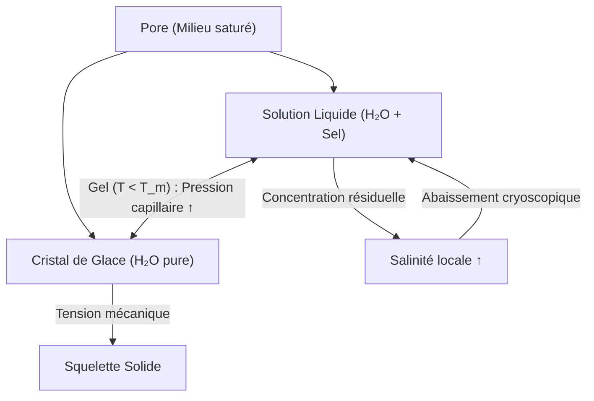
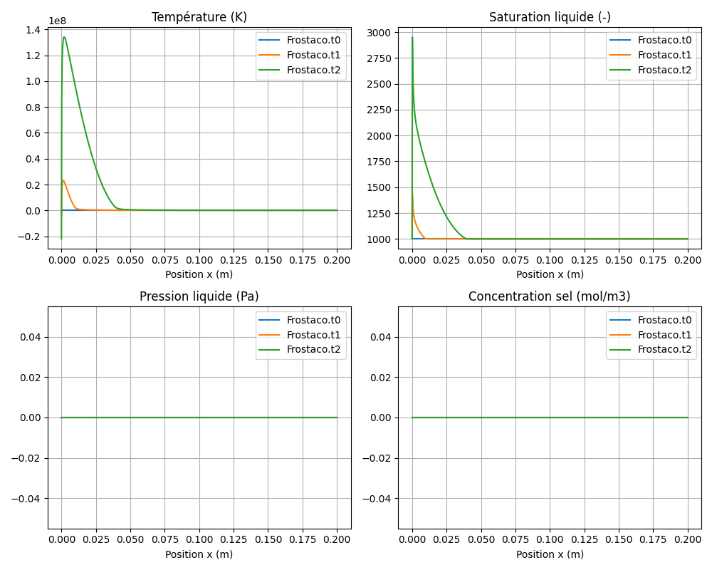

# Modèle Frostaco — Action du gel dans le béton

> **Fichiers sources :**
> `src/Models/ModelFiles/Frostaco.c` · `test_examples/Frostaco/Frostaco`
>
> **Auteurs du modèle :** Q. Zeng, T. Fen-Chong, P. Dangla (Université Gustave Eiffel)

---

## Table des matières

1. [Contexte et objectif](#1-contexte-et-objectif)
2. [Hypothèses](#2-hypothèses)
3. [Variables et notation](#3-variables-et-notation)
4. [Modèle mathématique](#4-modèle-mathématique)
   - 4.1 [Équations de conservation](#41-équations-de-conservation)
   - 4.2 [Lois de flux](#42-lois-de-flux)
   - 4.3 [Équilibre thermodynamique glace-liquide](#43-équilibre-thermodynamique-glace-liquide)
   - 4.4 [Couplage poromécanique](#44-couplage-poromécanique)
5. [Conditions aux limites et initiales](#5-conditions-aux-limites-et-initiales)
6. [Cas test : congélation unidimensionnelle (`test_examples/Frostaco/`)](#6-cas-test--congélation-unidimensionnelle)
7. [Discrétisation numérique](#7-discrétisation-numérique)
8. [Description pas-à-pas des fichiers](#8-description-pas-à-pas-des-fichiers)
   - 8.1 [Fichier de pilotage `test_examples/Frostaco/Frostaco`](#81-fichier-de-pilotage-test_examplesfrostacofrostaco)
   - 8.2 [Fichier modèle `src/Models/ModelFiles/Frostaco.c`](#82-fichier-modèle-srcmodelsmodelfilesfrostacoc)
9. [Références bibliographiques](#9-références-bibliographiques)

---

## 1. Contexte et objectif

Le modèle **Frostaco** (*Frost actions in concrete*) décrit les transferts **thermo-hydro-chimio-mécaniques** dans un milieu poreux cimentaire soumis au gel et au dégel. Il permet d'évaluer la pénétration du front de gel, la formation de glace dans l'espace poreux, et la pression générée par l'expansion volumique de l'eau se transformant en glace et par la cryo-succion. 

Le modèle incorpore également le transport d'un sel dissous (ex: NaCl ou CaCl₂) dont la présence modifie l'activité thermochimique de l'eau et abaisse la température de congélation. Il trouve des applications directes dans la durabilité des bétons soumis aux intempéries hivernales (sels de déverglaçage).

---

## 2. Hypothèses

1. **Trois phases en présence** : solide (matrice cimentaire/granulats), liquide (solution aqueuse salée) et glace (cristaux de glace purs). Le milieu est supposé saturé en eau et en glace ($S_l + S_i = 1$).
2. **Transfert de la phase liquide** : l'écoulement se fait par advection selon la loi de Darcy. La perméabilité est réduite par la présence de la glace. 
3. **Phase glace immobile** : la glace se forme in situ et ne s'écoule pas, sa déformation et sa pression modifient l'état de contrainte de la matrice solide.
4. **Transport de sel** : par advection avec l'eau liquide et diffusion (Fick) ralentie par la tortuosité du réseau poreux. La glace est formée d'eau pure (exclusion ionique), ce qui concentre la solution résiduelle.
5. **Thermodynamique** : équilibre local instantané entre l'eau liquide et la glace, régi par l'équation de Kelvin généralisée (avec l'activité de l'eau).
6. **Poromécanique** : la matrice se déforme sous l'effet des pressions de pores (liquide et glace) et des variations thermiques. Le modèle de Mori-Tanaka est utilisé pour évaluer les coefficients poroélastiques équivalents (modules massiques du squelette).

---

## 3. Variables et notation

### Inconnues primaires

Pour éviter les singularités de changement de phase (apparition/disparition de la glace), le modèle substitue les variables de pression $p_l$ et $p_i$ classiques par une pression maximale $p_{\max}$.

| Symbole | Signification | Unité |
|---------|---------------|-------|
| $p_{\max}$ | Pression de pore maximale : $\max(p_l, p_i)$ | Pa |
| $c_s$ | Concentration en sel dans la solution interstitielle | mol/m³ |
| $T$ | Température | K |

### Variables secondaires

| Symbole | Signification |
|---------|---------------|
| $p_l$ | Pression de la phase liquide |
| $p_i$ | Pression de la phase glace |
| $p_c$ | Pression capillaire glace-eau ($p_c = p_i - p_l$) |
| $S_l$ | Degré de saturation en eau liquide |
| $S_i$ | Degré de saturation en glace ($1 - S_l$) |
| $a_w$ | Activité de l'eau de la solution (dépend de $c_s$ et $T$) |

### Constantes physico-chimiques principales

| Symbole | Valeur typique | Signification |
|---------|----------------|---------------|
| $V_w$ | $18 \times 10^{-6}$ m³/mol | Volume molaire de l'eau liquide |
| $V_i$ | $19.63 \times 10^{-6}$ m³/mol | Volume molaire de la glace |
| $S_m$ | $23.54$ J/(mol·K) | Entropie molaire de fusion de la glace |
| $T_m$ | $273$ K | Température de fusion à la pression atmosphérique |
| $R$ | $8.314$ J/(mol·K) | Constante des gaz parfaits |
| $\alpha_i$ | $155 \times 10^{-6}$ K⁻¹ | Coefficient de dilatation thermique volumique (glace) |

---

## 4. Modèle mathématique

### 4.1 Équations de conservation

Le système se compose de trois équations de bilan intégrées sur le volume élémentaire représentatif (VER) :

**1. Conservation de la masse totale d'eau** (liquide + glace) :

$$\frac{\partial m_T}{\partial t} + \nabla \cdot \mathbf{W}_l = 0$$
avec 
$$m_T = \phi S_l \rho_l + \phi S_i \rho_i$$

**2. Bilan de masse du sel** :

$$\frac{\partial m_s}{\partial t} + \nabla \cdot \mathbf{W}_{\text{sels}} = 0$$
avec
$$m_s = \phi S_l M_s c_s$$

**3. Bilan d'entropie (Thermique)** :

$$\frac{\partial S_{\text{tot}}}{\partial t} + \nabla \cdot \left( \frac{\mathbf{q}}{T} + s_l \mathbf{W}_l \right) = 0$$

L'entropie totale comprend les composantes du squelette solide, de la matrice liquide et de la matrice glace : $S_{\text{tot}} = S_{\text{sol}} + m_l s_l + m_i s_i$.

### 4.2 Lois de flux

**Flux de Darcy pour la phase liquide** :

$$\mathbf{W}_l = - \frac{\rho_l k_{\text{int}} k_{rl}(p_c)}{\mu_l} \nabla p_l$$
La perméabilité relative $k_{rl}$ dépend de la pression capillaire et traduit le blocage par la matrice de glace (ex: modèle de Mualem).

**Flux de sel** (advection et diffusion de Fick) :

$$\mathbf{W}_{\text{sels}} = c_s M_s \left( \frac{\mathbf{W}_l}{\rho_l} \right) - \phi S_l \tau D_{\text{sel}} \nabla c_s$$
La tortuosité $\tau$ varie fortement avec le front de congélation.

**Flux de chaleur (Fourier)** :

$$\mathbf{q} = - \lambda_{\text{hom}} \nabla T$$
Où $\lambda_{\text{hom}}$ est une conductivité thermique macroscopique moyenne déduite de la matrice solide, de l'eau, et de la glace.

### 4.3 Équilibre thermodynamique glace-liquide

La relation thermodynamique fondamentale qui lie les pressions est donnée par l'égalité des potentiels chimiques $\mu_l = \mu_i$ :

$$V_w(p_l - p_{\text{atm}}) + R T \ln(a_w) = V_i(p_i - p_{\text{atm}}) + S_m(T - T_m)$$

L'activité de l'eau $a_w(T, c_s)$ inclut les effets du sel sur l'abaissement cryoscopique (modèle de Pitzer simplifié ou loi de Raoult-Lin, et dépend de la force ionique du CaCl₂ ou du NaCl). 

De cette relation, il est possible de déduire $p_c = p_i - p_l$ en fonction de la température et de la salinité, ce qui permet à son tour d'accéder aux saturations $S_l$ et $S_i$ via la courbe de rétention (modèle de Van Genuchten).

### 4.4 Couplage poromécanique

Une évaluation des contraintes mécaniques causées par l'expansion de la glace est effectuée post-résolution (dans la fonction de sortie), utilisant le schéma de **Mori-Tanaka** pour déduire les modules de compressibilité $K$ et le module de cisaillement $G$ équivalent. 
Les déformations volumiques se composent des contributions mécaniques de pression, et des dilatations thermiques d'origine hydrique et élastique.

---

## 5. Conditions aux limites et initiales

### Variables imposées (Dirichlet / Neumann)
Le modèle s'attend à recevoir des conditions sur les 3 variables clés :
1. Dépression thermique via une condition de Dirichlet ou un flux nul en bord.
2. Évolution de la salinité ou flux nul (imperméable).
3. Pression $p_{\max}$ gérant les arrivées d'eau (sèchage/réhumification ou étanchéité hydrique).

---

## 6. Cas test : congélation unidimensionnelle

Le dossier `test_examples/Frostaco/` contient un fichier d'entrée (`Frostaco`) représentatif du refroidissement d'une éprouvette ou d'un mur en béton selon les paramètres de matériau définis intrinsèquement.

### Paramètres de simulation

| Paramètre | Valeur |
|-----------|--------|
| Porosité $\phi$ | 0.20 |
| Perméabilité  $k_{\text{int}}$ | $5 \times 10^{-21}$ m² |
| Capacitée calorifique solide $C_s$ | $2 \times 10^6$ J/m³/K |
| Conductivité thermique solide $\lambda_s$ | 1.0 W/m/K |
| Compression de matrice $K_s$ | 31.8 GPa |
| Cisaillement de matrice $G_s$ | 19.1 GPa |
| Exemples géométriques | Domaine 1D de 20 cm, 100 mailles |
| Courbe de rétention | `Van-Genuchten` avec $p_0 = 0.7$ MPa, $m = 0.4$ |

### Physique attendue dans le cas test

La simulation pilote l'application progressive d'un protocole thermique et le suivi des champs $p_{\max}, T, c_s$ sur la géométrie 1D, reproduisant la propagation du front de gel et les déplacements des fluides causés par la "pompe" thermocinétique de la glace.

### Résultats et commentaires physiques du test

Une exécution typique du modèle `test_examples/Frostaco` illustrerait le comportement séquentiel suivant :

1. **Propagation du Gel** : Au refroidissement (de 283 K vers 253 K pour une face, par exemple), le modèle va prédire l'avancée du front de glace depuis le bord libre. En tout point atteignant des températures négatives adaptées, l'inconnue `p_max` dictera une apparition de `p_i` (pression de glace) dominante face à `p_l`.
2. **Cryo-succion** : La solidification de l'eau réduit la pression interstitielle liquide, créant un gradient très fort de succion attirant l'eau proche non gelée vers le front (pompage cryogénique).
3. **Surconcentration saline** : L’incorporation de l'eau dans le cristal de glace excluant le sel, le front dégage une surconcentration $c_s$ (effet de chasse visible sur les fichiers `.t1` et `.t2` de résultat) qui a pour vocation de stabiliser la transition en inhibant un gel ultérieur à cette même température.
4. **Impact Poro-thermique** : La densité de l'eau baissant lors de la glaciation (le volume gonflant de +9%), le bilan de masse entraîne la montée de tensions poroélastiques dans la matrice de sortie, provoquant des pressions macroscopiques évaluées via Mori-Tanaka à des mégapascals (Mpa) dommageables pour le béton.

---

## 7. Discrétisation numérique

La plateforme Bil s'appuie ici sur une discrétisation par la technique **Volumes Finis Centrés sur les Cellules** (`FVM.h`). Le modèle est totalement implicite pour la conservation de la masse, l'entropie, et la concentration de sel. 

Les dérivées pour l'assemblage de la matrice jacobienne (Newton-Raphson) sont calculées numériquement et analytiquement aux niveaux des termes flux, à travers le couplage des variables `(M_TOT, M_SALT, S_TOT, W_TOT, W_SALT, W_THE)`. 

---

## 8. Description pas-à-pas des fichiers

### 8.1 Fichier de pilotage `test_examples/Frostaco/Frostaco`

Ce fichier définit intégralement la simulation du cas test de façon déclarative. Voici sa structure détaillée pas-à-pas :

1. **Geometry / Mesh** : Initialise un problème de coordonnées géométriques via un maillage simple composé de 100 éléments le long d'un segment de 0.2 m.
2. **Material** : Indique le type de modèle à charger (`Model = Frostaco`) et définit tous les paramètres matériels (conductivités, porosité, modules mécaniques). On y trouve l'appel aux courbes `Curves_log = cement_log` intégrant les lois de Van-Genuchten et Mualem pour la thermodynamique liquide-glace.
3. **Fields** : Définit 8 champs de base (valeurs de référence) permettant d'associer des constantes fixes aux lois de conditions initiales ou aux limites (ex: 283 K pour la température ambiante via le champ 1, 1000 mol/m³ pour le sel via le champ 8).
4. **Initialization** : Spécifie les conditions microscopiques à $t=0$ dans le domaine (`Region = 2`). Les 3 inconnues primaires (`tem`, `c_s`, `p_max`) sont paramétrées à partir des champs pré-référencés.
5. **Functions** : Introduit des profils mathématiques de variation spatiale ou temporelle. La dimension thermique de gel de l'échantillon est pilotée par la fonction définissant une évolution passant de 273 K à 253 K en un intervalle de temps donné.
6. **Boundary Conditions** : Aligne les bords du modèle (ex: `Region = 1`) sur l'évolution prévue de la température et l'imperméabilité au transport par les autres variables (conditions de Neumann et Dirichlet).
7. **Dates & Time Steps** : Configure le moteur de pas de temps adaptatif propre à Bil. La ligne `Dtini` dicte le pas d'initialisation (très faible), et `Dates` gère aux quels marqueurs temporels les résultats doivent être écrits sur disque.
8. **Objective Variations** : Sert de tolérance maximale entre deux étapes itératives. Le solveur recalibrera les calculs si par exemple, la variation de thermie `tem` excède un pas de marge défini.

### 8.2 Fichier modèle `src/Models/ModelFiles/Frostaco.c`

Le fichier source C embarque toute la physique couplée de la loi Frostaco en s'interfaçant avec le noyau analytique *Bil*. Voici ses grands blocs de traitement fonctionnels (étapes de calcul) :

1. **Initialisation et Constantes** :
   - Définition des 3 équations primaires (`mass`, `salt`, `the`) associées aux inconnues clés (`p_max`, `c_s`, `tem`).
   - La fonction `ComputePhysicoChemicalProperties()` pré-calcule les grandeurs absolues de l'eau (densité, viscosité), l'activité molaire des sels et l'entropie de fusion du cristal de glace sur ce contexte physique.

2. **Évaluation aux Noeuds (`ComputeVariables` et `ComputeSecondaryVariables`)** :
   - La structure logique est conçue pour dédoubler `p_max` en pression limite liquide `p_l` et glace `p_i`. La méthode vérifie numériquement la possibilité thermodynamique via la loi généralisée de Kelvin, évitant ainsi d'imposer physiquement des degrés de glace dans un milieu modérément chaud.
   - Des paramètres locaux comme `rho_i`, `rho_salt`, module d'entropie `s_tot`, la viscosité de la solution, et le degré de saturation microscopique (`sd_l` via la courbe rétentionnelle) en découlent purement en variables d'états secondaires.

3. **Flux Échanges (`ComputeTransferCoefficients` et flux associés)** :
   - Construit les mobilités hydrodynamiques et tortuosités des conductances permettant d'advecter l'eau liquide (perte de rendement de Darcy par glace obstrusive).
   - Génère les flux nodaux exacts (`w_l` pour le liquide, `w_salt` pour le flux transporté cumulé à l'advection, et `w_the` la chaleur emportée).

4. **Jacobien et Bilan Numérique (`ComputeResidu` et `TangentCoefficients`)** :
   - Le vecteur de `Residu` calcule l'erreur numérique pour contraindre les 3 principes de conservation. Le bilan est construit via la fonction noyau `FVM_ComputeMassAndFluxResidu(..)`.
   - `TangentCoefficients` assemble numériquement (par différence finie ciblée et perturbations $10^{-4}$ des vecteurs d'état) l'entièreté de la jacobienne de sensibilité afin de nourrir la résolution Newton-Raphson.

5. **Déformations Post-Calcul (`ComputeOutputs`)** :
   - Les propriétés hydro-thermiques résiduelles et l'expansion interstitielle causée par la phase "Glace" modélisent des déformations effectives au sein de la matrice cimentaire. Ce poste reconstruit le modèle poroélastique contraint d'intégration locale selon le schéma de Mori-Tanaka, renvoyant l'incrément de fissuration estimée sur l'output physique final.

---

## 9. Références bibliographiques

- **Coussy, O.** (2005). Poromechanics of freezing materials. *Journal of the Mechanics and Physics of Solids*, 53(8), 1689–1718. — Cadre thermodynamique poromécanique rigoureux pour le gel/dégel de milieux poreux et l'usage de la relation de Kelvin sur la glace.
- **Zeng, Q., Fen-Chong, T. & Dangla, P.** (2012). Water freezing in cement paste: observation and calculation. *Advances in civil engineering materials*, 1(1), 1–16.
- **Zeng, Q., Fen-Chong, T. & Dangla, P.** (2014). Poromechanics model of freezing/thawing phenomena in porous geomaterials: application to concrete. *International Journal for Numerical and Analytical Methods in Geomechanics*. — Base principale du formalisme du présent modèle `Frostaco`.
- **Mori, T., & Tanaka, K.** (1973). Average stress in matrix and average elastic energy of materials with misfitting inclusions. *Acta metallurgica*, 21(5), 571–574. — Hypothèses d’homogénéisation pour déterminer le tenseur d'élasticité avec des cristaux de glace inclus dans les pores.
- **Lin, S. T., & Lee, H.** (1993). Hydration-based thermodynamic model for phase equilibria in aqueous solutions. *AIChE Journal*, 39(6), 1064–1075. — Modélisation de l'activité du sel utilisée et codée dans la fonction d'équilibre d'activité d'eau ($Ca^{2+}$, $Na^+$).
