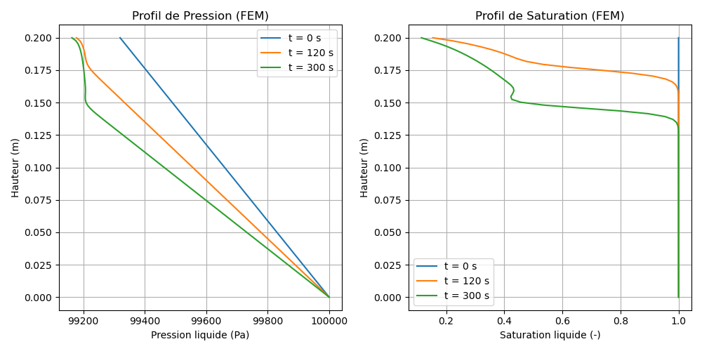

# Modèle M10 — Équation de Richards : drainage d'une colonne de billes sous gravité (1D)

> **Fichiers sources :**
> `src/Models/ModelFiles/M10.c` · `test_examples/m10-1/m10-1` · `test_examples/m10-1/billes`
>
> **Auteur du modèle Bil :** P. Dangla (Université Gustave Eiffel)

---

## Table des matières

1. [Contexte et objectif](#1-contexte-et-objectif)
2. [Hypothèses](#2-hypothèses)
3. [Variables et notation](#3-variables-et-notation)
4. [Modèle mathématique](#4-modèle-mathématique)
   - 4.1 [Équation de conservation](#41-équation-de-conservation)
   - 4.2 [Loi de flux de Darcy](#42-loi-de-flux-de-darcy)
   - 4.3 [Courbe de rétention et perméabilité relative](#43-courbe-de-rétention-et-perméabilité-relative)
   - 4.4 [Forme condensée — équation de Richards](#44-forme-condensée--équation-de-richards)
5. [Conditions aux limites et initiales](#5-conditions-aux-limites-et-initiales)
6. [Cas test : colonne de billes sous drainage gravitaire (`test_examples/m10-1`)](#6-cas-test--colonne-de-billes-sous-drainage-gravitaire)
7. [Résultats](#7-résultats)
8. [Discrétisation numérique](#8-discrétisation-numérique)
9. [Références bibliographiques](#9-références-bibliographiques)

---

## 1. Contexte et objectif

Le modèle M10 résout l'**équation de Richards** pour l'écoulement monophasique de l'eau liquide dans un milieu poreux partiellement saturé. La pression de la phase gazeuse est supposée uniforme et constante ; seule la **pression liquide** $p_l$ est une inconnue du problème.

Le cas test `test_examples/m10-1` simule le **drainage gravitaire d'une colonne verticale de billes de verre**. C'est un cas classique de validation de l'implémentation de l'équation de Richards : le milieu (billes de verre) possède une courbe de rétention bien caractérisée avec une pression d'entrée d'air basse (~500 Pa) et une désaturation rapide au-delà de ce seuil. Ce type d'expérience est utilisé pour étalonner les codes de transfert en milieu poreux non saturé.

Le domaine est une colonne unidimensionnelle verticale de longueur $L = 0.2$ m, composée d'un seul matériau homogène :

| Paramètre | Valeur |
|-----------|--------|
| Porosité $\phi$ | 0.38 |
| Perméabilité intrinsèque $k_\text{int}$ | $8.9 \times 10^{-12}$ m² |

---

## 2. Hypothèses

1. **Monophasique liquide** : seule la phase liquide (eau) est mobile. La phase gazeuse est supposée à pression constante $p_g = 10^5$ Pa (connexion à l'atmosphère).
2. **Isotherme** : la température est uniforme et constante ; viscosité et masse volumique sont des constantes.
3. **Porosité rigide** : le squelette solide est indéformable ; $\phi = \text{const}$.
4. **Loi de Darcy généralisée** avec gravité pour le transport de la phase liquide.
5. **Équilibre capillaire local** : la saturation $s_l$ est une fonction univoque de la pression capillaire $p_c = p_g - p_l$.
6. **Gravité** : $g = -9.81$ m/s² orientée dans la direction décroissante de $x$ (axe $x$ vertical vers le haut).

---

## 3. Variables et notation

### Inconnue primaire

| Symbole | Signification | Unité |
|---------|---------------|-------|
| $p_l$ | Pression de la phase liquide | Pa |

La pression capillaire en découle directement :

$$p_c = p_g - p_l$$

### Variables secondaires

| Symbole | Signification |
|---------|---------------|
| $s_l(p_c)$ | Degré de saturation en eau liquide |
| $k_{rl}(p_c)$ | Perméabilité relative à l'eau |
| $K_l$ | Conductivité hydraulique effective |
| $m_l$ | Teneur en eau massique |
| $W_l$ | Flux massique de liquide |

### Constantes physico-chimiques

| Symbole | Valeur | Signification |
|---------|--------|---------------|
| $T$ | — | Température (isotherme) |
| $\rho_l$ | 1000 kg/m³ | Masse volumique de l'eau liquide |
| $\mu_l$ | $10^{-3}$ Pa·s | Viscosité dynamique de l'eau |
| $k_\text{int}$ | $8.9 \times 10^{-12}$ m² | Perméabilité intrinsèque |
| $\phi$ | 0.38 | Porosité |
| $p_g$ | $10^5$ Pa | Pression gazeuse (constante, atmosphérique) |
| $g$ | $-9.81$ m/s² | Accélération de la pesanteur |

---

## 4. Modèle mathématique

### 4.1 Équation de conservation

Le système est composé d'une **unique équation de bilan de masse pour l'eau liquide**, intégrée sur le volume élémentaire représentatif (VER) :

$$\frac{\partial m_l}{\partial t} + \nabla \cdot \mathbf{W}_l = 0$$

avec la teneur en eau massique :

$$m_l = \rho_l\,\phi\,s_l(p_c)$$

### 4.2 Loi de flux de Darcy

Le flux massique de liquide $\mathbf{W}_l$ est donné par la loi de Darcy généralisée avec gravité :

$$\mathbf{W}_l = -K_l\,\left(\nabla p_l - \rho_l\,\mathbf{g}\right)$$

où la conductivité hydraulique effective est :

$$K_l = \frac{\rho_l\,k_\text{int}\,k_{rl}(p_c)}{\mu_l}$$

En 1D avec $g$ selon l'axe $x$ (positif vers le haut), cela donne :

$$W_l = -K_l\,\left(\frac{\partial p_l}{\partial x} - \rho_l\,g\right) = -K_l\,\left(\frac{\partial p_l}{\partial x} + \rho_l\,|g|\right)$$

> **Équilibre hydrostatique :** à l'équilibre ($W_l = 0$) : $\partial p_l/\partial x = -\rho_l\,|g| \approx -9810$ Pa/m. La pression décroît linéairement avec la hauteur.

### 4.3 Courbe de rétention et perméabilité relative

Les fonctions $s_l(p_c)$ et $k_{rl}(p_c)$ sont fournies sous forme **tabulée** dans le fichier `billes`. Ce fichier contient 2000 points couvrant la plage $p_c \in [500,\ 1000]$ Pa, avec les colonnes :

```
p_c [Pa]    s_l [-]    k_rl [-]
```

Les caractéristiques clés des billes de verre sont :

| Grandeur | Valeur | Description |
|----------|--------|-------------|
| $p_{c,\text{entrée}}$ | ≈ 500 Pa | Pression d'entrée d'air (air-entry pressure) |
| $s_{l,\text{max}}$ | 1.0 | Saturation maximale ($p_c < 500$ Pa) |
| $s_{l,\text{résiduel}}$ | ≈ 0.09 | Saturation résiduelle ($p_c = 1000$ Pa) |
| $k_{rl}(s_l = 1)$ | 1.0 | Perméabilité relative saturée |
| $k_{rl}(s_l = 0.09)$ | ≈ $2.6 \times 10^{-8}$ | Perméabilité relative résiduelle |

La courbe est **très raide** (désaturation quasi-totale sur un intervalle de 500 Pa), caractéristique d'un milieu à pores de taille homogène.

### 4.4 Forme condensée — équation de Richards

En substituant les expressions précédentes et en utilisant $\partial m_l/\partial t = -\rho_l\,\phi\,(\partial s_l/\partial p_c)\,(\partial p_l/\partial t)$, on obtient la forme standard de l'**équation de Richards** :

$$\boxed{-\rho_l\,\phi\,\frac{\partial s_l}{\partial p_c}\,\frac{\partial p_l}{\partial t} - \nabla \cdot \left[\frac{\rho_l\,k_\text{int}\,k_{rl}(p_c)}{\mu_l}\left(\nabla p_l - \rho_l\,\mathbf{g}\right)\right] = 0}$$

Le coefficient $C(p_c) = -\rho_l\,\phi\,\partial s_l/\partial p_c \geq 0$ est la **capacité capillaire** ; il intervient dans la matrice de masse du problème discret.

---

## 5. Conditions aux limites et initiales

### Conditions initiales

La pression initiale est donnée par un champ linéaire (sous-hydrostatique, colonne initialement près de la saturation complète) :

$$p_l(x,\,t=0) = p_{l0} + G\,x, \qquad p_{l0} = 10^5 \text{ Pa},\quad G = -3400 \text{ Pa/m}$$

| Bord | $x$ [m] | $p_l(t=0)$ [Pa] | $p_c(t=0)$ [Pa] | $s_l(t=0)$ [-] |
|------|---------|-----------------|-----------------|----------------|
| Bas | 0 | $10^5$ | 0 | 1.000 |
| Haut | 0.2 | $9.932 \times 10^4$ | 680 | ≈ 0.9998 |

La pression capillaire initiale est partout inférieure à la valeur critique ($\approx 680$ Pa au sommet), et la saturation est quasi-totale ($s_l \approx 1$) dans toute la colonne.

> **Remarque :** le gradient initial $G = -3400$ Pa/m est **inférieur en valeur absolue** au gradient hydrostatique $-9810$ Pa/m. La colonne n'est pas en équilibre ; le flux initial est non nul et orienté vers le bas.

### Conditions aux limites

| Bord | $x$ [m] | Type | Valeur |
|------|---------|------|--------|
| Bas | 0 | Dirichlet | $p_l = 10^5$ Pa (pression atmosphérique, fond saturé) |
| Haut | 0.2 | Neumann naturel | $\mathbf{W}_l \cdot \mathbf{n} = 0$ (drainage libre, pas de flux imposé) |

Le bord bas est maintenu à la pression atmosphérique (fond immergé ou drainage à pression contrôlée). Le bord haut est libre : c'est la condition de Neumann naturelle du problème variationnel, qui correspond physiquement à un sommet ouvert sans flux entrant (l'eau peut s'évacuer par gravité vers le bas uniquement).

---

## 6. Cas test : colonne de billes sous drainage gravitaire

### Paramètres de simulation

| Paramètre | Valeur |
|-----------|--------|
| Longueur de la colonne $L$ | 0.2 m |
| Nombre d'éléments | 100 (maillage non uniforme, raffiné en $x=0$) |
| Durée totale | 300 s |
| Instants de sortie | $t = 0$ s, $t = 120$ s, $t = 300$ s |
| Pas de temps initial $\Delta t_\text{ini}$ | 0.01 s |
| Pas de temps maximal $\Delta t_\text{max}$ | 1000 s |
| Variation objective (OBJE) | $\Delta p_l = 10$ Pa |
| Tolérance Newton | $10^{-10}$ |
| Nombre d'itérations max | 10 |

### Physique attendue

L'état initial (gradient sous-hydrostatique) crée un **déséquilibre** : la force gravitaire domine le gradient de pression, et l'eau s'écoule vers le bas. Le système évolue vers l'**équilibre hydrostatique** ($\nabla p_l = \rho_l\,\mathbf{g}$, soit $-9810$ Pa/m), qui implique une désaturation significative en haut de la colonne.

La séquence physique est :

1. **Drainage immédiat** : dès $t=0$, un flux vers le bas s'établit ($W_l \approx -5.7 \times 10^{-2}$ kg/(m²·s) à la base).
2. **Front de désaturation** : la pression capillaire en sommet augmente au-delà de la pression d'entrée ($p_c > 500$ Pa) ; la saturation chute rapidement de 1 à une valeur résiduelle (~0.09).
3. **Progression du front** : le front de désaturation descend de $x = 0.2$ m vers $x = 0$, à mesure que la pression se redistribue.
4. **Réduction du flux** : la perméabilité relative $k_{rl}$ décroît fortement dans la zone désaturée, ralentissant le drainage.



---

## 7. Résultats

Les trois instants de sortie illustrent les différentes étapes du drainage.

### État initial ($t = 0$ s)

| $x$ [m] | $p_l$ [Pa] | $W_l$ [kg/(m²·s)] | $s_l$ [-] |
|---------|-----------|-------------------|-----------|
| 0 | $1.000 \times 10^5$ | $-5.705 \times 10^{-2}$ | 1.000 |
| 0.1 | $\approx 9.966 \times 10^4$ | $-5.704 \times 10^{-2}$ | 1.000 |
| 0.2 | $9.932 \times 10^4$ | $-5.702 \times 10^{-2}$ | 0.9998 |

Le flux est **quasi-uniforme** dans toute la colonne : la saturation est totale et la conductivité hydraulique est maximale. Le flux s'exprime analytiquement comme :

$$W_l \approx -K_l\,(G + \rho_l\,|g|) = -\frac{\rho_l\,k_\text{int}}{\mu_l}\,(-3400 + 9810) = -8.9 \times 10^{-6} \times 6410 \approx -5.7 \times 10^{-2} \text{ kg/(m²·s)}$$

### État à $t = 120$ s

| $x$ [m] | $p_l$ [Pa] | $W_l$ [kg/(m²·s)] | $s_l$ [-] |
|---------|-----------|-------------------|-----------|
| 0 | $1.000 \times 10^5$ | $-4.782 \times 10^{-2}$ | 1.000 |
| 0.19 | $\approx 9.919 \times 10^4$ | $-2.86 \times 10^{-4}$ | 0.220 |
| 0.2 | $9.918 \times 10^4$ | $-2.86 \times 10^{-4}$ | 0.154 |

Le **front de désaturation** a atteint $x \approx 0.15$–$0.19$ m. Le flux est fortement réduit dans la zone désaturée (rapport ~200 entre flux en bas et en haut de colonne).

### État à $t = 300$ s

| $x$ [m] | $p_l$ [Pa] | $W_l$ [kg/(m²·s)] | $s_l$ [-] |
|---------|-----------|-------------------|-----------|
| 0 | $1.000 \times 10^5$ | $-3.955 \times 10^{-2}$ | 1.000 |
| 0.19 | $\approx 9.918 \times 10^4$ | $-5.48 \times 10^{-5}$ | 0.147 |
| 0.2 | $9.916 \times 10^4$ | $-5.48 \times 10^{-5}$ | 0.115 |

Le front continue de progresser vers le bas. Le sommet de la colonne est fortement désaturé ($s_l \approx 0.11$–0.15) avec un flux quasi-nul. Le profil de pression tend vers l'équilibre hydrostatique ($dp_l/dx \to -9810$ Pa/m).

---

## 8. Discrétisation numérique

Le modèle est discrétisé par la méthode des **éléments finis (FEM)** telle qu'implémentée dans Bil via `FEM.h`. La matrice du système linéarisé est composée de :

- une **matrice de masse** (termes d'accumulation), de coefficient $C(p_c) = -\rho_l\,\phi\,\partial s_l/\partial p_c$ évalué au pas de temps courant ;
- une **matrice de conduction** (termes de flux), de tenseur $K_l\,\mathbf{I}$ évalué explicitement au pas de temps précédent (schéma semi-implicite).

Le système non-linéaire est résolu à chaque pas de temps par la **méthode de Newton–Raphson**.

Le pas de temps est adaptatif, contrôlé par la variation maximale de l'inconnue $p_l$ (paramètre **OBJE** = 10 Pa dans Bil). La capacité capillaire $C(p_c)$ peut être nulle dans la zone saturée ($\partial s_l/\partial p_c = 0$ pour $p_c < p_{c,\text{entrée}}$) : dans ce régime, l'équation est de type **elliptique** (état stationnaire local), ce qui peut provoquer des oscillations numériques si $\Delta t$ est trop grand ou si le maillage est trop grossier.

> **Remarque sur la régularisation :** contrairement à M5, M10 n'implémente pas de régularisation explicite de la saturation en $p_c = 0$. Le fichier `billes` fournit directement $s_l = 1$ pour $p_c \leq 500$ Pa (extension constante), ce qui suffit à éviter la dégénérescence dans ce cas.

---

## 9. Références bibliographiques

### Équation de Richards et écoulement en milieu non saturé

- **Richards, L. A.** (1931). Capillary conduction of liquids through porous mediums. *Physics*, 1(5), 318–333. — Article fondateur de l'équation portant son nom, décrivant l'écoulement capillaire dans les sols.

- **Bear, J.** (1972). *Dynamics of Fluids in Porous Media*. Elsevier, New York. — Traitement rigoureux des équations de Darcy et Richards en milieu poreux.

- **Coussy, O.** (2004). *Poromechanics*. John Wiley & Sons, Chichester. — Cadre thermodynamique pour les milieux poreux multiphasiques, définition des pressions capillaires.

### Courbes de rétention capillaire

- **Van Genuchten, M. Th.** (1980). A closed-form equation for predicting the hydraulic conductivity of unsaturated soils. *Soil Science Society of America Journal*, 44(5), 892–898. — Modèle analytique couramment utilisé pour $s_l(p_c)$ ; le cas billes utilise une courbe tabulée de forme similaire.

- **Brooks, R. H. & Corey, A. T.** (1964). *Hydraulic Properties of Porous Media*. Hydrology Paper 3, Colorado State University. — Modèle alternatif (Brooks–Corey) pour les milieux à courbe de désaturation abrupte, pertinent pour les billes de verre.

### Propriétés hydrauliques des billes de verre

- **Touma, J. & Vauclin, M.** (1986). Experimental and numerical analysis of two-phase infiltration in a partially saturated soil. *Transport in Porous Media*, 1(1), 27–55. — Référence expérimentale sur les transferts diphasiques dans des colonnes de billes de verre.

- **Lenhard, R. J., Parker, J. C. & Mishra, S.** (1989). On the correspondence between Brooks–Corey and Van Genuchten models. *Journal of Irrigation and Drainage Engineering*, 115(4), 744–751. — Correspondance entre les modèles de courbes de rétention pour les milieux granulaires.

### Méthodes numériques pour l'équation de Richards

- **Celia, M. A., Bouloutas, E. T. & Zarba, R. L.** (1990). A general mass-conservative numerical solution for the unsaturated flow equation. *Water Resources Research*, 26(7), 1483–1496. — Formulation en $p_l$ (pressure-head form) permettant la conservation exacte de la masse ; base de la discrétisation utilisée dans Bil.

- **Haverkamp, R. & Vauclin, M.** (1979). A note on estimating finite difference interblock hydraulic conductivity values for transient unsaturated flow problems. *Water Resources Research*, 15(1), 181–187. — Stratégies d'évaluation des conductivités aux interfaces d'éléments dans un schéma FEM/FVM.

### Implémentation numérique

- **Dangla, P.** — *Bil : a FEM/FVM platform for multiphysics simulations*. Université Gustave Eiffel. Code source : <https://github.com/Universite-Gustave-Eiffel/bil>
