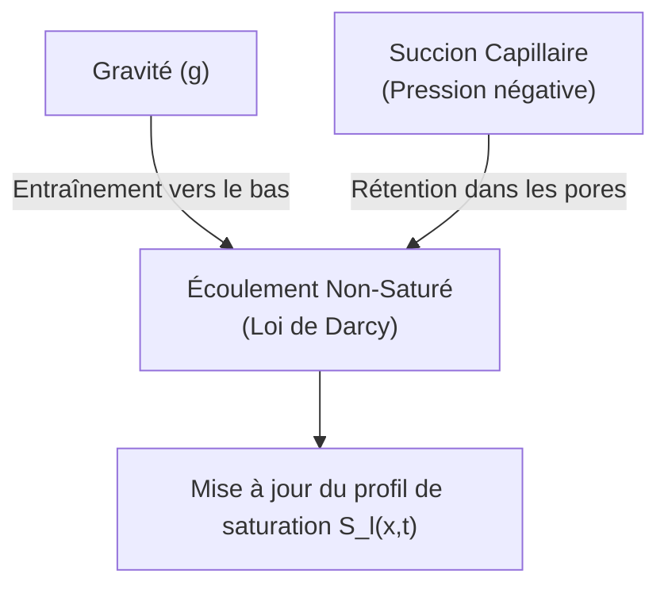
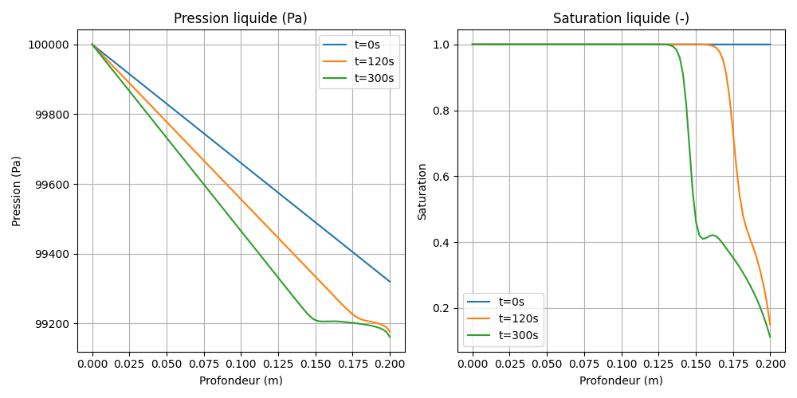

# Modèle M1 — Équation de Richards (Écoulement liquide 1D)

> **Fichiers sources :**
> `src/Models/ModelFiles/M1.c` · `test_examples/M1/M1`
>
> **Auteurs du modèle :** P. Dangla (Université Gustave Eiffel)

---

## Table des matières

1. [Contexte et objectif](#1-contexte-et-objectif)
2. [Hypothèses](#2-hypothèses)
3. [Variables et notation](#3-variables-et-notation)
4. [Modèle mathématique](#4-modèle-mathématique)
   - 4.1 [Équation de conservation](#41-équation-de-conservation)
   - 4.2 [Loi de flux (Darcy généralisée)](#42-loi-de-flux-darcy-généralisée)
5. [Conditions aux limites et initiales](#5-conditions-aux-limites-et-initiales)
6. [Cas test : drainage d'une colonne de billes (`test_examples/M1`)](#6-cas-test--drainage-dune-colonne-de-billes)
7. [Discrétisation numérique](#7-discrétisation-numérique)
8. [Description pas-à-pas des fichiers](#8-description-pas-à-pas-des-fichiers)
   - 8.1 [Fichier de pilotage `test_examples/M1/M1`](#81-fichier-de-pilotage-test_examplesm1m1)
   - 8.2 [Fichier modèle `src/Models/ModelFiles/M1.c`](#82-fichier-modèle-srcmodelsmodelfilesm1c)
9. [Références bibliographiques](#9-références-bibliographiques)

---

## 1. Contexte et objectif

Le modèle **M1** résout l'équation classique de **Richards** unidimensionnelle. Cette équation différentielle partielle non-linéaire représente le mouvement de l'eau dans un milieu poreux non saturé, sous l'action de la gravité et des forces capillaires, en supposant que la phase gazeuse (l'air) est à pression atmosphérique constante.

Ce modèle est extrêmement utilisé en hydrologie, hydrogéologie et génie civil pour prédire l'infiltration de la pluie dans les sols, le drainage ou la remontée capillaire.

---

## 2. Hypothèses

1. **Monophasique "actif"** : L'écoulement de l'air est négligé ; on assume que l'air interstitiel est à la pression interne constante $p_g$ = 1 atm. La modélisation est centrée exclusivement sur le transfert de la phase liquide.
2. **Matrice solide rigide** : La déformation du sol ou des matériaux est ignorée. La porosité $\phi$ est constante.
3. **Isotherme** : La température est uniforme, affectant de manière constante la viscosité de l'eau et sa masse volumique.
4. **Validité de la loi de Darcy** : S'applique pour la vitesse de phase de l'eau filtrant dans la matrice, étendue au non-saturé par une perméabilité relative $k_{rl}$ liée au degré de saturation liquide.

---

## 3. Variables et notation

Le modèle supporte 1 équation scalaire dont l'inconnue est la distribution spatiale de la tension hydrique ou pression liquide.

### Inconnue primaire

| Symbole | Signification | Unité |
|---------|---------------|-------|
| $p_l$   | Pression interstitielle de phase liquide | Pa |

### Variables de comportement et constantes

| Symbole | Signification |
|---------|---------------|
| $p_c$ | Pression capillaire constante ($p_g - p_l$) |
| $S_l$ | Saturation liquide (issue de $p_c$) |
| $k_{rl}$| Perméabilité relative liquide (dépend de $p_c$) |
| $m_l$ | Masse locale en eau stockée : $\phi S_l \rho_l$ |

---

## 4. Modèle mathématique

### 4.1 Équation de conservation

La variation de la masse d'eau locale est égale à la divergence des flux massiques (conservation de la masse d'eau liquide sans terme de source/puits) :

$$\frac{\partial m_l}{\partial t} + \nabla \cdot \mathbf{W}_l = 0$$

soit :
$$\rho_l \phi \frac{\partial S_l(p_c)}{\partial t} + \nabla \cdot \mathbf{W}_l = 0$$

### 4.2 Loi de flux (Darcy généralisée)

L'eau s'écoule de son potentiel de charge hydrostatique supérieur vers le plus faible.

$$\mathbf{W}_l = - \frac{\rho_l k_{\text{int}} k_{rl}(p_c)}{\mu_l} \nabla p_l + \frac{\rho_l^2 k_{\text{int}} k_{rl}(p_c)}{\mu_l} \mathbf{g}$$

Ici, $\mathbf{g}$ est le vecteur de gravité terrestre et $\mu_l$ la viscosité dynamique. La non-linéarité provient du couplage fort existant : le mouvement dépend de $k_{rl}$, qui s'effondre lorsque le milieu se draine et se désature (baisse de $S_l$).

---

## 5. Conditions aux limites et initiales

La condition initiale requiert de mapper le milieu complet par un champ de pression $p_l$. S'agissant souvent d'une colonne d'eau libre imposant une charge hydrostatique, ce champ peut être graduel ("affine").
Les conditions limites standards fixent soit la pérennité aux parois imperméables (Flux nul = gradient bloqué), soit une pression externe constante gérée par une "Condition de Dirichlet".

---

## 6. Cas test : drainage d'une colonne de billes

Le dossier `test_examples/M1/` contient l'exécution de référence, modélisant le drainage par gravité d'une colonne de billes de porosité importante (38 %), représentant un milieu pulvérulent très perméable (ex: graviers, billes de verre).

### Paramètres de simulation

| Paramètre | Valeur |
|-----------|--------|
| Géométrie / Maillage | Plan 1D (`1 plan`). Longueur = 20 cm, 100 mailles |
| $\phi$ (Porosité) | 0.38 |
| Perméabilité  $k_{\text{int}}$ | $8.9 \times 10^{-12}$ m² (milieu très perméable) |
| Gravité $g$ | -9.81 m/s² |
| Pression Gaz $p_g$ | $10^5$ Pa |

La courbe d'interaction macroscopique est chargée via le terme `Curves = billes`, injectant les coefficients empiriques de conductivité liés à cette granulométrie de billes.

### Résultats et commentaires physiques du test

Si l'on analyse l'historique d'évolution du solveur (les fichiers de coupe `.t0, .t1, .t2` évalués à $t=0, 120s, 300s$), le modèle reproduit fidèlement la phénoménologie du drainage hydrogravitaire :

1. **L'État Initial ($t=0$)** : Le champ est initié par type `affine` dégressif, simulant l'étagement de la pression dans l'axe de la colonne de la base vers le haut.
2. **Phase Transitoire de Vidage** : Sans contrainte qui vienne retenir l'immense majorité de la masse liquide face à la forte perméabilité $k \sim 10^{-12}$, l'eau percole à vitesse modérée vers le fond. En conséquence de la gravité vers les x-négatifs, la saturation de la colonne dans sa cime s'effondre drastiquement ($S_l \to S_{residuel}$).
3. **Seuil Capillaire Final** : Lorsque le drainage stoppe, un équilibre entre le poids de la colonne d'eau raréfiée et la force de succion / tension capillaire résiste à un effritement total de la masse liquide. Le sommet de la colonne maintient un degré statique constant (eau pendulaire).

*(Le graphique ci-dessus présente l'évolution spatio-temporelle : on observe l'assèchement progressif de la partie haute de la colonne, la saturation résiduant s'établissant par équilibre hydrostatique à l'état final $t=300s$).*

---

## 7. Discrétisation numérique

La discrétisation se repose sur une approche spatiale robuste via la méthode des **Volumes Finis Centrés** (`FVM.h`). Le modèle évalue le flux échangé non plus individuellement au noeud, mais par la section d'arête inter-volume, et l'associe à un pas de temps (Euler Implicite). 

Un mécanisme de **décentrement amont (upwind)** peut être activé via la constante logicielle `schema`, ce qui améliore drastiquement la stabilité en contexte très advectif, en forçant l'évaluation de la mobilité $k_{rl}(S_l)$ selon le volume "donneur" du fluide, et non une simple moyenne des deux pressions (`M1.c` - Ligne 223).

---

## 8. Description pas-à-pas des fichiers

### 8.1 Fichier de pilotage `test_examples/M1/M1`

1. **Geometry & Mesh** : Ouvre un vecteur `1 plan` simple, suivi de son maillage à géométrie découpant le bloc de 20 centimètres d'épaisseur en 100 tranches (`100 1`).
2. **Material** : Pointe vers le module mathématique compilé `Model = M1`. L'explicitation des constantes requises pour l'équation de Richards s'effectue ici (porosité `phi`, densité `rho_l`, gravité pure). 
3. **Fields & Initialization** : Fournit une fonction spatiale (`Type = affine`) avec pour valeur à l'origine locale `1.e5` et un gradient `-3400`. Ceci recrée la loi hydrostatique : $P_l(z) = 1.e5 - 3400 \times z$, pré-réglant harmonieusement et empiriquement le profil d'étages de vide.
4. **Boundary Conditions** : La `Reg = 1` fixe une limite imperméable ou à pression statique au sommet ou au bas de la colonne en figeant l'équation au travers de la constante nodale.
5. **Objective Variations** : L'indication booléenne `p_l = 10` dicte au gestionnaire adaptatif de pas de temps de l'exécutable BIL que la pression locale d'hydratation ne doit pas sauter de plus de $10$ Pa entre deux séquences transitoires, assurant qu'un drainage subit ne brise pas par à-coups la méthode Newtonienne.

### 8.2 Fichier modèle `src/Models/ModelFiles/M1.c`

1. **Architecture Globale (Lignes 14-45)** : 
   - Modèle simplissime à 1 équation `E_liq` pour 1 inconnue `I_p_l`. Les registres `M_l()`, `W_l()` stockent l'information masse/flux nodale.
2. **`ComputeInitialState` (Ligne 151)** :
   - Extrait les paramètres de la colonne (`gravite`, `rho_l`). Établit instantanément pour les points d'intégration le volume de fluide contenu via l'appel de surface à la courbe `SATURATION()`.
   - Charge le flux vecteur matriciel d'écoulement sous la double impulsion gravitaire et le gradient de la pression de gradient hydraulique existant sur la maille zéro et une.
3. **Loi Explicite Transitoire (`ComputeExplicitTerms` - Ligne 200)** :
   - Si `schema = 1` se révèle défini, le code injecte un traitement "upwind" pour capter la pression de transfert (d'un inter-noeud au noeud aval de Darcy). La perméabilité active `K_l` est rafraîchie en fonction.
4. **La Jacobienne de Diffusion (`TangentCoefficients` - Ligne 471)** :
   - Re-évalue la différentielle du terme de stockage (matrice de masse proportionnelle à $\partial S_l / \partial p_c$) et le module de l'opérateur de divergence flux. Cette matrice `c[i*nn + j]` va conditionner localement comment un incrément d'eau change l'inconnue spatiale `p_l` à proximité.
5. **Bilan Analytique (`ComputeResidu` - Ligne 333)** : 
   - L'étape de contrôle : injecte dans le résidu $R$, l'écart analytique exact entre la perte de volume de liquide `M_ln - M_l` face à l'advection nette `dt*surf*W_l`, ce qui valide au noeud que la conservation stricte d'eau a été observée pendant la chute.

---

## 9. Références bibliographiques

- **Richards, L. A.** (1931). Capillary conduction of liquids through porous mediums. *Journal of Applied Physics*, 1(5), 318–333. — L'article de base dérivant l'équation transitoire non saturée des sols.
- **Van Genuchten, M. Th.** (1980). A closed-form equation for predicting the hydraulic conductivity of unsaturated soils. *Soil Science Society of America Journal*. — Base universelle pour la liaison de la saturation avec la pression capillaire dans ces résolutions FVM.
- **Celia, M. A., Bouloutas, E. T., & Zarba, R. L.** (1990). A general mass-conservative numerical solution for the unsaturated flow equation. *Water Resources Research*, 26(7), 1483–1496. — Explique la robustesse et le comportement du code FVM couplé avec une discrétisation temporelle implicite (Newton-Raphson) face aux asymétries de saturation.
