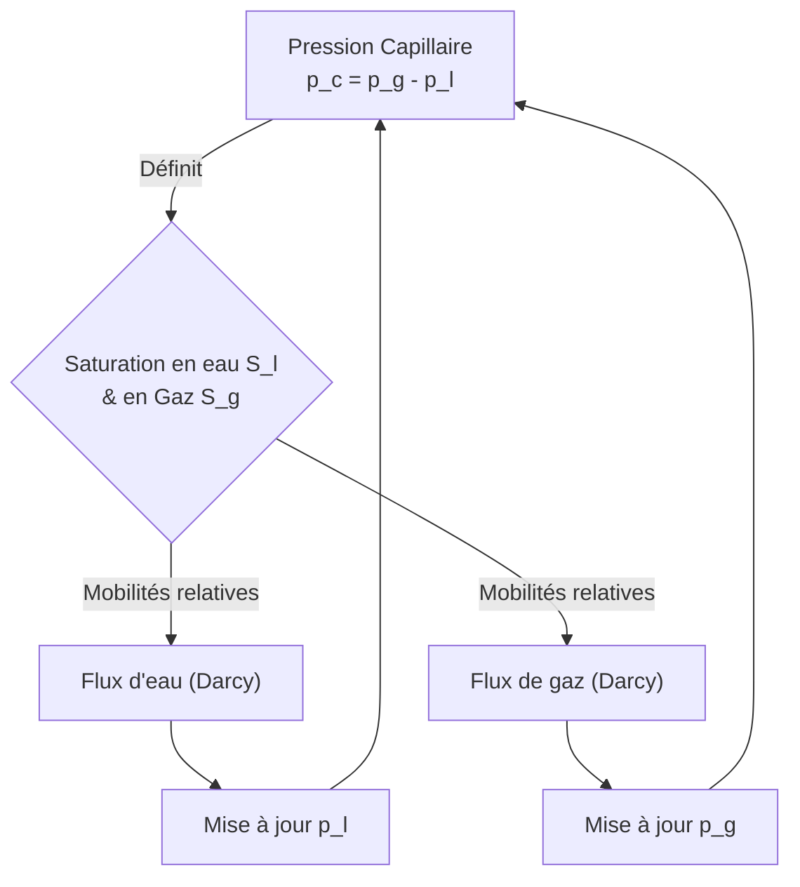

# Modèle M2 — Écoulement Diphasique L/G (Liquide-Gaz)

> **Fichiers sources :**
> `src/Models/ModelFiles/M2.c` · `test_examples/M2/M2`
>
> **Auteurs du modèle :** P. Dangla (Université Gustave Eiffel)

---

## Table des matières

1. [Contexte et objectif](#1-contexte-et-objectif)
2. [Hypothèses](#2-hypothèses)
3. [Variables et notation](#3-variables-et-notation)
4. [Modèle mathématique](#4-modèle-mathématique)
   - 4.1 [Équations de conservation](#41-équations-de-conservation)
   - 4.2 [Lois de comportement et flux (Darcy diphasique)](#42-lois-de-comportement-et-flux-darcy-diphasique)
5. [Conditions aux limites et initiales](#5-conditions-aux-limites-et-initiales)
6. [Cas test : drainage biphasique d'une colonne de sol (`test_examples/M2`)](#6-cas-test--drainage-biphasique-dune-colonne-de-sol)
7. [Paramétrage matériel du modèle](#7-paramétrage-matériel-du-modèle)
8. [Description pas-à-pas des fichiers](#8-description-pas-à-pas-des-fichiers)
9. [Références bibliographiques](#9-références-bibliographiques)

---

## 1. Contexte et objectif

Le modèle **M2** résout le problème d'**écoulement en milieux poreux à deux phases fluides (liquide et gaz)**, un classique en ingénierie géotechnique et en ingénierie des réservoirs. Contrairement au modèle M1 (équation de Richards) qui considère que l'air est partout stagnant et à pression atmosphérique constante, le modèle M2 couple intimement le mouvement des deux fluides : le liquide (généralement de l'eau) et le gaz (généralement de l'air ou des gaz de décomposition).

Il est très utile pour simuler les phénomènes de drainage complexe où l'air doit entrer dans le milieu pour permettre à l'eau d'en sortir, ou les problèmes de compression de poches d'air intra-matricielles.

---

## 2. Hypothèses

1. **Biphasique actif** : Les deux phases de fluide (liquide et gaz) sont libres de s'écouler dans le milieu poreux.
2. **Matrice solide rigide** : La déformation du sol ou des matériaux est ignorée. La porosité $\phi$ est constante.
3. **Loi des gaz parfaits** : La densité de la phase gazeuse est compressible et suit la loi des gaz parfaits ; l’air est décrit par sa masse molaire $M_g$ couplée à une équation d’état.
4. **Liquide incompressible** : La densité du fluide liquide $\rho_l$ est considérée constante, ne dépendant pas de la pression.
5. **Couplage capillaire exclusif** : La thermodynamique de saturation (répartition spatiale de l'eau dans les pores) est conditionnée par la seule différence de pression inter-phasique (la pression capillaire).

---

## 3. Variables et notation

Le modèle supporte un système couplé de 2 équations scalaires (conservation de masse pour le liquide et pour le gaz).

### Inconnues primaires (degrés de liberté)

| Symbole | Signification | Unité | Interne BIL |
|---------|---------------|-------|-------------|
| $p_l$ | Pression de la phase liquide | Pa | `p_l` |
| $p_g$ | Pression de la phase gazeuse | Pa | `p_g` |

### Variables de comportement

| Symbole | Signification |
|---------|---------------|
| $p_c$ | Pression capillaire : $p_c = p_g - p_l$ |
| $S_l, S_g$ | Saturations liquide et gazeuse ($S_g = 1 - S_l$) |
| $k_{rl}, k_{rg}$| Perméabilités relatives de phase (liées à $p_c$ via les courbes de rétention) |
| $\rho_g$ | Masse volumique du gaz : $\rho_g = p_g \frac{M_g}{R \cdot T}$ | 
| $m_l, m_g$ | Contenus massiques locaux (ex. $m_l = \phi S_l \rho_l$) |

---

## 4. Modèle mathématique

### 4.1 Équations de conservation

Le système exprime la **conservation de la masse** pour chaque constituant fluide sur un volume poreux partiel élémentaire.

1. **Balance de la masse liquide** :
   $$\frac{\partial m_l}{\partial t} + \nabla \cdot \mathbf{W}_l = 0$$

2. **Balance de la masse de gaz** :  
   $$\frac{\partial m_g}{\partial t} + \nabla \cdot \mathbf{W}_g = 0$$

Avec les relations d'état massiques locales :  
- Masse de liquide : $m_l = \rho_l \phi S_l(p_c)$
- Masse de gaz : $m_g = \rho_g(p_g) \phi S_g(p_c)$

### 4.2 Lois de comportement et flux (Darcy diphasique)

L'écoulement macroscopique dans la matrice respecte la loi empirique de Darcy généralisée à la perméabilité relative au sein des pores.

Le flux liquide s'écrit en fonction du gradient de charge :
$$\mathbf{W}_l = - \frac{\rho_l k_{\text{int}} k_{rl}(p_c)}{\mu_l} \nabla \left( p_l - \rho_l \mathbf{g} z \right)$$

De manière symétrique pour le gaz (sans négliger sa densité compressée) :
$$\mathbf{W}_g = - \frac{\rho_g k_{\text{int}} k_{rg}(p_c)}{\mu_g} \nabla \left( p_g - \rho_g \mathbf{g} z \right)$$

*Note : Les courbes d'état (saturation et perméabilités relatives) sont gérées par la consigne `Curves = sol` du fichier matériel et peuvent être lissées numériquement.*

---

## 5. Conditions aux limites et initiales

Contrairement au modèle M1, l'activation du mouvement d'air oblige la considération rigoureuse des conditions aux frontières "mixtes" (ouvert/fermé pour chaque phase).

- **Condition Initiale** : Répartition de pressions (ou hydrostatique) pour l'eau et répartition barométrique pour l'air $p_g$.
- **Condition Limite (Eau seule libre)** : Dirichlet sur $p_l$, Flux nul sur $\mathbf{W}_g$.
- **Condition Limite Atmosphérique** : Pression $p_g = 1 \text{ atm}$ imposée à la frontière et $p_l$ évaluée selon le gradient ou une succion d'évaporation.

---

## 6. Cas test : drainage biphasique d'une colonne de sol

Ce cas étudié dans `test_examples/M2/` est typique d'une colonne de sol vertical (ici d'une épaisseur de 1 mètre) que l'on laisse se drainer librement sous l'action de son propre poids. À la différence près que l'air environnant doit migrer à travers la colonne pour permettre le remplacement matriciel du liquide fuyant.

### Résultats du test

L'évolution du comportement de la colonne (drainage par le bas avec équilibrage) met en évidence le couplage. Sous l'effet gravitaire, une charge motrice vide d'eau les pores (baisse de $p_l$ en haut de colonne et baisse de saturation). L'air, suivant son propre flux, viendra compenser les volumes désaturés et stabiliser $p_g$. Si l'on bloquait l'apport d'air à la limite haute, l'eau serait incapable de drainer (les tensions de capillarité l'emporteraient à l'intérieur face à l'incapacité d'étendre la chambre stérile "à la seringue rebouchée"). 

*(Résultats typiques d'une colonne luthérienne où $S_l$ chute pour converger vers $S_{resi}$, laissant en haut des dépressions de $p_l$ alors que $p_g$ continue d'assurer les contacts continus).*

---

## 7. Paramétrage matériel du modèle

Le modèle nécessite l'implémentation fine des paramètres fluides dans le bloc `Material` du fichier. 

| Paramètre | Valeur (Ex. Cas M2) | Description |
|-----------|------------------|-------------|
| `gravite` | -9.81 | Norme de l'accélération gravitaire ($m.s^{-2}$) |
| `phi` | 0.3 | Porosité texturale du milieu |
| `k_int` | $4.4\times 10^{-13}$| Perméabilité intrinsèque du solide ($m^2$) |
| `mu_l`, `mu_g` | 1e-3 , 1.8e-5 | Viscosités de l'eau et de l'air en contact ($Pa.s$) |
| `M_g`, `RT` | 28.8e-3 , 2436 | Constantes de la loi des gaz massique (air) ; $RT=2436 \, J.kg^{-1}$ |
| `p_c3` | 300 | Paramètre de régularisation limite capillaire |

---

## 8. Description pas-à-pas des fichiers

### 8.1 Fichier de pilotage `test_examples/M2/M2`

1. **Geometry & Mesh** : Le cas se situe à nouveau dans un support 1D (`1 plan`) dont la coordonnée va de $z=0$ (base) à $z=1$ (sommet). La grille est fine pour absorber les pics frontaux : découpage en 100 facettes (soit  $\Delta z = 1$ cm). 
2. **Material** : Ligne `Model = M2`, les propriétés hydriques du milieu (`sol`) pour gérer le diphasique, et un lissage de pente si pressions très défavorables (`p_c3 = 300`).
3. **Initialization** :
   Un champ affine unitaire initie les valeurs homogènes de $p_l = 10^5 \text{ Pa}$ et $p_g = 10^5 \text{ Pa}$ à travers la colonne de $t=0$, correspondant respectivement à un sol saturé isobare mais sans contrainte piézométrique.
4. **Boundary Conditions** : 
   La condition bloque sélectivement des degrés de liberté aux frontières. 
   - `Reg = 1 Inc = p_l Champ = 2` : Entretient $p_l$ constant sur un nœud.
   - `Reg = 3 Inc = p_g Champ = 2` : Entretient le contact d'air à pression équivalente pour interagir.
5. **Objective Variations** : Afin de contourner la forte non-linéarité des flux couplés, on brise le pas de temps de l'intégration si $\Delta p > 1000$ Pa pour l'eau et l'air localement, ce qui garantit la convergence du résidu newtonien complet.

### 8.2 Code C modèle `src/Models/ModelFiles/M2.c`

1. **Définition de la carte des P.D.E (`SetModelProp`)** : 
   Associe `E_Liq` (Liquid mass balance) et `E_Gas` avec `p_l` et `p_g`.
2. **Relations couplées des perméabilités (`ComputeSecondaryComponents`)** : 
   Fonction clé qui à partir de $p_c$ évalue systématiquement pour tous les nœuds la saturation $S_l$ (liée à l'interaction capillaire), la proportion résidente $S_g$ ($1-S_l$), et leurs charges hydrostatiques $H_L = P_L - \rho_l g z$ et $H_G = P_G - \rho_g g z$. L'outil de courbe est sollicité en lisant le fichier externe `sol`.
3. **Le différentiel explicite `TangentCoefficients` (Ligne 646+)** :
   En 2-phases, l'évaluation de la matrice d'évolution implicite est drastiquement entachée par le double couplage. Le code M2 calcule l'écart différentiel manuellement (`dxi = 0.1` ou `1.e2` selon lissage, ligne 679) sur chaque composant $p_l$ et $p_g$ pour évaluer "l'effet en croix" (modification du flux liquide due à des changements de volume gazeux et vice-versa).
4. **Modélisation du Résidu non Linéaire (`ComputeResidu`)** :
   C'est la balance massique entre les 1ères itérations `t` et l'évolution en `t+1`. En l'occurrence pour tout volume cellulaire : la masse liquidienne future est amoindrie de la divergence du flux intercellulaire $W_L$ ; la fraction gazeuse est rééquilibrée sur le différentiel volumique du gaz $W_G$. L'équilibre est déclaré atteint lorsque le résidu sur les nœuds tend vers 0 dans la limite de la tolérance Newton (`Tol = 1e-4` dans le fichier pilotage).

---

## 9. Références bibliographiques

- **Celia, M. A., et Binning, P.** (1992). A Mass Conservative Numerical Solution for Two-Phase Flow in Porous Media with Application to Unsaturated Flow. *Water Resources Research*, 28(10), 2819-2828. - Pour la pertinence des solveurs Volume-Finis et l'intégration des flux couplés en double porosité.
- **Dullien, F. A. L.** (1992). *Porous Media: Fluid Transport and Pore Structure*. Academic press. - Cadre théorique des paramètres d'équations de Darcy diphasiques (Molarité de l'Air, Capillarité).
- **Corey, A. T.** (1954). The Interrelation Between Gas and Oil Relative Permeabilities. *Producer's Monthly*, 19(1), 38-41. - Bases des paramètres empiriques des courbes de perméabilité relative au sein de systèmes biphasiques ($k_{rg}, k_{rl}$).
