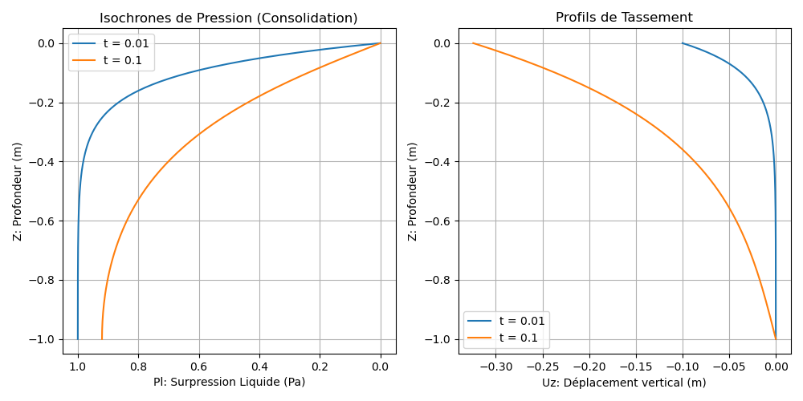

# Modèle M7 — Poroélasticité Saturée/Non-Saturée (Consolidation de Biot)

> **Fichiers sources :**
> `src/Models/ModelFiles/M7.c` · `test_examples/M7/M7`
>
> **Auteurs du modèle :** P. Dangla (Université Gustave Eiffel)

---

## Table des matières

1. [Contexte et objectif](#1-contexte-et-objectif)
2. [Hypothèses](#2-hypothèses)
3. [Variables et notation](#3-variables-et-notation)
4. [Modèle mathématique](#4-modèle-mathématique)
   - 4.1 [Équations d'équilibre et de conservation](#41-équations-déquilibre-et-de-conservation)
   - 4.2 [Lois de comportement poroélastique](#42-lois-de-comportement-poroélastique)
5. [Conditions aux limites et initiales](#5-conditions-aux-limites-et-initiales)
6. [Cas test : Consolidation de Terzaghi d'une couche de sol (`test_examples/M7`)](#6-cas-test--consolidation-de-terzaghi-dune-couche-de-sol-test_examplesm7)
7. [Paramétrage matériel du modèle](#7-paramétrage-matériel-du-modèle)
8. [Description pas-à-pas des fichiers](#8-description-pas-à-pas-des-fichiers)
9. [Références bibliographiques](#9-références-bibliographiques)

---

## 1. Contexte et objectif

Le modèle **M7** résout les équations couplées de la **poroélasticité de Biot**. Il combine la mécanique des milieux continus (déformation du squelette solide) avec l'hydraulique souterraine (écoulement de fluide, typiquement d'eau, régi par la loi de Darcy). Il s'agit d'un modèle fondamental en géomécanique, utilisé pour calculer le **tassement des sols** (consolidation au cours du temps) sous le poids des ouvrages (fondations, remblais), ainsi que la dissipation de la pression interstitielle associée.

L'implémentation "Saturated/Unsaturated" de BIL étend la théorie classique de Biot pour prendre en compte les états non-saturés, où la présence d'air diminue la perméabilité à l'eau et module la notion de "contrainte effective" via une pression de pores équivalente $\pi$.

```mermaid
graph TD
    A["Charge mécanique externe<br>et Poids Propre"] --> B("Équilibre Mécanique<br>Div(σ) + f = 0")
    E("Pression fluide p_l") -->|Poussée sur le squelette<br>(Couplage de Biot 'b')| B
    B -->|Déformation volumique<br>tr(ε)| C["Variation de la Porosité ϕ<br>(Stockage)"]
    C --> D("Conservation de l'eau<br>dm_l/dt + Div(W_l) = 0")
    E -->|Gradients de pression| D
    D --> E
```

---

## 2. Hypothèses

1. **Généralisation Biphasique/Uniphasique** : Modèle prévu pour être utilisé en mode saturé direct (air inexistant, $S_l = 1$) ou non-saturé (pression de gaz $p_g$ supposée purement atmosphérique et atmosphère instantanément équilibrée).
2. **Squelette élastique linéaire isotrope** : Le comportement mécanique intrinsèque de la matrice solide vide obéit à la loi de Hooke (Module d'Young $E$, Poisson $\nu$).
3. **Validité des relations de Biot** : Le tenseur des contraintes totales se décompose en contraintes effectives et pression interstitielle équivalente via le coefficient de Biot $b$.
4. **Cinématique des petites déformations** : L'advection du squelette solide (parois poreuses) n'est pas suivie dans le référentiel d'Euler.

---

## 3. Variables et notation

Modèle hydro-mécanique couplé, supportant $1 + \text{Dimension}$ équations (une pour l'hydraulique, et un vecteur pour la mécanique).

### Inconnues primaires

| Symbole | Signification | Interne BIL |
|---------|---------------|-------------|
| $p_l$ | Pression du liquide | `p_l`       |
| $\mathbf{u}$ | Vecteur des déplacements solides | `u_1, u_2, u_3` |

### Variables de comportement

| Symbole | Signification |
|---------|---------------|
| $\boldsymbol{\varepsilon}$ | Tenseur des déformations linéarisé $\frac{1}{2}(\nabla \mathbf{u} + \nabla^T \mathbf{u})$ |
| $\boldsymbol{\sigma}$ | Tenseur des contraintes totales |
| $\pi$ ou $p_p$| Pression équivalente des pores (intervenant pour un sol non-saturé) |
| $\phi$| Porosité instantanée du milieu (modifiée par la déformation) |

---

## 4. Modèle mathématique

La résolution repose sur un principe semi-implicite de minimisation des résidus nodaux par méthode Newton-Raphson.

### 4.1 Équations d'équilibre et de conservation

1. **Bilan des quantités de mouvement** (stationnaire) :
   $$\nabla \cdot \boldsymbol{\sigma} + (\rho_s + m_l) \mathbf{g} = \mathbf{0}$$
   *(L'inertie dynamique est nulle, il s'agit d'une quasi-statique. La force volumique intègre la masse sèche du sol $\rho_s$ et la masse de l'eau interstitielle $m_l$).*

2. **Équation de diffusion hydraulique** (masse de l'eau) :  
   $$\frac{\partial m_l}{\partial t} + \nabla \cdot \mathbf{W}_l = 0$$

### 4.2 Lois de comportement poroélastique

- **Loi de Hooke / Biot sur les contraintes** :
  $$\boldsymbol{\sigma} = \boldsymbol{\sigma}_0 + \lambda \, \text{Tr}(\boldsymbol{\varepsilon}) \mathbf{I} + 2\mu \boldsymbol{\varepsilon} - b \, (p_p - p_{p0}) \mathbf{I}$$
  *(Où $\lambda$ et $\mu$ sont les paramètres de Lamé du milieu solide, et $b$ le coefficient constant de Biot couplant la contribution de la pression).*

- **Évolution de la porosité** :
  $$\phi = \phi_0 + b \, \text{Tr}(\boldsymbol{\varepsilon}) + N \, (p_p - p_{p0})$$
  *($N \ge 0$ paramètre optionnel représentant la compressibilité intrinsèque des pores).*

- **Flux et accumulation** :
  $$\mathbf{W}_l = - \frac{\rho_l k_{\text{int}} k_{rl}(p_c)}{\mu_l} \nabla \left( p_{l} \right) + \frac{\rho^2_l k_{\text{int}} k_{rl}}{\mu_l} \mathbf{g}$$
  $$m_l = \rho_l \, \phi \, S_l(p_c)$$

---

## 5. Conditions aux limites et initiales

Les CL englobent les deux phénomènes physiques :

- Mécanique (`Reg X Inc = u_y Champ = z`) : Permet typiquement de créer des frontières bloquées (substratum rocheux rigide, rouleaux aux frontières).
- Mécanique (Force) (`Load Equation = meca_1 = force`) : Représente directement un effort imposé (ex: remblai posé sur le sol).
- Hydraulique : Surfaces drainantes ($p_l = P_{atmos}$) ou bien faces imperméables (Aucune prescription, donc flux implicitement nul via Newman).

---

## 6. Cas test : Consolidation de Terzaghi d'une couche de sol (`test_examples/M7/`)

Ce cas académique est celui du phénomène unidimensionnel de la **Consolidation de Terzaghi**.
Nous prenons une colonne 1D de sol saturé sur $H=1\text{m}$ (coordonnées entre $z=-1$ et $z=0$).
- En $t=0$, une pression massique continue (charge de surface -1 Pa) est appliquée soudainement au sommet géométrique, qui lui-même est libre de drainer l'eau ($p_l=0$). 
- La base ne bouge pas mécaniquement (`u=0` imposé au fond).  

### Résultats de la simulation

Le sol, de faible perméabilité et gorgé d'eau très peu compressible, voit sa matrice se contracter immédiatement mais l'eau qui s'oppose au tassement capture instantanément 100% de l'effort : c'est le pic de *"surpression interstitielle"*. Ensuite l'eau se dissipe peu à peu vers la surface drainante en $t = 0.01$, puis $t = 0.1$.
Ce transfert de la contrainte totale vers les grains du sol provoque son "tassement" (déformation $\Delta u_z$).



*(À gauche : Décroissance ou dissipation graduelle et isochrone de la pression fluide. À droite : L'accroissement progressif du tassement vertical des horizons géologiques au fil du drainage complet).*

---

## 7. Paramétrage matériel du modèle

La physique du modèle croise des données mécaniques standards avec le modèle hydraulique :

| Paramètre | Cas du Fichier `M7` | Rôle Physique |
|-----------|---------------------|---------------|
| `young`, `poisson` | 0.83 , 0.25 | Représente la matrice gélatineuse rigide du comportement sec. |
| `rho_s` | 0 | Masse de grains annulée pour écarter le confinement propre. |
| `b` | 1 | Coefficient de Biot (terzaghi = 1 souvent car incompressibilité intrinsèque des grains massifs). |
| `N` | 0 | Compressibilité du vide. |
| `sig0_xx` | 0 | Contraintes totales macroscopiques préétablies in situ. |

---

## 8. Description pas-à-pas des fichiers

### 8.1 Fichier de pilotage `test_examples/M7/M7`

1. **Géométrie & Maillage** : Exigences 1D (un segment) localisé entre $z=-1$ et $z=0$ (`4 -1 -1 0 0`). Le `1` d'épaisseur virtuelle maintient le cas volumique dans des volumes standards.
2. **Propriétés initiales** : 
   `p_l0 = 0` dans le bloc matériel définit qu'on démarre en pression d'équilibre (isobare zéro, pas de gradient, repos complet).
3. **Conditions aux limites (`Boundary Conditions`)** :
   - `Reg 1 Inc = u_1` : Le fond ($z=-1$) est figé. Déplacement nul.
   - `Reg 3 Inc = p_l` : Le sommet ($z=0$) est une surface de suintement pur ($p=0$, atmosphérique).
4. **Chargements (`Loads`)** :
   - `Reg 3 Equation = meca_1 Type = force Champ = 1` avec le `Fields 1` défini à `Value = -1`. Ceci insère une charge orientée vers les x-négatifs (-1) applicable à tout les éléments de bord de la région 3.
5. **Critères et temps (`Dates`, `Iterative Process`)** : Tolérance serrée `1.e-6` car les efforts génèrent initialement de gros chocs pour les solveurs non linaires. Dates imposées arbitrairement à `0.01` puis `0.1`.

### 8.2 Modélisation interne `src/Models/ModelFiles/M7.c`

1. **`ComputeInitialState` (Ligne 201)** : 
   Appelle les méthodes propres aux éléments Finis (`FEM.h` au lieu de `FVM.h` pour garantir le tracking mécanique nodal et non surfacique d'interface). Calcule les constantes de base (`lamé`, module de cisaillement). 
2. **Calcul de la contrainte `SIG` et de l'effort massique `F_MASS`** :
   - Effectue l'abstraction tensorielle (dérivée spatiale) des déplacements aux points de Gauss ($p=0..N_{integ}$).
   - `sig[...] += lame*tre - b*(pp - pp0)` - Additionne de l'énergie de forme et soustrait le potentiel de Biot.
3. **Assemblages de raideur `c7` et de transport `k7`** :
   Prépare analytiquement, sur les cellules de la matrice d'intégration (`kp` et `kc`), l'influence relative entre la variable d'eau `I_p_l` et les composantes cinématiques de `I_u`.
4. **`ComputeResidu`** :
   Dresse le solde mécanique virtuel en exploitant `FEM_ComputeStrainWorkResidu` (Bilan des forces virtuelles face à la rigidité interne $\int \boldsymbol{\sigma} \colon \nabla \delta \mathbf{u} \, d\Omega$). En E_liq c'est plutôt l'erreur sur la compression poreuse et le bilan des flux hydrauliques transitoires.

---

## 9. Références bibliographiques

- **Biot, M. A.** (1941). General theory of three-dimensional consolidation. *Journal of applied physics*, 12(2), 155-164. - C'est la fondation du couplage entre pression hydrique et déformation matricielle géré dans M7.
- **Coussy, O.** (2004). *Poromechanics*. John Wiley & Sons. - Fournit les développements rigoureux du tensoriel de comportement incluant l'introduction du paramètre de compressibilité `N` et la distinction avec la capillarité en non-saturé.
- **Terzaghi, K.** (1943). *Theoretical soil mechanics*. - Le test `M7` démontre mathématiquement l'équation phénoménologique établie originellement en 1D par Terzaghi pour le comportement des argiles argileuses sous stress.
