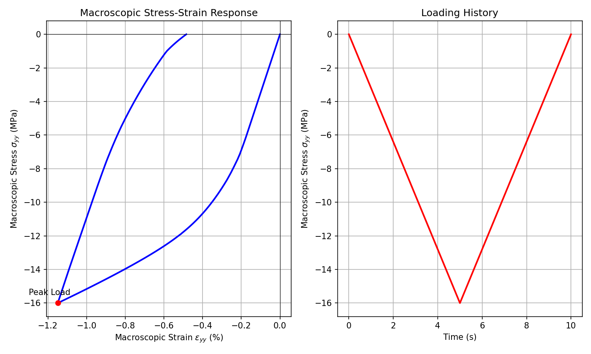

# Modèle MechaMic — FEM² Multiscale Mechanics (2017)

> **Fichiers sources :**
> `src/Models/ModelFiles/MechaMic.cpp` · `test_examples/MechaMic/MechaMic`
>
> **Auteur du modèle Bil :** P. Dangla (Université Gustave Eiffel)

---

## Table des matières

1. [Contexte et objectif](#1-contexte-et-objectif)
2. [Hypothèses et Échelles](#2-hypothèses-et-échelles)
3. [Variables et Équations de base](#3-variables-et-équations-de-base)
4. [Implémentation du couplage FEM²](#4-implémentation-du-couplage-fem)
5. [Discrétisation et Résolution algorithmique](#5-discrétisation-et-résolution-algorithmique)
6. [Cas test : Plaque sous chargement cyclique (`test_examples/MechaMic`)](#6-cas-test--plaque-sous-chargement-cyclique)
7. [Résultats et Comportement matériel](#7-résultats-et-comportement-matériel)

---

## 1. Contexte et objectif

Le modèle **MechaMic** (Mechanics from a microstructure) constitue l'implémentation du cadre d'homogénéisation numérique dite **FEM²**. Plutôt que d'employer une loi de comportement analytique macroscopique (élasticité, plasticité, etc.), le modèle délègue le calcul de la réponse contrainte-déformation matérielle à la résolution, _à la volée_ et _en chaque point d'intégration (point de Gauss)_, d'un Problème aux Limites (BVP) sur un Volume Élémentaire Représentatif (VER).

L'objectif est d'étudier ou de modéliser des comportements non linéaires complexes induits par de l'hétérogénéité sous-jacente sans formuler de lois constitutives phénoménologiques closes.

---

## 2. Hypothèses et Échelles

Le paradigme de ce modèle s'articule autour de deux échelles en couplage bidirectionnel :

- **L'échelle Macroscopique** : Gère l'équilibre global de la structure sous chargement macroscopique, par éléments finis (ici modélisé par `MechaMic.cpp`).
- **L'échelle Microscopique (VER)** : Chaque point de Gauss macroscopique détient une copie d'un maillage micro. La géométrie de ce VER est spécifiée dans le jeu de données par l'appel à une méthode `Microstructure [nom_fichier_VER]`.

**Hypothèse d'homogénéisation :**
La déformation macroscopique $\mathbf{E}$ (calculée par la B-matrice sur le macro-maillage) sert de conditions aux limites (souvent périodiques) ou de charge au maillage microstructurel. La macro-contrainte $\mathbf{\Sigma}$ est alors la moyenne volumique des micro-contraintes du VER en équilibre.

---

## 3. Variables et Équations de base

### Variables et Inconnues Nodales (Macro)

Pour un problème de dimension `dim` (2D ou 3D), le nombre d'inconnues et d'équations est égal à `dim` :

| Symbole Macroscopique | Signification |
|---------|---------------|
| `u_1, u_2, u_3` | Déplacements matériels de la structure dans les directions X, Y, Z |

### Conservation de la quantité de mouvement (Équilibre)

Le code résout l'équation classique de l'équilibre mécanique statique aux nœuds macroscopiques :

$$ \nabla \cdot \mathbf{\Sigma} + \rho_s \mathbf{g} = 0 $$

En formulation faible (principe des travaux virtuels implicite traitée dans `ComputeResidu`), cela équivaut à :

$$ \int_\Omega \mathbf{\Sigma}(\mathbf{E}) : \delta\mathbf{E} \, d\Omega = \int_\Omega (\rho_s \mathbf{g}) \cdot \delta\mathbf{u} \, d\Omega + \int_{\partial\Omega} \mathbf{F}_{ext} \cdot \delta\mathbf{u} \, dS $$

Où $\mathbf{\Sigma}(\mathbf{E})$ est extraite **numériquement** depuis le solveur de microstructure.

---

## 4. Implémentation du couplage FEM²

L'intégration locale (`MPM_t::Integrate` et `MPM_t::SetTangentMatrix` dans Bil) fait preuve du passage de la macro vers la micro :

1. **Extraction de déformation** (`SetInputs`) : 
   Les déplacements `val.Displacement` nodaux de l'élément Macro fournissent la déformation locale $\mathbf{E}$ (soit `val.Strain`), en tenant compte des potentiels gradients macroscopiques prescrits (`MacroStrain`).
   
2. **Homogénéisation de restriction élastoplastique (`Integrate`)** :
   ```cpp
   // Le gradient d'incrément de déformation Macro
   for(i = 0 ; i < 9 ; i++) deps[i] =  eps[i] - eps_n[i] ;
   
   // Démarrage du dataset Microstructure
   FEM2_t* fem2 = FEM2_GetInstance(dataset,solvers,sols_n+p,sols+p);
   FEM2_ComputeHomogenizedStressTensor(fem2,t,dt,deps,sig);
   ```
   L'incrément de déformation $\Delta\mathbf{E}$ est passé en argument à `FEM2_ComputeHomogenizedStressTensor` qui résout le problème interne du VER et renvoie la nouvelle contrainte macro $\mathbf{\Sigma}$ (soit `sig`).
   
3. **Calcul de la Matrice Tangente Macroscopique (`SetTangentMatrix`)** :
   Le tenseur de rigidité tangent $C_{ijkl} = \frac{\partial \Sigma_{ij}}{\partial E_{kl}}$ macroscopique est tout aussi numériquement homogénéisé, en appelant le VER sur un état perturbé :
   ```cpp
   FEM2_HomogenizeTangentStiffnessTensor(fem2,t,dt,c0);
   ```
   Ces coefficients remplissent la matrice de rigidité tangente macroscopique pour le processus de Newton-Raphson de l'élément macro.

---

## 5. Discrétisation et Résolution algorithmique

L'utilisation de `FEM2` alourdit considérablement le temps de calcul puisqu'un maillage entier est résolu à _chaque_ point d'intégration macroscopique pour _chaque_ itération de Newton-Raphson. La communication hiérarchique stockée sur le heap garantit que :

- L'histoire des variables internes (comme les déformations plastiques) du domaine VER est correctement sauvegardée localement (dans `Element_GetCurrentLocalSolutions`) de passe en passe pour chaque point de gauss macroscopique.
- Si le chargement Macro nécessite un coupage de pas de temps (`Dtmax/Dtini/Tol`), la structure Micro revient formellement à l'ancien état implicite sans décalage.

---

## 6. Cas test : Plaque sous chargement cyclique (`test_examples/MechaMic`)

Le cas modèle se compose d'un maillage très simple d'un seul élément fini `Q4` représentant la macro-structure soumise à une contrainte de traction-compression axiale. 

### Spécificités du Jeu de données

```text
Material
Model  = MechaMic
Method = Microstructure plasticell0
```
- Demande explicite à allouer une cellule microstructurelle à géométrie/comportement défini(e) dans le fichier implicite de la bibliothèque Bil `plasticell0`. Ce VER `plasticell0` contient typiquement des zones de plasticité (par exemple, une inclusion élastique avec une matrice plastique de type Von-Mises ou Mohr Coulomb).

**Conditions de chargement (`test_examples/MechaMic/MechaMic`)** :
- Base `Reg 13` et paroi M gauche `Reg 10` bloquées perpendiculairement (symétrie plan).
- Sollicitation en surface (`Reg 11` et `Reg 12`) par charge (`Loads`). La contrainte appliquée utilise un module à Fonction Temporelle :
  `N = 3 F(0) = 0  F(5) = 1  F(10) = 0` (Cycle de chargement plein en $t=5$ s puis retour à $0$ en $t=10$ s).
- L'amplitude de la limite motrice est fixée à 16.e6 Pa (16 MPa).

---

## 7. Résultats et Comportement matériel

L'exécution débouche sur les sorties en point d'histoire aux limites élasto-plastiques. Grâce aux échelles entremêlées, la réponse n'est pas linéaire bien que MechaMic ne déclare strictement aucun modèle plastique interne.

En appliquant un balayage macro de charge-décharge (via `plot_mechamic.py`), nous reproduisons le module d'écrouissage de la microstructure :



**Analyse :** 
1. **Régime Élastique Initial** : Proportionnalité stricte jusqu'à environ 3 MPa.
2. **Écoulement Plastique Adouci / Écrouissage** : La non-linéarité apparaît. La dégradation macro provient de la limite d'élasticité franchie localement par divers sous-éléments à l'intérieur du VER `plasticell0`. Le module tangent (cadré par `SetTangentMatrix`) s'infléchit doucement.
3. **Décharge** : Au moment du pic (t = 5s), les contraintes élastiques du VER entrainent une décharge macroscopique parallèle au module élastique brut initial. 
4. **Déformation Permanente (Résiduelle)** : À la fin de la charge macro nulle (t = 10s), environ $0.1\%$ de déformation macroscopique résiduelle permanente est enregistrée en $\epsilon_{yy}$. L'hétérogénéité spatiale micro et la redistribution des contraintes résiduelles provoquent ce comportement élasto-plastique macroscopique émergent absolu.
