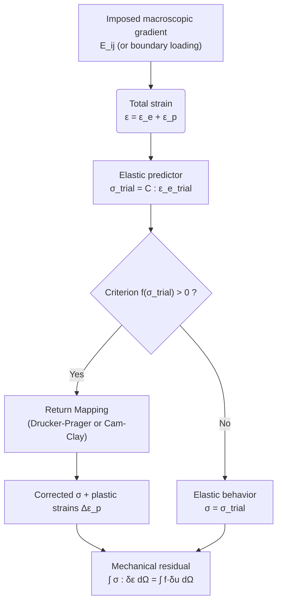

# Plast Model — Elasto-plasticity with Drucker-Prager (or Cam-Clay) Criterion

> **Bil model:** `src/Models/ModelFiles/Plast.cpp`

> **Input file:** `doc/mkdocs/Mechanics/Plast/Plast` · `doc/mkdocs/Mechanics/Plast/Plast0` · `doc/mkdocs/Mechanics/Plast/Plast1`
>
> **Model authors:** P. Dangla (Université Gustave Eiffel)

---

## Table of Contents

1. [Context and Objective](#1-context-and-objective)
2. [Assumptions](#2-assumptions)
3. [Variables and Notation](#3-variables-and-notation)
4. [Mathematical Model](#4-mathematical-model)
   - 4.1 [Mechanical Equilibrium Equation](#41-mechanical-equilibrium-equation)
   - 4.2 [Elastic Behavior (Isotropic Hooke)](#42-elastic-behavior-isotropic-hooke)
   - 4.3 [Drucker-Prager Plasticity Criterion](#43-drucker-prager-plasticity-criterion)
   - 4.4 [Plastic Flow Rule (Non-Associated)](#44-plastic-flow-rule-non-associated)
   - 4.5 [Return Mapping Integration](#45-return-mapping-integration)
5. [Numerical Homogenization and Macro Gradient](#5-numerical-homogenization-and-macro-gradient)
6. [Test Cases](#6-test-cases)
   - 6.1 [Plast — 2D Periodic Composite Cell (Shear)](#61-plast--2d-periodic-composite-cell-shear)
   - 6.2 [Plast0 — 1D Periodic Composite Cell (Tension)](#62-plast0--1d-periodic-composite-cell-tension)
   - 6.3 [Plast1 — Cylindrical Layer Under Pressure (Axisymmetry)](#63-plast1--cylindrical-layer-under-pressure-axisymmetry)
7. [Material Parameters of the Model](#7-material-parameters-of-the-model)
8. [Step-by-Step Description of Input Files](#8-step-by-step-description-of-input-files)
   - 8.1 [File `Plast` — 2D Composite Cell, Periodic Shear](#81-file-plast--2d-composite-cell-periodic-shear)
   - 8.2 [File `Plast0` — 1D Composite Cell, Periodic Tension](#82-file-plast0--1d-composite-cell-periodic-tension)
   - 8.3 [File `Plast1` — Axisymmetric Cylindrical Layer Under Internal Pressure](#83-file-plast1--axisymmetric-cylindrical-layer-under-internal-pressure)
9. [Numerical Implementation (`Plast.cpp`)](#9-numerical-implementation-plastcpp)
10. [References](#10-references)

---

## 1. Context and Objective

The **Plast** model solves the **quasi-static mechanical equilibrium** equations in a solid material exhibiting **elasto-plastic** behavior. It relies on the additive decomposition of strains into a reversible elastic part and an irreversible plastic part, coupled with a **Drucker-Prager** (or **Cam-Clay**) yield criterion with optional hardening.

This model is particularly well-suited to three major classes of problems:

1. **Periodic homogenization**: computation of the effective macroscopic response of a heterogeneous material (composite, geomaterial with inclusions) subjected to a prescribed macroscopic loading via a mean displacement gradient.
2. **Local plasticity**: simulations of geomaterials (rocks, cements, clays) exhibiting cracking or plastic flow under stress.
3. **Axisymmetric structures under pressure**: example of a cylindrical ring under internal/external pressure.



---

## 2. Assumptions

1. **Small strains**: the additive decomposition $\boldsymbol{\varepsilon} = \boldsymbol{\varepsilon}^e + \boldsymbol{\varepsilon}^p$ is valid within the small displacement framework.
2. **Linear isotropic elasticity**: the elastic behavior is fully described by Young's modulus $E$ and Poisson's ratio $\nu$.
3. **Perfect plasticity or isotropic hardening**: the Drucker-Prager criterion can be associated with hardening via the cumulated plastic shear strain $\gamma_p$.
4. **Quasi-static**: inertial terms are neglected; equilibrium is solved at each time step.
5. **Heterogeneous materials**: the cell may contain multiple materials (the `Plast` model for the matrix, the `Elast` model for rigid inclusions).

---

## 3. Variables and Notation

### Primary Unknowns

| Symbol | Meaning | BIL Internal |
|--------|---------|--------------|
| $\mathbf{u}$ | Displacement vector | `u_1, u_2, u_3` |

### Internal Variables (Gauss Points)

| Symbol | Meaning |
|--------|---------|
| $\boldsymbol{\varepsilon}$ | Total strain tensor |
| $\boldsymbol{\sigma}$ | Cauchy stress tensor |
| $\boldsymbol{\varepsilon}^p$ | Cumulated plastic strain tensor |
| $\gamma_p$ | Cumulated plastic shear strain (hardening variable) |
| $f$ | Yield criterion value |
| $\Delta\lambda$ | Plastic multiplier |

### Stress Invariants

| Symbol | Definition |
|--------|-----------|
| $p$ | Mean pressure: $p = \frac{1}{3}\text{Tr}(\boldsymbol{\sigma})$ |
| $q$ | Deviatoric stress: $q = \sqrt{3 J_2}$ with $J_2 = \frac{1}{2} s_{ij} s_{ij}$ |
| $\mathbf{s}$ | Deviatoric part: $\mathbf{s} = \boldsymbol{\sigma} - p \mathbf{I}$ |

---

## 4. Mathematical Model

### 4.1 Mechanical Equilibrium Equation

Under quasi-static conditions and in the absence of gravity ($\rho_s = 0$ in the test cases):

$$\nabla \cdot \boldsymbol{\sigma} = \mathbf{0}$$

The weak variational form is:

$$\int_\Omega \boldsymbol{\sigma} : \nabla^s \delta\mathbf{u} \, d\Omega = \int_{\partial\Omega_N} \mathbf{t} \cdot \delta\mathbf{u} \, d\Gamma$$

where $\mathbf{t}$ is the prescribed surface traction vector and $\delta\mathbf{u}$ is an admissible virtual displacement field.

### 4.2 Elastic Behavior (Isotropic Hooke)

The isotropic elastic law relates stresses to elastic strains via the Lamé coefficients $\lambda$ and $\mu$:

$$\boldsymbol{\sigma} = \lambda \, \text{Tr}(\boldsymbol{\varepsilon}^e)\mathbf{I} + 2\mu \boldsymbol{\varepsilon}^e$$

with:

$$\lambda = \frac{E\nu}{(1+\nu)(1-2\nu)}, \qquad \mu = \frac{E}{2(1+\nu)}$$

The bulk modulus and shear modulus are:

$$K = \frac{E}{3(1-2\nu)}, \qquad G = \mu = \frac{E}{2(1+\nu)}$$

### 4.3 Drucker-Prager Plasticity Criterion

The **Drucker-Prager** criterion is a smoothed (conical) version of the Mohr-Coulomb criterion in the invariant space $(p, q)$:

$$f(\boldsymbol{\sigma}, \gamma_p) = q + F \cdot p - C(\gamma_p) \leq 0$$

with parameters depending on the friction angle $\phi$:

$$F = \frac{6\sin\phi}{3 - \sin\phi}, \qquad C_0 = \frac{6\cos\phi}{3 - \sin\phi} \cdot c$$

where $c$ is the material cohesion (in Pa) and $C(\gamma_p) = C_0 \cdot \text{fac}(\gamma_p)$ is the cohesion modified by hardening.

> **Link to Mohr-Coulomb**: The Drucker-Prager criterion corresponds to the external circumscription of the Mohr-Coulomb cone in principal stress space. For $\phi = 25°$ and $c = 1.5$ MPa, one obtains $F \approx 0.755$ and $C_0 \approx 1.94$ MPa.

### 4.4 Plastic Flow Rule (Non-Associated)

The plastic strain increments follow the non-associated flow rule:

$$\dot{\boldsymbol{\varepsilon}}^p = \dot{\lambda} \frac{\partial g}{\partial \boldsymbol{\sigma}}$$

where the **potential function** $g$ is defined with the **dilatancy angle** $\psi$ (distinct from the friction angle $\phi$):

$$g(\boldsymbol{\sigma}) = q + D \cdot p, \qquad D = \frac{6\sin\psi}{3 - \sin\psi}$$

The gradient of the yield function (normal direction) is:

$$\frac{\partial f}{\partial \sigma_{ij}} = \underbrace{\frac{3}{2} \frac{s_{ij}}{q}}_{\text{deviatoric}} + \underbrace{\frac{F}{3} \delta_{ij}}_{\text{volumetric}}$$

The gradient of the potential (flow direction) is:

$$\frac{\partial g}{\partial \sigma_{ij}} = \frac{3}{2} \frac{s_{ij}}{q} + \frac{D}{3} \delta_{ij}$$

The plastic multiplier $\dot{\lambda} \geq 0$ satisfies the Kuhn-Tucker conditions:

$$f \leq 0, \quad \dot{\lambda} \geq 0, \quad \dot{\lambda} \cdot f = 0$$

### 4.5 Return Mapping Integration

The **return mapping** algorithm solves the plasticity problem incrementally and implicitly at each Gauss point.

**Step 1 — Elastic predictor (trial state):**
$$\boldsymbol{\sigma}^\text{trial} = \boldsymbol{\sigma}_n + \mathbb{C} : \Delta\boldsymbol{\varepsilon}$$

**Step 2 — Criterion check:**
$$f^\text{trial} = q^\text{trial} + F \cdot p^\text{trial} - C(\gamma_p^n)$$

- If $f^\text{trial} \leq 0$: elastic behavior, $\boldsymbol{\sigma} = \boldsymbol{\sigma}^\text{trial}$
- If $f^\text{trial} > 0$: plastic return required

**Step 3 — Plastic correction (smooth regime):**

We seek $\Delta\lambda > 0$ such that $f(\boldsymbol{\sigma}^{n+1}, \gamma_p^{n+1}) = 0$. The correction reads:

$$\boldsymbol{\sigma}^{n+1} = \boldsymbol{\sigma}^\text{trial} - \Delta\lambda \, \mathbb{C} : \frac{\partial g}{\partial \boldsymbol{\sigma}}$$

The pressure is corrected by the volumetric part:
$$p^{n+1} = p^\text{trial} - K \cdot D \cdot \Delta\lambda$$

The deviatoric stress is reduced by the deviatoric part:
$$q^{n+1} = \frac{q^\text{trial}}{1 + 3G\Delta\lambda/q^\text{trial}}$$

The hardening variable is updated:
$$\gamma_p^{n+1} = \gamma_p^n + \sqrt{3/2} \cdot \Delta\lambda$$

**Consistent tangent matrix:** During plastic flow ($q > 0$ and $\Delta\lambda > 0$), the effective shear modulus is reduced:

$$G_1 = G \cdot \frac{q^\text{trial}}{q^\text{trial} + 3G\Delta\lambda}, \qquad K_1 = K$$

---

## 5. Numerical Homogenization and Macro Gradient

The **Plast** model incorporates a **periodic homogenization** mechanism that allows imposing a **macroscopic displacement gradient** $\mathbf{E}$ on a representative volume element (RVE). The local displacement is decomposed as:

$$\mathbf{u}(\mathbf{x}) = \mathbf{E} \cdot \mathbf{x} + \tilde{\mathbf{u}}(\mathbf{x})$$

where $\tilde{\mathbf{u}}$ is the periodic fluctuation. The local strain is then:

$$\boldsymbol{\varepsilon}(\mathbf{u}) = \mathbf{E}^\text{sym} + \tilde{\boldsymbol{\varepsilon}}(\tilde{\mathbf{u}})$$

**Corresponding parameters in the input file:**

| Parameter | Meaning |
|-----------|---------|
| `macro-gradient_ij` | Component $E_{ij}$ of the macroscopic gradient |
| `macro-fctindex_ij` | Index of the time function modulating $E_{ij}(t)$ |

The macroscopic gradient is thus $E_{ij}(t) = \texttt{macro-gradient\_ij} \times f_{\texttt{macro-fctindex\_ij}}(t)$.

The **periodicity conditions** (section `Periodicities`) enforce that the fluctuations $\tilde{\mathbf{u}}$ are identical on opposite cell boundaries, with the corresponding period vector.

---

## 6. Test Cases

### 6.1 `Plast` — 2D Periodic Composite Cell (Shear)

**Geometry:** Square cell $2 \times 2$ (dimensionless units) in plane strain (`2 plan`), containing 4 circular inclusions of radius $R = 0.5$ at the four corners, assembled by successive $90°$ rotations. The mesh is defined in `composite1.msh` (generated from `composite1.geo` and `inclusion.geo`).

**Physics:** Pure macroscopic shear imposed by the off-diagonal components of the gradient:
$$E_{12} = E_{21} = 10^{-3} \times f(t)$$

The function $f(t)$ is linear from $0$ to $t=5$. The loading is therefore an increasing shear up to $\gamma = 5 \times 10^{-3}$.

- **Matrix** (Physical surface 1): `Plast` model (Drucker-Prager), $E = 2.713$ GPa, $\nu = 0.339$, $c = 1.5$ MPa, $\phi = \psi = 25°$
- **Inclusions** (Physical surface 2): `Elast` model (pure linear elasticity), $E = 2.713 \times 10^{10}$ GPa (quasi-rigid), $\nu = 0.49$

**Expected results:** Under increasing shear, the matrix yields first at stress concentration points (inclusion corners), then progressively. The quasi-rigid inclusions remain elastic and redistribute stresses. The formation of plastic shear bands is observed.

### 6.2 `Plast0` — 1D Periodic Composite Cell (Tension)

**Geometry:** 1D cell (`1 plan`) defined by 5 regularly spaced nodes on $[0, 1]$ with a 10-element mesh, containing a soft layer (matrix) and a stiff layer (inclusion). Periodicity links the left boundary (Region 1) and right boundary (Region 4) along the $x_1$ direction.

**Physics:** Imposed axial macroscopic tension:
$$E_{11} = 10^{-3} \times f(t)$$

**Materials:** Identical to the `Plast` case but in 1D, with only the `macro-gradient_11` component active.

**Expected results:** Progressive yielding of the matrix under uniaxial tension. The effective macroscopic stress-strain law shows a yield knee followed by a plateau (perfect plasticity without hardening in this case).

### 6.3 `Plast1` — Axisymmetric Cylindrical Layer Under Internal Pressure

**Geometry:** Axisymmetric hollow cylinder (`1 axis`), inner radius $r_i = 0.1$ m, outer radius $r_e = 0.2$ m. Radial discretization with 10 elements.

**Physics:** Initial isotropic stresses $\sigma_0 = -1$ MPa (confinement). Loading by an internal pressure $p(t)$ applied at $r = r_i$ (Region 1) and an external pressure at $r = r_e$ (Region 3), modulated by the function $f(t)$ (linear from $-1$ at $t=0$ up to $5$ at $t=10$). The base is free in the $r$ direction.

**Material:** `Plast` model (Drucker-Prager), $E = 10$ GPa, $\nu = 0.26$, $c = 1$ MPa, $\phi = \psi = 25°$.

**Expected results:** Known analytical solution for plasticity of a thick-walled cylinder (Lamé + Drucker-Prager). The plastic front propagates from the inner radius outward as the internal pressure increases. The radial stress profiles $\sigma_r(r)$ and $\sigma_\theta(r)$ can be compared to the analytical solution.


---

## 7. Material Parameters of the Model

### Common Parameters

| Parameter | Physical Role |
|-----------|--------------|
| `young` | Young's modulus $E$ (Pa) — skeleton stiffness |
| `poisson` | Poisson's ratio $\nu$ — lateral compressibility |
| `rho_s` | Dry mass density (kg/m³) — self-weight |
| `gravity` | Gravitational acceleration (m/s²) |
| `sig0_ij` | In-situ initial stress $\sigma_0^{ij}$ (Pa) |

### Drucker-Prager Specific Parameters (Model 1)

| Parameter | Physical Role | Typical Value |
|-----------|--------------|---------------|
| `cohesion` | Cohesion $c$ (Pa) | 1.5 MPa |
| `friction` | Friction angle $\phi$ (degrees) | 25° |
| `dilatancy` | Dilatancy angle $\psi$ (degrees) | 25° (associated) |

### Cam-Clay Parameters (Model 2, Alternative)

| Parameter | Meaning |
|-----------|---------|
| `initial_pre-consolidation_pressure` | Initial pre-consolidation pressure $p_{c0}$ |
| `slope_of_swelling_line` | Slope of the swelling line $\kappa$ |
| `slope_of_virgin_consolidation_line` | Slope of the normal consolidation line $\lambda$ |
| `slope_of_critical_state_line` | Slope of the critical state line $M$ |
| `initial_void_ratio` | Initial void ratio $e_0$ |

### Periodic Homogenization Parameters

| Parameter | Meaning |
|-----------|---------|
| `macro-gradient_ij` | Amplitude of the macroscopic gradient $E_{ij}$ |
| `macro-fctindex_ij` | Index of the time function (defined in `Functions`) |

---

## 8. Step-by-Step Description of Input Files

### 8.1 File `Plast` — 2D Composite Cell, Periodic Shear

```
Geometry
2 plan
```
**Dimension:** 2D plane stress problem (`plan`). BIL solves the vector equations in $x_1$ and $x_2$.

---

```
Mesh
composite1.msh
```
**External mesh:** GMSH file generated from `composite1.geo` (which includes `inclusion.geo`). The geometry comprises:
- A square $[0,2] \times [0,2]$ divided into 4 quadrants
- In each quadrant, a quarter-disk of radius $R=0.5$ centered at the corresponding corner
- Physical surface 1 = matrix (regions outside the inclusions)
- Physical surface 2 = inclusions (circular regions)
- Physical lines (regions 13, 14, 104, 105, 114, 115, 124, 125) correspond to the cell boundaries

---

```
Periodicities
4
MasterRegion = 105 SlaveRegion = 13  PeriodVector = 2 0 0
MasterRegion = 114 SlaveRegion = 125 PeriodVector = 2 0 0
MasterRegion = 115 SlaveRegion = 104 PeriodVector = 0 2 0
MasterRegion = 124 SlaveRegion = 14  PeriodVector = 0 2 0
```
**Periodicity conditions:** 4 master/slave region pairs define the cell periodicity in both directions. The period vector $\mathbf{T}$ links the degrees of freedom of image nodes:
$$\tilde{\mathbf{u}}(\mathbf{x} + \mathbf{T}) = \tilde{\mathbf{u}}(\mathbf{x})$$
That is, the **fluctuation** $\tilde{\mathbf{u}}$ is identical on opposite boundaries (the first two pairs handle the $x_1$ direction, the last two handle the $x_2$ direction).

---

```
Material #1            # matrix
Model = Plast
young = 2713e6         # E = 2.713 GPa
poisson = 0.339        # ν = 0.339
cohesion = 1.5e+06     # c = 1.5 MPa
friction = 25          # φ = 25°
dilatancy = 25         # ψ = 25° (associated)
macro-gradient_12 = 1.e-3
macro-gradient_21 = 1.e-3
macro-fctindex_12 = 1
macro-fctindex_21 = 1
```
**Material 1 (matrix):** The matrix obeys the Drucker-Prager criterion. The presence of `cohesion`, `friction`, `dilatancy` automatically triggers the selection of plastic model 1 (`SetPlasticModel(1)` in `pm()`). The macroscopic shear gradient is imposed: $E_{12}(t) = E_{21}(t) = 10^{-3} \times f_1(t)$, where $f_1$ is function 1 defined in `Functions`.

---

```
Material #2            # inclusion
Model = Elast
young = 2713e16        # E = 2.713e19 Pa (quasi-rigid)
poisson = 0.49
macro-gradient_12 = 1.e-3
macro-gradient_21 = 1.e-3
macro-fctindex_12 = 1
macro-fctindex_21 = 1
```
**Material 2 (inclusion):** The inclusions are modeled as rigid bodies ($E$ multiplied by $10^{10}$ relative to the matrix). They use the `Elast` model (pure elasticity, no plasticity). The same macro gradient is prescribed to ensure loading compatibility.

---

```
Functions
1
N = 2  F(0) = 0  F(5) = 5
```
**Loading function:** A single function (index 1), piecewise linear with 2 points: $f(0) = 0$, $f(5) = 5$. The macroscopic gradient is therefore $E_{12}(t) = 10^{-3} \times t$ for $0 \leq t \leq 5$.

---

```
Boundary Conditions
2
Region = 1 Unknown = u_1 Field = 0 Function = 0
Region = 1 Unknown = u_2 Field = 0 Function = 0
```
**Boundary conditions:** One point of the cell (Region 1 = origin point in the mesh) is fixed in both displacement directions to suppress rigid body modes. Without this, with periodic conditions and no fixed support, the system would be singular.

---

```
Dates
6
0 1 2 3 4 5
```
**Output times:** Results saved at $t = 0, 1, 2, 3, 4, 5$ (corresponding to files `.t0` through `.t5`).

---

```
Objective Variations
u_1 = 1.e-4
u_2 = 1.e-4
```
**Adaptive time step control:** The time increment $\Delta t$ is adjusted so that the relative variations of the unknowns remain around $10^{-4}$ per step.

---

```
Iterative Process
Iterations = 10
Tolerance = 1.e-4
Repetition = 0
```
**Nonlinear solver:** Newton-Raphson with a maximum of 10 iterations per time step, and a tolerance on the normalized residual of $10^{-4}$.

---

### 8.2 File `Plast0` — 1D Composite Cell, Periodic Tension

```
DIME
1 plan
```
**Dimension:** 1D plane stress problem. Only the displacement $u_1$ is solved.

---

```
MESH
5
0 0 0.5 1 1
0.05
1 10 10 1
2 2 1 1
```
**Internal BIL mesh (simplified format):** 5 nodes at positions $x = 0, 0, 0.5, 1, 1$ (duplicates indicate zone boundaries). Target mesh size: $h = 0.05$. The line `1 10 10 1` defines the physical regions of the segments, `2 2 1 1` the material types. The cell thus consists of two segments: a central layer (matrix, material 1, $x \in [0, 0.5]$) and an outer layer (inclusion, material 2, $x \in [0.5, 1]$).

---

```
Periodicities
1
MasterRegion = 1 SlaveRegion = 4  PeriodVector = 1 0 0
```
**1D Periodicity:** The left boundary (Region 1, $x=0$) is linked to the right boundary (Region 4, $x=1$) with period $T_1 = 1$.

---

```
macro-gradient_11 = 1.e-3
macro-fctindex_11 = 1
```
**Macroscopic tension:** Only the component $E_{11}$ is active, imposing an axial tension/compression strain.

---

```
Boundary Conditions
1
Region = 1 Unknown = u_1 Field = 0 Function = 0
```
**Rigid body mode suppression:** The displacement at $x=0$ is zero to remove the translational indeterminacy.

---

### 8.3 File `Plast1` — Axisymmetric Cylindrical Layer Under Internal Pressure

```
DIME
1 axis
```
**Axisymmetry:** 1D problem with rotational symmetry. BIL automatically computes the curvature terms in the equilibrium equation.

---

```
MESH
4
0.1 0.1 0.2 0.2
1.e-2
1 10 1
1 1 1
```
**Geometry:** 4 nodes at $r = 0.1, 0.1, 0.2, 0.2$ m (inner and outer radii of the ring). Mesh with 10 elements of size $10^{-2}$ m. A single material (material 1) over the single segment.

---

```
sig0_11 = -1e6
sig0_22 = -1e6
sig0_33 = -1e6
```
**Initial state:** Isotropic initial stresses $\sigma_0 = -1$ MPa simulating confinement (lithostatic or hydrostatic pressure).

---

```
FLDS
1
Value = -1e6   Gradient = 0 0 0 Point = 0 0 0
```
**Initial pressure field:** Uniform scalar field of value $-1$ MPa used to initialize conditions (here used as the reference value for loading).

---

```
INIT
1
Region = 2  Unknown = u_1  Field = 0
```
**Initialization:** The displacement $u_1$ in Region 2 (inner boundary, $r = r_i$) is initialized to zero (Field 0 = zero value).

---

```
FUNC
1
N = 2  F(0) = -1  F(10) = 5
```
**Loading function:** Ramp from $f(0) = -1$ to $f(10) = 5$, i.e., $f(t) = -1 + 0.6t$. This allows starting from the initial compressive stress and progressively increasing the internal pressure.

---

```
LOAD
2
Region = 1 Equation = meca_1 Type = force Field = 1 Function = 1
Region = 3 Equation = meca_1 Type = force Field = 1 Function = 0
```
**Loading:**
- **Region 1** ($r = r_i$): internal pressure $p_i = -10^6 \times f(t)$ Pa (nodal force at $r_i$, modulated by function 1).
- **Region 3** ($r = r_e$): fixed zero external pressure ($f_0 = $ zero constant, Function = 0).

---

```
DATE
5
0 1 2 3 4
```
**Output times:** 5 time steps at $t = 0, 1, 2, 3, 4$.

---

## 9. Numerical Implementation (`Plast.cpp`)

### 9.1 Code Architecture

The `Plast.cpp` file is built on the **MaterialPointMethod (MPM)** design pattern of BIL, which breaks the computation into four distinct operations executed at each Gauss point:

| Method | Role |
|--------|------|
| `SetInputs` | Computation of the total strain $\boldsymbol{\varepsilon}$ from nodal displacements and the macro gradient |
| `Integrate` | Constitutive integration: return mapping and update of $\boldsymbol{\sigma}$, $\boldsymbol{\varepsilon}^p$, $\gamma_p$ |
| `SetTangentMatrix` | Assembly of the consistent tangent matrix $\mathbb{C}^\text{ep}$ |
| `Initialize` | State initialization (initial stresses, internal variables) |

### 9.2 Stored Internal Variables (struct `ImplicitValues_t`)

```cpp
struct ImplicitValues_t {
  double Displacement[3];       // u_i
  double Strain[9];             // ε_ij
  double Stress[9];             // σ_ij
  double BodyForce[3];          // ρ g_i
  double PlasticStrain[9];      // ε^p_ij
  double HardeningVariable;     // γ_p (cumulated plastic strain)
  double CriterionValue;        // f(σ, γ_p)
  double PlasticMultiplier;     // Δλ
};
```

### 9.3 Plastic Model Selection

The `pm()` function (property manager) identifies the plastic model from the keywords in the input file:
- `cohesion`, `friction`, `dilatancy` → Drucker-Prager (`plasticmodel = 1`)
- `slope_of_swelling_line`, etc. → Cam-Clay (`plasticmodel = 2`)

This mechanism allows the same `Plast.cpp` file to be used for different plastic criteria without modifying the code.

### 9.4 Macro Gradient and Kinematic Decomposition

The local strain at each Gauss point is:
$$\boldsymbol{\varepsilon} = \mathbf{E}^\text{sym}(t) + \boldsymbol{\varepsilon}(\tilde{\mathbf{u}})$$

The `MacroStrain()` function computes the symmetric part of the macro gradient:
```cpp
strain[3*i + j] = 0.5*(grd[3*i + j] + grd[3*j + i]);
```

The `MacroGradient()` function evaluates the time amplitude by interpolating the loading function $f_k(t)$ for each component $E_{ij}$.

### 9.5 Mechanical Residual

The residual is computed via `FEM_ComputeStrainWorkResidu`, which integrates by Gauss quadrature:
$$r_i^\alpha = \int_\Omega \sigma_{ij} \frac{\partial N^\alpha}{\partial x_j} d\Omega$$
where $N^\alpha$ are the shape functions associated with node $\alpha$.

---

## 10. References

- **Drucker, D. C. & Prager, W.** (1952). Soil mechanics and plastic analysis or limit design. *Quarterly of Applied Mathematics*, 10(2), 157–165. — Original Drucker-Prager criterion, conical extension of the Mohr-Coulomb criterion in principal stress space.

- **Simo, J. C. & Hughes, T. J. R.** (1998). *Computational Inelasticity*. Springer, New York. — Fundamental reference for the return mapping algorithm and consistent tangent matrix used in `PlasticityDruckerPrager.c`.

- **de Souza Neto, E. A., Perić, D. & Owen, D. R. J.** (2008). *Computational Methods for Plasticity: Theory and Applications*. Wiley. — Details implicit integration algorithms for Drucker-Prager plasticity, including treatment of the cone apex.

- **Roscoe, K. H. & Burland, J. B.** (1968). On the generalised stress-strain behaviour of wet clay. In *Engineering Plasticity*, Cambridge University Press, 535–609. — Theoretical foundation of the modified Cam-Clay model, implemented as an alternative model in `Plast.cpp`.

- **Suquet, P.** (1987). Elements of Homogenization for Inelastic Solid Mechanics. In *Homogenization Techniques for Composite Media*, Springer, 193–278. — Theoretical basis for periodicity conditions and the macro/micro decomposition used in the `Plast` and `Plast0` cases.

- **Hill, R.** (1963). Elastic properties of reinforced solids: some theoretical principles. *Journal of the Mechanics and Physics of Solids*, 11(5), 357–372. — Hill's lemma (relationship between stress/strain averages and macroscopic work), foundation of periodic numerical homogenization.
