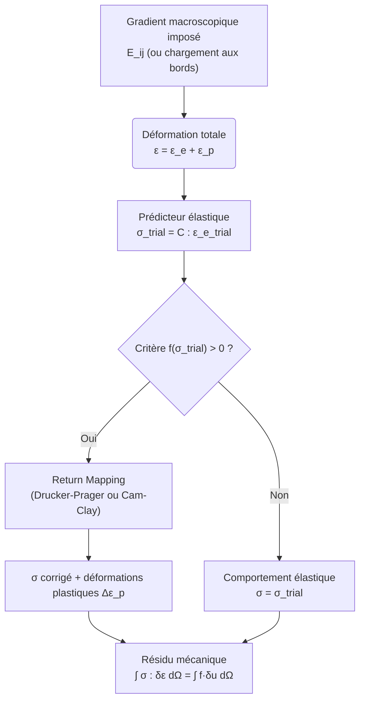
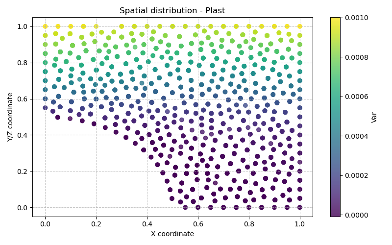

# Modèle Plast — Élasto-plasticité avec critère de Drucker-Prager (ou Cam-Clay)

> **Fichiers sources :**
> `src/Models/ModelFiles/Plast.cpp` · `base/Plast/Plast` · `base/Plast/Plast0` · `base/Plast/Plast1`
>
> **Auteurs du modèle :** P. Dangla (Université Gustave Eiffel)

---

## Table des matières

1. [Contexte et objectif](#1-contexte-et-objectif)
2. [Hypothèses](#2-hypothèses)
3. [Variables et notation](#3-variables-et-notation)
4. [Modèle mathématique](#4-modèle-mathématique)
   - 4.1 [Équation d'équilibre mécanique](#41-équation-déquilibre-mécanique)
   - 4.2 [Comportement élastique (Hooke isotrope)](#42-comportement-élastique-hooke-isotrope)
   - 4.3 [Critère de plasticité de Drucker-Prager](#43-critère-de-plasticité-de-drucker-prager)
   - 4.4 [Règle d'écoulement plastique (non-associée)](#44-règle-découlement-plastique-non-associée)
   - 4.5 [Intégration par retour radial (Return Mapping)](#45-intégration-par-retour-radial-return-mapping)
5. [Homogénéisation numérique et gradient macro](#5-homogénéisation-numérique-et-gradient-macro)
6. [Cas tests](#6-cas-tests)
   - 6.1 [Plast — Cellule composite 2D périodique (cisaillement)](#61-plast--cellule-composite-2d-périodique-cisaillement)
   - 6.2 [Plast0 — Cellule composite 1D périodique (traction)](#62-plast0--cellule-composite-1d-périodique-traction)
   - 6.3 [Plast1 — Couche cylindrique en pression (axisymétrie)](#63-plast1--couche-cylindrique-en-pression-axisymétrie)
7. [Paramétrage matériel du modèle](#7-paramétrage-matériel-du-modèle)
8. [Description pas-à-pas des fichiers d'entrée](#8-description-pas-à-pas-des-fichiers-dentrée)
   - 8.1 [Fichier `Plast` — cellule composite 2D, cisaillement périodique](#81-fichier-plast--cellule-composite-2d-cisaillement-périodique)
   - 8.2 [Fichier `Plast0` — cellule composite 1D, traction périodique](#82-fichier-plast0--cellule-composite-1d-traction-périodique)
   - 8.3 [Fichier `Plast1` — couche cylindrique axisymétrique sous pression interne](#83-fichier-plast1--couche-cylindrique-axisymétrique-sous-pression-interne)
9. [Implémentation numérique (`Plast.cpp`)](#9-implémentation-numérique-plastcpp)
10. [Références bibliographiques](#10-références-bibliographiques)

---

## 1. Contexte et objectif

Le modèle **Plast** résout les équations d'**équilibre mécanique quasi-statique** dans un matériau solide présentant un comportement **élasto-plastique**. Il repose sur la décomposition additive des déformations en une partie élastique réversible et une partie plastique irréversible, couplée à un critère de plastification de **Drucker-Prager** (ou **Cam-Clay**) avec écrouissage possible.

Ce modèle est particulièrement adapté à trois grandes familles de problèmes :

1. **Homogénéisation périodique** : calcul de la réponse macroscopique effective d'un matériau hétérogène (composite, géomatériau avec inclusions) soumis à un chargement macroscopique prescrit via un gradient de déplacement moyen.
2. **Plasticité locale** : simulations de géomatériaux (roches, ciments, argiles) présentant de la fissuration ou de l'écoulement plastique sous contrainte.
3. **Structures axisymétriques sous pression** : exemple d'une couronne cylindrique en pression interne/externe.



---

## 2. Hypothèses

1. **Petites déformations** : la décomposition additive $\boldsymbol{\varepsilon} = \boldsymbol{\varepsilon}^e + \boldsymbol{\varepsilon}^p$ est valide dans le cadre des petits déplacements.
2. **Élasticité isotrope linéaire** : le comportement élastique est entièrement décrit par le module d'Young $E$ et le coefficient de Poisson $\nu$.
3. **Plasticité parfaite ou avec écrouissage isotrope** : le critère de Drucker-Prager peut être associé à un écrouissage via la déformation plastique cumulée en cisaillement $\gamma_p$.
4. **Quasi-statique** : les termes inertiels sont négligés ; l'équilibre est résolu à chaque instant.
5. **Matériaux hétérogènes** : la cellule peut comporter plusieurs matériaux (modèle `Plast` pour la matrice, modèle `Elast` pour les inclusions rigides).

---

## 3. Variables et notation

### Inconnues primaires

| Symbole | Signification | Interne BIL |
|---------|---------------|-------------|
| $\mathbf{u}$ | Vecteur déplacement | `u_1, u_2, u_3` |

### Variables internes (points de Gauss)

| Symbole | Signification |
|---------|---------------|
| $\boldsymbol{\varepsilon}$ | Tenseur des déformations totales |
| $\boldsymbol{\sigma}$ | Tenseur des contraintes de Cauchy |
| $\boldsymbol{\varepsilon}^p$ | Tenseur des déformations plastiques cumulées |
| $\gamma_p$ | Déformation plastique en cisaillement cumulée (variable d'écrouissage) |
| $f$ | Valeur du critère de plasticité |
| $\Delta\lambda$ | Multiplicateur plastique |

### Invariants de contrainte

| Symbole | Définition |
|---------|-----------|
| $p$ | Pression moyenne : $p = \frac{1}{3}\text{Tr}(\boldsymbol{\sigma})$ |
| $q$ | Contrainte déviatorique : $q = \sqrt{3 J_2}$ avec $J_2 = \frac{1}{2} s_{ij} s_{ij}$ |
| $\mathbf{s}$ | Partie déviatorique : $\mathbf{s} = \boldsymbol{\sigma} - p \mathbf{I}$ |

---

## 4. Modèle mathématique

### 4.1 Équation d'équilibre mécanique

En quasi-statique et en l'absence de gravité ($\rho_s = 0$ dans les cas tests) :

$$\nabla \cdot \boldsymbol{\sigma} = \mathbf{0}$$

La forme variationnelle faible est :

$$\int_\Omega \boldsymbol{\sigma} : \nabla^s \delta\mathbf{u} \, d\Omega = \int_{\partial\Omega_N} \mathbf{t} \cdot \delta\mathbf{u} \, d\Gamma$$

où $\mathbf{t}$ est le vecteur des forces surfaciques imposées et $\delta\mathbf{u}$ un champ de déplacement virtuel admissible.

### 4.2 Comportement élastique (Hooke isotrope)

La loi élastique isotrope relie les contraintes aux déformations élastiques via les coefficients de Lamé $\lambda$ et $\mu$ :

$$\boldsymbol{\sigma} = \lambda \, \text{Tr}(\boldsymbol{\varepsilon}^e)\mathbf{I} + 2\mu \boldsymbol{\varepsilon}^e$$

avec :

$$\lambda = \frac{E\nu}{(1+\nu)(1-2\nu)}, \qquad \mu = \frac{E}{2(1+\nu)}$$

Le module de compressibilité (bulk modulus) et le module de cisaillement sont :

$$K = \frac{E}{3(1-2\nu)}, \qquad G = \mu = \frac{E}{2(1+\nu)}$$

### 4.3 Critère de plasticité de Drucker-Prager

Le critère de **Drucker-Prager** est une version lissée (conique) du critère de Mohr-Coulomb dans l'espace des invariants $(p, q)$ :

$$f(\boldsymbol{\sigma}, \gamma_p) = q + F \cdot p - C(\gamma_p) \leq 0$$

avec les paramètres dépendant de l'angle de frottement $\phi$ :

$$F = \frac{6\sin\phi}{3 - \sin\phi}, \qquad C_0 = \frac{6\cos\phi}{3 - \sin\phi} \cdot c$$

où $c$ est la cohésion du matériau (en Pa) et $C(\gamma_p) = C_0 \cdot \text{fac}(\gamma_p)$ est la cohésion modifiée par l'écrouissage.

> **Lien avec Mohr-Coulomb** : Le critère de Drucker-Prager correspond à l'inscription externe du cône de Mohr-Coulomb dans l'espace des contraintes principales. Pour $\phi = 25°$ et $c = 1.5$ MPa, on obtient $F \approx 0.755$ et $C_0 \approx 1.94$ MPa.

### 4.4 Règle d'écoulement plastique (non-associée)

Les incréments de déformation plastique suivent la règle d'écoulement non-associée :

$$\dot{\boldsymbol{\varepsilon}}^p = \dot{\lambda} \frac{\partial g}{\partial \boldsymbol{\sigma}}$$

où la **fonction potentielle** $g$ est définie avec l'**angle de dilatance** $\psi$ (distinct de l'angle de frottement $\phi$) :

$$g(\boldsymbol{\sigma}) = q + D \cdot p, \qquad D = \frac{6\sin\psi}{3 - \sin\psi}$$

Le gradient de la fonction de charge (direction normale) est :

$$\frac{\partial f}{\partial \sigma_{ij}} = \underbrace{\frac{3}{2} \frac{s_{ij}}{q}}_{\text{déviatorique}} + \underbrace{\frac{F}{3} \delta_{ij}}_{\text{volumique}}$$

Le gradient du potentiel (direction d'écoulement) est :

$$\frac{\partial g}{\partial \sigma_{ij}} = \frac{3}{2} \frac{s_{ij}}{q} + \frac{D}{3} \delta_{ij}$$

Le multiplicateur plastique $\dot{\lambda} \geq 0$ vérifie les conditions de Kuhn-Tucker :

$$f \leq 0, \quad \dot{\lambda} \geq 0, \quad \dot{\lambda} \cdot f = 0$$

### 4.5 Intégration par retour radial (Return Mapping)

L'algorithme de **return mapping** résout de façon incrémentale et implicite le problème de plasticité à chaque point de Gauss.

**Étape 1 — Prédicteur élastique (trial state) :**
$$\boldsymbol{\sigma}^\text{trial} = \boldsymbol{\sigma}_n + \mathbb{C} : \Delta\boldsymbol{\varepsilon}$$

**Étape 2 — Test du critère :**
$$f^\text{trial} = q^\text{trial} + F \cdot p^\text{trial} - C(\gamma_p^n)$$

- Si $f^\text{trial} \leq 0$ : comportement élastique, $\boldsymbol{\sigma} = \boldsymbol{\sigma}^\text{trial}$
- Si $f^\text{trial} > 0$ : retour plastique nécessaire

**Étape 3 — Correction plastique (régime lisse) :**

On cherche $\Delta\lambda > 0$ tel que $f(\boldsymbol{\sigma}^{n+1}, \gamma_p^{n+1}) = 0$. La correction s'écrit :
$$\boldsymbol{\sigma}^{n+1} = \boldsymbol{\sigma}^\text{trial} - \Delta\lambda \, \mathbb{C} : \frac{\partial g}{\partial \boldsymbol{\sigma}}$$

La pression est corrigée par la partie volumique :
$$p^{n+1} = p^\text{trial} - K \cdot D \cdot \Delta\lambda$$

La contrainte déviatorique est réduite par la partie déviatorique :
$$q^{n+1} = \frac{q^\text{trial}}{1 + 3G\Delta\lambda/q^\text{trial}}$$

La variable d'écrouissage est mise à jour :
$$\gamma_p^{n+1} = \gamma_p^n + \sqrt{3/2} \cdot \Delta\lambda$$

**Matrice tangente cohérente :** Lors de l'écoulement plastique ($q > 0$ et $\Delta\lambda > 0$), le module de cisaillement effectif est réduit :

$$G_1 = G \cdot \frac{q^\text{trial}}{q^\text{trial} + 3G\Delta\lambda}, \qquad K_1 = K$$

---

## 5. Homogénéisation numérique et gradient macro

Le modèle **Plast** intègre un mécanisme d'**homogénéisation périodique** permettant d'imposer un **gradient de déplacement macroscopique** $\mathbf{E}$ sur une cellule élémentaire représentative (RVE). Le déplacement local se décompose en :

$$\mathbf{u}(\mathbf{x}) = \mathbf{E} \cdot \mathbf{x} + \tilde{\mathbf{u}}(\mathbf{x})$$

où $\tilde{\mathbf{u}}$ est la fluctuation périodique. La déformation locale est alors :

$$\boldsymbol{\varepsilon}(\mathbf{u}) = \mathbf{E}^\text{sym} + \tilde{\boldsymbol{\varepsilon}}(\tilde{\mathbf{u}})$$

**Paramètres correspondants dans le fichier d'entrée :**

| Paramètre | Signification |
|-----------|---------------|
| `macro-gradient_ij` | Composante $E_{ij}$ du gradient macroscopique |
| `macro-fctindex_ij` | Index de la fonction temporelle modulant $E_{ij}(t)$ |

Le gradient macroscopique est ainsi $E_{ij}(t) = \texttt{macro-gradient\_ij} \times f_{\texttt{macro-fctindex\_ij}}(t)$.

Les **conditions de périodicité** (section `Periodicities`) imposent que les fluctuations $\tilde{\mathbf{u}}$ soient identiques sur les bords opposés de la cellule, avec le vecteur de période correspondant.

---

## 6. Cas tests

### 6.1 `Plast` — Cellule composite 2D périodique (cisaillement)

**Géométrie :** Cellule carrée $2 \times 2$ (unités adimensionnelles) en plan (`2 plan`), contenant 4 inclusions circulaires de rayon $R = 0.5$ aux quatre coins, assemblées par rotations successives de $90°$. Le maillage est défini dans `composite1.msh` (généré depuis `composite1.geo` et `inclusion.geo`).

**Physique :** Cisaillement macroscopique pur imposé par les composantes hors-diagonale du gradient :
$$E_{12} = E_{21} = 10^{-3} \times f(t)$$

La fonction $f(t)$ est linéaire de $0$ à $t=5$. Le chargement est donc un cisaillement croissant jusqu'à $\gamma = 5 \times 10^{-3}$.

- **Matrice** (Surface physique 1) : modèle `Plast` (Drucker-Prager), $E = 2.713$ GPa, $\nu = 0.339$, $c = 1.5$ MPa, $\phi = \psi = 25°$
- **Inclusions** (Surface physique 2) : modèle `Elast` (élasticité linéaire pure), $E = 2.713 \times 10^{10}$ GPa (quasi-rigide), $\nu = 0.49$

**Résultats attendus :** Sous cisaillement croissant, la matrice se plastifie d'abord aux points de concentration de contrainte (angles des inclusions), puis progressivement. Les inclusions quasi-rigides restent élastiques et redistribuent les contraintes. On observe la formation de bandes de cisaillement plastique.

### 6.2 `Plast0` — Cellule composite 1D périodique (traction)

**Géométrie :** Cellule 1D (`1 plan`) définie par 5 nœuds réguliers sur $[0, 1]$ avec un maillage à 10 éléments, contenant une couche souple (matrice) et une couche raide (inclusion). La périodicité relie les bords gauche (Région 1) et droit (Région 4) selon la direction $x_1$.

**Physique :** Traction macroscopique axiale imposée :
$$E_{11} = 10^{-3} \times f(t)$$

**Matériaux :** Identiques au cas `Plast` mais en 1D, avec seulement la composante `macro-gradient_11` active.

**Résultats attendus :** Plastification progressive de la matrice sous traction uniaxiale. La loi contrainte-déformation macroscopique effective montre un coude de plastification suivi d'un plateau (plasticité parfaite sans écrouissage dans ce cas).

### 6.3 `Plast1` — Couche cylindrique axisymétrique sous pression interne

**Géométrie :** Cylindre creux axisymétrique (`1 axis`), rayon interne $r_i = 0.1$ m, rayon externe $r_e = 0.2$ m. Discrétisation radiale avec 10 éléments.

**Physique :** Contraintes initiales isotropes $\sigma_0 = -1$ MPa (confinement). Chargement par une pression interne $p(t)$ appliquée en $r = r_i$ (Région 1) et une pression externe en $r = r_e$ (Région 3), modulées par la fonction $f(t)$ (linéaire de $-1$ à $t=0$ puis jusqu'à $5$ en $t=10$). La base est libre selon $r$.

**Matériau :** Modèle `Plast` (Drucker-Prager), $E = 10$ GPa, $\nu = 0.26$, $c = 1$ MPa, $\phi = \psi = 25°$.

**Résultats attendus :** Solution analytique connue pour la plasticité d'un cylindre épais (Lamé + Drucker-Prager). Le front de plastification se propage depuis le rayon interne vers l'extérieur à mesure que la pression interne augmente. On peut comparer le profil radial des contraintes $\sigma_r(r)$ et $\sigma_\theta(r)$ à la solution analytique.



---

## 7. Paramétrage matériel du modèle

### Paramètres communs

| Paramètre | Rôle physique |
|-----------|---------------|
| `young` | Module d'Young $E$ (Pa) — rigidité du squelette |
| `poisson` | Coefficient de Poisson $\nu$ — compressibilité latérale |
| `rho_s` | Densité massique sèche (kg/m³) — poids propre |
| `gravity` | Accélération gravitationnelle (m/s²) |
| `sig0_ij` | Contrainte initiale in situ $\sigma_0^{ij}$ (Pa) |

### Paramètres spécifiques Drucker-Prager (modèle 1)

| Paramètre | Rôle physique | Valeur typique |
|-----------|---------------|----------------|
| `cohesion` | Cohésion $c$ (Pa) | 1.5 MPa |
| `friction` | Angle de frottement $\phi$ (degrés) | 25° |
| `dilatancy` | Angle de dilatance $\psi$ (degrés) | 25° (associé) |

### Paramètres Cam-Clay (modèle 2, alternatif)

| Paramètre | Signification |
|-----------|---------------|
| `initial_pre-consolidation_pressure` | Pression de préconsolidation initiale $p_{c0}$ |
| `slope_of_swelling_line` | Pente de la ligne de gonflement $\kappa$ |
| `slope_of_virgin_consolidation_line` | Pente de la ligne de consolidation vierge $\lambda$ |
| `slope_of_critical_state_line` | Pente de la ligne d'état critique $M$ |
| `initial_void_ratio` | Indice des vides initial $e_0$ |

### Paramètres d'homogénéisation périodique

| Paramètre | Signification |
|-----------|---------------|
| `macro-gradient_ij` | Amplitude du gradient macroscopique $E_{ij}$ |
| `macro-fctindex_ij` | Index de la fonction temporelle (définie dans `Functions`) |

---

## 8. Description pas-à-pas des fichiers d'entrée

### 8.1 Fichier `Plast` — cellule composite 2D, cisaillement périodique

```
Geometry
2 plan
```
**Dimension :** Problème 2D en contraintes planes (`plan`). BIL résout les équations vectorielles en $x_1$ et $x_2$.

---

```
Mesh
composite1.msh
```
**Maillage externe :** Fichier GMSH généré depuis `composite1.geo` (qui inclut `inclusion.geo`). La géométrie comprend :
- Un carré $[0,2] \times [0,2]$ découpé en 4 quadrants
- Dans chaque quadrant, un quart de disque de rayon $R=0.5$ centré au coin correspondant
- Surface physique 1 = matrice (zones extérieures aux inclusions)
- Surface physique 2 = inclusions (zones circulaires)
- Les lignes physiques (régions 13, 14, 104, 105, 114, 115, 124, 125) correspondent aux bords de la cellule

---

```
Periodicities
4
MasterRegion = 105 SlaveRegion = 13  PeriodVector = 2 0 0
MasterRegion = 114 SlaveRegion = 125 PeriodVector = 2 0 0
MasterRegion = 115 SlaveRegion = 104 PeriodVector = 0 2 0
MasterRegion = 124 SlaveRegion = 14  PeriodVector = 0 2 0
```
**Conditions de périodicité :** 4 paires de régions maîtres/esclaves définissent la périodicité de la cellule dans les deux directions. Le vecteur de période $\mathbf{T}$ permet de relier les degrés de liberté des nœuds images :
$$\tilde{\mathbf{u}}(\mathbf{x} + \mathbf{T}) = \tilde{\mathbf{u}}(\mathbf{x})$$
C'est-à-dire que la **fluctuation** $\tilde{\mathbf{u}}$ est identique sur les bords opposés (les deux premiers couples gèrent la direction $x_1$, les deux derniers la direction $x_2$).

---

```
Material #1            # matrix
Model = Plast
young = 2713e6         # E = 2.713 GPa
poisson = 0.339        # ν = 0.339
cohesion = 1.5e+06     # c = 1.5 MPa
friction = 25          # φ = 25°
dilatancy = 25         # ψ = 25° (associé)
macro-gradient_12 = 1.e-3
macro-gradient_21 = 1.e-3
macro-fctindex_12 = 1
macro-fctindex_21 = 1
```
**Matériau 1 (matrice) :** La matrice obéit au critère de Drucker-Prager. La présence de `cohesion`, `friction`, `dilatancy` déclenche automatiquement la sélection du modèle plastique 1 (`SetPlasticModel(1)` dans `pm()`). Le gradient macroscopique de cisaillement est imposé : $E_{12}(t) = E_{21}(t) = 10^{-3} \times f_1(t)$, où $f_1$ est la fonction 1 définie dans `Functions`.

---

```
Material #2            # inclusion
Model = Elast
young = 2713e16        # E = 2.713e19 Pa (quasi-rigide)
poisson = 0.49
macro-gradient_12 = 1.e-3
macro-gradient_21 = 1.e-3
macro-fctindex_12 = 1
macro-fctindex_21 = 1
```
**Matériau 2 (inclusion) :** Les inclusions sont modélisées comme des corps rigides ($E$ multiplié par $10^{10}$ par rapport à la matrice). Elles utilisent le modèle `Elast` (élasticité pure, sans plasticité). Le même gradient macro est prescrit pour assurer la compatibilité du chargement.

---

```
Functions
1
N = 2  F(0) = 0  F(5) = 5
```
**Fonction de chargement :** Une seule fonction (index 1), linéaire par morceaux avec 2 points : $f(0) = 0$, $f(5) = 5$. Le gradient macroscopique vaut donc $E_{12}(t) = 10^{-3} \times t$ pour $0 \leq t \leq 5$.

---

```
Boundary Conditions
2
Region = 1 Unknown = u_1 Field = 0 Function = 0
Region = 1 Unknown = u_2 Field = 0 Function = 0
```
**Conditions aux limites :** Un point de la cellule (Région 1 = point origine dans le maillage) est bloqué en déplacement dans les deux directions pour supprimer les modes de corps rigide. Sans cela, avec les conditions périodiques et sans appui fixe, le système serait singulier.

---

```
Dates
6
0 1 2 3 4 5
```
**Instants de sortie :** Résultats sauvegardés à $t = 0, 1, 2, 3, 4, 5$ (correspondant aux fichiers `.t0` à `.t5`).

---

```
Objective Variations
u_1 = 1.e-4
u_2 = 1.e-4
```
**Contrôle adaptatif du pas de temps :** L'incrément de temps $\Delta t$ est ajusté pour que les variations relatives des inconnues restent autour de $10^{-4}$ par pas.

---

```
Iterative Process
Iterations = 10
Tolerance = 1.e-4
Repetition = 0
```
**Solveur non-linéaire :** Newton-Raphson avec au maximum 10 itérations par pas de temps, et une tolérance sur le résidu normalisé de $10^{-4}$.

---

### 8.2 Fichier `Plast0` — cellule composite 1D, traction périodique

```
DIME
1 plan
```
**Dimension :** Problème 1D en contraintes planes. Seul le déplacement $u_1$ est résolu.

---

```
MESH
5
0 0 0.5 1 1
0.05
1 10 10 1
2 2 1 1
```
**Maillage interne BIL (format simplifié) :** 5 nœuds aux positions $x = 0, 0, 0.5, 1, 1$ (les doublons indiquent des frontières de zones). Taille de maille cible : $h = 0.05$. La ligne `1 10 10 1` définit les régions physiques des segments, `2 2 1 1` les types de matériaux. La cellule est donc composée de deux segments : une couche centrale (matrice, matériau 1, $x \in [0, 0.5]$) et une couche externe (inclusion, matériau 2, $x \in [0.5, 1]$).

---

```
Periodicities
1
MasterRegion = 1 SlaveRegion = 4  PeriodVector = 1 0 0
```
**Périodicité 1D :** Le bord gauche (Région 1, $x=0$) est lié au bord droit (Région 4, $x=1$) avec la période $T_1 = 1$.

---

```
macro-gradient_11 = 1.e-3
macro-fctindex_11 = 1
```
**Traction macroscopique :** Seule la composante $E_{11}$ est active, imposant une déformation de traction/compression axiale.

---

```
Boundary Conditions
1
Region = 1 Unknown = u_1 Field = 0 Function = 0
```
**Blocage du mode rigide :** Le déplacement en $x=0$ est nul pour lever l'indétermination de la translation.

---

### 8.3 Fichier `Plast1` — couche cylindrique axisymétrique sous pression interne

```
DIME
1 axis
```
**Axisymétrie :** Problème 1D avec symétrie de révolution. BIL calcule automatiquement les termes de courbure dans l'équation d'équilibre.

---

```
MESH
4
0.1 0.1 0.2 0.2
1.e-2
1 10 1
1 1 1
```
**Géométrie :** 4 nœuds à $r = 0.1, 0.1, 0.2, 0.2$ m (rayons interne et externe de la couronne). Maillage à 10 éléments de taille $10^{-2}$ m. Un seul matériau (matériau 1) sur l'unique segment.

---

```
sig0_11 = -1e6
sig0_22 = -1e6
sig0_33 = -1e6
```
**État initial :** Contraintes initiales isotropes $\sigma_0 = -1$ MPa simulant un confinement (pression lithogène ou hydrostatique).

---

```
FLDS
1
Value = -1e6   Gradient = 0 0 0 Point = 0 0 0
```
**Champ initial de pression :** Champ scalaire uniforme de valeur $-1$ MPa utilisé pour initialiser les conditions (ici utilisé comme valeur de référence du chargement).

---

```
INIT
1
Region = 2  Unknown = u_1  Field = 0
```
**Initialisation :** Le déplacement en $u_1$ dans la Région 2 (bord interne, $r = r_i$) est initialisé à zéro (Field 0 = valeur nulle).

---

```
FUNC
1
N = 2  F(0) = -1  F(10) = 5
```
**Fonction de chargement :** Rampe de $f(0) = -1$ à $f(10) = 5$, soit $f(t) = -1 + 0.6t$. Cela permet de partir de la contrainte initiale de compression et d'augmenter progressivement la pression interne.

---

```
LOAD
2
Region = 1 Equation = meca_1 Type = force Field = 1 Function = 1
Region = 3 Equation = meca_1 Type = force Field = 1 Function = 0
```
**Chargements :** 
- **Région 1** ($r = r_i$) : pression interne $p_i = -10^6 \times f(t)$ Pa (force nodale en $r_i$, modulée par la fonction 1).
- **Région 3** ($r = r_e$) : pression externe fixe nulle ($f_0 = $ constante nulle, Function = 0).

---

```
DATE
5
0 1 2 3 4
```
**Instants de sortie :** 5 pas de temps à $t = 0, 1, 2, 3, 4$.

---

## 9. Implémentation numérique (`Plast.cpp`)

### 9.1 Architecture du code

Le fichier `Plast.cpp` s'appuie sur le patron de conception **MaterialPointMethod (MPM)** de BIL, qui décompose le calcul en quatre opérations distinctes exécutées à chaque point de Gauss :

| Méthode | Rôle |
|---------|------|
| `SetInputs` | Calcul de la déformation totale $\boldsymbol{\varepsilon}$ à partir des déplacements nodaux et du gradient macro |
| `Integrate` | Intégration constitutive : return mapping et mise à jour de $\boldsymbol{\sigma}$, $\boldsymbol{\varepsilon}^p$, $\gamma_p$ |
| `SetTangentMatrix` | Assemblage de la matrice tangente cohérente $\mathbb{C}^\text{ep}$ |
| `Initialize` | Initialisation de l'état (contraintes initiales, variables internes) |

### 9.2 Variables internes stockées (struct `ImplicitValues_t`)

```cpp
struct ImplicitValues_t {
  double Displacement[3];       // u_i
  double Strain[9];             // ε_ij
  double Stress[9];             // σ_ij
  double BodyForce[3];          // ρ g_i
  double PlasticStrain[9];      // ε^p_ij
  double HardeningVariable;     // γ_p (déformation plastique cumulée)
  double CriterionValue;        // f(σ, γ_p)
  double PlasticMultiplier;     // Δλ
};
```

### 9.3 Sélection du modèle plastique

La fonction `pm()` (property manager) identifie le modèle plastique à partir des mots-clés du fichier d'entrée :
- `cohesion`, `friction`, `dilatancy` → Drucker-Prager (`plasticmodel = 1`)
- `slope_of_swelling_line`, etc. → Cam-Clay (`plasticmodel = 2`)

Ce mécanisme permet d'utiliser le même fichier `Plast.cpp` pour différents critères plastiques sans modifier le code.

### 9.4 Gradient macro et décomposition cinématique

La déformation locale à chaque point de Gauss est :
$$\boldsymbol{\varepsilon} = \mathbf{E}^\text{sym}(t) + \boldsymbol{\varepsilon}(\tilde{\mathbf{u}})$$

La fonction `MacroStrain()` calcule la partie symétrique du gradient macro :
```cpp
strain[3*i + j] = 0.5*(grd[3*i + j] + grd[3*j + i]);
```

La fonction `MacroGradient()` évalue l'amplitude temporelle en interpolant la fonction de chargement $f_k(t)$ pour chaque composante $E_{ij}$.

### 9.5 Résidu mécanique

Le résidu est calculé via `FEM_ComputeStrainWorkResidu`, qui intègre par quadrature de Gauss :
$$r_i^\alpha = \int_\Omega \sigma_{ij} \frac{\partial N^\alpha}{\partial x_j} d\Omega$$
où $N^\alpha$ sont les fonctions de forme associées au nœud $\alpha$.

---

## 10. Références bibliographiques

- **Drucker, D. C. & Prager, W.** (1952). Soil mechanics and plastic analysis or limit design. *Quarterly of Applied Mathematics*, 10(2), 157–165. — Critère original de Drucker-Prager, extension conique du critère de Mohr-Coulomb dans l'espace des contraintes principales.

- **Simo, J. C. & Hughes, T. J. R.** (1998). *Computational Inelasticity*. Springer, New York. — Référence fondamentale pour l'algorithme de return mapping et la matrice tangente cohérente utilisés dans `PlasticityDruckerPrager.c`.

- **de Souza Neto, E. A., Perić, D. & Owen, D. R. J.** (2008). *Computational Methods for Plasticity: Theory and Applications*. Wiley. — Détaille les algorithmes d'intégration implicite pour la plasticité de Drucker-Prager, notamment le traitement du sommet du cône.

- **Roscoe, K. H. & Burland, J. B.** (1968). On the generalised stress-strain behaviour of wet clay. In *Engineering Plasticity*, Cambridge University Press, 535–609. — Fondement théorique du modèle Cam-Clay modifié, implémenté comme modèle alternatif dans `Plast.cpp`.

- **Suquet, P.** (1987). Elements of Homogenization for Inelastic Solid Mechanics. In *Homogenization Techniques for Composite Media*, Springer, 193–278. — Base théorique des conditions de périodicité et de la décomposition macro/micro utilisée dans les cas `Plast` et `Plast0`.

- **Hill, R.** (1963). Elastic properties of reinforced solids: some theoretical principles. *Journal of the Mechanics and Physics of Solids*, 11(5), 357–372. — Lemme de Hill (relation entre moyenne des contraintes/déformations et travail des efforts macroscopiques), fondement de l'homogénéisation numérique périodique.
