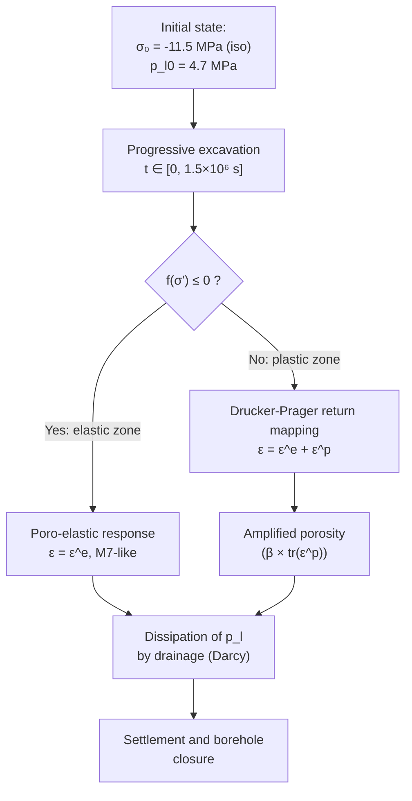

# Poroplast Model — Poro-elastoplasticity with Hardening (Borehole Drilling in a Saturated Porous Medium)

> **Bil model:** `src/Models/ModelFiles/Poroplast.cpp`

> **Input file:** `doc/mkdocs/Poromchanics/Poroplast/Poroplast`
>
> **Model authors:** P. Dangla (Université Gustave Eiffel)

---

## Table of Contents

1. [Context and Objective](#1-context-and-objective)
2. [Assumptions](#2-assumptions)
3. [Variables and Notation](#3-variables-and-notation)
4. [Mathematical Model](#4-mathematical-model)
   - 4.1 [Equilibrium and Conservation Equations](#41-equilibrium-and-conservation-equations)
   - 4.2 [Poro-elastoplastic Constitutive Laws](#42-poro-elastoplastic-constitutive-laws)
   - 4.3 [Drucker-Prager Criterion and Return Mapping Algorithm](#43-drucker-prager-criterion-and-return-mapping-algorithm)
5. [Boundary and Initial Conditions](#5-boundary-and-initial-conditions)
6. [Test Case: Borehole Drilling in a Saturated Rock (`base/Poroplast/`)](#6-test-case-borehole-drilling-in-a-saturated-rock-baseporoplast)
7. [Material Parameters of the Model](#7-material-parameters-of-the-model)
8. [Step-by-Step Description of Input Files](#8-step-by-step-description-of-input-files)
9. [References](#9-references)

---

## 1. Context and Objective

The **Poroplast** model extends the Biot poro-elasticity model (see model M7) by introducing **irreversible plastic behavior** of the solid skeleton. It is a fundamental model in **rock geomechanics** and **soil mechanics** for predicting:

- The **plastic (failure) zone** around a borehole (oil well, nuclear storage gallery, tunnel);
- **Time-delayed creep** due to pore pressure dissipation in the damaged zone;
- **Permanent deformations** and **borehole closure** over time.

The test case presented here simulates the **progressive excavation of a cylindrical borehole** in a saturated porous medium initially subjected to an isotropic stress state (lithostatic equilibrium). Excavation removes the mechanical support at the inner wall, inducing stress redistribution that may exceed the material strength.



---

## 2. Assumptions

1. **1D axisymmetric geometry**: The problem is set in a cylindrical coordinate system $(r, \theta, z)$ with angular and vertical invariance. The problem is therefore purely radial.
2. **Full saturation**: The medium is entirely saturated with water ($S_l = 1$). No gas pressure.
3. **Isotropic elastoplastic skeleton**: Elastic behavior is linear (Lamé), and plastic behavior follows the **Drucker-Prager criterion** (softening possible, here without hardening).
4. **Generalized Biot coupling**: Two Biot coefficients are introduced:
   - $b$: elastic Biot coefficient, appearing in the mechanical constitutive law;
   - $\beta$: plastic Biot coefficient, modulating the pressure contribution to the yield threshold in the plastically deformed zone.
5. **Small strains**: Linearized displacement formulation.
6. **Darcy's law**: Fluid flux is proportional to the pressure gradient, with no capillary hysteresis.

---

## 3. Variables and Notation

The model solves $1 + \text{dim}$ coupled equations (1 hydraulic + dim mechanical).

### Primary Unknowns

| Symbol | Meaning | BIL Internal |
|--------|---------|--------------|
| $p_l$ | Interstitial liquid pressure | `p_l` |
| $\mathbf{u}$ | Solid skeleton displacement vector | `u_1` (axisym. 1D) |

### Constitutive Variables (at Gauss Points)

| Symbol | Meaning |
|--------|---------|
| $\boldsymbol{\varepsilon}$ | Linearized total strain tensor |
| $\boldsymbol{\varepsilon}^p$ | Plastic strain tensor |
| $\boldsymbol{\sigma}$ | Total stress tensor |
| $\boldsymbol{\sigma}'$ | Effective stresses (in the Biot-plasticity sense) |
| $\phi$ | Current porosity (strain + plasticity) |
| $\gamma^p = \kappa$ | Hardening variable: cumulated deviatoric plastic strain |
| $\Delta\lambda$ | Plastic multiplier |
| $f$ | Value of the yield function (Drucker-Prager) |

---

## 4. Mathematical Model

### 4.1 Equilibrium and Conservation Equations

**Mechanical equilibrium (quasi-static):**
$$\nabla \cdot \boldsymbol{\sigma} + (\rho_s + m_l)\,\mathbf{g} = \mathbf{0}$$

**Water mass conservation:**
$$\frac{\partial m_l}{\partial t} + \nabla \cdot \mathbf{W}_l = 0$$

with the liquid mass $m_l = \rho_l\,\phi$ and the Darcy flux:
$$\mathbf{W}_l = -\frac{\rho_l\,k_\text{int}}{\mu_l}\,\nabla p_l + \frac{\rho_l^2\,k_\text{int}}{\mu_l}\,\mathbf{g}$$

### 4.2 Poro-elastoplastic Constitutive Laws

**Hooke–Biot law with plasticity:**

$$\boldsymbol{\sigma} = \boldsymbol{\sigma}_0 + \mathbb{C} : (\boldsymbol{\varepsilon} - \boldsymbol{\varepsilon}^p) - b\,(p_l - p_{l0})\,\mathbf{I}$$

where $\mathbb{C}$ is the isotropic Lamé stiffness tensor:
$$C_{ijkl} = \lambda\,\delta_{ij}\delta_{kl} + \mu\,(\delta_{ik}\delta_{jl} + \delta_{il}\delta_{jk})$$
with $\lambda = \frac{E\nu}{(1+\nu)(1-2\nu)}$ and $\mu = \frac{E}{2(1+\nu)}$.

**Porosity evolution (with plastic contribution):**
$$\phi = \phi_0 + b\,(\text{tr}\,\boldsymbol{\varepsilon} - \text{tr}\,\boldsymbol{\varepsilon}^p) + N\,(p_l - p_{l0}) + \beta\,\text{tr}\,\boldsymbol{\varepsilon}^p$$

The term $\beta\,\text{tr}\,\boldsymbol{\varepsilon}^p$ reflects the fact that plastic dilatancy (opening of cracks and pores) contributes to porosity irreversibly with a coefficient $\beta \neq b$.

**Liquid mass:**
$$m_l = \rho_l\,\phi, \qquad \rho_l = \rho_{l0}\left(1 + \frac{p_l - p_{l0}}{k_l}\right)$$

### 4.3 Drucker-Prager Criterion and Return Mapping Algorithm

The model uses the **Drucker-Prager** criterion applied to the effective stresses (in the plastic sense):
$$\boldsymbol{\sigma}' = \boldsymbol{\sigma} + \beta\,p_l\,\mathbf{I}$$

**Yield function:**
$$f(\boldsymbol{\sigma}') = q + \alpha_f\,p' - c_c \leq 0$$

with:
- $p' = \frac{1}{3}\,\text{tr}\,\boldsymbol{\sigma}'$: effective mean stress,
- $q = \sqrt{3\,J_2(\boldsymbol{\sigma}')}$: deviatoric stress (Von Mises measure),
- $\alpha_f = \dfrac{6\sin\varphi}{3 - \sin\varphi}$, $\quad c_c = \dfrac{6\cos\varphi}{3-\sin\varphi}\cdot c$: Drucker-Prager cone parameters as functions of the friction angle $\varphi$ and cohesion $c$.

**Non-associated flow rule (plastic potential):**
$$\dot{\boldsymbol{\varepsilon}}^p = \Delta\lambda\,\frac{\partial g}{\partial \boldsymbol{\sigma}'}, \qquad g(\boldsymbol{\sigma}') = q + \alpha_d\,p' \quad \text{(no cohesion term)}$$
with $\alpha_d = \dfrac{6\sin\psi}{3-\sin\psi}$ and $\psi$ the dilatancy angle.

The implementation uses the **consistent return mapping algorithm** (`ReturnMapping`), which computes $\Delta\lambda$ by solving the projection problem onto the yield surface, then updates stresses, plastic strains, and the multiplier, providing the operational tangent matrix for Newton-Raphson.

---

## 5. Boundary and Initial Conditions

### Initial State

- **Interstitial pressure**: $p_l = p_{l0} = 4.7$ MPa (lithostatic hydrostatic pressure at depth).
- **Total stress**: isotropic $\boldsymbol{\sigma}_0 = -11.5$ MPa $\cdot\mathbf{I}$ (lithostatic compression).
- **Plastic strains**: zero ($\boldsymbol{\varepsilon}^p_0 = 0$).

### Boundary Conditions

| Region | Type | Initial Value | Evolution |
|--------|------|--------------|-----------|
| Inner wall (Region 1) | Pressure $p_l$ | $4.7\times10^6$ Pa | Reduced to $0$ linearly over $[0,\,1.5\times10^6\,\text{s}]$ |
| Inner wall (Region 1) | Radial force | $+11.5\times10^6$ Pa | Reduced to $0$ linearly (removal of excavation support) |
| Outer boundary (Region 6) | Pressure $p_l$ | $4.7\times10^6$ Pa | Constant (far field) |
| Outer boundary (Region 6) | Radial force | $-11.5\times10^6$ Pa | Constant (lithostatic confinement) |

Excavation is modeled by a **time ramp** (Function 1: F(0)=1, F(1.5×10⁶)=0) that progressively reduces the inner wall pressure and support from their initial values (equilibrium state) to zero (free and drained wall).

---

## 6. Test Case: Borehole Drilling in a Saturated Rock (`base/Poroplast/`)

### Problem Geometry

The behavior of a **saturated porous rock** around a cylindrical borehole is simulated in a radial axisymmetric coordinate system. The main geometric parameters are:

- **Borehole radius** (inner wall, Region 1): inner boundary of the radial domain.
- **Far-field distance** (Region 6): outer boundary at ~65 m from the center.
- **1D radial mesh**: 7 zones with progressive refinement near the borehole (segments of 3 m, 3 m, 4 m) toward coarser elements in the far field (20 m, 20 m).

### Observed Physics

The problem unfolds in **three phases**:

1. **Transient excavation phase** ($t \in [0,\,1.5\times10^6\,\text{s}]$ ≈ 17 days):  
   Pressure and support at the wall decrease progressively. A **radial pressure gradient** develops, driving inward flow (drainage). Simultaneously, stress redistribution creates a **plastic zone** (plastic annulus) around the borehole where $f > 0$.

2. **Consolidation phase** ($t \in [1.5\times10^6,\,50\times10^6\,\text{s}]$ ≈ 578 days):  
   Excavation is complete. The excess pore pressure in the damaged zone **dissipates slowly** (the rock has low permeability: $k_\text{int} = 10^{-19}$ m²). This dissipation progressively transfers total stress to the solid skeleton, resulting in **time-delayed radial displacement** (delayed borehole closure).

3. **Long-term consolidation phase** ($t \approx 300\times10^6\,\text{s}]$ ≈ 9.5 years):  
   Hydraulic equilibrium is nearly reached. The final pressure distribution is quasi-stationary. The **maximum radial displacement** (borehole convergence) is attained.

### Simulation Outputs

The 4 quantities plotted (`.gp` file) are:

| Curve | `.tN` Columns | Physical Meaning |
|-------|--------------|-----------------|
| Radial displacement $u_r$ | col. 5 | Borehole convergence (closure) |
| Pore pressure $p_l$ | col. 4 | Dissipation of excess pore pressure |
| Volumetric plastic strain | col. 20+24+28 | Trace of $\boldsymbol{\varepsilon}^p$ in the damaged zone |
| Effective hoop stress $\sigma'_{\theta\theta}$ | col. 19 + $\beta$ × col. 4 | Evolution of the effective stress state |


---

## 7. Material Parameters of the Model

| Parameter | Value | Physical Role |
|-----------|-------|--------------|
| `young` | 5.8×10⁹ Pa | Young's modulus of the dry rock — elastic stiffness. |
| `poisson` | 0.3 | Poisson's ratio — lateral contraction under axial load. |
| `porosity` | 0.15 | Initial porosity $\phi_0$ — pore volume fraction in the rock. |
| `rho_s` | 2350 kg/m³ | Solid skeleton density — gravitational body force. |
| `rho_l` | 1000 kg/m³ | Water density. |
| `p_l0` | 4.7×10⁶ Pa | Initial equilibrium pressure ($\approx$ 470 m depth). |
| `k_l` | 2×10⁹ Pa | Water bulk modulus (nearly incompressible). |
| `k_int` | 1×10⁻¹⁹ m² | Very low intrinsic permeability (tight rock). |
| `mu_l` | 0.001 Pa·s | Dynamic viscosity of water at 20°C. |
| `b` | 0.8 | Elastic Biot coefficient ($b < 1$: partially compressible grains). |
| `N` | 4×10⁻¹¹ Pa⁻¹ | Pore compressibility (Biot storage). |
| `cohesion` | 1×10⁶ Pa | Cohesion $c$ of the rock in pure shear. |
| `friction` | 25° | Internal friction angle $\varphi$ (Drucker-Prager). |
| `dilatancy` | 25° | Dilatancy angle $\psi$ (= $\varphi$: associated flow here). |
| `beta` | 0.8 | Plastic Biot coefficient — irreversible pressure contribution to the criterion. |
| `sig0_11,22,33` | −11.5×10⁶ Pa | Initial isotropic lithostatic total stress. |

---

## 8. Step-by-Step Description of Input Files

### 8.1 `Geometry` Block

```
Geometry
1 axis
```

- `1`: **1-dimensional** problem (radial only).
- `axis`: **cylindrical axisymmetric** geometry (the degree of freedom is the radial component $u_r$; components $u_\theta, u_z$ are zero by symmetry). This declaration activates the $1/r$ geometric terms in the differential operators (divergence, gradient).

### 8.2 `Mesh` Block

```
Mesh
7 3. 3. 4. 5. 10. 20. 20.
0.05
1 20 10 40 30 1
1 1 1 1 1 1
```

- **Line 1**: `7` radial zones with respective lengths of 3, 3, 4, 5, 10, 20, 20 m. The total modeled distance is $3+3+4+5+10+20+20 = 65$ m from the borehole wall.
- **Line 2**: `0.05` — reference element size (in meters), ensuring good resolution in the high stress gradient zones near the borehole.
- **Line 3**: `1 20 10 40 30 1` — number of elements in each subdivision zone. Zone 2 (3 m) contains 20 elements (Δr = 0.15 m, fine mesh); far-field zones are coarser. The total yields approximately 102 elements.
- **Line 4**: `1 1 1 1 1 1` — material region index for each mesh zone. Here all cells belong to material region 1.

The **boundary region numbering** (Regions 1 and 6) is automatically generated at the two ends of the 1D domain by BIL, corresponding respectively to the **borehole wall** (minimum r) and the **far field** (maximum r).

### 8.3 `Material` Block

```
Material
Model = Poroplast
gravity = 0
rho_s = 2350
young = 5.8e+09
...
cohesion = 1e+06
friction = 25
dilatancy = 25
beta = 0.8
sig0_11 = -11.5e6 
sig0_22 = -11.5e6 
sig0_33 = -11.5e6
```

- `Model = Poroplast`: selects the poro-elastoplastic model (loads the corresponding `.cpp`).
- `gravity = 0`: the gravity field is disabled — only the behavior due to lateral unloading is studied, without a vertical stress gradient from self-weight.
- `sig0_11/22/33 = -11.5e6`: defines the **isotropic** initial stress state (sign convention: negative = compression). BIL reads `sig0_ij` as $\sigma_{ij}^0$ in component-row order (11=radial, 22=tangential, 33=axial).
- The **Drucker-Prager** model is automatically activated by the presence of `cohesion`, `friction`, `dilatancy` parameters in `ReadMatProp` (see `src/Models/ModelFiles/Poroplast.cpp:325`).

### 8.4 `Fields` Block

```
Fields
3
Value = 4.7e6   Gradient = 0  Point = 0
Value = 11.5e6  Gradient = 0. Point = 0.
Value = -11.5e6 Gradient = 0. Point = 0.
```

Defines 3 constant scalar fields (zero gradient throughout the domain):

| Field | Value | Usage |
|-------|-------|-------|
| Field 1 | 4.7 MPa | Initial water pressure — initial condition and hydraulic BC |
| Field 2 | +11.5 MPa | Positive compressive force — initial support at the inner wall |
| Field 3 | −11.5 MPa | Negative compressive force — far-field confinement |

### 8.5 `Initialization` Block

```
Initialization
4
Region = 2 Unknown = p_l Field = 1
Region = 3 Unknown = p_l Field = 1
Region = 4 Unknown = p_l Field = 1
Region = 5 Unknown = p_l Field = 1
```

Initializes the pressure $p_l$ to the value of Field 1 (4.7 MPa) in all interior regions 2 through 5. Regions 1 and 6 (boundaries) are driven by the **boundary conditions** below. This initialization creates an isobaric equilibrium state ($\nabla p_l = 0$) consistent with the initial isotropic stress state.

### 8.6 `Functions` Block

```
Functions
1
N = 2 F(0.) = 1. F(1.5e6) = 0.
```

Defines **Function 1**: a linearly decreasing ramp from 1 to 0 between $t = 0$ and $t = 1.5\times10^6$ s. This function is the time multiplier applied to the inner wall boundary conditions, modeling progressive excavation (gradual removal of support).

**Function 0** (implicit in BIL) = constant multiplier = 1 (condition always active at its nominal value).

### 8.7 `Boundary Conditions` Block

```
Boundary Conditions
2
Region = 1 Unknown = p_l Field = 1 Function = 1
Region = 6 Unknown = p_l Field = 1 Function = 0
```

| Region | Unknown | Imposed Value | Evolution |
|--------|---------|--------------|-----------|
| Region 1 (wall) | `p_l` | Field 1 = 4.7 MPa | × Function 1 → $4.7$ MPa to $0$ over $1.5\times10^6$ s |
| Region 6 (far field) | `p_l` | Field 1 = 4.7 MPa | × Function 0 = constant |

The inner wall is therefore **initially impermeable** and then drains progressively (perfect drain at the end of excavation, $p_l = 0$). The far field maintains the original lithostatic pressure.

### 8.8 `Loads` Block

```
Loads
2
Region = 1 Equation = meca_1 Type = force Field = 2 Function = 1
Region = 6 Equation = meca_1 Type = force Field = 3 Function = 0
```

| Region | Equation | Type | Value | Evolution |
|--------|----------|------|-------|-----------|
| Region 1 (wall) | `meca_1` | force | Field 2 = +11.5 MPa | Reduced to 0 (excavation) |
| Region 6 (far field) | `meca_1` | force | Field 3 = −11.5 MPa | Constant (confinement) |

The **force of +11.5 MPa at the inner wall** initially represents the soil reaction before excavation (equilibrium state with natural support). By reducing it to zero, the **loading of the surrounding rock** due to the creation of the void is simulated. The **force of −11.5 MPa at the outer boundary** is the compressive stress of the far field (negative sign = compression in the BIL convention for surface forces).

### 8.9 `Dates` Block and Time Control

```
Dates
4
0. 1.5e6 50.e6 300.e6
```

| Date | Value | Meaning |
|------|-------|---------|
| 0 | $t = 0$ | Initial state |
| $1.5\times10^6$ s | ≈ 17 days | End of excavation (internal pressure = 0) |
| $50\times10^6$ s | ≈ 1.6 years | Partial consolidation, onset of extended drainage |
| $300\times10^6$ s | ≈ 9.5 years | Hydraulic equilibrium nearly reached |

```
Objective Variations
u_1 = 1.e-3 
p_l = 1.e5
```

Adaptive convergence criteria: a time step is acceptable if the relative variation of displacement is < $10^{-3}$ m and that of pressure is < $10^5$ Pa between two iterations.

```
Time Steps
Dtini = 1.e3 
Dtmax = 1.e8 
```

Very small initial time step (1000 s) because the mechanical shocks due to excavation are abrupt. The time step can then grow up to $10^8$ s once the state becomes quasi-stationary.

---

## 9. References

- **Biot, M. A.** (1941). General theory of three-dimensional consolidation. *Journal of Applied Physics*, 12(2), 155–164. — Foundation of elastic hydromechanical coupling.
- **Coussy, O.** (2004). *Poromechanics*. John Wiley & Sons. — Extension to unsaturated media and plastic deformations. Introduces the coefficients $b$, $N$, and $\beta$.
- **Drucker, D. C. & Prager, W.** (1952). Soil mechanics and plastic analysis or limit design. *Quarterly of Applied Mathematics*, 10(2), 157–165. — Drucker-Prager plasticity criterion used for rock.
- **Detournay, E. & Cheng, A. H.-D.** (1993). Fundamentals of poroelasticity. *Comprehensive Rock Engineering*, 2, 113–171. — Primary reference for poro-elasticity applied to boreholes.
- **Charlez, P. A.** (1991). *Rock Mechanics — Vol. 1: Theoretical Fundamentals*. Éditions Technip. — Presentation of wellbore stability in porous media.
- **Dangla, P.** — BIL internal documentation, *Poroplasticity with hardening* (2019). — Poroplast model, title registered in `TITLE` of the source file.
