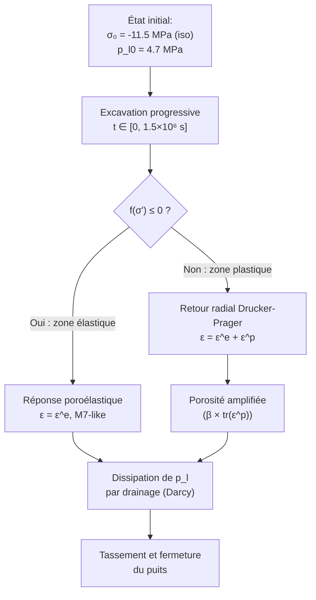
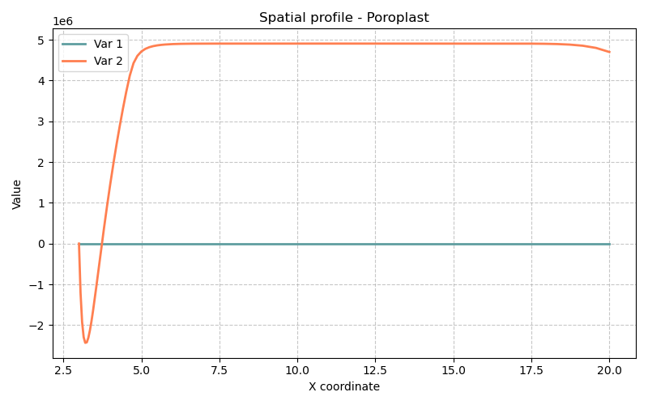

# Modèle Poroplast — Poroélastoplasticité avec Écrouissage (Forage en Milieu Poreux Saturé)

> **Fichiers sources :**
> `src/Models/ModelFiles/Poroplast.cpp` · `base/Poroplast/Poroplast`
>
> **Auteurs du modèle :** P. Dangla (Université Gustave Eiffel)

---

## Table des matières

1. [Contexte et objectif](#1-contexte-et-objectif)
2. [Hypothèses](#2-hypothèses)
3. [Variables et notation](#3-variables-et-notation)
4. [Modèle mathématique](#4-modèle-mathématique)
   - 4.1 [Équations d'équilibre et de conservation](#41-équations-déquilibre-et-de-conservation)
   - 4.2 [Lois de comportement poroélastoplastique](#42-lois-de-comportement-poroélastoplastique)
   - 4.3 [Critère de Drucker-Prager et algorithme de retour radial](#43-critère-de-drucker-prager-et-algorithme-de-retour-radial)
5. [Conditions aux limites et initiales](#5-conditions-aux-limites-et-initiales)
6. [Cas test : Forage d'un puits dans une roche saturée (`base/Poroplast/`)](#6-cas-test--forage-dun-puits-dans-une-roche-saturée-baseporoplast)
7. [Paramétrage matériel du modèle](#7-paramétrage-matériel-du-modèle)
8. [Description pas-à-pas des fichiers d'entrée](#8-description-pas-à-pas-des-fichiers-dentrée)
9. [Références bibliographiques](#9-références-bibliographiques)

---

## 1. Contexte et objectif

Le modèle **Poroplast** étend le modèle de poroélasticité de Biot (cf. modèle M7) en introduisant un **comportement plastique irréversible** du squelette solide. C'est un modèle fondamental en **géomécanique des roches** et en **mécanique des sols** pour prédire :

- La **zone de plastification** (rupture) autour d'un forage (puits pétrolier, galerie de stockage nucléaire, tunnel) ;
- Le **fluage différé** dû à la dissipation de la pression de pore dans la zone endommagée ;
- Les **déformations permanentes** et la **fermeture** du puits au cours du temps.

Le cas test présenté ici simule l'**excavation progressive d'un forage cylindrique** dans un milieu poreux saturé soumis initialement à une contrainte isotrope (équilibre lithostique). L'excavation supprime le support mécanique sur le paroi interne, induisant une redistribution des contraintes pouvant dépasser la résistance du matériau.



---

## 2. Hypothèses

1. **Géométrie axisymétrique 1D** : On se place dans un repère cylindrique $(r, \theta, z)$ avec invariance angulaire et verticale. Le problème est donc purement radial.
2. **Saturation complète** : Le milieu est entièrement saturé en eau ($S_l = 1$). Pas de pression de gaz.
3. **Squelette élastoplastique isotrope** : Le comportement élastique est linéaire (Lamé), le comportement plastique suit le **critère de Drucker-Prager** (adoucissement possible, ici sans écrouissage).
4. **Couplage de Biot généralisé** : Deux coefficients de Biot sont introduits :
   - $b$ : coefficient de Biot élastique, intervenant dans la loi d'état mécanique ;
   - $\beta$ : coefficient de Biot plastique, modulant la contribution de la pression au seuil de plasticité dans la zone déformée plastiquement.
5. **Petites déformations** : Formulation en déplacements linéarisés.
6. **Loi de Darcy** : Le flux de fluide est proportionnel au gradient de pression, sans hystérésis de capillarité.

---

## 3. Variables et notation

Le modèle résout $1 + \text{dim}$ équations couplées (1 hydraulique + dim mécaniques).

### Inconnues primaires

| Symbole | Signification | Interne BIL |
|---------|---------------|-------------|
| $p_l$ | Pression du liquide interstitiel | `p_l` |
| $\mathbf{u}$ | Vecteur déplacement du squelette solide | `u_1` (axisym. 1D) |

### Variables de comportement (aux points de Gauss)

| Symbole | Signification |
|---------|---------------|
| $\boldsymbol{\varepsilon}$ | Tenseur des déformations totales linéarisé |
| $\boldsymbol{\varepsilon}^p$ | Tenseur des déformations plastiques |
| $\boldsymbol{\sigma}$ | Tenseur des contraintes totales |
| $\boldsymbol{\sigma}'$ | Contraintes effectives (au sens de Biot-plasticité) |
| $\phi$ | Porosité courante (déformation + plasticité) |
| $\gamma^p = \kappa$ | Variable d'écrouissage : déformation plastique déviatorique cumulée |
| $\Delta\lambda$ | Multiplicateur plastique |
| $f$ | Valeur de la fonction de charge (Drucker-Prager) |

---

## 4. Modèle mathématique

### 4.1 Équations d'équilibre et de conservation

**Équilibre mécanique (quasi-statique) :**
$$\nabla \cdot \boldsymbol{\sigma} + (\rho_s + m_l)\,\mathbf{g} = \mathbf{0}$$

**Conservation de la masse d'eau :**
$$\frac{\partial m_l}{\partial t} + \nabla \cdot \mathbf{W}_l = 0$$

avec la masse de liquide $m_l = \rho_l\,\phi$ et le flux de Darcy :
$$\mathbf{W}_l = -\frac{\rho_l\,k_\text{int}}{\mu_l}\,\nabla p_l + \frac{\rho_l^2\,k_\text{int}}{\mu_l}\,\mathbf{g}$$

### 4.2 Lois de comportement poroélastoplastique

**Loi de Hooke–Biot avec plasticité :**

$$\boldsymbol{\sigma} = \boldsymbol{\sigma}_0 + \mathbb{C} : (\boldsymbol{\varepsilon} - \boldsymbol{\varepsilon}^p) - b\,(p_l - p_{l0})\,\mathbf{I}$$

où $\mathbb{C}$ est le tenseur de raideur isotrope de Lamé :
$$C_{ijkl} = \lambda\,\delta_{ij}\delta_{kl} + \mu\,(\delta_{ik}\delta_{jl} + \delta_{il}\delta_{jk})$$
avec $\lambda = \frac{E\nu}{(1+\nu)(1-2\nu)}$ et $\mu = \frac{E}{2(1+\nu)}$.

**Évolution de la porosité (avec contribution plastique) :**
$$\phi = \phi_0 + b\,(\text{tr}\,\boldsymbol{\varepsilon} - \text{tr}\,\boldsymbol{\varepsilon}^p) + N\,(p_l - p_{l0}) + \beta\,\text{tr}\,\boldsymbol{\varepsilon}^p$$

Le terme $\beta\,\text{tr}\,\boldsymbol{\varepsilon}^p$ traduit le fait que la dilatance plastique (ouverture des fissures et pores) contribue à la porosité de manière irréversible avec un coefficient $\beta \neq b$.

**Masse de liquide :**
$$m_l = \rho_l\,\phi, \qquad \rho_l = \rho_{l0}\left(1 + \frac{p_l - p_{l0}}{k_l}\right)$$

### 4.3 Critère de Drucker-Prager et algorithme de retour radial

Le modèle utilise le critère de **Drucker-Prager** sur les contraintes effectives (au sens plastique) :
$$\boldsymbol{\sigma}' = \boldsymbol{\sigma} + \beta\,p_l\,\mathbf{I}$$

**Fonction de charge :**
$$f(\boldsymbol{\sigma}') = q + \alpha_f\,p' - c_c \leq 0$$

avec :
- $p' = \frac{1}{3}\,\text{tr}\,\boldsymbol{\sigma}'$ : contrainte sphérique effective,
- $q = \sqrt{3\,J_2(\boldsymbol{\sigma}')}$ : contrainte déviatorique (mesure de Von Mises),
- $\alpha_f = \dfrac{6\sin\varphi}{3 - \sin\varphi}$, $\quad c_c = \dfrac{6\cos\varphi}{3-\sin\varphi}\cdot c$ : paramètres du cône de DP en fonction de l'angle de frottement $\varphi$ et de la cohésion $c$.

**Règle d'écoulement non-associée (potentiel plastique) :**
$$\dot{\boldsymbol{\varepsilon}}^p = \Delta\lambda\,\frac{\partial g}{\partial \boldsymbol{\sigma}'}, \qquad g(\boldsymbol{\sigma}') = q + \alpha_d\,p' \quad \text{(pas de terme de cohésion)}$$
avec $\alpha_d = \dfrac{6\sin\psi}{3-\sin\psi}$ et $\psi$ l'angle de dilatance.

L'implémentation utilise l'**algorithme de retour radial consistant** (`ReturnMapping`) qui calcule $\Delta\lambda$ en résolvant le problème de projection sur la surface de charge, puis met à jour les contraintes, déformations plastiques et le multiplicateur, fournissant la matrice tangente opérationnelle pour Newton-Raphson.

---

## 5. Conditions aux limites et initiales

### État initial

- **Pression interstitielle** : $p_l = p_{l0} = 4.7$ MPa (pression hydrostatique lithostique à profondeur).
- **Contrainte totale** : isotrope $\boldsymbol{\sigma}_0 = -11.5$ MPa $\cdot\mathbf{I}$ (compression lithostatique).
- **Déformations plastiques** : nulles ($\boldsymbol{\varepsilon}^p_0 = 0$).

### Conditions aux limites

| Région | Type | Valeur initiale | Évolution |
|--------|------|-----------------|-----------|
| Paroi interne (Région 1) | Pression $p_l$ | $4.7\times10^6$ Pa | Réduite à $0$ linéairement sur $[0,\,1.5\times10^6\,\text{s}]$ |
| Paroi interne (Région 1) | Force radiale | $+11.5\times10^6$ Pa | Réduite à $0$ linéairement (suppression du support d'excavation) |
| Frontière externe (Région 6) | Pression $p_l$ | $4.7\times10^6$ Pa | Constante (champ lointain) |
| Frontière externe (Région 6) | Force radiale | $-11.5\times10^6$ Pa | Constante (confinement lithostatique) |

L'excavation est modélisée par une **rampe temporelle** (Function 1 : F(0)=1, F(1.5×10⁶)=0) qui réduit progressivement la pression et le soutènement interne de leur valeur initiale (état d'équilibre) vers zéro (paroi libre et drainée).

---

## 6. Cas test : Forage d'un puits dans une roche saturée (`base/Poroplast/`)

### Géographie du problème

On simule le comportement d'une **roche poreuse saturée** autour d'un puits cylindrique dans un repère axisymétrique radial. Les principaux paramètres géométriques sont :

- **Rayon du puits** (paroi interne, Région 1) : bord intérieur du domaine radial.
- **Distance de champ lointain** (Région 6) : frontière externe à ~65 m du centre.
- **Maillage 1D radial** : 7 zones avec raffinement progressif près du puits (segments de 3 m, 3 m, 4 m) vers des éléments plus grossiers en champ lointain (20 m, 20 m).

### Physique observée

Le problème se déroule en **trois phases** :

1. **Phase transitoire d'excavation** ($t \in [0,\,1.5\times10^6\,\text{s}]$ ≈ 17 jours) :  
   La pression et le soutènement sur la paroi diminuent progressivement. Un **gradient radial de pression** se crée, forçant un écoulement vers l'intérieur (drainance). Simultanément, la redistribution des contraintes crée une **zone plastifiée** (anneau plastique) autour du puits là où $f > 0$.

2. **Phase de consolidation** ($t \in [1.5\times10^6,\,50\times10^6\,\text{s}]$ ≈ 578 jours) :  
   L'excavation est terminée. La surpression interstitielle dans la zone endommagée se **dissipe lentement** (la roche est peu perméable : $k_\text{int} = 10^{-19}$ m²). Cette dissipation transfère progressivement la contrainte totale vers le squelette solide, entraînant un **déplacement radial différé** (fermeture différée du puits).

3. **Phase de consolidation longue** ($t \approx 300\times10^6\,\text{s}]$ ≈ 9.5 ans) :  
   L'équilibre hydraulique est presque atteint. La distribution finale des pressions est quasi-stationnaire. Le **déplacement radial maximal** (convergence du puits) est atteint.

### Sorties de simulation

Les 4 grandeurs tracées (fichier `.gp`) sont :

| Courbe | Colonnes `.tN` | Signification physique |
|--------|---------------|------------------------|
| Déplacement radial $u_r$ | col. 5 | Convergence du puits (fermeture) |
| Pression de pore $p_l$ | col. 4 | Dissipation de la surpression interstitielle |
| Déformation plastique volumique | col. 20+24+28 | Trace de $\boldsymbol{\varepsilon}^p$ dans la zone endommagée |
| Contrainte de cerclage effective $\sigma'_{\theta\theta}$ | col. 19 + $\beta$ × col. 4 | Évolution de l'état de contrainte effectif |



---

## 7. Paramétrage matériel du modèle

| Paramètre | Valeur | Rôle physique |
|-----------|--------|---------------|
| `young` | 5.8×10⁹ Pa | Module d'Young de la roche vide — rigidité élastique. |
| `poisson` | 0.3 | Coefficient de Poisson — contraction latérale sous charge axiale. |
| `porosity` | 0.15 | Porosité initiale $\phi_0$ — volume de pores dans la roche. |
| `rho_s` | 2350 kg/m³ | Masse volumique du squelette solide — force volumique gravitaire. |
| `rho_l` | 1000 kg/m³ | Masse volumique de l'eau. |
| `p_l0` | 4.7×10⁶ Pa | Pression initiale d'équilibre ($\approx$ 470 m de profondeur). |
| `k_l` | 2×10⁹ Pa | Module de compressibilité de l'eau (quasi-incompressible). |
| `k_int` | 1×10⁻¹⁹ m² | Perméabilité intrinsèque très faible (roche tight). |
| `mu_l` | 0.001 Pa·s | Viscosité dynamique de l'eau à 20°C. |
| `b` | 0.8 | Coefficient de Biot élastique ($b < 1$ : grains partiellement compressibles). |
| `N` | 4×10⁻¹¹ Pa⁻¹ | Compressibilité des pores (stockage Biot). |
| `cohesion` | 1×10⁶ Pa | Cohésion $c$ de la roche en cisaillement pur. |
| `friction` | 25° | Angle de frottement interne $\varphi$ (Drucker-Prager). |
| `dilatancy` | 25° | Angle de dilatance $\psi$ (= $\varphi$ : écoulement associé ici). |
| `beta` | 0.8 | Coefficient de Biot plastique — contribution irréversible de la pression au critère. |
| `sig0_11,22,33` | −11.5×10⁶ Pa | Contrainte totale lithostatique initiale isotrope. |

---

## 8. Description pas-à-pas des fichiers d'entrée

### 8.1 Bloc `Geometry`

```
Geometry
1 axis
```

- `1` : problème en **dimension 1** (radial uniquement).
- `axis` : géométrie **axisymétrique cylindrique** (le degré de liberté est la composante radiale $u_r$ ; les composantes $u_\theta, u_z$ sont nulles par symétrie). Cette déclaration active les termes géométriques en $1/r$ dans les opérateurs différentiels (divergence, gradient).

### 8.2 Bloc `Mesh`

```
Mesh
7 3. 3. 4. 5. 10. 20. 20.
0.05
1 20 10 40 30 1
1 1 1 1 1 1
```

- **Ligne 1** : `7` zones radiales avec des longueurs respectives de 3, 3, 4, 5, 10, 20, 20 m. La distance totale modélisée est $3+3+4+5+10+20+20 = 65$ m depuis la paroi du puits.
- **Ligne 2** : `0.05` — taille d'élément de référence (en mètres), garantissant une bonne résolution dans les zones de fort gradient de contrainte proche du puits.
- **Ligne 3** : `1 20 10 40 30 1` — nombre d'éléments dans chaque zone de subdivision. La zone 2 (3 m) contient 20 éléments (Δr = 0.15 m, maillage fin), les zones lointaines sont plus grossières. Le total donne environ 102 éléments.
- **Ligne 4** : `1 1 1 1 1 1` — indice de région associé à chaque zone de maillage. Ici toutes les cellules appartiennent à la région matérielle 1.

La **numérotation des régions aux bords** (Régions 1 et 6) est générée automatiquement aux deux extrémités du domaine 1D par BIL, correspondant respectivement à la **paroi du puits** (r minimal) et au **champ lointain** (r maximal).

### 8.3 Bloc `Material`

```
Material
Model = Poroplast
gravity = 0
rho_s = 2350
young = 5.8e+09
...
cohesion = 1e+06
friction = 25
dilatancy = 25
beta = 0.8
sig0_11 = -11.5e6 
sig0_22 = -11.5e6 
sig0_33 = -11.5e6
```

- `Model = Poroplast` : sélectionne le modèle poroélastoplastique (chargement du `.cpp` correspondant).
- `gravity = 0` : le champ de gravité est désactivé — on étudie le comportement pur dû au déconfinement latéral, sans gradient vertical de contrainte propre.
- `sig0_11/22/33 = -11.5e6` : définit l'état de contrainte initiale **isotrope** (convention de signe : négatif = compression). BIL lit `sig0_ij` comme $\sigma_{ij}^0$ dans l'ordre composante-ligne (11=radial, 22=tangentiel, 33=axial).
- Le modèle **Drucker-Prager** est activé automatiquement par la présence des paramètres `cohesion`, `friction`, `dilatancy` dans `ReadMatProp` (cf. `src/Models/ModelFiles/Poroplast.cpp:325`).

### 8.4 Bloc `Fields`

```
Fields
3
Value = 4.7e6   Gradient = 0  Point = 0
Value = 11.5e6  Gradient = 0. Point = 0.
Value = -11.5e6 Gradient = 0. Point = 0.
```

Définit 3 champs scalaires constants (gradient nul sur tout le domaine) :

| Champ | Valeur | Utilisation |
|-------|--------|-------------|
| Field 1 | 4.7 MPa | Pression initiale d'eau — condition initiale et CL hydraulique |
| Field 2 | +11.5 MPa | Force de compression positive — soutènement initial à la paroi interne |
| Field 3 | −11.5 MPa | Force de compression négative — confinement du champ lointain |

### 8.5 Bloc `Initialization`

```
Initialization
4
Region = 2 Unknown = p_l Field = 1
Region = 3 Unknown = p_l Field = 1
Region = 4 Unknown = p_l Field = 1
Region = 5 Unknown = p_l Field = 1
```

Initialise la pression $p_l$ à la valeur du Field 1 (4.7 MPa) dans toutes les régions intérieures 2 à 5. Les régions 1 et 6 (bords) sont pilotées par les **conditions aux limites** ci-dessous. Cette initialisation crée un état d'équilibre isobare ($\nabla p_l = 0$) cohérent avec l'état de contrainte initial isotrope.

### 8.6 Bloc `Functions`

```
Functions
1
N = 2 F(0.) = 1. F(1.5e6) = 0.
```

Définit une **Function 1** : rampe linéaire décroissante de 1 à 0 entre $t = 0$ et $t = 1.5\times10^6$ s. Cette fonction est le multiplicateur temporel appliqué aux conditions aux limites de la paroi interne, modélisant l'excavation progressive (retrait graduel du soutènement).

**Function 0** (implicite dans BIL) = multiplicateur constant = 1 (condition toujours active à sa valeur nominale).

### 8.7 Bloc `Boundary Conditions`

```
Boundary Conditions
2
Region = 1 Unknown = p_l Field = 1 Function = 1
Region = 6 Unknown = p_l Field = 1 Function = 0
```

| Région | Inconnue | Valeur imposée | Évolution |
|--------|----------|----------------|-----------|
| Région 1 (paroi) | `p_l` | Field 1 = 4.7 MPa | × Function 1 → $4.7$ MPa à $0$ en $1.5\times10^6$ s |
| Région 6 (champ lointain) | `p_l` | Field 1 = 4.7 MPa | × Function 0 = constant |

La paroi interne est donc **initialement imperméable** puis se draine progressivement (drain parfait en fin d'excavation, $p_l = 0$). Le champ lointain maintient la pression lithostatique d'origine.

### 8.8 Bloc `Loads`

```
Loads
2
Region = 1 Equation = meca_1 Type = force Field = 2 Function = 1
Region = 6 Equation = meca_1 Type = force Field = 3 Function = 0
```

| Région | Équation | Type | Valeur | Évolution |
|--------|----------|------|--------|-----------|
| Région 1 (paroi) | `meca_1` | force | Field 2 = +11.5 MPa | Réduit à 0 (excavation) |
| Région 6 (lointain) | `meca_1` | force | Field 3 = −11.5 MPa | Constant (confinement) |

La **force de +11.5 MPa sur la paroi interne** représente initialement la réaction du sol avant excavation (état d'équilibre avec le soutènement naturel). En la réduisant à zéro, on simule la **mise en charge** de la roche environnante due à la création du vide. La **force de −11.5 MPa sur la frontière externe** est la contrainte de compression du champ lointain (signe négatif = compression dans la convention BIL pour les forces surfaciques).

### 8.9 Bloc `Dates` et contrôle temporel

```
Dates
4
0. 1.5e6 50.e6 300.e6
```

| Date | Valeur | Signification |
|------|--------|---------------|
| 0 | $t = 0$ | État initial |
| $1.5\times10^6$ s | ≈ 17 jours | Fin de l'excavation (pression interne = 0) |
| $50\times10^6$ s | ≈ 1.6 ans | Consolidation partielle, début de drainage étendu |
| $300\times10^6$ s | ≈ 9.5 ans | Équilibre hydraulique quasi-atteint |

```
Objective Variations
u_1 = 1.e-3 
p_l = 1.e5
```

Critères de convergence adaptatifs : un pas de temps est acceptable si la variation relative de déplacement est < $10^{-3}$ m et celle de pression < $10^5$ Pa entre deux itérations.

```
Time Steps
Dtini = 1.e3 
Dtmax = 1.e8 
```

Pas de temps initial très petit (1000 s) car les chocs mécaniques dus à l'excavation sont brusques. Le pas de temps peut ensuite croître jusqu'à $10^8$ s lorsque l'état devient quasi-stationnaire.

---

## 9. Références bibliographiques

- **Biot, M. A.** (1941). General theory of three-dimensional consolidation. *Journal of Applied Physics*, 12(2), 155–164. — Fondation du couplage hydromécanique élastique.
- **Coussy, O.** (2004). *Poromechanics*. John Wiley & Sons. — Extension aux milieux non-saturés et aux déformations plastiques. Introduce les coefficients $b$, $N$ et $\beta$.
- **Drucker, D. C. & Prager, W.** (1952). Soil mechanics and plastic analysis or limit design. *Quarterly of Applied Mathematics*, 10(2), 157–165. — Critère de plasticité de Drucker-Prager utilisé pour la roche.
- **Detournay, E. & Cheng, A. H.-D.** (1993). Fundamentals of poroelasticity. *Comprehensive Rock Engineering*, 2, 113–171. — Référence de base pour la poroélasticité appliquée au forage.
- **Charlez, P. A.** (1991). *Rock Mechanics — Vol. 1: Theoretical Fundamentals*. Éditions Technip. — Présentation de la stabilité des puits dans les milieux poreux.
- **Dangla, P.** — Documentation interne BIL, *Poroplasticity with hardening* (2019). — Modèle Poroplast, titre enregistré dans `TITLE` du fichier source.
