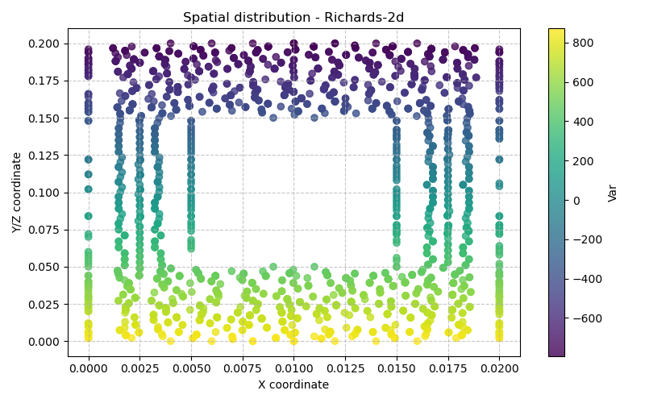

# Richards-2d — Drainage d'une colonne de billes

**Fichier d'entrée :** `base/Richards-2d/Richards-2d`
**Modèle Bil :** `Richards` ([src/Models/ModelFiles/Richards.cpp](../src/Models/ModelFiles/Richards.cpp))

---

## Contexte physique

Cet exemple simule le **drainage par gravité d'une colonne de milieu poreux hétérogène** composée de deux zones de perméabilités différentes. Il s'agit d'un problème canonique de l'hydrogéologie non saturée : on observe comment l'eau se draine d'un matériau granulaire (billes) sous l'effet de la gravité lorsque la pression imposée à la base passe subitement de l'état saturé à l'état non saturé.

---

## Équations mathématiques : l'équation de Richards

Le modèle résout l'**équation de Richards** (1931), qui gouverne l'écoulement d'un liquide en milieu poreux partiellement saturé sous l'hypothèse que la pression de gaz reste constante (phase gazeuse continue).

### Bilan de masse du liquide

$$\frac{\partial m_l}{\partial t} + \nabla \cdot \mathbf{w}_l = 0$$

avec la teneur en masse du liquide :

$$m_l = \rho_l \, \phi \, S_l(p_c)$$

### Loi de Darcy généralisée

$$\mathbf{w}_l = -k_l \left( \nabla p_l - \rho_l \, \mathbf{g} \right)$$

avec la **perméabilité effective au liquide** :

$$k_l = \rho_l \, \frac{k_\text{int}}{\mu_l} \, k_{rl}(p_c)$$

### Variables et relations de fermeture

| Symbole | Signification | Valeur |
|---|---|---|
| $p_l$ | Pression du liquide (inconnue primaire) | — |
| $p_c = p_g - p_l$ | Pression capillaire | $p_g = 0$ Pa |
| $S_l(p_c)$ | Degré de saturation | courbe `billes` |
| $k_{rl}(p_c)$ | Perméabilité relative au liquide | courbe `billes` |
| $\phi$ | Porosité | 0.38 |
| $\rho_l$ | Masse volumique du liquide | 1000 kg/m³ |
| $k_\text{int}$ | Perméabilité intrinsèque | 8.9×10⁻¹² m² (zone ext.) / 8.9×10⁻¹³ m² (zone int.) |
| $\mu_l$ | Viscosité dynamique | 0.001 Pa·s (eau à 20 °C) |
| $g$ | Accélération de la pesanteur | −9.81 m/s² |

### Schéma temporel

Le flux $\mathbf{w}_l$ est calculé avec la perméabilité $k_l$ du **pas de temps précédent** (*lagging* de Picard), tandis que la teneur en masse $m_l$ est implicite en $p_l$ courant. C'est le schéma IMPES classique pour l'équation de Richards.

### Référence bibliographique

> **Richards, L.A. (1931).** *Capillary conduction of liquids through porous mediums.*
> Physics, 1(5), 318–333.

---

## Géométrie et maillage

Le fichier `columncomposite.geo` définit une **colonne rectangulaire 2D composite** :

```
W = 0.02 m  (largeur totale)
H = 0.20 m  (hauteur totale)
w = W/2     (largeur de l'inclusion)
h = H/2     (hauteur de l'inclusion)
```

La colonne est composée de deux zones matérielles :

| Région GMSH | Surface physique | Rôle | Perméabilité intrinsèque |
|---|---|---|---|
| Surface(100) | Anneau extérieur (domaine – inclusion) | zone plus perméable | 8.9×10⁻¹² m² |
| Surface(101) | Rectangle interne centré | inclusion moins perméable | 8.9×10⁻¹³ m² |

```
┌──────────────────────┐
│   Zone 100           │  k_int = 8.9e-12 m²
│   ┌────────────┐     │
│   │  Zone 101  │     │  k_int = 8.9e-13 m²
│   │ (inclusion)│     │
│   └────────────┘     │
│                      │
└──────────────────────┘
    Ligne 11 (base, région 11)
```

---

## Courbes de rétention et perméabilité relative : fichier `billes`

Le fichier `billes` contient une table à 3 colonnes : $p_c$ [Pa], $S_l$ [−], $k_{rl}$ [−].

| Plage de $p_c$ | Comportement |
|---|---|
| 500 – 577 Pa | $S_l = 1$, $k_{rl} = 1$ → milieu totalement saturé |
| 577 – 1000 Pa | $S_l$ et $k_{rl}$ décroissent rapidement |
| $p_c = 1000$ Pa | $S_l \approx 0.09$, $k_{rl} \approx 2.6 \times 10^{-8}$ → milieu quasi-sec |

La **pression d'entrée d'air** (air-entry pressure) se situe vers 575 Pa, et la **saturation résiduelle** est d'environ 9 %. Ces courbes sont typiques d'un assemblage de billes sphériques calibrées (courbe de type Brooks-Corey ou van Genuchten à paramètres ajustés expérimentalement).

---

## Explication ligne à ligne du fichier `Richards-2d`

```
# Drainage d'une colonne de billes
```
Commentaire descriptif du cas test.

---

### `Geometry`

```
2 plan
```

Espace 2D plan. L'équation de Richards est résolue dans un plan vertical.

---

### `Mesh`

```
columncomposite.msh
```

Maillage GMSH de la colonne composite (généré depuis `columncomposite.geo`).

---

### `Material` — bloc 1 (zone externe, Surface 100)

```
Model = Richards
Gravity = -9.81
Porosity = 0.38
LiquidMassDensity = 1000
IntrinsicPermeability = 8.9e-12
LiquidViscosity = 0.001
ReferenceGasPressure = 0
Curves = billes
```

| Paramètre | Signification |
|---|---|
| `Model = Richards` | Sélectionne le module `Richards.cpp` |
| `Gravity = -9.81` | Gravité selon l'axe y négatif (vers le bas), en m/s² |
| `Porosity = 0.38` | 38 % de vides |
| `LiquidMassDensity = 1000` | Eau, en kg/m³ |
| `IntrinsicPermeability = 8.9e-12` | Perméabilité intrinsèque en m² (zone externe) |
| `LiquidViscosity = 0.001` | Viscosité dynamique de l'eau à 20 °C, en Pa·s |
| `ReferenceGasPressure = 0` | Pression de gaz de référence $p_g = 0$ Pa |
| `Curves = billes` | Fichier de courbes $S_l(p_c)$ et $k_{rl}(p_c)$ |

---

### `Material` — bloc 2 (zone interne, Surface 101)

Identique au bloc 1 sauf :

```
IntrinsicPermeability = 8.9e-13
```

L'inclusion est **10 fois moins perméable** que la zone externe, ce qui ralentit localement le drainage.

---

### `Fields`

```
1
Value = 0  Gradient = 0 -9810 0  Point = 0 0.2 0
```

Définit le **champ linéaire de pression hydrostatique** :

$$p_l(x, y) = 0 + (-9810) \times (y - 0.2) = 9810 \times (0.2 - y) \text{ Pa}$$

ancré au point $(0, 0.2, 0)$ (sommet de la colonne) où $p_l = 0$ Pa. Ce champ correspond à l'équilibre hydrostatique d'une colonne saturée.

---

### `Initialization`

```
2
Region = 100  Unknown = p_l  Field = 1  Function = 0
Region = 101  Unknown = p_l  Field = 1  Function = 0
```

Initialise $p_l$ dans les deux régions avec le champ hydrostatique (Field 1, facteur = 1). La colonne démarre **entièrement saturée à l'équilibre hydrostatique**.

---

### `Functions`

```
1
N = 2  F(0) = 1  F(360) = 0
```

Fonction temporelle linéaire valant 1 à $t = 0$ s et décroissant à 0 à $t = 360$ s. Elle module l'amplitude de la condition aux limites à la base.

---

### `Boundary Conditions`

```
1
Region = 11  Unknown = p_l  Field = 1  Function = 1
```

La condition est appliquée sur la **base de la colonne** (ligne 11, bord inférieur) :

$$p_l^{\text{base}}(t) = \underbrace{9810 \times 0.2}_{\text{Field 1 en } y=0} \times \underbrace{\text{Function}_1(t)}_{\in [0,1]}$$

- À $t = 0$ : $p_l = 1962$ Pa (état saturé)
- À $t = 360$ s : $p_l = 0$ Pa (pression atmosphérique → aspiration)

Concrètement : on impose **progressivement une pression nulle à la base**, déclenchant le drainage de la colonne vers le bas.

---

### `Loads`

```
0
```

Aucune source volumique externe de masse liquide.

---

### `Points`

```
0
```

Aucun point de sortie particulier.

---

### `Dates`

```
16
0 200 400 600 800 1000 1200 1400 1600 1800 2000 2200 2400 2600 2800 3000
```

16 instants de sortie, de $t = 0$ à $t = 3000$ s (50 minutes), tous les 200 s.

---

### `Objective Variations`

```
p_l = 1.e3
```

Variation admissible de $p_l$ entre deux itérations du pas de temps adaptatif : **1000 Pa**. Contrôle la taille automatique du pas de temps.

---

### `Iterative Process`

```
Iter = 20
Tol = 1.e-6
Recom = 2
```

| Paramètre | Signification |
|---|---|
| `Iter = 20` | Maximum 20 itérations Newton-Raphson par pas de temps |
| `Tol = 1.e-6` | Tolérance relative de convergence |
| `Recom = 2` | En cas de non-convergence : découpage du pas de temps, jusqu'à 2 fois |

---

### `Time Steps`

```
Dtini = 1
Dtmax = 1000
```

| Paramètre | Signification |
|---|---|
| `Dtini = 1` | Pas de temps initial : 1 s |
| `Dtmax = 1000` | Pas de temps maximal : 1000 s |

Le solveur adapte automatiquement le pas de temps entre ces bornes selon la convergence et la variation objective de $p_l$.

---

## Sorties calculées

Le modèle calcule et exporte (`Richards.cpp`, fonction `ComputeOutputs`) :

| Variable | Nom de sortie | Unité |
|---|---|---|
| Pression liquide | `pressure` | Pa |
| Flux massique liquide | `flow` | kg/m²/s |
| Degré de saturation | `saturation` | — |

---

## Synthèse du scénario simulé

1. **$t = 0$ s** : colonne composite entièrement saturée à l'équilibre hydrostatique.
2. **$0 < t \leq 360$ s** : la pression à la base est progressivement réduite à 0 Pa → le bas de la colonne commence à se drainer.
3. **$t > 360$ s** : pression nulle maintenue à la base → le front de désaturation remonte dans la colonne sous l'effet de la gravité.
4. **Effet de l'hétérogénéité** : l'inclusion centrale (10× moins perméable) ralentit localement le drainage → on observe un **retard de désaturation** dans la zone interne, phénomène caractéristique des milieux poreux hétérogènes en conditions non saturées.

## Résultats de la simulation


*(Graphes générés automatiquement pour l'exemple Richards-2d)*
