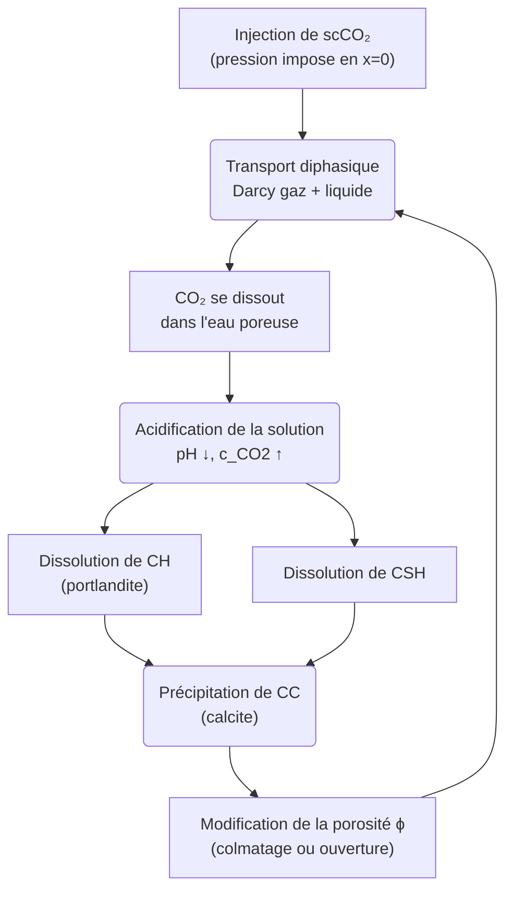
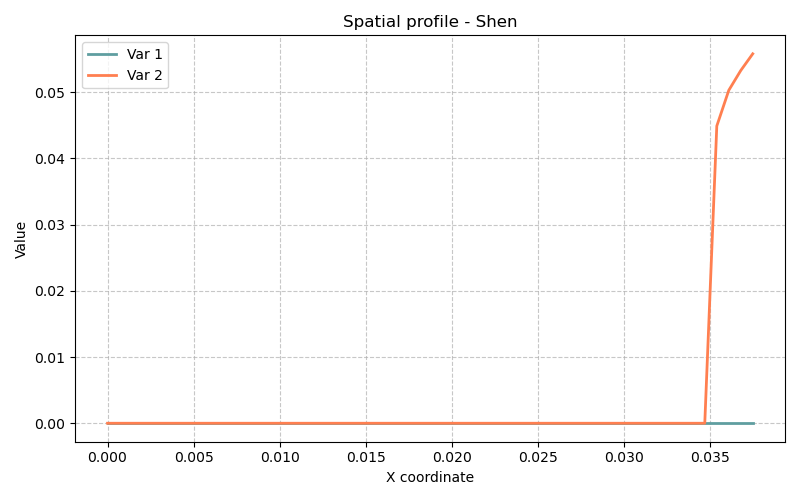

# Modèle Shen — Carbonatation du béton au CO₂ supercritique

> **Fichiers sources :**
> `src/Models/ModelFiles/Shen.c` · `base/Shen/Shen`
>
> **Auteur du modèle :** Shen (d'après l'expérience de Duguid, 2006)
> **Titre interne BIL :** `"Carbonation of CBM with scCO2 (2012)"`

---

## Table des matières

1. [Contexte et objectif](#1-contexte-et-objectif)
2. [Hypothèses](#2-hypothèses)
3. [Variables et notation](#3-variables-et-notation)
4. [Modèle mathématique](#4-modèle-mathématique)
   - 4.1 [Équations de conservation (bilans élémentaires)](#41-équations-de-conservation-bilans-élémentaires)
   - 4.2 [Chimie de la solution aqueuse](#42-chimie-de-la-solution-aqueuse)
   - 4.3 [Réactions solide–liquide : dissolution/précipitation](#43-réactions-solideligquide--dissolutionprécipitation)
   - 4.4 [Transport : advection + diffusion + migration électrique](#44-transport--advection--diffusion--migration-électrique)
   - 4.5 [Phase gazeuse et solubilité du CO₂](#45-phase-gazeuse-et-solubilité-du-co₂)
   - 4.6 [Évolution de la porosité](#46-évolution-de-la-porosité)
5. [Conditions aux limites et initiales](#5-conditions-aux-limites-et-initiales)
6. [Cas test : Expérience de Duguid (`base/Shen/`)](#6-cas-test--expérience-de-duguid-baseshen)
7. [Paramétrage matériel du modèle](#7-paramétrage-matériel-du-modèle)
8. [Description pas-à-pas des fichiers d'entrée](#8-description-pas-à-pas-des-fichiers-dentrée)
9. [Références bibliographiques](#9-références-bibliographiques)

---

## 1. Contexte et objectif

Le modèle **Shen** simule la **carbonatation d'une matrice cimentaire (CBM — Cement-Based Material) par du CO₂ supercritique (scCO₂)**. Ce phénomène est central pour l'évaluation de l'intégrité à long terme des puits de forage cimentés utilisés dans les sites de **stockage géologique du CO₂** (CCS — Carbon Capture and Storage).

Le scénario physique reproduit l'expérience de laboratoire de Duguid (2006) : un écoulement de scCO₂ est forcé à travers un carotte de grès à ciment, provoquant une cascade de réactions chimiques qui dissolvent les hydrates de ciment (portlandite CH, silicates de calcium hydratés CSH) et précipitent de la calcite (CC). Ces transformations modifient la porosité et, in fine, la perméabilité du ciment.



---

## 2. Hypothèses

1. **Géométrie 1D axiale** : La carotte de grès est discrétisée comme un segment de 3,75 cm ($0$ à $0.0375$ m). L'invasion du CO₂ se propage de la face gauche (injection) vers la droite.
2. **Milieu poreux biphasique** : La porosité contient simultanément une phase liquide aqueuse (eau chargée en ions) et une phase gazeuse (CO₂ supercritique pur ou mélange CO₂-H₂O). Le degré de saturation liquide $S_l$ dépend de la pression capillaire.
3. **CO₂ supercritique traité comme un gaz pur** : La densité et la viscosité du CO₂ sont calculées via les équations d'état de Redlich-Kwong (densité) et de Fenghour (viscosité), tabulées sous forme de courbes en fonction de la pression $P_{CO_2}$.
4. **Équilibre chimique local** : La solution aqueuse est supposée à l'équilibre thermodynamique local à chaque pas de temps. Les concentrations des espèces secondaires sont déduites algébriquement des inconnues primaires.
5. **Cinétique de dissolution/précipitation finie** : La dissolution de CH et la précipitation de CC suivent une cinétique du premier ordre contrôlée par les temps caractéristiques $T_{CH}$ et $T_{CC}$.
6. **Électroneutralité** : La charge électrique totale de la solution est nulle, ce qui fournit l'équation supplémentaire pour déterminer la concentration en OH⁻ (et donc le pH).
7. **Température constante** : $T = 293\,\text{K}$ (20 °C). Toutes les constantes d'équilibre, coefficients de diffusion et viscosités sont calculés à cette température.

---

## 3. Variables et notation

Le modèle résout **7 équations** (NEQ = 7) avec **7 inconnues primaires** par nœud.

### Inconnues primaires

| Symbole BIL | Signification | Type |
|-------------|---------------|------|
| `logp_co2` | $\log_{10}(P_g)$ — pression (log) du gaz CO₂ | Continue |
| `psi` | $\psi$ — potentiel électrique de la solution | Continue |
| `z_ca` | $z_{Ca,s}$ — quantité de Ca en phase solide (normalisée) | Continue |
| `z_si` | $z_{Si,s}$ — quantité de Si en phase solide (normalisée) | Continue |
| `c_k` | $c_K$ — concentration en K⁺ | Continue |
| `c_cl` | $c_{Cl}$ — concentration en Cl⁻ | Continue |
| `p_l` | $P_l$ — pression de la phase liquide | Continue |

> La pression de gaz est résolue en espace logarithmique (`LOG_U`) pour améliorer la convergence numérique sur plusieurs décades de pression. La pression liquide est résolue directement (`NOLOG_U`).

### Équations résolues

| Index | Nom | Signification physique |
|-------|-----|------------------------|
| `E_C` | `carbone` | Conservation du carbone (C) |
| `E_q` | `charge` | Conservation de la charge électrique |
| `E_Ca` | `calcium` | Conservation du calcium (Ca) |
| `E_Si` | `silicium` | Conservation du silicium (Si) |
| `E_K` | `potassium` | Conservation du potassium (K) |
| `E_Cl` | `chlorine` | Conservation du chlore (Cl) |
| `E_mass` | `mass` | Conservation de la masse totale (eau + gaz) |

### Variables secondaires calculées

À partir des 7 inconnues, le modèle déduit algébriquement :
- Concentrations aqueuses de toutes les espèces : $c_{OH}$, $c_H$, $c_{CO_2}$, $c_{HCO_3^-}$, $c_{CO_3^{2-}}$, $c_{Ca^{2+}}$, $c_{CaHCO_3^+}$, $c_{H_3SiO_4^-}$, $c_{H_4SiO_4}$, $c_{H_2SiO_4^{2-}}$, $c_{CaH_3SiO_4^+}$, $c_{CaH_2SiO_4}$, $c_{CaCO_3^{aq}}$, $c_{CaOH^+}$, $c_{H_2O}$
- Contenu des phases solides : $n_{CH}$ (portlandite), $n_{CC}$ (calcite), $n_{Si,s}$ (Si dans les CSH)
- Porosité $\phi$, saturations $S_l$, $S_g$
- Densités de phase $\rho_l$, $\rho_g$

---

## 4. Modèle mathématique

### 4.1 Équations de conservation (bilans élémentaires)

Pour chaque élément chimique $\alpha \in \{C, Ca, Si, K, Cl\}$, la conservation s'écrit :

$$\frac{\partial N_\alpha}{\partial t} + \nabla \cdot \mathbf{W}_\alpha = 0$$

où $N_\alpha$ est la quantité totale (liquide + gaz + solide) par unité de volume de milieu poreux et $\mathbf{W}_\alpha$ est le flux total de l'élément $\alpha$.

La **conservation de charge** (électroneutralité locale) :

$$\frac{\partial N_q}{\partial t} + \nabla \cdot \mathbf{W}_q = 0$$

La **conservation de la masse totale** (eau + CO₂ gaz) :

$$\frac{\partial M}{\partial t} + \nabla \cdot \mathbf{W}_M = 0$$

avec $M = S_g \phi \rho_g + S_l \phi \rho_l + m_s$ (masse totale de fluide et de solide par unité de volume poreux).

### 4.2 Chimie de la solution aqueuse

Les concentrations des espèces aqueuses secondaires sont calculées à partir des constantes d'équilibre thermodynamiques (dépendantes de la température $T$) :

$$K_{h_2o} = c_H \cdot c_{OH}$$
$$K_{hco_3} = \frac{c_{HCO_3^-} \cdot c_H}{c_{CO_2}}$$
$$K_{co_3} = \frac{c_{CO_3^{2-}} \cdot c_H}{c_{HCO_3^-}}$$
$$K_{h_3sio_4} = \frac{c_{H_3SiO_4^-} \cdot c_H}{c_{H_4SiO_4}}$$

La **neutralité électrique** fournit $c_{OH}$ :

$$\sum_i z_i \, c_i = 0$$

où $z_i$ est la charge de l'ion $i$. C'est une équation algébrique résolue numériquement (polynôme d'ordre 4 en $c_{OH}$) à chaque pas de temps.

### 4.3 Réactions solide–liquide : dissolution/précipitation

**Portlandite (CH = Ca(OH)₂)** : se dissout si $z_{CO_2} > 1$ (CO₂ en sursaturation), précipite si $z_{CO_2} < 1$. La cinétique est du premier ordre :

$$n_{CH}(t + dt) = n_{CH}(t) \cdot (z_{CO_2})^{-dt/T_{CH}}$$

**Calcite (CC = CaCO₃)** : se précipite lorsque CH se dissout. La cinétique suit :

$$n_{CC}(t + dt) = n_{CC}(t) \cdot (z_{CO_2})^{+dt/T_{CC}}$$

avec $T_{CH}$ et $T_{CC}$ les temps caractéristiques de dissolution/précipitation (en secondes).

**CSH (Silicates de Calcium Hydratés)** : leur composition (rapport C/S = $x_{CSH}$, rapport H/S = $z_{CSH}$, volume molaire $V_{CSH}$) dépend du degré de saturation $S_{CH}$ (état de saturation en CH). Ces propriétés sont lues depuis la courbe `csh4p` (modèle CSH4Poles).

**Gel de silice amorphe (SH)** : se forme lors de la décalcification des CSH. Son degré de saturation $S_{SH}$ est calculé depuis les courbes CSH4Poles.

### 4.4 Transport : advection + diffusion + migration électrique

Pour chaque espèce aqueuse $i$, le flux total combine trois mécanismes :

$$\mathbf{W}_i = \underbrace{-D_i \, \tau_l(\phi, S_l) \, \nabla c_i}_{\text{Diffusion}} \underbrace{- D_i \, \tau_l \, \frac{F z_i}{RT} c_i \nabla \psi}_{\text{Migration électrique}} \underbrace{+ c_i \, k_l(\phi, S_l) \, (-\nabla P_l + \rho_l \mathbf{g})}_{\text{Advection Darcy}}$$

La **perméabilité à la phase liquide** :
$$k_l = \frac{k_{int,l}}{\mu_l} \cdot k_{rl}(P_c) \cdot \left(\frac{\phi}{\phi_0}\right)^3 \left(\frac{1-\phi_0}{1-\phi}\right)^2$$

La **perméabilité au gaz** :
$$k_g = \frac{k_{int,g}}{\mu_{CO_2}(P_g)} \cdot k_{rg}(P_c) \cdot \left(\frac{\phi}{\phi_0}\right)^3 \left(\frac{1-\phi_0}{1-\phi}\right)^2$$

La **tortuosité pour la diffusion liquide** (Millington-Quirk modifié) :
$$\tau_l(\phi, S_l) = \min\!\left(\frac{\phi}{0.25}, 1\right) \cdot \frac{0.00029 \, e^{9.95\phi}}{1 + 625\,(1-S_l)^4}$$

### 4.5 Phase gazeuse et solubilité du CO₂

La densité molaire du CO₂ supercritique est calculée par l'**équation de Redlich-Kwong** (tabulée dans le fichier `density_co2`). La viscosité est calculée via la corrélation de **Fenghour** (tabulée dans `viscosity_co2`).

La **solubilité du CO₂ dans l'eau** à la pression $P_g$ et température $T$ (loi de Henry modifiée avec fugacité) :

$$c_{CO_2}^{liq} = \text{solubilityCO2}(P_g, P_l, T)$$

La **fraction molaire de H₂O dans la phase gazeuse** :
$$y_{H_2O} = \frac{P_{sat}(T) \cdot \phi_{H_2O}^{sat}}{P_g \cdot \phi_{H_2O}}$$

avec $\phi_{H_2O}$ le coefficient de fugacité de H₂O dans le mélange CO₂-H₂O.

### 4.6 Évolution de la porosité

La porosité évolue dynamiquement par le changement de volume des solides :

$$\phi = \phi_0 + V_{s,0} - V_s$$

$$V_s = V_{CH} \cdot n_{CH} + V_{CC} \cdot n_{CC} + V_{CSH}(S_{CH}) \cdot n_{Si,s}$$

avec $V_{CH} = 33 \times 10^{-3}$ dm³/mol et $V_{CC} = 37 \times 10^{-3}$ dm³/mol. La dissolution de CH (volume libéré) et la précipitation de CC (volume comblé) se compensent partiellement : la **dissolution nette crée de la porosité** tandis que la **précipitation de calcite comble les pores**.

---

## 5. Conditions aux limites et initiales

### État initial (Initialization)

| Inconnue | Valeur initiale | Champ BIL | Signification |
|----------|-----------------|-----------|---------------|
| `logp_co2` | `Champ 1` → $10^1 = 10$ Pa (transformée via exp) | affine `Val = 1.` | Pression CO₂ initiale basse |
| `psi` | `Champ 0` → $0$ | affine `Val = 0.` | Potentiel électrique nul |
| `z_si` | `Champ 6` → $-2$ | affine `Val = -2.` | CSH partiellement décalcifiés |
| `z_ca` | `Champ 2` → $0$ | affine `Val = 0.` | Solide calci-riche initial |
| `c_k` | `Champ 5` → $0.5$ mol/dm³ | affine `Val = 0.5` | Potassium dissous |
| `c_cl` | `Champ 5` → $0.5$ mol/dm³ | affine `Val = 0.5` | Chlorure dissous |
| `p_l` | `Champ 8` → $0.5$ Pa | affine `Val = 0.5` | Pression liquide initiale |

### Conditions aux limites (`Boundary Conditions`)

| Frontière | Inconnue | Condition | Signification |
|-----------|----------|-----------|---------------|
| `Reg 3` (face d'injection, $x=0$) | `psi` | $\psi = 0$ (Fonc 0 constante) | Potentiel électrique de référence |
| `Reg 3` (face d'injection) | `logp_co2` | Imposée via Fonc 1 (profil décroissant de $10^1$ à $-0.5$) | Montée en pression du CO₂ |
| `Reg 3` (face d'injection) | `p_l` | Imposée via Fonc 0 | Pression liquide à la face |
| `Reg 2` (toute la zone) | `c_k` | Imposée via Champ 9 = $0.5$ mol/dm³, Fonc 0 | Concentration en K constante |
| `Reg 2` (toute la zone) | `c_cl` | Imposée via Champ 9 = $0.5$ mol/dm³, Fonc 0 | Concentration en Cl constante |
| `Reg 3` (face d'injection) | `z_ca` | Imposée via Champ 4 = $1$, Fonc 4 (rampe de $-2$ à $1$) | Imposition du front de calcite |

---

## 6. Cas test : Expérience de Duguid (`base/Shen/`)

### Géométrie et maillage

Le domaine est un **segment 1D de longueur $L = 0.0375$ m** (3,75 cm), discrétisé avec **50 éléments** de taille régulière $\Delta x = 7.5 \times 10^{-4}$ m.

```
x = 0 (injection CO₂)  ←——————————————————→  x = 0.0375 m (face libre)
Reg 3 (CL imposées)                                Reg 2
```

### Protocole expérimental simulé

L'expérience de Duguid injecte du CO₂ supercritique dans une carotte de grès ciméntée sous pression de confinement. La pression du CO₂ est progressivement montée en face d'injection, forçant son invasion dans la porosité du ciment.

- **$t = 0$ à $86\,400$ s (1 jour)** : Phase transitoire d'établissement du front CO₂.
- **$t = 86\,400$ à $864\,000$ s (10 jours)** : Progression du front de carbonatation.
- **$t = 864\,000$ à $2\,592\,000$ s (30 jours)** : Stabilisation et possible rebouchage par la calcite.

### Résultats attendus

Le scénario produit un **front de carbonatation** qui avance de la face d'injection vers le fond :

1. **Zone carbonatée** (près de $x = 0$) : La portlandite est totalement dissoute ($n_{CH} \approx 0$), les CSH décalcifiés sont transformés en gel de silice. La calcite précipitée comble une partie de la porosité. Le pH chute de ~12 à ~6.
2. **Zone de transition** : Coexistence des phases solides en cours de transformation, gradient important de $c_{CO_2}$ et de pH.
3. **Zone saine** (près de $x = L$) : Ciment intact ($n_{CH}$ élevé, pH > 12, pas de calcite).

La **porosité** oscille selon le bilan volumique :
- La dissolution de CH libère du volume → $\phi$ augmente.
- La précipitation de CC occupe du volume → $\phi$ diminue localement.
- Le résultat net peut mener à un **colmatage partiel** (perméabilité réduite) si la précipitation de calcite domine.



---

## 7. Paramétrage matériel du modèle

| Paramètre | Valeur dans `base/Shen/Shen` | Rôle physique |
|-----------|------------------------------|---------------|
| `porosite` | 0.4 | Porosité initiale du grès cimenté |
| `N_CH` | 5.16 mol/dm³ | Contenu initial en portlandite (référence pour $n_{Ca,s}$) |
| `N_Si` | 3.9 mol/dm³ | Contenu initial en Si dans les CSH (référence pour $n_{Si,s}$) |
| `T_CH` | $4 \times 10^5$ s | Temps caractéristique de dissolution de CH ($\approx 4.6$ jours) |
| `k_intl` | $2 \times 10^{-17}$ m² | Perméabilité intrinsèque à la phase liquide |
| `k_intg` | $1.4 \times 10^{-16}$ m² | Perméabilité intrinsèque à la phase gazeuse (CO₂) |
| `temperature` | 293 K | Température de l'expérience ($\approx 20$ °C) |
| `Curves = CN_courbe` | Fichier tabulé 4 col. | Courbes de capillarité : $S_l(P_c)$, $k_{rl}(P_c)$, $k_{rg}(P_c)$ |
| `Curves_log = csh4p` | Fichier tabulé 5 col. | Propriétés des CSH : rapport C/S, H/S, volume molaire, $q_{SH}$, $X_S$ |
| `Curves = density_co2` | Fichier tabulé (Redlich-Kwong) | Densité molaire du CO₂ : $\rho_{CO_2}(P, T=293\,\text{K})$ |
| `Curves = viscosity_co2` | Fichier tabulé (Fenghour) | Viscosité dynamique du CO₂ : $\mu_{CO_2}(P, T=293\,\text{K})$ |

---

## 8. Description pas-à-pas des fichiers d'entrée

### 8.1 Fichier de pilotage `base/Shen/Shen`

#### Bloc `Geometry`

```
Geometry
1 axis
```

Simulation monodimensionnelle (`1`) en géométrie axiale. BIL interprète le problème comme un problème de transport selon un axe unique.

#### Bloc `Mesh`

```
Mesh
4 0 0 0.0375 0.0375
1.e-3
1 50 1
1 1 1
```

- `4 0 0 0.0375 0.0375` : Maillage de type 4 (segment), de $x=0$ à $x=0.0375$ m, sur la même épaisseur (section transversale virtuelle de 1 dm²).
- `1.e-3` : Tolérance géométrique du mailleur.
- `1 50 1` : 1 couche d'éléments, 50 éléments sur la longueur, 1 couche en épaisseur.
- `1 1 1` : Indices des régions géométriques (Reg 1 = base, Reg 2 = volume, Reg 3 = face d'injection).

#### Bloc `Material`

```
Model = Shen
porosite = 0.4
N_CH     = 5.16
N_Si     = 3.9
T_CH     = 4.e5
k_intl    = 2.e-17
k_intg    = 1.4e-16
temperature = 293.
Curves = CN_courbe
Curves_log = csh4p  q_CH = Range{...}  X_S = CSH4Poles(1){...}
Curves = density_co2    P_co2 = Range{...}  Rho_co2 = Redlich-Kwong_CO2(1){...}
Curves = viscosity_co2  P_co2 = Range{...}  Mu_co2 = Fenghour_CO2(1){...}
```

- `Model = Shen` : Sélection du modèle physique dans BIL.
- Les paramètres scalaires (`porosite`, `N_CH`, etc.) sont lus par la fonction `pm()` du modèle.
- `Curves = CN_courbe` : Charge la table de 7000 points à 4 colonnes : $P_c$ (Pa), $S_l$, $k_{rl}$, $k_{rg}$. Utilisée pour interpoler le degré de saturation et les perméabilités relatives en fonction de la pression capillaire.
- `Curves_log = csh4p` : Charge la table CSH4Poles (5 colonnes) en abscisse logarithmique. Les colonnes sont : $q_{CH}$ (activité ionique de CH), $X_S$ (rapport Si), $z$ (rapport H/S), $V$ (volume molaire), $q_{SH}$. Construite avec le modèle thermodynamique CSH4Poles à T=293 K, avec les paramètres $y_{Tob1}=2.4$, $y_{Tob2}=1.8$, $y_{Jen}=0.9$, $z_S=0$.
- `Curves = density_co2` : Table Redlich-Kwong sur $[0, 60\,\text{MPa}]$ avec 1001 points. Colonne 1 = $P_{CO_2}$ (Pa), colonne 2 = $\rho_{CO_2}$ (mol/dm³) à 293 K.
- `Curves = viscosity_co2` : Table Fenghour sur $[0, 60\,\text{MPa}]$ avec 1001 points. Colonne 1 = $P_{CO_2}$ (Pa), colonne 2 = $\mu_{CO_2}$ (Pa·s) à 293 K.

#### Bloc `Fields`

```
Fields
9
Type = affine Val = -10.   Grad = 0. Point = 0.   # Champ 0: logp_co2 = -10 (p_g ≈ 0)
Type = affine Val = 1.     Grad = 0. Point = 0.   # Champ 1: logp_co2 = 1 (p_g = 10 Pa)
Type = affine Val = 0.     Grad = 0. Point = 0.   # Champ 2: z_ca = 0
Type = affine Val = 1.     Grad = 0. Point = 0.   # Champ 3: valeur 1
Type = affine Val = 0.5    Grad = 0. Point = 0.   # Champ 4: z_ca = 1 (CL injection)
Type = affine Val = 1.     Grad = 0. Point = 0.   # Champ 5: c_k = c_cl = 0.5 mol/dm³
Type = affine Val = -2.    Grad = 0. Point = 0.   # Champ 6: z_si = -2
Type = affine Val = 100000. Grad = 0. Point = 0.  # Champ 7: 10^5 Pa
Type = affine Val = 0.5    Grad = 0. Point = 0.   # Champ 8: p_l = 0.5 Pa
```

Tous les champs sont **affines** (constants ici, gradient nul). BIL les interprète comme $\text{valeur}(x) = \text{Val} + \text{Grad} \cdot (x - \text{Point})$.

#### Bloc `Initialization`

```
Initialization
7
Reg = 2 Inc = logp_co2  Champ = 1    → logp_co2 = 1.0 (P_g = 10 Pa) sur tout le domaine
Reg = 2 Inc = psi       Champ = 0    → psi = 0. (potentiel nul)
Reg = 2 Inc = z_si     Champ = 6    → z_si = -2. (CSH décalcifiés)
Reg = 2 Inc = z_ca    Champ = 2    → z_ca = 0. (solide en état initial)
Reg = 2 Inc = c_k       Champ = 5    → c_k = 0.5 mol/dm³
Reg = 2 Inc = c_cl      Champ = 5    → c_cl = 0.5 mol/dm³
Reg = 2 Inc = p_l    Champ = 8    → p_l = 0.5 Pa
```

`Reg = 2` désigne l'ensemble du domaine volumique (l'intérieur de la carotte).

#### Bloc `Functions`

```
Functions
4
N = 2 F(0) = 1.        F(7200) = -0.5           # Fonc 1: logp_co2 à la face injectante (montée rapide)
N = 5 F(0) = 1.  F(2400000) = 1. F(3200000) = -0.4 F(4000000) = -0.8 F(8400000) = -0.9  # Fonc 2: pression gas multiphasique
N = 3 F(0) = -2. F(8540000) = -1. F(8640000) = 1   # Fonc 3: z_ca CL (rampe de -2 à 1)
N = 2 F(0) = 1.        F(7200) = -20.           # Fonc 4: z_ca injection rapide
```

Chaque fonction est une interpolation linéaire par morceaux dans le temps (en secondes). Par exemple, `Fonc 1` impose $\log p_{CO_2}$ à la face d'injection : il part de la valeur `Val * Fonc(t)` du champ. À $t = 0$, le facteur vaut $1$ (pression = $10^1$ Pa), puis évolue linéairement jusqu'à $-0.5$ à $t = 7200$ s (2 heures), faisant monter la pression.

#### Bloc `Boundary Conditions`

```
Boundary Conditions
6
Reg = 3 Inc = psi      Champ = 0 Fonc = 0   → psi = 0 * 0 = 0 (référence de potentiel)
Reg = 3 Inc = logp_co2 Champ = 1 Fonc = 1   → pression CO₂ imposée selon Fonc 1
Reg = 3 Inc = p_l      Champ = 8 Fonc = 0   → p_l = 0 * 0 = 0
Reg = 2 Inc = c_k       Champ = 9 Fonc = 0   → c_k maintenu à 0.5
Reg = 2 Inc = c_cl      Champ = 9 Fonc = 0   → c_cl maintenu à 0.5
Reg = 3 Inc = z_ca     Champ = 4 Fonc = 4   → z_ca imposition selon Fonc 4 (rampe)
```

`Reg = 3` est la frontière gauche ($x = 0$), face d'injection. `Fonc = 0` correspond à la 1ère fonction (d'index 0) qui est ici constante (ou signifie que la valeur est le champ seul). Plusieurs conditions en `Reg = 2` imposent des concentrations volumiques aux potassium et chlorure.

#### Bloc `Dates`

```
Dates
4
0. 86400 864000 2592000
```

4 instants de sortie demandés : $t = 0$, $1$ jour ($86\,400$ s), $10$ jours ($864\,000$ s), $30$ jours ($2\,592\,000$ s). Les fichiers `Shen.t0` à `Shen.t3` correspondent à ces 4 sorties.

#### Bloc `Objective Variations`

```
Objective Variations
logp_co2 = 0.1
z_si     = 1.e-1
z_ca     = 1.e-1
psi      = 0.1
c_k      = 0.1
c_cl     = 0.1
p_l      = 10000.
```

Définit la variation relative maximale tolérée par inconnue **pour le contrôle adaptatif du pas de temps**. BIL augmente $\Delta t$ si toutes les variations sont inférieures à ces seuils, et le diminue sinon. `p_l = 10000.` Pa de variation autorisée par pas de temps reflète le fait que la pression liquide peut varier fortement en début de simulation.

#### Bloc `Iterative Process`

```
Iterative Process
Iteration = 10
Tolerance = 1.e-4
Repetition = 0
```

Newton-Raphson : maximum 10 itérations par pas de temps, tolérance sur le résidu normalisé de $10^{-4}$, sans répétition de pas de temps en cas de non-convergence.

#### Bloc `Time Steps`

```
Time Steps
Dtini = 1.e1
Dtmax = 1.e5
```

- `Dtini = 10 s` : Pas de temps initial très petit, car les fronts chimiques sont raides au démarrage.
- `Dtmax = 100 000 s` ($\approx 27.8$ heures) : Pas de temps maximum autorisé.

---

## 9. Références bibliographiques

- **Duguid, A.** (2006). The effect of CO₂ on the integrity of well cements. *Princeton University PhD Thesis*. — Expérience de référence simulée dans ce cas test : injection de scCO₂ dans une carotte de grès ciméntée.

- **Shen, J., Dangla, P., Thiery, M.** (2013). Reactive transport modeling of CO₂ through cementitious materials under CO₂ geological storage conditions. *International Journal of Greenhouse Gas Control*, 18, 75–87. — Article de référence pour le modèle numérique implémenté dans `Shen.c`.

- **Redlich, O., & Kwong, J. N. S.** (1949). On the thermodynamics of solutions. V. An equation of state. *Chemical Reviews*, 44(1), 233–244. — Équation d'état pour la densité du CO₂ supercritique.

- **Fenghour, A., Wakeham, W. A., & Vesovic, V.** (1998). The viscosity of carbon dioxide. *Journal of Physical and Chemical Reference Data*, 27(1), 31–44. — Corrélation pour la viscosité du CO₂ supercritique.

- **Jennings, H. M.** (2000). A model for the microstructure of calcium silicate hydrate in cement paste. *Cement and Concrete Research*, 30(1), 101–116. — Base du modèle CSH4Poles utilisé pour décrire la composition des CSH en fonction de leur état de saturation.

- **Coussy, O.** (2004). *Poromechanics*. John Wiley & Sons. — Cadre théorique général pour la modélisation des milieux poreux multiphasiques.
