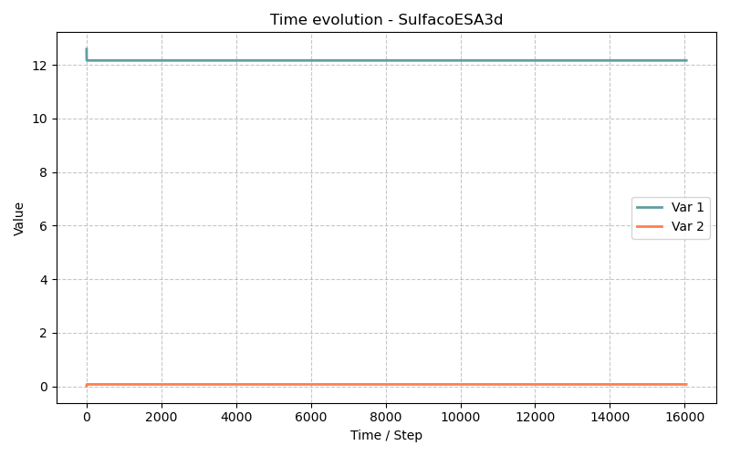

# Modèle SulfacoESA3d — Attaque Sulfatique Externe avec Endommagement Mécanique 3D

> **Fichiers sources :**
> `src/Models/ModelFiles/SulfacoESA3d.c` · `base/SulfacoESA3d/SulfacoESA3d` · `base/SulfacoESA3d/test-ESA-Ferraris-D25_3d/D25`
>
> **Auteurs du modèle :** Ran, Dangla (Université Gustave Eiffel)
> **Titre interne :** *"External sulfate attack of concrete (2023)"*

---

## Table des matières

1. [Contexte et objectif](#1-contexte-et-objectif)
2. [Différences clés avec Sulfaco](#2-différences-clés-avec-sulfaco)
3. [Hypothèses](#3-hypothèses)
4. [Variables et notation](#4-variables-et-notation)
5. [Modèle mathématique](#5-modèle-mathématique)
   - 5.1 [Équations de conservation chimique](#51-équations-de-conservation-chimique)
   - 5.2 [Équilibre mécanique et couplage chemo-mécanique](#52-équilibre-mécanique-et-couplage-chemo-mécanique)
   - 5.3 [Loi d'endommagement (Marigo-Jirasek ou Mazars)](#53-loi-dendommagement-marigo-jirasek-ou-mazars)
   - 5.4 [Pression de cristallisation et eigenstrain chimique](#54-pression-de-cristallisation-et-eigenstrain-chimique)
   - 5.5 [Transport ionique (Nernst-Planck)](#55-transport-ionique-nernst-planck)
6. [Conditions aux limites et initiales](#6-conditions-aux-limites-et-initiales)
7. [Cas tests](#7-cas-tests)
   - 7.1 [Point matériau homogène (`SulfacoESA3d`)](#71-point-matériau-homogène-sulfacoesa3d)
   - 7.2 [Référence Ma30 — Calibrage Sulfaco](#72-référence-ma30--calibrage-sulfaco)
   - 7.3 [Validation Ferraris D25 (`test-ESA-Ferraris-D25_3d/D25`)](#73-validation-ferraris-d25-test-esa-ferraris-d25_3dd25)
8. [Paramétrage matériel du modèle](#8-paramétrage-matériel-du-modèle)
9. [Description pas-à-pas des fichiers d'entrée](#9-description-pas-à-pas-des-fichiers-dentrée)
10. [Références bibliographiques](#10-références-bibliographiques)

---

## 1. Contexte et objectif

Le modèle **SulfacoESA3d** est une extension du modèle [Sulfaco](Sulfaco_model.md) qui ajoute un **couplage chemo-mécanique complet en 3D**. Il simule l'**attaque sulfatique externe (ESA — External Sulfate Attack)** du béton en combinant :

- La **chimie multi-espèces** de la solution de pores (héritée de Sulfaco) : diffusion ionique, équilibres acido-basiques, précipitation/dissolution des phases solides (AFt, CH, AFm, C₃AH₆…),
- La **mécanique de l'endommagement en 3D** (tenseur des contraintes et des déformations complet) via des éléments finis `FEM.h`,
- La **pression de cristallisation de l'ettringite** appliquée comme eigenstress au squelette solide, déclenchant l'endommagement dès que la traction locale dépasse la résistance à la traction $f_t$.

Par rapport à Sulfaco (qui calculait un scalaire de déformation libre avec une loi d'endommagement simplifiée exponentielle), SulfacoESA3d utilise le **module `Damage.h`** de BIL, permettant d'appliquer des modèles d'endommagement formulés thermodynamiquement (Mazars, Marigo-Jirasek).

```mermaid
graph TD
    A["Ions SO₄²⁻ imposés<br>en surface (ESA)"] --> B("Diffusion Nernst-Planck<br>+ chimie de solution")
    B -->|Sursaturation AFt| C["Précipitation ettringite<br>en pore confiné"]
    C --> D["Pression de cristallisation P_c<br>= RT/V_AFt · ln(β)"]
    D -->|Eigenstrain chimique<br>ε_ch = b·P_c/K_bulk| E["FEM: Équilibre mécanique<br>Div(σ) = 0"]
    E --> F["Contraintes σ, déformations ε"]
    F -->|Critère d'endommagement<br>κ > κ_0| G["Endommagement D<br>(Marigo-Jirasek ou Mazars)"]
    G -->|Réduction de rigidité<br>C_ijkl → (1-D)·C_ijkl⁰| E
    G -->|Ouverture de fissures<br>Δφ| B
```

---

## 2. Différences clés avec Sulfaco

| Fonctionnalité | Sulfaco | SulfacoESA3d |
|---------------|---------|--------------|
| Solveur mécanique | Scalaire (déformation libre) | **FEM 3D** (`FEM.h`) |
| Modèle d'endommagement | Loi exponentielle empirique $D = 1 - \frac{\varepsilon_0}{\varepsilon} e^{-(\varepsilon-\varepsilon_0)/\varepsilon_f}$ | **Module `Damage.h`** : Mazars ou Marigo-Jirasek |
| Paramètres mécaniques | `K_bulk`, `Biot`, `Strain0`, `Strainf` | **`young`, `poisson`, `Biot`** + paramètres du modèle de dommage |
| Inconnues primaires | 6 (chimie seule) | **6 + dim** (chimie + déplacements `u_1`…`u_dim`) |
| Tenseur de sortie | Déformation scalaire | **Tenseur des contraintes** (9 composantes), **tenseur des déformations** (9 composantes), **vecteur déplacement** |
| Validation expérimentale | / | Essais Ferraris (2001) sur cylindres D25mm |
| Différenciation automatique | Non | **`autodiff.h`** pour la matrice tangente exacte |

---

## 3. Hypothèses

1. **Isotherme** : $T = 293\,\text{K}$.
2. **Petites déformations** : cinématique linéarisée ; le tenseur des déformations est $\boldsymbol{\varepsilon} = \frac{1}{2}(\nabla \mathbf{u} + \nabla^T \mathbf{u})$.
3. **Elasticité endommageable isotrope** : avant endommagement, comportement élastique linéaire isotrope ($E$, $\nu$). L'endommagement réduit la rigidité de manière isotrope : $\mathbf{C}^\text{eff} = (1-D)\,\mathbf{C}^0$.
4. **Couplage via eigenstrain** : la pression de cristallisation de l'AFt dans les pores génère une déformation libre (eigenstrain) isotrope $\varepsilon^\text{ch}$ qui s'ajoute à la déformation élastique.
5. **Saturé** : même hypothèse que Sulfaco (pas de phase gazeuse dans les pores).
6. **Quasi-statique** : l'inertie dynamique est négligée ($\partial^2 \mathbf{u}/\partial t^2 = 0$).
7. **Modèle de dommage au choix** : Mazars (paramètres $A_t$, $B_t$, $A_c$, $B_c$) ou Marigo-Jirasek (paramètres $f_t$, $G_f$, $l_c$).

---

## 4. Variables et notation

### Inconnues primaires ($6 + \text{dim}$ équations)

| Symbole | Signification | Nom BIL | Équation |
|---------|---------------|---------|----------|
| $\log c_{\text{SO}_4}$ | Log₁₀ concentration sulfate | `logc_so4` | `E_Sulfur` |
| $\psi$ | Potentiel électrique (V) | `psi` | `E_charge` |
| $z_\text{Ca}$ | Quantité normalisée Ca solide | `z_ca` | `E_Calcium` |
| $\log c_K$ | Log₁₀ concentration potassium | `logc_k` | `E_Potassium` |
| $z_\text{Al}$ | Quantité normalisée Al solide | `z_al` | `E_Aluminium` |
| $\log c_\text{OH}$ | Log₁₀ concentration hydroxyle | `logc_oh` | `E_eneutral` |
| $\mathbf{u}$ | Vecteur déplacement solide (dim composantes) | `u_1` [, `u_2`, `u_3`] | `E_Mech + i` |

### Variables secondaires principales

| Symbole | Signification |
|---------|---------------|
| $\boldsymbol{\sigma}$ | Tenseur des contraintes totales (9 composantes) |
| $\boldsymbol{\varepsilon}$ | Tenseur des déformations totales (9 composantes) |
| $D$ | Variable scalaire d'endommagement ($0$ = intact) |
| $\kappa$ | Variable d'écrouissage (déformation équivalente maximale atteinte) |
| $f$ | Fonction de charge (critère de dommage) |
| $P_c$ | Pression de cristallisation de l'AFt (Pa) |
| $n_\text{AFt}$, $n_\text{CH}$, $n_\text{AFm}$, $n_\text{C3AH6}$ | Teneurs en phases solides (mol/L) |
| $\phi$ | Porosité instantanée |

---

## 5. Modèle mathématique

### 5.1 Équations de conservation chimique

Identiques à [Sulfaco](Sulfaco_model.md#41-équations-de-conservation) : six bilans de conservation pour S, Ca, Al, K, charge et électroneutralité, avec la chimie de solution résolue par `HardenedCementChemistry.h` et le transport par `CementSolutionDiffusion.h`. Voir le document Sulfaco pour le détail.

### 5.2 Équilibre mécanique et couplage chemo-mécanique

SulfacoESA3d résout l'**équilibre mécanique quasi-statique** via la méthode des éléments finis (`FEM.h`) :

$$\nabla \cdot \boldsymbol{\sigma} = \mathbf{0}$$

Le tenseur des contraintes totales se décompose en une partie élasto-endommageable et une **contrainte chimique** (eigenstress isotrope) issue de la pression de cristallisation :

$$\boldsymbol{\sigma} = (1-D)\,\mathbf{C}^0 : (\boldsymbol{\varepsilon} - \boldsymbol{\varepsilon}^\text{ch}) = (1-D)\,\mathbf{C}^0 : \boldsymbol{\varepsilon}^e$$

où l'**eigenstrain chimique** isotrope est reliée à la pression de cristallisation par la loi de Biot :

$$\boldsymbol{\varepsilon}^\text{ch} = \frac{b\,P_c}{3\,K_\text{bulk}} \,\mathbf{I} \qquad \text{(expansion isotrope)}$$

avec $b$ le coefficient de Biot ($b = 0.54$ dans le cas test), $K_\text{bulk} = E / (3(1-2\nu))$ le module de compression isostatique et $P_c$ la pression de cristallisation de l'AFt (voir §5.4).

Le tenseur de rigidité élastique isotrope vierge est :
$$C^0_{ijkl} = \lambda\,\delta_{ij}\delta_{kl} + \mu\,(\delta_{ik}\delta_{jl} + \delta_{il}\delta_{jk})$$

avec les coefficients de Lamé $\lambda = \frac{E\nu}{(1+\nu)(1-2\nu)}$ et $\mu = \frac{E}{2(1+\nu)}$.

### 5.3 Loi d'endommagement (Marigo-Jirasek ou Mazars)

Le module `Damage.h` implémente deux modèles d'endommagement isotrope activés selon les paramètres du fichier d'entrée :

#### Modèle de Marigo-Jirasek (activé par `uniaxial_tensile_strength` et `fracture_energy`)

La variable d'écrouissage $\kappa$ est la **déformation équivalente maximale** atteinte dans l'histoire du chargement :
$$\kappa = \max_\tau \tilde{\varepsilon}(\tau)$$

où $\tilde{\varepsilon} = \sqrt{\langle\varepsilon_1\rangle^2 + \langle\varepsilon_2\rangle^2 + \langle\varepsilon_3\rangle^2}$ est la norme des déformations principales positives (parties en traction).

Le critère de charge est $f = \tilde{\varepsilon} - \kappa \le 0$. Le seuil initial est :
$$\kappa_0 = \frac{f_t}{E}$$

La loi d'endommagement exponentielle de Jirasek-Mazars (régularisée par la largeur de bande de fissure $l_c$) :
$$D(\kappa) = 1 - \frac{\kappa_0}{\kappa}\left(1 - \alpha + \alpha \exp\!\left(-\beta(\kappa - \kappa_0)\right)\right)$$

avec $\beta = \frac{f_t \cdot l_c}{G_f - \frac{1}{2} f_t \kappa_0 l_c}$, $G_f$ l'énergie de rupture et $l_c$ la largeur de bande de fissure.

#### Modèle de Mazars (activé par `max_elastic_strain`, `A_c`, `A_t`, `B_c`, `B_t`)

Le modèle de Mazars décompose l'endommagement en traction ($D_t$) et compression ($D_c$), pondérés par l'état de contrainte :
$$D = \alpha_t D_t + \alpha_c D_c$$

$$D_t = 1 - \frac{\kappa_0(1-A_t)}{\kappa} - A_t \exp(-B_t(\kappa - \kappa_0))$$

$$D_c = 1 - \frac{\kappa_0(1-A_c)}{\kappa} - A_c \exp(-B_c(\kappa - \kappa_0))$$

### 5.4 Pression de cristallisation et eigenstrain chimique

La thermodynamique de Kelvin-Thomson donne la pression exercée par un cristal d'AFt sur la paroi d'un pore de rayon $r$ :

$$P_c = \frac{RT}{V_\text{AFt}} \ln\!\left(\frac{\beta}{\beta_\text{eq}(r)}\right)$$

où $\beta$ est l'indice de sursaturation de l'AFt en solution et $\beta_\text{eq}(r) = \exp\!\left(\frac{2\,\Gamma_\text{AFt}\,V_\text{AFt}}{RT\,r}\right)$ l'équilibre de Laplace à l'interface cristal-pore.

La cinétique de croissance dans le pore confiné (rayon $r$, saturation de cristal $S_c$) :
$$\dot{n}_\text{AFt}^\text{pore} = S_c \cdot a_p \cdot |1 - \beta_p/\beta|$$

où $\beta_p$ est l'indice de saturation à l'interface cristal-liquide confiné, $a_p$ la constante cinétique de croissance en pore (`A_p`).

La pression $P_c$ est transmise au squelette solide *via* la porosité $\phi_c$ occupée par les cristaux en croissance confinée :
$$\text{Eigenstrain volumique : }\quad \varepsilon^\text{ch}_\text{vol} = \frac{b\,\phi_c\,P_c}{K_\text{bulk}}$$

### 5.5 Transport ionique (Nernst-Planck)

Identique à [Sulfaco](Sulfaco_model.md#45-loi-de-transport-diffusion-ionique) :

$$\mathbf{W}_i = -\phi\,\tau(\phi)\left(D_i \nabla c_i + z_i \frac{F D_i}{RT} c_i \nabla\psi\right)$$

La matrice de Fick $K^\text{Fick}_{ij}$ est maintenant stockée explicitement (`KFick`, $\text{NDIF} \times \text{NDIF}$ termes) pour les 5 ions de diffusion principaux (S, Ca, K, Al, Si) ce qui permet une différentiation automatique exacte via `autodiff.h`.

---

## 6. Conditions aux limites et initiales

### Chimie

Identiques à Sulfaco : concentrations en sulfate et potassium imposées en surface, pH constant, potentiel électrique de référence nul.

### Mécanique

- **Blocage cinématique** : `u_1 = 0` en une région (ex : face intérieure du cylindre ou fond de l'éprouvette) pour éviter les modes rigides.
- **Surface libre** : aucune condition sur `u_1` en surface exposée → traction nulle (Neumann mécanique naturel).
- **Aucun chargement externe** (`Loads = 0`) : le seul chargement est l'eigenstrain chimique dû à la cristallisation de l'AFt.

---

## 7. Cas tests

### 7.1 Point matériau homogène (`SulfacoESA3d`)

Géométrie 0D (1 élément, 1 dm) : même philosophie que `base/Sulfaco/Sulfaco`. Permet de tracer l'évolution temporelle de toutes les variables chimiques et mécaniques à un point matériau sans gradient spatial. Durée : $3.03 \times 10^6\,\text{s} \approx 35\,\text{jours}$.

**Différence principale vs `Sulfaco`** : les fonctions temporelles prescrivent une montée en concentration beaucoup plus rapide (interpolation linéaire entre $t=0$ et $t=86400\,\text{s}$ seulement, au lieu de 5 paliers sur 10 jours), simulant une attaque sulfatique agressive.

Le fichier `.gp` compare simulation et mesures expérimentales de Ferraris :
- Figure 1 : contrainte axiale de compression (MPa) vs temps (jours), calculée à partir de la pression de cristallisation et de la rigidité de la barrière de confinement (`k = 9.257e9`, $E = 36\,\text{GPa}$, $\nu = 0.2$).
- Figure 2 : expansion mesurée (%) pour les deux concentrations : $1.5\,\text{g/L}$ et $30\,\text{g/L}$.
- Figure 3 : courbe contrainte-déformation axiale pour les deux concentrations.

### 7.2 Référence Ma30 — Calibrage Sulfaco

Le fichier `base/SulfacoESA3d/Ma30` utilise l'**ancien modèle `Sulfaco`** (sans mécanique 3D) avec des paramètres légèrement différents :

| Paramètre | SulfacoESA3d | Ma30 (Sulfaco) |
|-----------|-------------|----------------|
| `porosity` | 0.23 | 0.20 |
| `N_C3AH6` | 0.2 mol/L | 0.114 mol/L |
| `A_i` | 8.4e-8 | 2.3e-8 |
| `K_bulk` / `young` | 18.06 GPa → 30.1 GPa | 20 GPa |
| `Biot` | 0.54 | 1.0 |
| `Strain0` | (Marigo-Jirasek) | 6e-4 |

Ce cas sert de **référence de calibration** pour les paramètres cinétiques chimiques, indépendamment du modèle de dommage.

### 7.3 Validation Ferraris D25 (`test-ESA-Ferraris-D25_3d/D25`)

Ce cas teste la **diffusion 1D dans un cylindre de béton** (diamètre $D = 25\,\text{mm}$, modélisé en 1D radial entre $r=0$ et $r=0.01\,\text{dm} = 1\,\text{mm}$) exposé à une solution sulfatée. Il utilise le modèle `SulfacoESA3d` avec un **maillage de 100 éléments**, ce qui représente le front de diffusion réel des sulfates entrants.

**Spécificités :**
- Région 1 (surface, $x=0$) : conditions de Dirichlet chimiques évolutives (fonctions à 5 paliers sur 10 jours) + `u_1 = 0` en région 2 (centre de symétrie).
- Région 2 (cœur, $x=L$) : conditions initiales uniquement.
- Deux points d'observation : surface et cœur.
- Durée : $3.5 \times 10^6\,\text{s} \approx 40\,\text{jours}$.

La validation porte sur les mesures de Ferraris (2001) : expansion longitudinale d'éprouvettes de pâte de ciment (D25mm) immergées dans des solutions de $\text{Na}_2\text{SO}_4$ à différentes concentrations.



---

## 8. Paramétrage matériel du modèle

### Paramètres communs avec Sulfaco

| Paramètre | Valeur (`SulfacoESA3d`) | Rôle |
|-----------|------------------------|------|
| `porosity` | 0.23 | Porosité initiale |
| `N_CH` | 1.53 mol/L | Portlandite initiale |
| `N_CSH` | 1.393 mol/L | C-S-H initial |
| `N_C3AH6` | 0.2 mol/L | Hydrogrenat précurseur |
| `R_AFm`, `R_C3AH6` | 1e-6 mol/L/s | Taux cinétiques |
| `R_CSH2` | 1e-12 mol/L/s | Gypse (très lent) |
| `A_i`, `A_p` | 8.4e-8, 4.4e-9 | Cinétiques AFt interface/pore |
| `Biot` | 0.54 | Couplage pression-déformation |

### Paramètres mécaniques propres à SulfacoESA3d

| Paramètre | Valeur | Rôle physique |
|-----------|--------|---------------|
| `young` | 18.06 GPa | Module d'Young du béton sain ($E$) |
| `poisson` | 0.2 | Coefficient de Poisson ($\nu$) → $K_\text{bulk} = E/(3(1-2\nu)) = 30.1\,\text{GPa}$ |
| `uniaxial_tensile_strength` | 22.77 MPa | Résistance à la traction $f_t = E\kappa_0$ ($\kappa_0 = 4\times10^{-4}$) |
| `fracture_energy` | 21.6 kJ/m² | Énergie de rupture $G_f$ (Marigo-Jirasek) |
| `crack_band_width` | 1 dm | Largeur de bande de fissure $l_c$ (régularisation) |

> **Note** : le paramètre `young = 18.06e9` avec `poisson = 0.2` donne $K_\text{bulk} = 18.06/(3 \times 0.6) = 10.03\,\text{GPa}$. Le commentaire `# K = 30.1e9` dans le fichier suggère que la valeur de `young` a été ajustée pour obtenir ce module de compression en convention BIL.

### Modèle de dommage de Marigo-Jirasek

| Paramètre | Expression | Signification |
|-----------|-----------|---------------|
| $\kappa_0 = f_t/E$ | $22.77 \times 10^6 / 18.06 \times 10^9 = 1.26 \times 10^{-3}$ | Déformation élastique limite |
| $\beta = f_t l_c / (G_f - \frac{1}{2}f_t\kappa_0 l_c)$ | $\approx 1054$ | Pente post-pic d'adoucissement |
| $D(\kappa)$ | $1 - \frac{\kappa_0}{\kappa}(1-\alpha+\alpha e^{-\beta(\kappa-\kappa_0)})$ | Loi d'évolution de l'endommagement |

---

## 9. Description pas-à-pas des fichiers d'entrée

### 9.1 Système d'unités et géométrie

Identiques à Sulfaco : longueur en décimètre, temps en secondes, masse en hectogramme. Domaine 1D plan, 1 élément de 1 dm.

### 9.2 Matériau (`Material`) — nouveau bloc mécanique

```
young = 18.06e9                      # K = 30.1e9
poisson = 0.2
Biot = 0.54
uniaxial_tensile_strength = 22.7684e6    # ft = E*kappa_0  kappa_0 = 4.e-4
fracture_energy = 21.6e3
crack_band_width = 1
```

Ces six lignes activent le **modèle de dommage de Marigo-Jirasek** (via la fonction `pm` qui reconnaît `uniaxial_tensile_strength` → `SetDamageModel(2)`). Les paramètres remplacent les `Strain0`/`Strainf` de Sulfaco par une formulation énergétique plus rigoureuse.

Les lignes commentées montrent l'alternative via `Strain0`/`Strainf` (ancienne formulation du module de dommage simplifié) :

```
#Strain0 = 6.e-4
#Strainf = 3.9e-3
```

### 9.3 Fonctions temporelles (`Functions`)

```
Functions
5
N = 2 F(0) = -6        F(86400) = -0.678
N = 2 F(0) = -5.7      F(86400) = -0.377
N = 2 F(0) = -7.32     F(86400) = -6.32
N = 2 F(0) = 1         F(86400) = 1
N = 2 F(0) = -1.57     F(86400) = -1.57    # pH(10) = -4; pH(11) = -3; pH(12) = -2
```

**Différence majeure par rapport à Sulfaco** : seulement 2 points par fonction (interpolation linéaire directe sur 1 jour), et le pH est fixé à $10^{-1.57} \approx 0.027\,\text{mol/L}$, soit pH 13.57 (plus basique que dans Sulfaco). La montée en concentration est plus brutale :

| Variable | $t=0$ | $t=86400\,\text{s}$ ($= 1$ jour) |
|----------|-------|------|
| $\log c_{\text{SO}_4}$ | $-6$ | $-0.678$ → $c_{\text{SO}_4} = 0.21\,\text{mol/L} \approx 20\,\text{g/L}$ |
| $\log c_K$ | $-5.7$ | $-0.377$ → $c_K = 0.42\,\text{mol/L}$ |
| $\log c_\text{OH}$ | $-1.57$ | $-1.57$ → pH constant $\approx 12.4$ |

### 9.4 Conditions aux limites (`Boundary Conditions`)

```
Boundary Conditions
5
Region = 1 Unknown = u_1        Field = 0 Function = 0
Region = 1 Unknown = logc_so4   Field = 1 Function = 1
Region = 1 Unknown = psi        Field = 0 Function = 0
Region = 1 Unknown = logc_k     Field = 1 Function = 2
Region = 1 Unknown = logc_oh    Field = 1 Function = 5
```

**Nouveauté** : la ligne `u_1 = 0` en région 1 bloque mécaniquement la surface exposée ($x = 0$). Cela simule un **confinement latéral** : l'expansion chimique due à l'AFt ne peut pas se librement dilater vers l'extérieur, ce qui génère des contraintes de compression dans le matériau. Cette hypothèse est représentative d'une éprouvette coulée dans un moule rigide ou d'une partie d'ouvrage confinée.

> **Comparaison avec D25** : dans le cas Ferraris D25, c'est l'inverse — `u_1 = 0` est imposé en **région 2 (cœur)**, permettant à la surface de se dilater librement. C'est la configuration d'expansion libre.

### 9.5 Variations objectives et pas de temps

```
Objective Variations
u_1          = 1.e-4    ← contrôle adaptatif sur le déplacement (4 chiffres sig.)
logc_so4     = 1.e-3
z_ca         = 1.e-3
psi          = 1.e-1
logc_k       = 1.e-1
z_al         = 1.e-1
logc_oh      = 1.e-1
p_c          = 1.e5     ← contrôle adaptatif sur la pression de cristallisation (Pa)

Time Steps
Dtini = 1               ← démarrage très petit (1 s) car la chimie initiale est raide
Dtmax = 1.e4            ← maximum 2.8 heures par pas
```

Le pas de temps initial de **1 seconde** (contre 1000 s dans Sulfaco) est nécessaire car la montée en concentration est beaucoup plus rapide (1 jour contre 10 jours) et le modèle de dommage crée une non-linéarité forte. L'ajout de `p_c = 1e5` dans les variations objectives contrôle le pas de temps en fonction de l'évolution de la pression de cristallisation.

### 9.6 Interprétation des colonnes de sortie (`.p1`)

Le fichier `.gp` documente 93 colonnes de sortie. Les colonnes clés propres à SulfacoESA3d (absentes dans Sulfaco) sont :

| Colonne | Variable | Signification |
|---------|----------|---------------|
| 70–78 | `Strain tensor` | Composantes $\varepsilon_{11}, \varepsilon_{12}, …, \varepsilon_{33}$ |
| 79–87 | `Stress tensor` | Composantes $\sigma_{11}, \sigma_{12}, …, \sigma_{33}$ (Pa) |
| 88–90 | `Displacement vector` | $u_1, u_2, u_3$ (dm) |
| 91 | `Damage` | Variable scalaire $D \in [0,1]$ |
| 92 | `Hardening variable` | Variable d'écrouissage $\kappa$ |
| 93 | `Yield function` | Critère de charge $f = \tilde{\varepsilon} - \kappa$ |

Le fichier `.gp` calcule la contrainte axiale via :
```gnuplot
coef = (1-2*nu)/(1 + E/k)        # Facteur de confinement
plot file2 us ($1/86400):(coef*$65*$68*MPa)   # S_c * P_c * coef
     file2 us ($1/86400):(-coef*$78*MPa)       # -sigma_11 * coef
```

où $\sigma_{11}$ (colonne 78) est la contrainte axiale directement calculée par FEM.

---

## 10. Références bibliographiques

- **Ferraris, C. F., Stutzman, P. E., & Snyder, K. A.** (2006). Sulfate resistance of concrete: a new approach. *Portland Cement Association*. — Expériences sur cylindres D25mm (pâte de ciment, exposition sulfatique à 1.5 et 30 g/L) qui servent de cas de validation pour `test-ESA-Ferraris-D25_3d`.

- **Marigo, J.-J.** (1981). Formulation d'une loi d'endommagement d'un matériau élastique. *Comptes Rendus de l'Académie des Sciences*. — Fondation de la mécanique de l'endommagement utilisée dans `Damage.h` (modèle 2 : Marigo-Jirasek).

- **Jirasek, M. & Bazant, Z. P.** (2002). *Inelastic Analysis of Structures*. John Wiley & Sons. — Formulation régularisée du modèle de Marigo par la largeur de bande de fissure $l_c$ (`crack_band_width`), évitant la dépendance au maillage.

- **Mazars, J.** (1986). A description of micro- and macroscale damage of concrete structures. *Engineering Fracture Mechanics*, 25(5-6), 729–737. — Modèle d'endommagement bimodal traction/compression (paramètres $A_t$, $B_t$, $A_c$, $B_c$), disponible comme alternative dans `Damage.h`.

- **Coussy, O.** (2004). *Poromechanics*. John Wiley & Sons. — Base théorique du couplage pression de cristallisation / eigenstrain / déformation macroscopique via le coefficient de Biot.

- **Flatt, R. J. & Scherer, G. W.** (2008). Thermodynamics of crystallization stresses in DEF. *Cement and Concrete Research*, 38(3), 325–336. — Thermodynamique de Kelvin-Thomson appliquée à la pression de cristallisation de l'AFt en pore confiné.

- **Biot, M. A.** (1941). General theory of three-dimensional consolidation. *Journal of applied physics*, 12(2), 155–164. — Fondation du couplage pression interstitielle / déformation (coefficient de Biot $b = 0.54$).

- **Bazant, Z. P. & Najjar, L. J.** (1972). Nonlinear water diffusion in nonsaturated concrete. *Matériaux et Construction*, 5(25), 3–20. — Tortuosité $\tau(\phi)$ utilisée pour le transport ionique.
