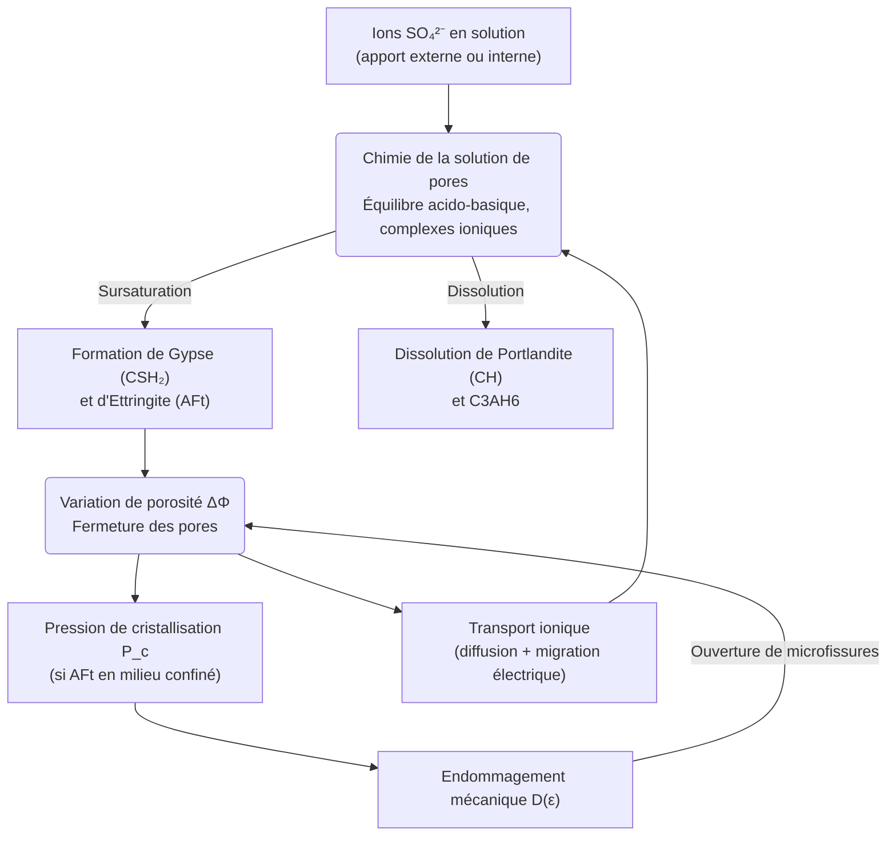

# Modèle Sulfaco — Attaque Sulfatique Interne/Externe du Béton

> **Fichiers sources :**
> `src/Models/ModelFiles/Sulfaco.c` · `base/Sulfaco/Sulfaco`
>
> **Auteurs du modèle :** Gu, Dangla (Université Gustave Eiffel)
> **Titre interne :** *"Internal/External sulfate attack of concrete (2017)"*

---

## Table des matières

1. [Contexte et objectif](#1-contexte-et-objectif)
2. [Hypothèses](#2-hypothèses)
3. [Variables et notation](#3-variables-et-notation)
4. [Modèle mathématique](#4-modèle-mathématique)
   - 4.1 [Équations de conservation](#41-équations-de-conservation)
   - 4.2 [Chimie de la solution interstitielle](#42-chimie-de-la-solution-interstitielle)
   - 4.3 [Réactions avec les phases solides](#43-réactions-avec-les-phases-solides)
   - 4.4 [Pression de cristallisation et endommagement](#44-pression-de-cristallisation-et-endommagement)
   - 4.5 [Loi de transport (diffusion ionique)](#45-loi-de-transport-diffusion-ionique)
5. [Conditions aux limites et initiales](#5-conditions-aux-limites-et-initiales)
6. [Cas test : Attaque sulfatique d'un échantillon de béton (`base/Sulfaco/`)](#6-cas-test--attaque-sulfatique-dun-échantillon-de-béton-basesulfaco)
7. [Paramétrage matériel du modèle](#7-paramétrage-matériel-du-modèle)
8. [Description pas-à-pas des fichiers d'entrée](#8-description-pas-à-pas-des-fichiers-dentrée)
9. [Références bibliographiques](#9-références-bibliographiques)

---

## 1. Contexte et objectif

Le modèle **Sulfaco** simule la **dégradation chimique du béton armé par attaque sulfatique** (interne ou externe). Ce phénomène de durabilité est l'une des principales causes de détérioration à long terme des infrastructures en béton (ouvrages d'art, fondations, tunnels en terrain gypseux).

L'attaque sulfatique se produit lorsque des ions sulfate ($\text{SO}_4^{2-}$) pénètrent dans la pâte de ciment durcie (attaque externe) ou sont libérés par des agrégats sulfatés (attaque interne). Ces ions réagissent avec les phases solides alumineuses du ciment hydraté pour former de l'**ettringite secondaire** ($\text{AFt} = \text{C}_6\text{AS}_3\text{H}_{32}$). La formation d'ettringite en milieu confiné génère une **pression de cristallisation** qui excède la résistance à la traction du béton, provoquant fissuration et délaminage.



---

## 2. Hypothèses

1. **Isotherme** : La température est fixée à $T = 293\,\text{K}$ ($20°\text{C}$). Les constantes d'équilibre thermodynamique sont évaluées à cette température.
2. **Milieu poreux saturé** : La solution de pores occupe l'ensemble de la porosité (pas de phase gazeuse). La saturation $S_r$ est décrite par une courbe tabulée en fonction du rayon de pore $r$.
3. **Cinétique de dissolution/précipitation** : Les réactions des phases solides (CSH₂, AFt, AFm, C₃AH₆) sont pilotées par des lois cinétiques du premier ordre en écart à la sursaturation, avec des taux $R_x$ (mol/L/s). La portlandite (CH) et l'ettringite (AFt à l'équilibre) obéissent à un bilan de matière direct.
4. **Électroneutralité** : La charge électrique totale de la solution est nulle. Cette contrainte ferme le système : elle définit la concentration en $\text{OH}^-$ à partir des autres ions.
5. **Pression de cristallisation** : La pression exercée par un cristal d'AFt en croissance dans un pore de rayon $r$ est donnée par la thermodynamique de Laplace (équation de Kelvin-Thomson).
6. **Endommagement uniaxial** : Une déformation de gonflement $\varepsilon$ est calculée à partir des variations de porosité. Quand $\varepsilon$ dépasse le seuil $\varepsilon_0$, une loi d'endommagement exponentielle réduit la rigidité effective.
7. **Diffusion de Nernst-Planck** : Le transport ionique suit la loi de diffusion couplée électro-chimique, incluant la migration sous champ électrique interne (potentiel de Donnan/diffusion $\psi$).

---

## 3. Variables et notation

### Inconnues primaires (6 équations)

| Symbole | Signification | Interne BIL | Inconnue BIL |
|---------|---------------|-------------|--------------|
| $\log c_{\text{SO}_4}$ | Log₁₀ de la concentration en sulfate | `E_Sulfur` | `logc_so4` |
| $\psi$ | Potentiel électrique diffus (V) | `E_charge` | `psi` |
| $z_\text{Ca}$ | Quantité normalisée de calcium solide (CH) | `E_Calcium` | `z_ca` |
| $\log c_\text{K}$ | Log₁₀ de la concentration en potassium | `E_Potassium` | `logc_k` |
| $z_\text{Al}$ | Quantité normalisée d'aluminium solide (AH₃) | `E_Aluminium` | `z_al` |
| $\log c_\text{OH}$ | Log₁₀ de la concentration en hydroxyle | `E_eneutral` | `logc_oh` |

### Principales variables secondaires calculées

| Symbole | Signification |
|---------|---------------|
| $n_\text{CH}$ | Teneur en moles de portlandite par litre de béton |
| $n_\text{CSH2}$ | Teneur en moles de gypse (CaSO₄·2H₂O) |
| $n_\text{AFt}$ | Teneur en moles d'ettringite ($\text{C}_6\text{AS}_3\text{H}_{32}$) |
| $n_\text{AFm}$ | Teneur en moles de monosulfoaluminate ($\text{C}_4\text{ASH}_{12}$) |
| $n_\text{C3AH6}$ | Teneur en moles d'hydrogrenat ($\text{C}_3\text{AH}_6$) |
| $\phi$ | Porosité instantanée (modifiée par les réactions solides) |
| $P_c$ | Pression de cristallisation de l'AFt en confinement (Pa) |
| $\varepsilon$ | Déformation de gonflement libre |
| $D$ | Variable d'endommagement ($0$ = intact, $1$ = ruiné) |

---

## 4. Modèle mathématique

### 4.1 Équations de conservation

Le modèle résout six bilans de conservation couplés (Volumes Finis, `FVM.h`) :

1. **Conservation du soufre** (S, sous forme $\text{SO}_4^{2-}$ et complexes) :
   $$\frac{\partial N_S}{\partial t} + \nabla \cdot \mathbf{W}_S = 0$$

2. **Conservation de la charge électrique** (électroneutralité globale) :
   $$\frac{\partial N_q}{\partial t} + \nabla \cdot \mathbf{W}_q = 0$$

3. **Conservation du calcium** (dissous + solide CH + CSH + CSH₂ + AFt + AFm + C₃AH₆) :
   $$\frac{\partial N_\text{Ca}}{\partial t} + \nabla \cdot \mathbf{W}_\text{Ca} = 0$$

4. **Conservation du potassium** :
   $$\frac{\partial N_K}{\partial t} + \nabla \cdot \mathbf{W}_K = 0$$

5. **Conservation de l'aluminium** (dissous + solide AH₃ + AFm + AFt + C₃AH₆) :
   $$\frac{\partial N_\text{Al}}{\partial t} + \nabla \cdot \mathbf{W}_\text{Al} = 0$$

6. **Electroneutralité locale** (fermeture du système) :
   $$\sum_i z_i c_i = 0$$

où $N_x = \phi \, c_x^{\text{total}} + n_x^{\text{solide}}$ est la teneur totale (liquide + solide) par unité de volume de béton.

### 4.2 Chimie de la solution interstitielle

Le module `HardenedCementChemistry.h` résout l'équilibre chimique complet de la solution de pores du béton. Les espèces considérées sont :

| Espèce | Symbole |
|--------|---------|
| Hydroxyle | $\text{OH}^-$ |
| Proton | $\text{H}^+$ |
| Calcium libre | $\text{Ca}^{2+}$ |
| Complexes calciques | $\text{CaOH}^+$ |
| Silicates dissous | $\text{H}_2\text{SiO}_4^{2-}$, $\text{H}_3\text{SiO}_4^-$, $\text{H}_4\text{SiO}_4$ |
| Complexes Ca-Si | $\text{CaH}_2\text{SiO}_4$, $\text{CaH}_3\text{SiO}_4^+$ |
| Sulfates | $\text{SO}_4^{2-}$, $\text{HSO}_4^-$, $\text{H}_2\text{SO}_4$ |
| Complexes Ca-sulfate | $\text{CaSO}_4^\text{aq}$, $\text{CaHSO}_4^+$ |
| Potassium | $\text{K}^+$, $\text{KOH}^\text{aq}$ |
| Aluminates | $\text{Al}(\text{OH})_4^-$ |

Ces concentrations sont toutes dérivées des 6 inconnues primaires via les constantes d'équilibre thermodynamique à $T = 293\,\text{K}$.

### 4.3 Réactions avec les phases solides

Les phases solides se dissolvent ou précipitent selon leur état de saturation :

#### Portlandite — $\text{CH} = \text{Ca(OH)}_2$

Dissolution contrôlée par le bilan de calcium solide :
$$n_\text{CH} = N_\text{CH}^{\text{ref}} \cdot \max(z_\text{Ca}, 0)$$

La variable $z_\text{Ca}$ décroît quand le calcium solide est consommé par les sulfates ou lixivié.

#### Gypse — $\text{CSH}_2 = \text{CaSO}_4 \cdot 2\text{H}_2\text{O}$ (Cinétique)

$$n_\text{CSH2}(t+\Delta t) = \max\!\left(n_\text{CSH2}(t) + \Delta t \cdot R_\text{CSH2} \cdot (S_\text{CSH2} - 1),\, 0\right)$$

où $S_\text{CSH2}$ est l'indice de saturation (rapport activité/produit de solubilité) et $R_\text{CSH2}$ le taux cinétique.

#### Ettringite — $\text{AFt} = \text{C}_6\text{AS}_3\text{H}_{32}$ (Cinétique avec confinement)

La cinétique de précipitation de l'AFt est plus élaborée : elle distingue la **croissance en interface libre** (paroi de pore) et la **croissance en confinement** (pore rempli), cette dernière générant une pression :

$$n_\text{AFt}(t+\Delta t) = \max\!\left(n_\text{AFt}(t) + \Delta t \cdot R_\text{AFt} \cdot f(\beta, \beta_p),\, 0\right)$$

où $\beta = S_\text{AFt}$ (indice de sursaturation global) et $\beta_p$ est l'indice d'équilibre au niveau de l'interface cristal-liquide confiné.

#### Monosulfoaluminate — $\text{AFm} = \text{C}_4\text{ASH}_{12}$ et Hydrogrenat — $\text{C}_3\text{AH}_6$ (Cinétique)

$$n_x(t+\Delta t) = \max\!\left(n_x(t) + \Delta t \cdot R_x \cdot (S_x - 1),\, 0\right)$$

### 4.4 Pression de cristallisation et endommagement

Lorsque l'AFt précipite dans un pore de rayon $r$, il génère une surpression donnée par la relation de **Kelvin-Thomson** :

$$P_c = \frac{RT}{V_\text{AFt}} \ln(\beta)$$

où $\beta$ est l'indice de sursaturation de l'AFt par rapport à l'équilibre confiné et $V_\text{AFt} = 710.32\,\text{cm}^3/\text{mol}$ est le volume molaire de l'ettringite.

L'équilibre thermodynamique à l'interface cristal-liquide dans un pore de rayon $r$ est :
$$\beta_\text{eq}(r) = \exp\!\left(\frac{2\,\Gamma_\text{AFt}\,V_\text{AFt}}{RT \cdot r}\right)$$

avec $\Gamma_\text{AFt} = 0.1\,\text{N/m}$ la tension superficielle.

La pression de cristallisation volumétriquement intégrée produit une **déformation de gonflement libre** $\varepsilon$. Quand $\varepsilon$ dépasse le seuil $\varepsilon_0$, le béton s'endommage selon une loi exponentielle :

$$D(\varepsilon) = 1 - \frac{\varepsilon_0}{\varepsilon} \exp\!\left(-\frac{\varepsilon - \varepsilon_0}{\varepsilon_f}\right)$$

où $\varepsilon_0$ est la déformation seuil et $\varepsilon_f$ la déformation caractéristique de rupture. L'endommagement $D$ réduit la contrainte effective et augmente la perméabilité aux ions.

### 4.5 Loi de transport (diffusion ionique)

Le flux de chaque ion $i$ (de charge $z_i$ et coefficient de diffusion $D_i$) dans la solution de pores est donné par l'équation de **Nernst-Planck** :

$$\mathbf{W}_i = -\phi \, \tau(\phi) \left( D_i \nabla c_i + z_i \frac{F D_i}{RT} c_i \nabla \psi \right)$$

où $\tau(\phi)$ est la tortuosité effective selon la loi de Bazant-Najjar :

$$\tau(\phi) = 0.001 + 0.07\phi^2 + H(\phi - 0.18) \cdot 1.8(\phi - 0.18)^2$$

Le module `CementSolutionDiffusion.h` gère les coefficients $D_i$ pour chaque ion.

---

## 5. Conditions aux limites et initiales

### Conditions initiales

Le béton est initialement dans un état d'équilibre chimique "intact" défini par les teneurs initiales en phases solides ($N_\text{CH}$, $N_\text{CSH}$, $N_\text{C3AH6}$...) et une concentration en sulfates très faible ($\log c_{\text{SO}_4} = -6$, soit $c_{\text{SO}_4} = 10^{-6}\,\text{mol/L}$).

### Conditions aux limites

Le système est **exposé d'un côté** (région 1, $x=0$) à une solution sulfatée dont la concentration en $\text{SO}_4^{2-}$ augmente au cours du temps selon les fonctions définies dans le fichier d'entrée. L'autre face (région 3, $x=L$) est laissée sans flux (Neumann nul implicite).

---

## 6. Cas test : Attaque sulfatique d'un échantillon de béton (`base/Sulfaco/`)

### Géométrie

L'échantillon est un **domaine 1D de longueur $L = 1\,\text{dm}$**, discrétisé en un seul élément fini de volumes finis avec deux nœuds (représentation d'un "point matériel" homogène sans gradient spatial interne).

### Scénario simulé

Il s'agit d'une simulation d'un **point de matériau unique** (pas de gradient spatial) exposé à un apport croissant de sulfates. Les concentrations imposées en $x=0$ varient selon des fonctions temporelles définies dans le fichier d'entrée :

| Variable imposée | $t=0$ | $t=8640\,\text{s}$ | $t=864000\,\text{s}$ |
|-----------------|-------|--------|---------|
| $\log c_{\text{SO}_4}$ | $-6$ | $-2.556$ | $-0.456$ |
| $\log c_K$ | $-5.7$ | $-2.256$ | $-0.156$ |
| $\log c_\text{OH}$ | $-2$ (pH 12) | $-2$ | $-2$ |

La durée totale simulée est de $3.5 \times 10^6\,\text{s} \approx 40\,\text{jours}$.

### Résultats attendus (sorties `.gp`)

Le fichier Gnuplot `Sulfaco.gp` trace neuf figures de post-traitement :

| Figure | Fichier | Contenu physique |
|--------|---------|-----------------|
| 1 | `Strain.eps` | Déformation de gonflement $\varepsilon(t)$ |
| 2 | `EttringiteSaturationIndex.eps` | Indice de saturation $S_\text{AFt}(t)$ (log-log) |
| 3 | `EttringiteContent.eps` | Teneur en ettringite $n_\text{AFt}(t)$ (mol/L de béton) |
| 4 | `CrystallizationPressure.eps` | Pression de cristallisation $P_c(t)$ (Pa) |
| 5 | `pH.eps` | Évolution du pH de la solution interstitielle |
| 6 | `SaturationIndexes.eps` | Indices de saturation : AFt et gypse (CSH₂) |
| 7 | `SolidContents.eps` | Évolution des phases solides : CH, AFt, C₃AH₆ |
| 8 | `IonConcentrations.eps` | Concentration en $\text{SO}_4^{2-}$ (mol/L) |
| 9 | `StressStrain.eps` | Contrainte effective $S_c \cdot P_c$ vs. déformation |

La séquence physique attendue est :
1. Les sulfates entrant réagissent d'abord avec **C₃AH₆** (hydrogrenat) et **AFm** (monosulfoaluminate), qui se convertissent en **AFt** (ettringite).
2. L'indice de saturation de l'AFt croît, la **pression de cristallisation** augmente.
3. Quand $P_c$ dépasse la résistance à la traction (déformation $\varepsilon > \varepsilon_0$), **l'endommagement** $D$ s'enclenche et la déformation libre $\varepsilon$ augmente brutalement.
4. La **portlandite** (CH) se dissout progressivement, tamponnant le pH.

---

## 7. Paramétrage matériel du modèle

| Paramètre | Valeur dans `Sulfaco` | Rôle physique |
|-----------|----------------------|---------------|
| `porosity` | $0.23$ | Porosité initiale du béton sain |
| `N_CH` | $1.53\,\text{mol/L}$ | Teneur initiale en portlandite |
| `N_CSH` | $1.393\,\text{mol/L}$ | Teneur initiale en C-S-H (source Si) |
| `N_AH3` | $10^{-6}\,\text{mol/L}$ | Gibbsite (quasi-nul, trace) |
| `N_C3AH6` | $0.2\,\text{mol/L}$ | Hydrogrenat initial (précurseur aluminium) |
| `N_CSH2`, `N_AFm`, `N_AFt` | $0$ | Pas de gypse ni ettringite initiale |
| `R_CSH2` | $10^{-12}\,\text{mol/L/s}$ | Taux de précipitation du gypse (très lent) |
| `R_AFm` | $10^{-6}\,\text{mol/L/s}$ | Taux de précipitation du monosulfoaluminate |
| `R_C3AH6` | $10^{-6}\,\text{mol/L/s}$ | Taux de dissolution de l'hydrogrenat |
| `A_i` | $8.4 \times 10^{-8}$ | Taux de croissance de l'AFt en interface libre ($a_r$) |
| `A_p` | $4.4 \times 10^{-9}$ | Taux de croissance de l'AFt en pore confiné ($a_p$) |
| `K_bulk` | $30.1\,\text{GPa}$ | Module de compression du béton sain |
| `Biot` | $0.54$ | Coefficient de Biot (couplage pression-déformation) |
| `Strain0` | $4 \times 10^{-4}$ | Déformation seuil d'endommagement $\varepsilon_0$ |
| `Strainf` | $6.4 \times 10^{-3}$ | Déformation caractéristique de rupture $\varepsilon_f$ |
| `AlphaCoef` | $0$ | Coefficient d'adsorption des sulfates sur les C-S-H (désactivé) |
| `BetaCoef` | $0.87$ | Coefficient de saturation dans l'isotherme d'adsorption |
| `Curves_log = Sat` | Van Genuchten ($m=0.2516$, $r_0=155.82\,\text{nm}$) | Courbe de saturation liquide $S_r(r)$ dans les pores |

---

## 8. Description pas-à-pas des fichiers d'entrée

### 8.1 Système d'unités (`Units`)

```
Units
Length = decimeter     # 1 unité de longueur = 1 dm
Time   = second        # 1 unité de temps = 1 s
Mass   = hectogram     # 1 unité de masse = 100 g
```

Le choix du décimètre comme unité de longueur est cohérent avec les tailles d'éprouvettes de béton (quelques centimètres à décimètres). Les concentrations sont donc en **mol/dm³ = mol/L** et les diffusivités en **dm²/s**.

### 8.2 Géométrie et maillage (`Geometry`, `Mesh`)

```
Geometry
Dimension = 1  plan     # Problème 1D en coordonnées planes (cartésiennes)

Mesh
2                        # 2 nœuds
0. 1                     # Nœud 1 : x=0 (surface exposée)
1.                       # Nœud 2 : x=1 dm (cœur)
1                        # 1 élément
1                        # Élément linéaire reliant nœuds 1-2 (région 1)
```

Le fichier maillage `Sulfaco.msh` (format Gmsh) définit explicitement 4 nœuds dont 2 nœuds de bord (type 15 = points) et 1 segment (type 1) entre $x=0$ et $x=1\,\text{dm}$.

### 8.3 Matériau (`Material`)

```
Model = Sulfaco
porosity = 0.23
N_CH     = 1.53
N_CSH    = 1.393
N_AH3    = 1.e-6
N_C3AH6  = 0.2
```

Ces lignes définissent la **microstructure initiale** du béton : portlandite et C-S-H sont les réservoirs de calcium qui contrôlent le tampon pH et la source de calcium pour les réactions sulfatiques.

```
R_CSH2   = 1.e-12
R_AFm    = 1.e-6
R_C3AH6  = 1.e-6
```

Ces constantes cinétiques (`R_x`, en mol/L/s) contrôlent la vitesse des transformations solides. `R_CSH2` très petit signifie que le gypse précipite très lentement ; `R_C3AH6` modéré permet une dissolution rapide de l'hydrogrenat en ettringite.

```
A_i = 8.4e-8
A_p = 4.4e-9
```

Coefficients de cinétique de croissance cristalline de l'AFt : `A_i` (interface libre, rapide) et `A_p` (pore confiné, 20 fois plus lent).

```
K_bulk = 30.1e9
Biot = 0.54
Strain0 = 4.e-4
Strainf = 6.4e-3
```

Paramètres mécaniques : le module de compression $K_\text{bulk}$ et le coefficient de Biot permettent de calculer la contrainte effective. `Strain0` et `Strainf` définissent la courbe d'endommagement : le béton commence à se fissurer à partir d'une déformation de $4 \times 10^{-4}$ et est totalement ruiné à $\sim 7 \times 10^{-3}$.

```
Curves_log = Sat  r = Range{r1 = 1.e-8 , r2 = 1.e-3 , n = 1000}
             S_r = Expressions(1){r0=155.82e-8; m = 0.2516 ; S_r = (1 + (r0/r)**(1/(1-m)))**(-m)}
```

Courbe de saturation de van Genuchten : pour un rayon de pore $r$ (en m), $S_r(r)$ donne la fraction de pores plus petits que $r$ saturés en solution. Elle est tabulée sur 1000 points entre $r=10\,\text{nm}$ et $r=1\,\text{mm}$.

### 8.4 Champs (`Fields`)

```
Fields
1
Value = 1   Gradient = 0 0 0   Point = 0 0 0
```

Un seul champ scalaire uniforme (valeur 1, gradient nul) est défini. Il sert comme **multiplicateur** dans les fonctions d'initialisation et de conditions aux limites.

### 8.5 Initialisation (`Initialization`)

```
Initialization
6
Region = 1 Unknown = logc_so4   Field = 1 Function = 1
Region = 1 Unknown = psi        Field = 0 Function = 0
Region = 1 Unknown = z_ca       Field = 1 Function = 4
Region = 1 Unknown = z_al       Field = 1 Function = 3
Region = 1 Unknown = logc_k     Field = 1 Function = 2
Region = 1 Unknown = logc_oh    Field = 1 Function = 5
```

Chaque ligne initialise une inconnue dans la région 1 (tout le domaine) à la valeur `Field × Function(t=0)` :

| Inconnue | Valeur initiale | Signification |
|----------|----------------|---------------|
| `logc_so4` | $1 \times (-6) = -6$ | $c_{\text{SO}_4} = 10^{-6}\,\text{mol/L}$ (béton sain, peu de sulfates) |
| `psi` | $0 \times 0 = 0$ | Potentiel électrique nul à l'état initial |
| `z_ca` | $1 \times 1 = 1$ | Portlandite intacte : $n_\text{CH} = N_\text{CH} \times 1$ |
| `z_al` | $1 \times 1 = 1$ | AH₃ solide intact : $n_\text{AH3} = N_\text{AH3} \times 1$ |
| `logc_k` | $1 \times (-5.7) = -5.7$ | $c_K \approx 2 \times 10^{-6}\,\text{mol/L}$ |
| `logc_oh` | $1 \times (-2) = -2$ | pH $= 12$ ($c_{\text{OH}^-} = 10^{-2}\,\text{mol/L}$) |

### 8.6 Fonctions temporelles (`Functions`)

```
Functions
5
N = 5 F(0) = -6     F(8640) = -2.556  F(86400) = -1.556  F(345600) = -0.954  F(864000) = -0.456
N = 5 F(0) = -5.7   F(8640) = -2.256  F(86400) = -1.256  F(345600) = -0.654  F(864000) = -0.156
N = 2 F(0) = -7.32  F(86400) = -6.32
N = 2 F(0) = 1      F(86400) = 1
N = 2 F(0) = -2     F(86400) = -2
```

Cinq fonctions d'interpolation temporelle linéaire par morceaux (avec `N` points) :

| Fonction | Utilisation | Description |
|----------|-------------|-------------|
| 1 | `logc_so4` en CL | $\log c_{\text{SO}_4}$ : monte de $-6$ à $-0.456$ (de $10^{-6}$ à $0.35\,\text{mol/L}$) en $10\,\text{jours}$ |
| 2 | `logc_k` en CL | $\log c_K$ : monte de $-5.7$ à $-0.156$ (de $2\times10^{-6}$ à $0.7\,\text{mol/L}$) en $10\,\text{jours}$ |
| 3 | `z_al` initial | Constante $= 1$ (aluminium solide stable) |
| 4 | `z_ca` initial | Pente légère (dissolution lente de CH au cours du 1er jour) |
| 5 | `logc_oh` en CL | pH constant à 12 ($c_{\text{OH}^-} = 10^{-2}\,\text{mol/L}$) |

### 8.7 Conditions aux limites (`Boundary Conditions`)

```
Boundary Conditions
4
Region = 1 Unknown = logc_so4   Field = 1 Function = 1
Region = 1 Unknown = psi        Field = 0 Function = 0
Region = 1 Unknown = logc_k     Field = 1 Function = 2
Region = 1 Unknown = logc_oh    Field = 1 Function = 5
```

Les conditions aux limites sont appliquées à la **région 1** (surface exposée $x=0$) :
- Les concentrations en sulfate et potassium sont **imposées** et augmentent au cours du temps (fonctions 1 et 2).
- Le potentiel électrique est maintenu à **zéro** (référence).
- Le pH est **maintenu à 12** tout au long de la simulation (fonction 5, constante).
- $z_\text{Ca}$ et $z_\text{Al}$ ne sont **pas prescrits** en CL (lignes commentées) : le calcium solide évolue librement par dissolution/précipitation.

### 8.8 Points d'observation (`Points`)

```
Points
1
0.5
```

Un seul point d'observation est défini, à $x = 0.5\,\text{dm}$ (centre de l'échantillon). C'est à ce point que les variables secondaires (colonnes du fichier `.p1`) sont enregistrées au cours du temps.

### 8.9 Fenêtre temporelle et critères de convergence

```
Dates
2
0.  3.5e6       # t=0 s à t=3.5×10⁶ s ≈ 40 jours

Objective Variations
logc_so4  = 1.e-3   # Variation relative tolérée pour l'inconnue sulfate
z_ca      = 1.e-3
psi       = 1.e-1
logc_k    = 1.e-1
z_al      = 1.e-1
logc_oh   = 1.e-1

Iterative Process
Iter = 20       # Nombre max d'itérations Newton-Raphson par pas de temps
Tol  = 1.e-4    # Tolérance sur le résidu global

Time Steps
Dtini = 1.e3    # Pas de temps initial : 1000 s ≈ 17 min
Dtmax = 1.e3    # Pas de temps maximum : 1000 s (fixe)
```

Le pas de temps fixe de $1000\,\text{s}$ est adapté aux cinétiques chimiques les plus rapides (AFm, C₃AH₆ avec $R_x = 10^{-6}\,\text{mol/L/s}$). La tolérance `Objective Variations` contrôle le pas de temps adaptatif de BIL : si la variation d'une inconnue dépasse son seuil, le pas est découpé.

---

## 9. Références bibliographiques

- **Biot, M. A.** (1941). General theory of three-dimensional consolidation. *Journal of applied physics*, 12(2), 155–164. — Fonde le couplage pression interstitielle / déformation (coefficient de Biot $b = 0.54$ utilisé dans le modèle).

- **Coussy, O.** (2004). *Poromechanics*. John Wiley & Sons. — Traitement rigoureux de la pression de cristallisation en milieu poreux (Eq. de Kelvin-Thomson appliquée aux cristaux en croissance dans les pores).

- **Flatt, R. J. & Scherer, G. W.** (2008). Thermodynamics of crystallization stresses in DEF. *Cement and Concrete Research*, 38(3), 325–336. — Base thermodynamique du calcul de pression de cristallisation de l'ettringite différée $P_c = \frac{RT}{V_\text{AFt}}\ln\beta$.

- **Montoya, A. G., et al.** (2016). A chemo-mechanical model for sulfate attack in concrete — Fournit le cadre du couplage chimie-mécanique utilisé dans Sulfaco (endommagement, gonflement, altération de porosité).

- **Nernst, W. & Planck, M.** (1890). Théorie de diffusion ionique couplée au potentiel électrique. — Équation de Nernst-Planck pour le transport d'ions en solution poreuse ($\mathbf{W}_i = -\phi\tau(D_i \nabla c_i + z_i \frac{FD_i}{RT} c_i \nabla\psi)$).

- **Bazant, Z. P. & Najjar, L. J.** (1972). Nonlinear water diffusion in nonsaturated concrete. *Matériaux et Construction*, 5(25), 3–20. — Loi de tortuosité $\tau(\phi)$ utilisée dans le calcul des flux diffusifs.

- **Van Genuchten, M. Th.** (1980). A closed-form equation for predicting the hydraulic conductivity of unsaturated soils. *Soil Science Society of America Journal*, 44(5), 892–898. — Modèle de courbe de saturation $S_r(r)$ utilisé pour la distribution de rayons de pores (paramètres $m=0.2516$, $r_0 = 155.82\,\text{nm}$).
