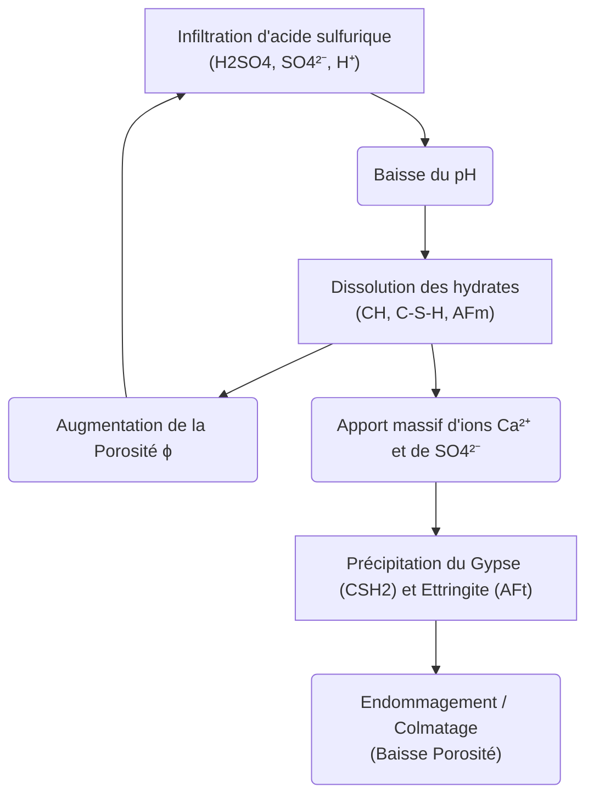
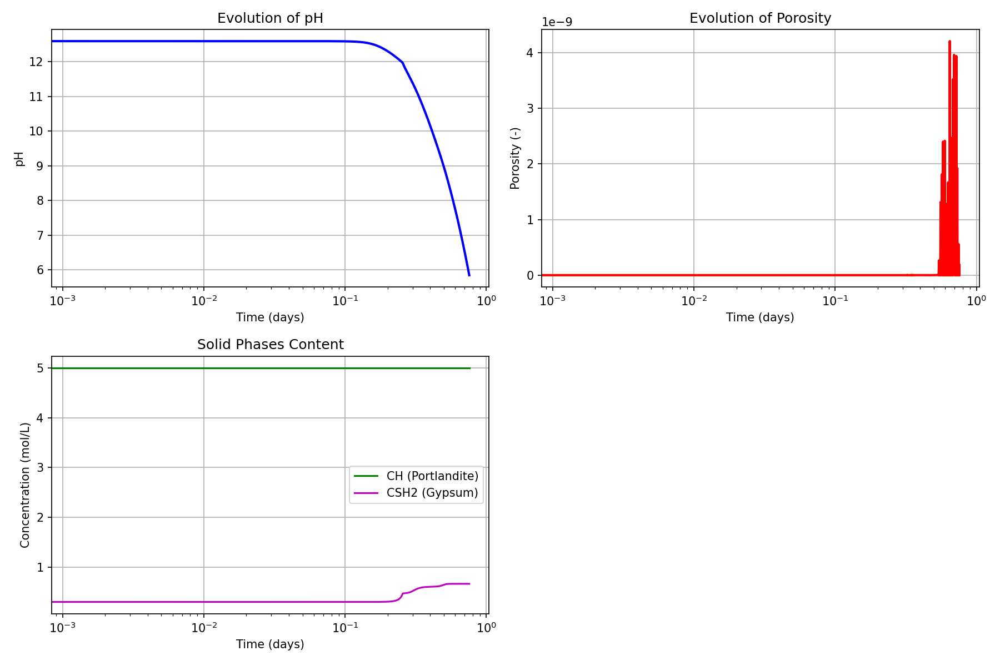

# Modèle Sulfuricem — Attaque à l'acide sulfurique des matériaux cimentaires

> **Fichiers sources :**
> `src/Models/ModelFiles/Sulfuricem.c` · `test_examples/Sulfuricem/Sulfuricem`
>
> **Auteurs du modèle :** O. Grandclerc, B. Yuan, P. Dangla

---

## Table des matières

1. [Contexte et objectif](#1-contexte-et-objectif)
2. [Hypothèses](#2-hypothèses)
3. [Variables et notation](#3-variables-et-notation)
4. [Modèle mathématique](#4-modèle-mathématique)
   - 4.1 [Équations de conservation](#41-équations-de-conservation)
   - 4.2 [Réactions de dissolution et précipitation](#42-réactions-de-dissolution-et-précipitation)
5. [Conditions aux limites et initiales](#5-conditions-aux-limites-et-initiales)
6. [Cas test : Attaque acide 1D d'une éprouvette de ciment (`test_examples/Sulfuricem`)](#6-cas-test--attaque-acide-1d-dune-éprouvette-de-ciment)
7. [Résultats de la modélisation](#7-résultats-de-la-modélisation)
8. [Description pas-à-pas des fichiers d'entrée](#8-description-pas-à-pas-des-fichiers-dentrée)
9. [Références bibliographiques](#9-références-bibliographiques)

---

## 1. Contexte et objectif

Le modèle **Sulfuricem** simule l'altération chimique (et la réponse du transport réactif) des matériaux cimentaires (OPC et CAC - *Portland* et *Alumineux*) exposés à l'**acide sulfurique** ($\text{H}_2\text{SO}_4$), typique de la corrosion biogénique dans les réseaux d'assainissement ou des agressions industrielles extrêmes. 

Ce modèle intègre un couplage fort entre le transport ionique multi-espèces dans la solution porale et la thermodynamique chimique des hydrates cimentaires. L'attaque sulfurique se traduit par une brutale chute du pH, la dissolution des phases cimentaires protectrices (Portlandite CH, C-S-H), libérant la matrice, suivie d'une re-précipitation secondaire expansive sous la forme de **Gypse** (CSH2) et d'**Ettringite** (AFt).

---

## 2. Hypothèses

1. **Chimie complète couplée** : Intègre explicitement le transport sous gradients de concentration et de potentiel électrique.
2. **Loi des masses d'action** : L'équilibre chimique dans la solution porale est basé sur l'expression d'équilibre des paires d'ions.
3. **Mélanges hétérogènes de solides** : Les solides sont quantifiés via des cinétiques de dissolution/précipitation avec seuils de saturation (exprimées en moles).
4. **Conservation des Atomes Conservatifs (les "Zéta" $\zeta_{x}$)** : Les bilans chimiques massifs sont menés autour de marqueurs neutres d'éléments (Calcul du Z_Ca pour tout le calcium dissous et solide au lieu de fractionner l'équation).
5. **Électroneutralité par charge croisée** : Un champ de Poisson garantit la neutralité électrique de la solution par une variable de potentiel électromoteur artificiel $\psi$.

---

## 3. Variables et notation

Le modèle définit **8 équations couplées** aux nœuds par volumes finis.

### Inconnues primaires (Vectorielles Nodales)

| Symbole | Intitulé Variable BIL | Signification |
|---------|-----------------------|-------------|
| $c_{\text{H}_2\text{SO}_4}$ | `logc_h2so4` | Concentration en acide sulfurique total (échelle logarithmique imposée) |
| $\psi$ | `psi` | Potentiel électrique local (diffusion ionique de Nernst-Planck) |
| $Z_{\text{Ca}}$ | `z_ca` | Inconnue conservative globale pour l'ion Calcium |
| $Z_{\text{Si}}$ | `z_si` | Inconnue conservative globale pour la Silice |
| $c_{\text{K}}$ | `logc_k` | Concentration en ions Potassium alcalins |
| $c_{\text{Cl}}$ | `logc_cl` | Concentration en Chlorures |
| $Z_{\text{Al}}$ | `z_al` | Inconnue conservative pour l'Aluminium |
| $c_{\text{OH}}$ | `logc_oh` | Concentration des ions hydroxyde (définissant l'électroneutralité et le pH) |

### Variables de comportement

| Symbole | Signification |
|---------|---------------|
| `N_CH`, `N_CSH` | Molarités locales en Portlandite (CH) et Silicates de Calcium hydratés (C-S-H). |
| `N_CSH2` | Molarité locale du Gypse précipité (Sulfate de calcium hydraté). |
| $\phi$ | Porosité instantanée. Augmente par dissolution, chute par précipitation gypse/ettringite. |
| $S_{\text{CH}}$, $S_{\text{CSH2}}$ | Indices de Saturation physico-chimique qui pilotent les cinétiques. |

---

## 4. Modèle mathématique

### 4.1 Équations de conservation

Le système est axé sur la conservation stricte des moles par atome constituant (S, Ca, Si, K, Cl, Al). Par exemple, le bilan du Soufre $S$ :

$$\frac{\partial}{\partial t}\left(\phi \cdot c_S^{tot} + N_{\text{gypse}} + N_{\text{ettringite}} \right) + \text{div}(\mathbf{W}_S) = 0$$

Les flux $\mathbf{W}_i$ sont donnés par l'équation de *Nernst-Planck*, régissant la diffusion sous tortuosité (Modèles de Oh-Jang ou Bazant-Najjar) et migration électrique.

### 4.2 Réactions de dissolution et précipitation

Les vitesses de réaction locales reposent sur la saturation. Pour le gypse $CSH_2$ :
$$ \frac{\partial N_{\text{gypse}}}{\partial t} = \frac{1}{\tau_{\text{CSH2}}} (S_{CSH2} - 1) $$
*(avec minoration à 0 si le gypse n'existe pas en sous-saturation).*

L'assemblage des composantes chimiques de la phase C-S-H dépend des courbes intrinsèques multi-pôles de ratio `C/S` codées de la base `csh3p`.

---

## 5. Conditions aux limites et initiales

Les CL s'apparentent généralement à une mise en situation de laboratoire (bain acide) :

- **Région exposée (Bord)** : Imposition de Dirichlet via la macro `Boundary Conditions` sur `logc_h2so4` ($-\text{pH}_{\text{acide}}$) et `logc_cl`. Le potentiel est également ancré (généralement $\psi = 0$).
- **Masse d'origine (Initiales)** : Les variables `z_ca` et `z_si` sont dimensionnées pour initialiser la Portlandite (CH) et les C-S-H à des teneurs initiales équivalentes à celles d'une pâte de ciment saine non dégradée (pH ~13).

---

## 6. Cas test : Attaque acide 1D d'une éprouvette de ciment (`test_examples/Sulfuricem`)

Le cas fourni simule l'exposition prolongée d'un plan de béton à une solution très agressive.

1. L'acide sulfurique pénètre via la surface exposée (droite du maillage). Le front avance en décomposant d'abord la portlandite, libérant du Calcium dissous qui va violemment réagir avec l'apport incident en sulfates SO₄²⁻.
2. Formations d'une gangue transitoire massive de Gypse (CSH2). 
3. Modification totale du réseau poreux.

---

## 7. Résultats de la modélisation

À l'issue de l'exécution, les sorties nodales `.p1` au bord agressé (ou par intégration profonde) permettent de suivre la dégradation au cours du temps.

1. **Impact pH** : Chute brutale du pH vers une acidité nocive (front de carbonatation/sulfatation).
2. **Dissolution** : Le front consomme l'intégralité du CH natif de la matrice.
3. **Précipitation de gypse** : On constate le développement spectaculaire du Gypse confiné (CSH2), ce qui fait brutalement gonfler la fraction volumique solide.
4. **Évolution Rétroactive de la Porosité** : Dans un premier lieu, la perte en CH augmente la porosité, mais c'est immédiatement contrecarré (puis complètement congestionné) par la formation expansive du sulfate de calcium (gypse et ettringite).

---

## 8. Description pas-à-pas des fichiers d'entrée

### Fichier `test_examples/Sulfuricem/Sulfuricem`

1. **Maillage `Mesh`** : Crée un volume 1D discrétisé sur une lanière fine via commande interne :
   `4 \n  0.8 0.8 1. 1. \n 2.e-3 \n 1 100 1... ` (100 cellules sur un axe).
2. **Propriétés du matériau `Material`** :
   Définit une "pâte" saturée théorique saine initialement exempte d'attaque :
   - `porosite = 0.3` : Porosité modérée d'origine.
   - `N_CH = 5.2`, `N_CSH = 5.` : Haute teneur typique d'hydrate liant.
   - `N_CSH2 = 0.`, `N_AFt = 0.` : Les phases dégradées ne sont pas encore formées.
   - `Curves_log = csh3p ... ` : Incorpore un lien sur l'hétérogénéité des CSH tiré du fichier compagnon textuel `csh3p`.
3. **Champs et `Initialization`** :
   Des valeurs log-standard (-35, -3, -1...) traduisant une concentration saine initiale ultra-trace d'acide, et les potentiels à travers `z_ca`, `z_si`.
4. **Conditions de Bord (`Boundary Conditions`)** :
   - `Reg 3 Unknown = logc_h2so4 Field = 1 Function = 1` -> Sur le plan de contact 3, un acide concentré de facteur fonctionnel 1 y est forcé (évolution dans le temps pour un choc progressif, paramétrée dans le bloc `Functions`).
5. **Conduite Temporelle (`Iterative Process` & `Time Steps`)** :
   Un pas pseudo-logarithmique démarre à `Dtini = 100 s.` étalé sur plusieurs centaines de jours (2.89e7 s). L'algorithme opère par méthode implicite lourde.

---

## 9. Références bibliographiques

- **Grandclerc, O.** (2018). *Modélisation du transport réactif en milieu poreux saturé et des couplages mécano-chimiques induits par les réactions de précipitation-dissolution : Application à l'attaque acide des matériaux cimentaires*. Université Paris-Est.
- **Yuan, B., Dangla, P., & Chatellier, P.** (2013). *Numerical modeling of sulfuric acid attack on concrete via a reactive transport approach*. - Validations des bilans des composantes C-S-H expansives. 
- **Samson, E., Marchand, J.** (2007). *Modeling the effect of temperature on ionic transport in cementitious materials.* - Utilisation des lois de Nernst-Planck couplées à l'électroneutralité pour prédire la diffusion d'ions.
